# Introduction {#Intro}

## Development & Morphogenesis {#Intro-Morpho}

Morphogenesis = "Beginning of the shape"

> *An organ is defined as a tissue or set of tissues that work together to perform a specific function or functions. Morphogenesis is the process in which anatomical structures are generated and organized. Organs are commonly observed as visibly distinct structures, but may also exist as loosely associated clusters of cells that work together to perform a specific function or functions.*
> 
> [zfin.org](https://zfin.org/GO:0009887)

(ref:morph) Cell signaling at scale
```{r morph, out.width='75%', echo=FALSE, fig.cap="(ref:morph)"}
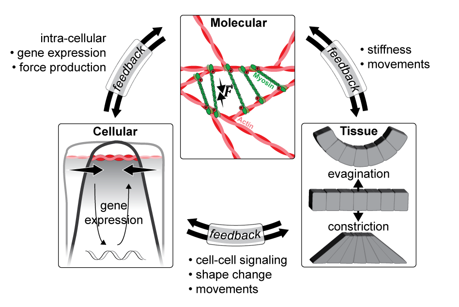
```

(ref:haeckel) Embryology 
```{r haeckel, out.width='75%', echo=FALSE, fig.cap="(ref:haeckel)"}
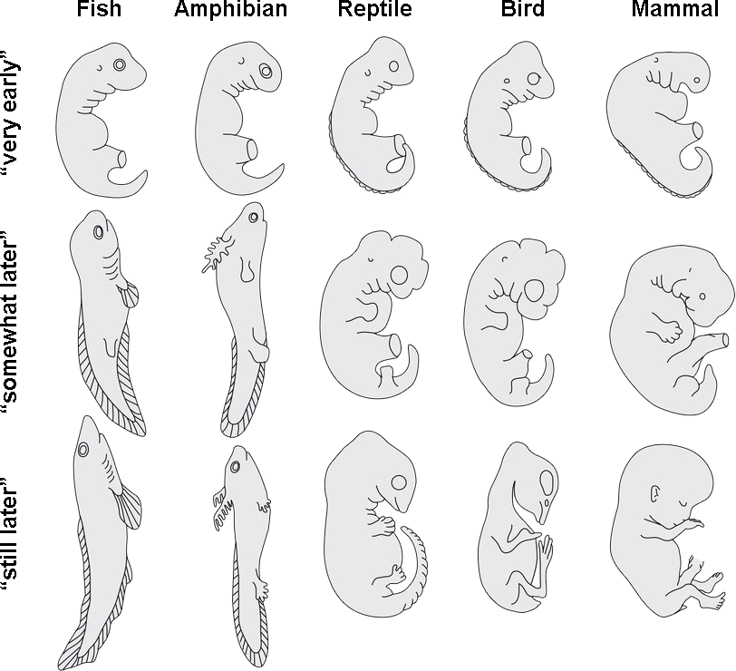
```

### Apical Constriction

Apical constriction (AC) is a single cell morphogenetic process manifest by an active apical narrowing, making the cell appear bottle or wedge shaped. It is usually coordinated by multiple cells within an epithelial layer that raise forces necessary to deform a tissue. Developmental processes that involve AC are…

* Tissue folding and tube formation
* Single cell ingression and EMT
* Gastrulation
* Healing and sealing of embryonic tissue

Subcellular AC takes place at the Apical Junctional Complex (AJC), a compartment that encompasses three types of junctions: Adherent junctions (AJ) at the zonula adherens (ZA), tight junctions (TJ) and desmosomes. Around the ZA dense cables of actomyosin are found  that, like sarcomers, are able to contract upon RHO‑associated protein kinase (ROCK) mediated phosphorylation of the motor protein non-muscle myosin II (NMII).

During development cells differentiate and undergo drastic shape changes, going from one morphological type to another - a process commonly known as morphogenesis. Collective cellular morphologies give rise to tissue morphology, which again gives rise to organ morphology...and so on. One distinct morphogenetic feature is apical constriction (AC), which can be described an active narrowing of cellular apices[@Sawyer2010] (figure1, A-D), or in other words...

> *Apical constriction is the process in which contraction of the apical side of a cell causes the cell to take on a wedged shape. Generally, this shape change is coordinated across many cells of an epithelial layer, generating forces that can bend or fold the cell sheet.*
> 
> J.y. Lee and R.M.Harland[@Lee2009]

AC has been shown to depend on a contractile network of Actin and Non-muscle Myosin II (NMII) (figure 1, E), which is extensively studied in _D.melanogaster_ during dorsal closure [@Coravos2016; @Martin2014]. Besides this, AC occurs in all multicellular organisms and is an important factor during early embryogenesis as it has also been shown during _C.elegans_ gastrulation, or e.g. during epithelial-to mesenchymal transition and ingression[@Sawyer2010].

(ref:ACIfig) Apical constriction and tissue bending. **A** _D. Melanogaster_ mesoderm invagination. **B** Vertebrate neurulation. **C and D** schematic representation of AC in an epithelial tissue [@Lecuit2007].
```{r ACfig, out.width='75%', echo=FALSE, fig.cap="(ref:ACIfig)"}
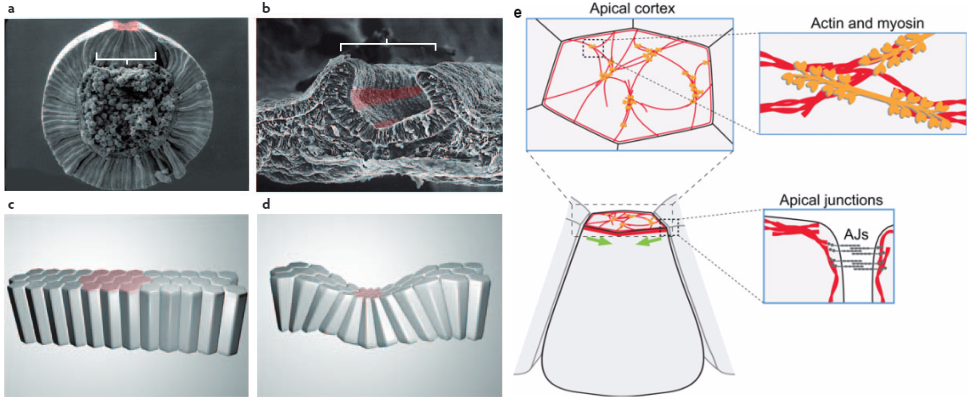
```

### Epithelial Rosettes

Epithelial Rosettes are intermediate structures of radially organized cells within an epithelial tissue whose vertices interface a common center. While the mechanisms of cytoskeletal rearrangements seem to be well conserved, the extracellular cues that lead to rosette formation are less well understood and more diverse.

At least two architectural distinct types of rosettes exist, depending on the tissues polarization. First, in a planar polarized tissue, several cells converge at a central apico-basal (A-B) line with no shrinkage of the apical surface to form a cylindrical structure. Such rosettes are usually observed during tissue elongation and rather short-lived. In a second scenario, cells converge to a central apical point through AC. This type of rosette is more long-lived and, usually does not resolve but already represents a morphologically pre-mature state of the organ to be formed.

(ref:rosettes) Epithelial rosettes
```{r rosettes, out.width='75%', echo=FALSE, fig.cap="(ref:rosettes)"}
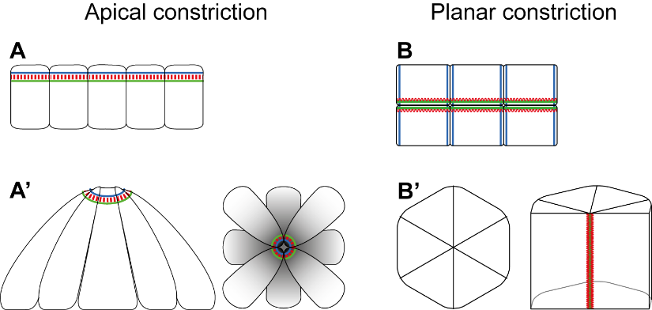
```

## Model system {#Intro-Model}

Model systems are frequently used in any science. In Developmental Biology the most common systems are...

### _D.rerio_ aka zebrafish

(ref:embryo-01) The embryo at 32 hpf
```{r embryo-01, out.width='60%', echo=FALSE, fig.cap="(ref:embryo-01)"}
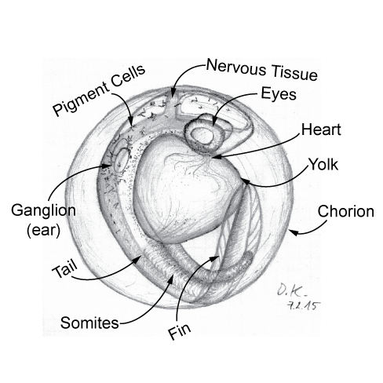
```

### Zebrafish posterior lateral line primordium {#Intro-pllp}

\pagebreak

(ref:pllpmorph) Cells of the PLLp
```{r pllpmorph, out.width='60%', echo=FALSE, fig.cap="(ref:pllpmorph)"}
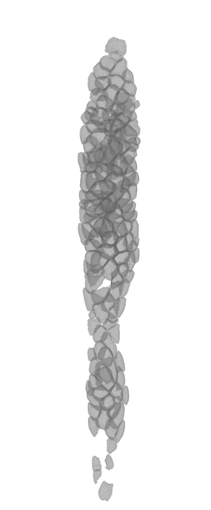
```

\pagebreak

(ref:pllpmodel) _shroom3_\-- PLLps recapitulate morphant morphology
```{r pllpmodel, echo=FALSE, out.width='85%', fig.cap="(ref:pllpmodel)"}
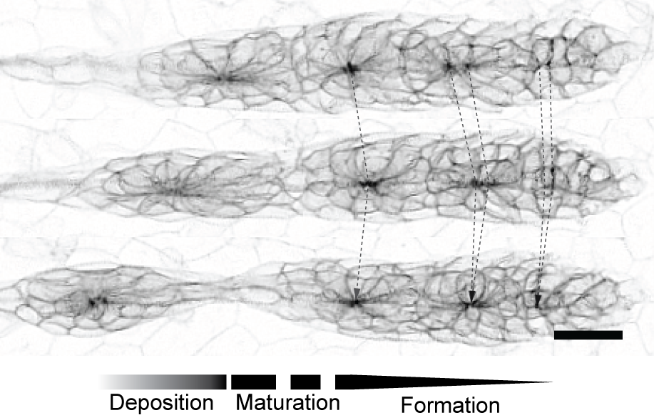
```
### Shroom3 {#Intro-shrm}

Presence of Shroom has been confirmed in several studies including [@Das2014a; @Loebel2016a; @Tariq2011; @Lee2007; @Plageman2011; @Hildebrand1999a]

(ref:shrmdom) Shroom3 functional domains[@Zalewski2016]
```{r shrmdom, echo=FALSE, out.width='75%', fig.cap="(ref:shrmdom)"}
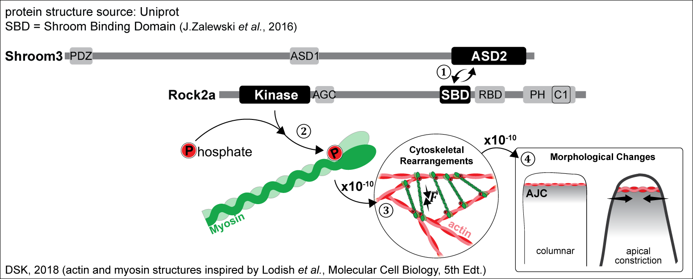
```

During LL morphogenesis, a previous study done on morphants[@Ernst2012a] suggests that upon FGF activated transcription of _shroom3_, Shroom3 would locate to the AJC where it supposedly interacts with Rock, which would then phosphorylate NMII and thereby trigger contraction of the actin meshwork and AC. Furthermore, it could be shown that rosette formation in the PLLp is an important morphological feature for a vesicle to form on top of the rosette, which acts as a locally enriched source of fgf signaling[@Durdu2014a]. Together, this leads to the working model shown in figure \@ref(fig:shrmmodel).

(ref:shrmmodel) Rosette formation current model
```{r shrmmodel, echo=FALSE, out.width='50%', fig.cap="(ref:shrmmodel)"}
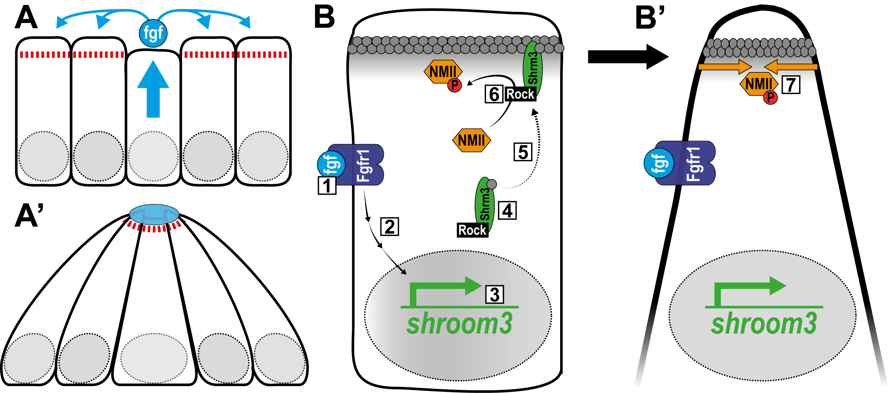
```

To confirm these results and to be able to further investigate the role of Shroom3 during LL morphogenesis, a mutant was generated that lacks the highly conserved SD2 domain [@Zalewski2016] important for Rock interaction and therefore would lack rosette formation and AC (figure \@ref(fig:shrmmut)). If this mutation causes a Null-mutation or if the remaining domains are still able to interact is not known. However, the morphant PLLp morphology is fully recapitulated by _shroom3_\-- embryos (figure \@ref(fig:zmaxccs)). This is also confirmed by quantification through a rosette detector CNN. 

(ref:shrmmut) Shroom3 mutant aa sequence
```{r shrmmut, echo=FALSE, out.width='50%', fig.cap="(ref:shrmmut)"}
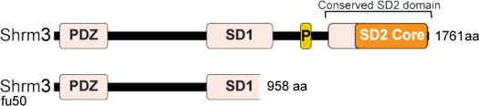
```

#### _shroom3_ mutant

(ref:shrmrecap) _shroom3_\-- PLLps recapitulate morphant morphology
```{r shrmrecap, echo=FALSE, out.width='85%', fig.cap="(ref:shrmrecap)"}
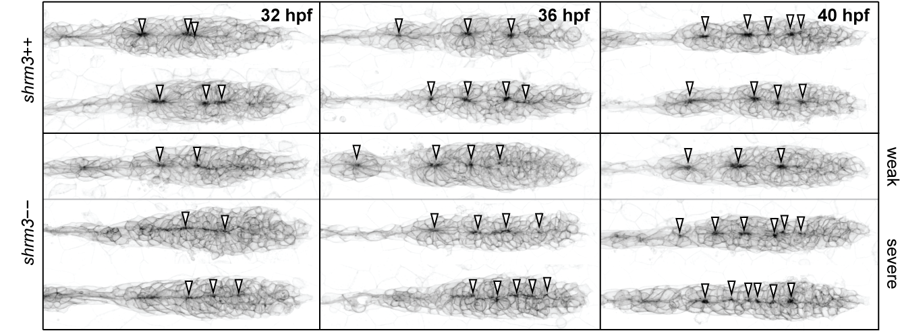
```

#### Shroom3 interaction partners

## Sample preparation

## Data Analysis