# Introduction {#Intro}

```{r, include=FALSE}
options(tinytex.verbose = TRUE)
```

## Development

In biology differentiation describes the continuous process of cells dividing and adapting to their ever-changing environment during advancing development, whereby adopting specialized function. Physically a cell represents an open system, which is defined as a unit system able for external interactions. Such a system is therefore not self-dependent and self-sustained, but its current conformation is determined by external interactions. To illustrate this, the cell can the thought of as a marble rolling down a furrowed landscape \@ref(fig:wadd). In this landscape a hill would be a high energy-, a valley a low energy state. The path the marble will take is determined by the furrows in the landscape, since it would always prefer a valley. However, this landscape is not a static structure but is a one that changes at every instant of time.

```{r wadd, fig.cap = "Waddington's Classical Epigenetic Landscape"}
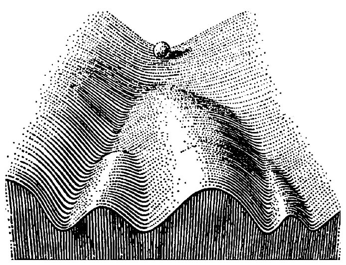
```

For developmental biology, which as a scientific discipline originates from embryology, the central interest is to understand how inanimate matter can form such complex structures we see in living matter at different levels of organismal hierarchy while ensuring a robust developmental plan. Using the marble analogy, studying developmental biology can be thought of tracking multiple cells as they roll down the valley while observing and testing how interactions between them might change their fate. The basic questions arising from this interest are

- How do tissues arise from a population of cells?
- How do organs form from tissues?
- Why do organs form at their particular location?
- How do migrating cells know whether they reached their destination?
- How is growth controlled and how do body axes form?

### Cell Types

In animals there are two basic types of cells. 

1. Epithelial cells, which can form strong bonds between each other and thereby are able to exert forces upon each other to achieve complex architectures. 
2. Mesenchymal cells, which do not bond with each other and are more independent.

This however describes only the extremes on a continuous scale. A cell is not a binary system but can show characteristics of both extremities, e.g. during Epithelial to Mesenchymal transition (EMT), a bidirectional process whereby epithelial cells can gain migratory and invasive properties and _vice versa_.

A cells identity on this continuum is determined by

- The cells genome, which reflects its repertoire of molecular machinery (proteins) and therefore determines its competence to react to internal and external cues. 
- The cells micro-environment, which has a _physical_ (forces, energy) and a _chemical_ (signaling molecules, diluents) dimension. A change in the latter usually brings about a reaction in the cell which becomes evident both in expression of genes, which represents the programmatic adaption, and morphologically, which represents the functional adaption.
- The cells shape and incorporation into a tissue, which may modulate the cells affection to its micro-environment (e.g. certain regions of the cell can be more or less exposed, or it can be more or less tightly packed, tuning its susceptibility to forces and signals).

With rising numbers of cells and differentiated tissue a shape and body axes begin to emerge that for the earliest developmental stages is highly similar across certain phyla and only begins to diversify at later developmental stages \@ref(fig:heak), which reflects our evolutionary ancestry. This principle was first formulated by Ernst Haeckel as the biogenetic rule [@Haeckel1866], which states that ontogenesis (individual development) recapitulates _phylogenesis_ (development of phylum)^[While the biogenetic got refuted in its core (there is no ‘complete’ phylogenesis in ontogenesis). It still can’t be neglected that embryogenesis even of evolutionary distant species shows remarkable similarities[@Garstang1922]].

```{r heak, out.width = "0.75\\textwidth", fig.cap = "Ontogenesis across species (George Romanes, 1892)"}
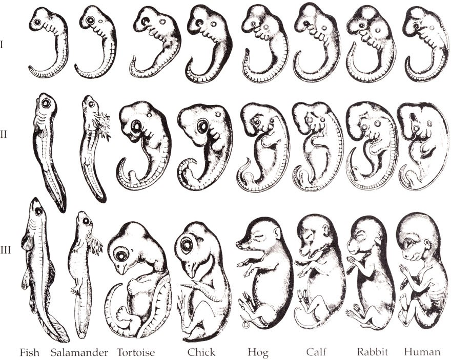
```

### Morphogenesis

Morphogenesis, from the Greek morphê (shape) and genesis (creation)

>"Beginning of the shape"

For objects that fulfill a purpose, many times (if not always) their forms (or shapes) are an expression of their function^[Even though the expression Form follows function [@Davies1982] is usually found in design and architecture, it formulates the general idea that any objects form is (or in design should) be shaped by the requirements to it.]. Analyzing the shape of an object can give one information about its function. It is therefore an important feature many different sciences, e.g. when correlating an organism’s size to the climate it lives or when correlating intelligence to the size of an animal’s brain. During an organism’s development diversification of shape on a cellular level is an important step in breaking symmetry of daughter cells. In order to form a tissue or an organ with a variety of specialized cells, it is important for the single cell to have information about where it is located, what its neighbors are doing, how densely it is packed and what the chemical composition of its surrounding is. This is accomplished by being in constant feedback with its neighbor cells and sensation of its environment. After the information got processed, the cell will react by adjusting the levels of proteins expressed to undergo proliferation or develop specialized structures like cilia or axons.

For a cell, its present shape impacts its further specification by impacting how well it perceives specific signals and the magnitude of signals received and transmitted. E.g. it has been shown that during lateral inhibition [@Shaya2017a]. Shape therefore sets the general framework for cell-cell interaction and follows a\newline

\makebox[\linewidth]{$molecular \longrightarrow cellular \longrightarrow tissue$}
\newline

scale hierarchy, where each scale’s output again feeds back to the others \@ref(fig:feedb). E.g. it has been shown that simple changes in cell geometry affect fundamental processes such as cell growth, death, or direction of cell divisions [@Galli2016; @Miller2013; @Thery2007].

```{r feedb, out.width = "0.75\\textwidth", fig.cap = "Form and function feedback loops"}
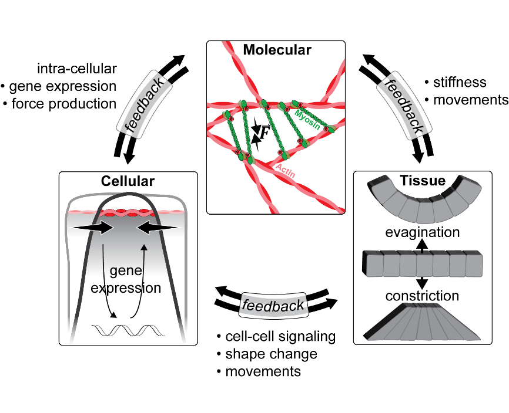
```

#### Apical Constriction

A defining feature of Epithelial cells is they have a basal- (bottom) to apical (top) polarity. At the basal site, the cell is in contact with the substrate like the extracellular matrix (ECM), apically the cell forms tight connections to its neighbouring cells – a region called the apical junctional complex (AJC). The AJC encompasses three types of junctions: Adherent junctions (AJ) at the zonula adherens (ZA), tight junctions (TJ) and desmosomes. Around the ZA dense cables of actomyosin are found  that, analog to muscle sarcomeres, are able to contract upon RHO‑associated protein kinase (Rock) mediated phosphorylation of the motor protein non-muscle myosin II (NMII) [@StJohnston2011].

Apical constriction (AC) is a single cell morphogenetic process manifest by an active apical narrowing, making the cell appear bottle or wedge shaped. It is usually coordinated by multiple cells within an epithelial layer that raise forces necessary to deform a tissue. 

```{r arrange, out.width = "0.75\\textwidth", fig.cap = "Multi-cellular Arrangements"}
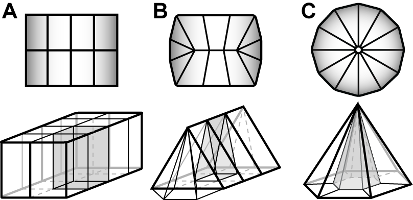
```

Developmental processes that involve AC are…
- Tissue folding and tube formation
- Single cell ingression and EMT
- Gastrulation
- Healing and sealing of embryonic tissue

Epithelial rosettes are intermediate structures of radially organized cells within an epithelial tissue whose vertices interface a common center. While the mechanisms of cytoskeletal rearrangements seem to be well conserved, the extracellular cues that lead to rosette formation are less well understood and more diverse.
At least two architectural distinct types of rosettes exist, depending on the tissues polarization \@ref(fig:constr). First, in a planar polarized tissue, several cells converge at a central apico-basal (A-B) line with no shrinkage of the apical surface to form a cylindrical structure. Such rosettes are usually observed during tissue elongation and rather short-lived. In a second scenario, cells converge to a central apical point through AC. This type of rosette is more long-lived and, usually does not resolve but already represents a morphologically pre-mature state of the organ to be formed [@Harding2014b].

```{r constr, out.width = "0.75\\textwidth", fig.cap = "Modes of Constriction"}
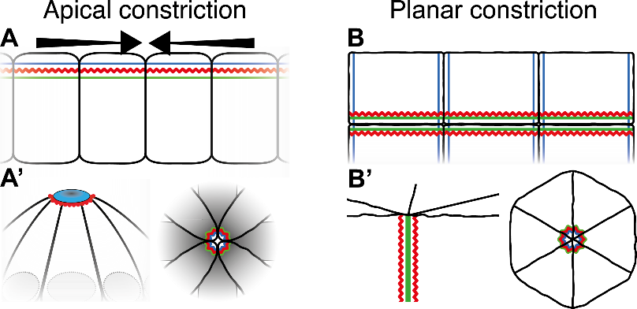
```

### Cell communication

To communicate with each other, cells have developed a variety of intercellular communication systems and a complex network of intracellular signal transduction pathways. Some information transfer depends on direct cell-to-cell contact, others rely on freely diffusible ligands that can be sensed by other cells. Each signaling pathway consists of some key regulators of a ligand – receptor pair that determines their main function. In the following, three pathways are introduced that play major roles in embryonic development.

#### WNT Signal transduction

The word ‘WNT’ is a compound word of _Wingless_ and _Int-1_, both of which are important genes during development of _Drosophila melanogaster_ (commonly known as fruit fly), where WNT signaling was first studied. WNT is evolutionary conserved with 15 different receptors and co-receptors and plays a major role during embryonic axis formation, body segmentation, organogenesis and stem cell proliferation. Aberrant WNT signaling is involved in diseases like colon cancer, melanoma and neurogenerative diseases [@Niehrs2012].

Besides this WNT signaling is sub-divided in a canonical ($\beta$-catenin^[catenins are regulators of cell-cell adhesion and gene transcription] dependent) and a non-canonical ($\beta$-catenin independent) branch. In canonical signaling, WNT ligand binds, together with co-receptor _Lipoprotein Receptor-related Protein_ (LRP), to the receptor _Frizzled_ (Frz) – jointly activating protein _Dishevelled_ (Dsh). Dsh again inhibits a protein complex usually degrading $\beta$-catenin, leading to an enrichment in the cytoplasm and the nucleus. Within the nucleus, $\beta$-catenin forms a complex with Lef to activate specific target genes [@Niehrs2012].

#### Fibroblast Growth Factor

Key roles of _Fibroblast growth factor_ (Fgf) signaling is mesoderm^[one of the earliest differentiating layer of cells. Cells of the mesoderm will e.g. form the musculature.] patterning in the early embryo, regulation of angiogenesis and wound repair. On a cellular level it is also an important regulator of proliferation and differentiation. The mammalian Fgf family is comprised of 18 ligands and four highly conserved transmembrane tyrosine kinases named Fgf receptor 1-4 (Fgfr1-4). Aberrant Fgf signaling is _e.g._ associated with tumor growth [@Turner2010].

Upon ligand binding Fgfr dimerizes and undergoes a conformational shift activating the intracellular kinase^[enzymes that transfer energy to specific substrates] domain. Subsequent trans-phosphorylation of tyrosine kinase domains serve as docking sites for adaptor proteins. Activated Fgfr then phosphorylates Fgfr substrate 2 (FRS2), recruiting adaptor protein _Son of Sevenless_ (SoS) and _Growth factor Receptor bound 2_ (GRb2) to set on a cascade of kinase dependent signal transduction eventually leading to activation of target genes [@Turner2010].

Furthermore, it was shown that rosette formation is an important morphological feature for a vesicle to form on top of the rosette, which acts as a locally enriched source of Fgf signalling [@Durdu2014a].

#### Lateral Inhibition {#intro-notch}

In neurobiology the term _lateral inhibition_ describes the process of an excited neuron reducing the activity of its neighbors. The same principle however can be found in other types of cells too where one cell signals its neighbor cell(s) _not_ to do something. term has therefore been adapted by developmental biologists to describe processes in which Notch signaling takes place [@Bray2016; @Guisoni2017].

Notch signaling is a highly conserved in evolution and controls various developmental and homeostatic processes that involve patterning, such as sensory hair cell formation, branched arterial networks or organ morphogenesis. Notch signaling consists of four components: (1) The extracellular, membrane bound Notch receptor (2) Notch ligands (3) the Notch intracellular domain (NICD) (4) and the $\gamma$-secretase. Upon ligand activation of NICD and cleavage and release of NICD, NICD enters the nucleus and together with DNA-binding proteins and co-factors initiates expression of target genes. In contrast to other signaling pathways 

1. there are no intermediates between membrane signaling and nucleus and therefore no amplification or dampening of the signal occurs 
2. signaling requires direct contact between cells, which makes Notch signaling particularly biased by features of cellular morphology and tissue organization [@Bray2016].

Since Notch signaling occurs at sites where cells are in contact, the signal generated is proportional to the contact area. Additionally, the strength of the signal increases further where cells are tightly opposed, such as sites of apical constriction [@Bray2016; @Hunter2019; @Khait2016; @Shaya2017a].

## Model Organism and System

To discover biological phenomena, biologists use a variety of non-human model organism species. While each model organism has their advantages and disadvantages, the choice for a particular model depends on the scientific question.

To study embryonic development the fresh water fish _Danio rerio_ (also known as eng: _zebrafish_ or _ger:_ zebrabärbling)\@ref(fig:zebra) has become an important model organism over the recent years. _D.rerio_ is a diploid organism with a fully sequenced genome (of the human genes 71.4% have at least one _D.rerio_ ortholog, 47% have a one-to-one ortholog [@Howe2013a]. It has a relatively short alternation of generations (12-16 weeks), a regularly large number of embryos (100 / week / female) and is relatively undemanding in terms of space for breeding and time for maturation. Furthermore, it offers well established methods for mutagenesis, screening and generation of transgenic lines. Since its embryos are naturally transparent and develop _ex utero_, it’s an ideal system for microscopic examination using molecular dyes and tags to visualize _inter_ and _intra_ cellular components even deep within the tissue (e.g. cell nuclei or cell membrane fluorescent tags). Together with advances in imaging techniques, this also allows for high throughput, high resolution, long-term _in vivo_ imaging. Especially the combination of organ or tissue specific fluorescent makers like Green- or Red fluorescent protein (G- or RFP) and observation of pre-larval stages, where the embryo is still transparent, offers enormous possibilities and to address interesting and long standing open questions.

In nature zebrafish can be found in the shallow waters of the Indian and Pakistan Ganges inflows. It exhibits an oval body shape and can reach a length of up to 5 cm in adulthood. While females are usually more silverish, for males the back is brownish and the belly yellow-whit. Laterally it exhibits its name-giving dark-blue iridescent stripes with silver in between.

```{r zebra, out.width = "0.50\\textwidth", fig.cap = "Model organism Danio rerio (aquarell by Christine Molenda)"}
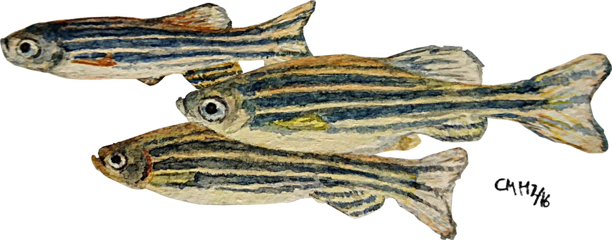
```

### Developmental Stages

A single female may lay up to 100 fertilized eggs. Each Zygote^[first diploid cell after fertilization between two germ cells] then undergoes the first zygotic cell cycle (**up to 0.75 h**). The following two to seven cell cycles (period: _Cleavage_, **up to 2.25 h**) occur directed and synchronous every ~15 min. Cells in this stage are called _blastomeres_ and are incompletely undercut the _blastodisc_ (the collective of blastomeres) and remain interconnected by cytoplasmic bridges. The _Blastula_ period (up to 5.25 h) is determined by an increasing a-synchronicity between the cells, flattening of the blastodisc and lengthening of the cell cycle. This period is also marked by the onset of _epiboly_^[cells in late blastula start to dome, while a monolayer of the domes circumfence begins to wrap around the Yolk] [@Kimmel1995a].

After Blastula and **up to 10 h** the _Gastrula_ period takes place, followed by the _Segmentation_ period (**up to 24 h**). Both of which are depicted in more detail in figure \@ref(fig:stages). At even later stages the embryo starts to elongate posteriorly, grow in size and develop organs until it first active muscle are present and it starts to swim \@ref(fig:stages). 

(ref:stages) Zebrafish embryonic development (schemes adapted from Kimmel et al., 1995)

```{r stages, out.width = ".95\\textwidth", fig.cap = "(ref:stages)", fig.scap="Zebrafish embryonic development"}
knitr::include_graphics("figures/intro/stages.png")
```

### The Lateral Line System

The lateral line (LL) system is a mechano-sensory organ that is common to all teleost fish. It enables the animal to sense water movements and therefore to orient itself, and to detect prey and predators. Fully developed, the lateral line system is comprised of hundreds of neuromasts positioned in an orderly pattern all over the animal’s body \@ref(fig:llsystem)A. Its functional subunits are the neuromasts (NM) \@ref(fig:llsystem)B-C that, when fully developed, consist of hair-, support- and mantle cells. To sense water movements, each NM projects kinocilia out of the skin that, upon water induced deflection, create action potentials that are transduced via afferent and efferent fibers [@Chitnis2012a; @Ghysen2007a].

(ref:llsys) The lateral line system. **A** modified after (Ghysen et al., 2012) and A.Bergs, 2016 (student presentation at AK Lecaudey). Development of the later line system at embryonic, larval and juvenile stage. **B** Schematic showing a crossection and organization of a single neuromast. (C-C’) SEM images of a single, pre-mature (3 dpf) neuromast.

```{r llsystem, out.width = ".95\\textwidth", fig.cap = "(ref:llsys)", fig.scap = "The lateral line system"}
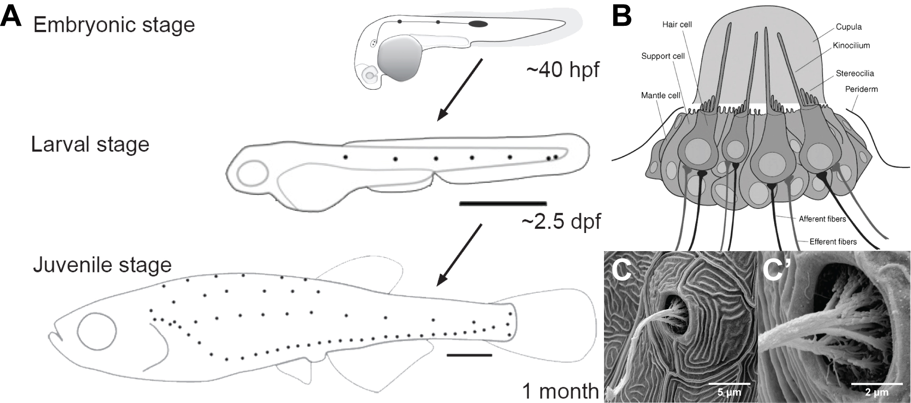
```

Each NM is first deposited as a premature cluster of about 30 cells from a migrating cell-aggregate called the posterior lateral line primordium (pLLP) \@ref(fig:llgfp)A. The pLLP delaminates from the pLL placode, caudal to the otic vesicle \@ref(fig:llgfp)B at around 20 _hours post fertilization_ (hpf) as a group of ~100 cells. After formation of the leading region with cells undergoing EMT, it starts migrating along a chemokine gradient positioned at the horizontal myoseptum to the tip of the tail \@ref(fig:pllp) [@Chitnis2012a; @Ghysen2007a]. To ensure the development of a functional organ, several fundamental biological processes like cell migration, morphogenesis, proliferation and cell polarization need to be integrated into the pLLP. 
An important breakthrough in LL research has been the development of a transgenic line expressing a membrane tethered GFP fusion protein (lyn-GFP) that is expressed under the LL specific promotor of _cldnb_ (claudin b^[construct name: _Tg(-8.0cldnb:lynGFP)_; ZFIN ID: ZDB-TGCONSTRCT-070117-15]) [@Haas2006c], which allowed for a much more detailed view and to observe lateral line development _in vivo_. An example of the fluorescence signal visible at ~60 hpf can be seen in \@ref(fig:llgfp)B.

(ref:llgfp) Neuromast deposition and pattern **A** Scheme showing NM deposition over three timepoints (10 min. interval). Dotted lines are time-tracks of rosettes, which become more concentrated over time. Bottom arrow indicates regions of rosette formation, maturation and deposition within the pLLP (scale bar = 20 µm; 20X WI; ~20 Z-planes; 2.5 µm spacing. MaxIP. Colors inverted.) **B** Scheme showing the lateral line at end of migration (~60 hpf) and other parts visible through the cldnb:lyn-gfp transgene (as documented through zfin.org) (air objective + 1.5X tube lens; four tiles; ~20 Z-planes; 5 µm spacing. MaxIP. Colors inverted).

```{r llgfp, out.width = ".95\\textwidth", fig.cap = "(ref:llgfp)", fig.scap = "Neuromast deposition and pattern"}
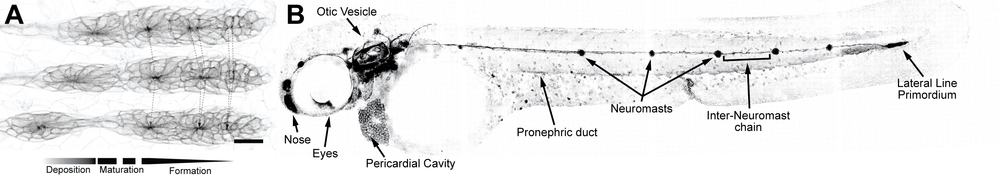
```


### Posterior Lateral Line Primordium

The pLLP is about 100-150 $\mu$m in length (depending on deposition cycle) over which it exhibits a diverse surface topology and cellular morphology. The current model assumes that the _caudal_ (also _posterior_), more mesenchymal cells, are leading the path of migration, while the _cranial_ (also _anterior_), more epithelial cells, are trailing. Towards the leading region the cells are more flat, towards the trailing region the cells become more columnar and increasingly radially organized into formations called epithelial rosettes (figure 14). During migration the pLLP typically contains 2-3 _rosettes_ (~25-30 cells each), while the most trailing one will eventually be deposited to further mature to a functional NM [@Chitnis2012a; @Harding2014a]. Since every deposition comes with a loss of cells in the pLLP, cells need to be regenerated. While one study concludes a spatial heterogeneity in distribution of proliferative cells [@Laguerre2009a], another one suggests a higher proliferative rate near the leading region [@Nechiporuk2008].

(ref:pllp) Summary of signaling gradients within the pLLP. Cross-section of the lateral line primordium. (red = trailing region, yellow = leading region; embryonic axes indicated by arrows. Signaling gradients indicated by black-white gradients, sorted by hierarchy.)

```{r pllp, out.width = ".75\\textwidth", fig.cap="(ref:pllp)", fig.scap = "Summary of signaling gradients within the pLLP"}
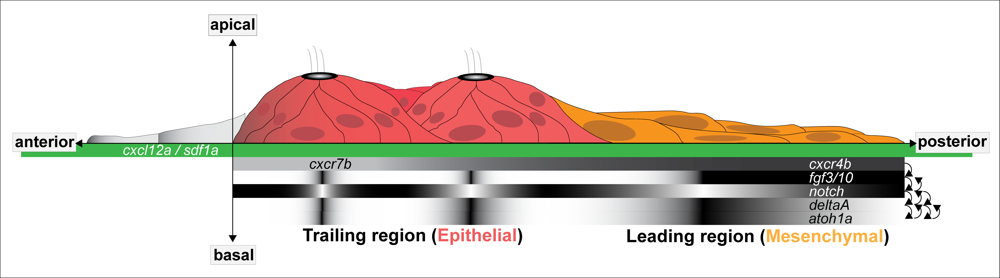
```


#### Rosette formation

The onset of morphological and functional changes is determined by signaling of Fgf, which is mostly active in the trailing region. Causal for expression of Fgf is a signaling center of WNT in the leading region, which promotes expression of Fgf ligands _Fgf-3_ and _-10_ [@Aman2008]. Those ligands then diffuse to the trailing domain where binding through _Fgf receptor 1_ (Fgfr1) triggers a signaling cascade through which the cells become more columnar, apically constricted and eventually re-organize into epithelial rosettes [@Hava2009; @Lecaudey2008a; @Nechiporuk2008]. Concurrently, cells of the Wnt signaling center themselves are not competent to Fgf signaling, which is achieved through expression of _Sef_, an intracellular antagonist to Fgfr1 signaling [@Tsang]. In a more recent publication [@Ernst2012a] it was shown that Shroom3 plays a key role in mediating AC and rosette formation in the pLLP.

#### Hair cell specification

Downstream of Fgf lies the expression of transcription factor (TF) atoh1a, which gives cells the potential to become sensory hair cells [@Nechiporuk2008]. The current model suggests that Fgf initiates expression of _atoh1a_ and _deltaA_, where DeltaA activates Notch in neighboring cells to inhibit expression of _atoh1a_ in those. Atoh1a in turn suppresses competence for Fgf and initiates expression of _atoh1b_ and _deltaD_. While the latter acts synergistic with DeltaA, Atoh1b again drives expression of _atoh1a_ [@Matsuda2010b]. Once a prospective hair cell is specified it will itself become a source for Fgf-10. By this process adjacent cells are laterally inhibited and determined _support cells_\@ref(fig:llsystem)B, still capable of receiving Fgf signals.

Just before the most trailing rosette is deposited, its prospective hair cell will undergo a final division to form a doublet of sensory hair cells that will orient orthogonal to planar polarity and establish mirror symmetry in maturing neuromasts [@Mirkovic2012; @Rouse1991].

### Shroom3 in the pLLP

The Shroom protein family is conserved through evolution (supplementary figure) and involved in contraction of the actomyosin network (e.g. during AC), which has been confirmed in several studies _e.g._ investigating e.g. epithelial planar remodelling, neural tube morphogenesis, _Xenopus_ bottle cells and epithelial invagination [@Das2014a; @Hildebrand2005; @Hildebrand1999a; @Lee2007; @Nishimura2008; @Plageman2011]. Furthermore, Shroom might be a novel candidate involved in heterotaxy [@Tariq2011].

#### Recent research {#intro-shroom}

Shroom proteins have three characteristic domains (1) a _PDZ_ domain close to the N-terminus to interact with other proteins with PDZ domains and (2) two _Apx/Shroom_ domains (ASD1 and 2), the latter being close to the proteins C-terminus. The Shroom domains may interact with proteins containing a _Shroom binding domain_ (SBD) such as Rock to help and facilitate phosphorylation of NMII \@ref(fig:shrminteract) [@Zalewski2016].

(ref:interact) Shroom3 functional domains and mode of operation. Sequence of events numbered from 1-4. Approximate scale jumps indicated at arrows.

```{r shrminteract, out.width = ".95\\textwidth", fig.cap="(ref:interact)", fig.scap = "Shroom3 functional domains and mode of operation"}
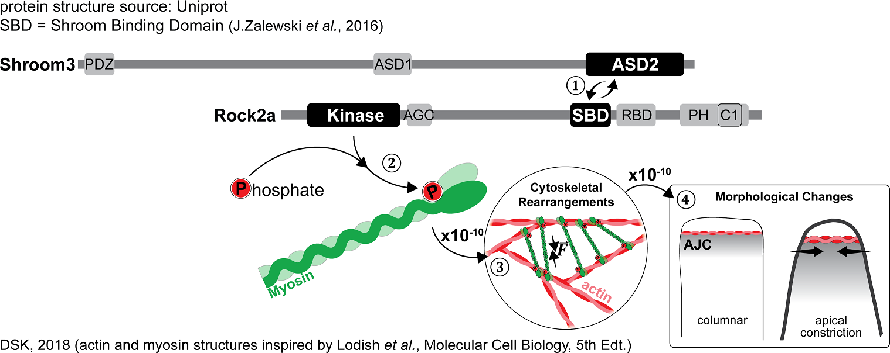
```

While in all of the above-mentioned studies Shroom3 was the focus of interest, in zebrafish and most other model organisms there are four paralogs. A previous study done on Shroom3 morphants in _D.rerio_ [@Ernst2012a] indicates that Shroom3 is also necessary for AC and rosette formation in the migrating pLLP. In summary they were able to show and that

1. Shroom3 is indeed expressed in the pLLP from stages 24 – 48 hpf which was confirmed via _in situ_ hybridization (ISH)
2. _shroom3_ is expressed downstream of Fgf signalling, which was confirmed via treatment with an Fgfr1 inhibiting drug. Subsequent ISH with the Probe used before showed that the signal was gone in Morpholino (MO) injected embryos. The drug used has been used before (SU5402) in the same context [@Lecaudey2008a; @Nechiporuk2008]. In these it was found that SU5402 has the ability to prevent rosette formation, but not to dismantle already established ones.
3. Shroom3 localizes to rosette centers, which was accomplished by inserting a genetic construct where a _shroom3-tagRFP_ fusion protein is under control of a heat-shock^[heat shock proteins are _Escherichia coli_ enzymes that assist protein folding and are heat activated] promotor into a _cldnb:lyn-GFP_ transgenic line. This way they were able to ectopically express _shroom3-tRFP_ and confirm its localization by confocal fluorescence microscopy \@ref(fig:shrmernst)A.
4. Rosette formation is impaired, which was confirmed quantitatively by using a specifically trained _rosette detector_ [@Liu] to count and weight single rosettes. As a metric to compare whole pLLPs the sum of weights as in $\sum_{i=1}^{i-n}{weighted\ detections}$ was used \@ref(fig:shrmernst)BB-B'.

(ref:ernst) Shroom3 in rosette formation (adapted from Ernst et al., 2012) **(A)** composite MaxIPs of membrane label and fusion protein showing the localization of Shroom within the pLLP **(B)** uninjected control and shroom3 MO injected MaxIPs (B’) Heat-maps of rosette detector score.

```{r shrmernst, out.width = ".95\\textwidth", fig.cap="(ref:ernst)", fig.scap = "Shroom3 in rosette formation"}
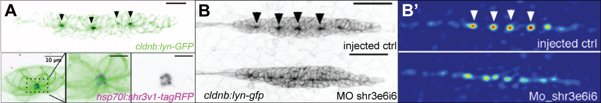
```

#### Current Model

Based on these and previous results, the current model for apical constriction in the pLLP assumes that (1) expression of _shroom3_ is induced by Fgf signaling (2) Shroom3 binds Rock and translocates to the AJC to (3) mediate phosphorylation of NMII which (3) induces contraction of the actin network and AC \@ref(fig:shrmmodel). Furthermore, AC is necessary for rosette assembly and subsequent NM deposition. In conclusion the current understanding is that without Shroom3 AC can not take place and rosette formation does not occur, therefore NMs are not deposited.

(ref:shrmmodel) Shroom3 current model

```{r shrmmodel, out.width = ".70\\textwidth", fig.cap="(ref:shrmmodel)"}
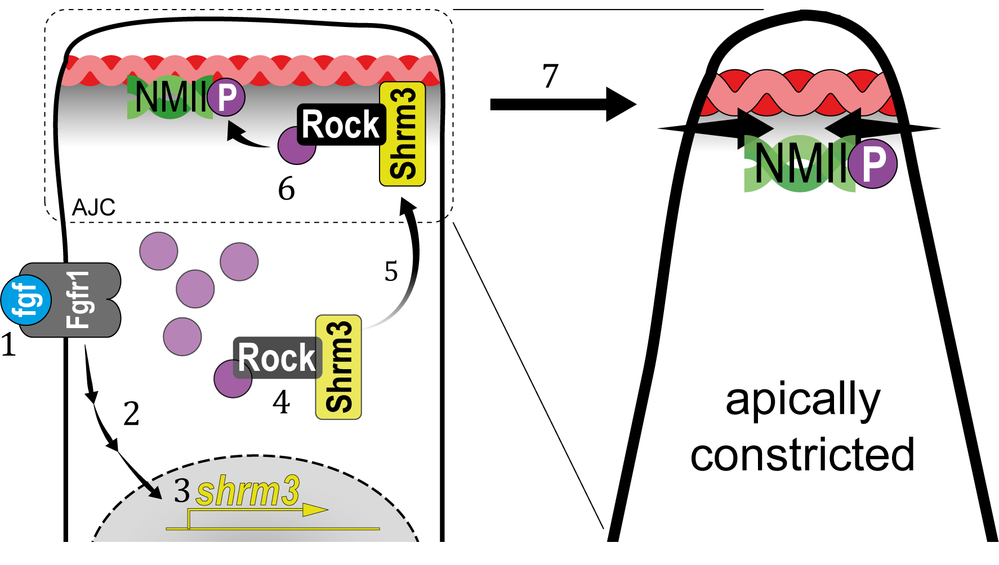
```

### _shroom3_ mutants

The strategy for the mutant was to inhibit interaction with SBD-domain proteins. Furthermore, the mutant should be easily genotyped by amplifying a fragment of the gene via PCR and correlating gel electrophoresis band patterns after a restrictive digest. To achieve this, an eight base pair deletion was introduced in Shroom domain 1 (SD1) using the _Transcription activator-like effector nuclease_ (TALEN) [@Bedell2012a] genome editing system that would prevent interaction with SBD-domain proteins, or even lead to a NULL mutation^[mutation that leads to a complete loss of function] \@ref(fig:shrmmut)A-A'. The mutation lead to (1) a shift in the open reading frame and to a pre-mature stop codon and (2) a deletion of a restriction site for a restriction enzyme named NsiI. create a point mutation \@ref(fig:shrmmut)B-B'.

#### Phenotype description {#intro-phen}

While birth rates follow a distribution of Mendelian inheritance (after genotyping at 3 months of age), mutant adults are more sensitive to mechanical stress and have a shortened lifespan (~6-9 months). In body shape, _shroom3_ mutants are not smaller or posses any other striking phenotype \@ref(fig:shrmmut)C, however their gill flaps seem to be increased in size, swollen, and not exactly streamlined with the body. This is also evident by an increased frequency of gill flap beating. When looking at the pLLP at different stages \@ref(fig:shrmmut)D, they exhibit the same phenotype as the MO injected embryos. Here it is noteworthy that a fraction of about 20$\%$ of the pLLPs exhibit a more wildtype (or _weak_) phenotype, even though these embryos were genotyped as homozygous^[when both alleles are the same] mutant. A possible reason for this will also be subject of thesis. Figure \@ref(fig:shrmmut)E shows exemplary specimen at about 60 hpf where for the mutant, the first thing that catches the eye is the increase in the number of clusters^[forth on Neuromasts will be called ‘cell clusters]  deposited. Interestingly, this is rather contradictive to the current model of Shroom3’s function during LL development.

(ref:shrmmut) _shroom3_ mutant phenotype **(A-A’)** mutation strategy (A) Talen arms (black blocks) bordering a sequence within SD1 including a restriction site for NsiI (indicated back arrows and grey background) (A’) wildtype and mutant allele with 8 bp deletion **(B-B’)** Amino acid code and protein schematic with functional domains and stop codon (indicated by asterisk) **(C-C’)** Adult phenotype with closeup to gill flaps **(D)** pLLP phenotype for three different stages (columns) and different manifestations (rows) (40X WI objective). Arrows indicate epithelial rosettes. **(E)** LL phenotype at end of migration (10X air objective). Scale bars = 1 mm. MaxIPs for D-E.

```{r shrmmut, out.width = ".95\\textwidth", fig.cap="(ref:shrmmut)", fig.scap = "shroom3 mutant phenotype"}
knitr::include_graphics("figures/intro/shrm_mutants.png")
```

## Objective and Open Questions

After having the results of the morpholino induced phenotype, a mutant was generated whose pLLP phenotype closely resembled the morpholino induced one. However, the phenotype at later stages revealed discrepancies with the current model and the role of Shroom3 during LL development.

### Motivation

Due to the pLLP’s relative simplicity (~100 cells), excellent accessibility for advanced light-microscopes (~1 cell layer beneath the skin) and a broad and well-established palette of available methods, it promises an _in toto_ understanding and complete model of factors leading to its development. Having access to such a model may be very beneficial to other fields such as organ regeneration, cancer- and clinical research.

In this scenario, the advantages of working with a knockout- as compared to a knockdown^[permanent versus transient mutation] mutant are (1) an equal amount of gene expression across all samples (2) no side effects due to injection procedure or solvents in drug treatments (3) the ability to observe the effects of the mutation for very long periods of time.

One aspect about LL development that still remains unclear are the exact factors that lead to cell cluster (CC) deposition. What determines the timing of deposition? When is a rosette mature enough to be deposited? What happens to the cells before and after deposition? How do the cells specify before deposition? What are the morphological features of depositing cells? What influence does morphology have on Neuromast deposition?

Using the Shroom3 mutants as a model system offers great potential to shed new light on organogenesis, the interplay between morphogenesis and cellular specification, epithelial rosette formation and neuromast deposition.

## Data Strategy and Analysis

Due to the history of Developmental Biology and the complexity of biological processes _per se_, the field heavily relies on image data. Since the advent of electronic imaging techniques^[e.g. photomultipliers or charge-coupled devices] scientific image data can be processed and analyzed _in silico_. To make use of the possibility of 

1. live imaging, which (as compared to fixation techniques) conserves the cellular integrity and morphology while also offers the possibility of recording time-lapses 
2. the optically clear specimen and 
3. high throughput image analysis and state-of-the-art data science using algorithmic implementations, 

the three following points were paid special attention to.

### Sample Preparation

For fluorescence microscopy zebrafish embryos are usually immersed in a 1% solution of _low melting-point agarose_ (LMPA) solution and then oriented on an optical cover slip manually until the LMPA has solidified. This process allows to mount^[the process of embedding the samples in agarose] eight to ten embryos _per_ dish. To make use of the high number of offspring a single zebrafish female may lay, which rapidly leads to a sample number of more than 300, a new sample preparation technique was devised that allows for (1) a four to five times increase in samples per dish (2) a facilitated navigation _via_ a grid-like orientation through the samples and (3) an improved spatial orientation where the embryos body axes are aligned parallel to the optical Z-sections of the confocal microscope. For details, see Materials and Methods section \@ref(mount-met) and Kleinhans _et al._, 2019.

### Imaging

Technically, speed and sensitivity are most important for live imaging. Considering these two parameters a light-sheet [@Keller2010c] fluorescence microscope (LSFM) would be the best fit. However, LSFMs also have several limitations. First, due to the sample preparation methods available the number of samples that can be imaged at a time is highly restricted. Second, for subcellular resolution a high magnification is required, which is limited by working distances and third - for optimal image analysis a high Signal-to-Noise ratio (SNR) and numerical aperture (N.A.) is preferable. Therefore a spinning disc [@Graf2005] system was chosen for most of the imaging. 
The system makes use of (1) an extra-large field of view (FOV) ideal for large specimen (2) the possibility of a high degree of automation with state-of-the-art software and (3) a water dispension system for long-term water immersion imaging. For details about the system see Materials and Methods section \@ref(mat-SD).

### Data handling

Subsequently after data acquisition and pre-processing the image data was transferred from the microscope system to the labs main workstation. To uniquely identify each file and have them appear in a structured manner, a file-naming system was established after the following structure

\makebox[\linewidth]{$[stage]\_[group]\_[id]\_[date]$}
\newline

Where _stage_ would e.g. be 32hpf, _group_ would be a genotype or drug treatment, _id_ would be a positional identifier on an imaging dish like B1P01^[Where B stands for a batch, that is if multiple dishes were imaged and P stands for the position within a single batch] and _date_ would be a date in the form of YYMMDD.

### Image and Data Analysis

In order to be as objective an as high throughput as possible, almost all of the analyses performed for this study was solved using either algorithmically or state-of-the-art convolutional neural networks (CNNs). Furthermore, to meet the terms and conditions of _open science_^[“movement to make scientific research […] and its dissemination accessible to all levels of an inquiring society” – Wikipedia/en/Open_science] standards, all pipelines were implemented in open source software frameworks such as _Fiji is just image J_ (FIJI) and R. For further information about training datasets, algorithms and versions used see Materials and Methods section \@ref(mat-sftwr). 