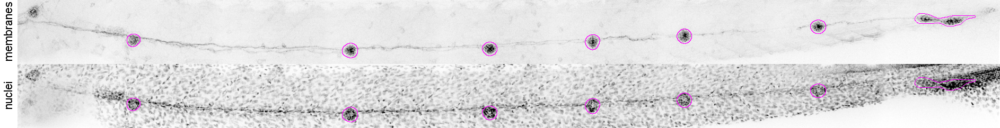
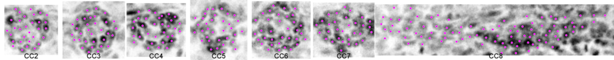
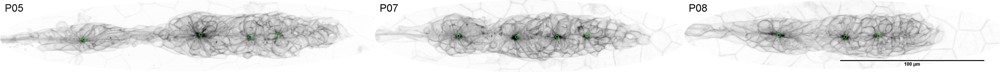
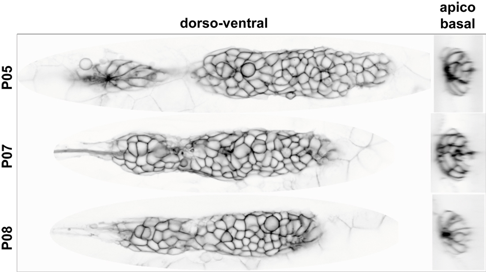
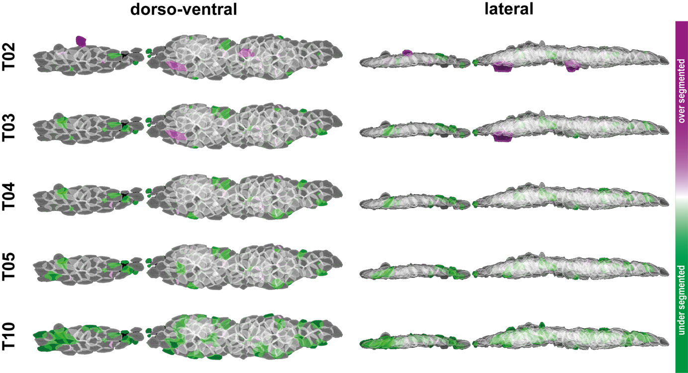
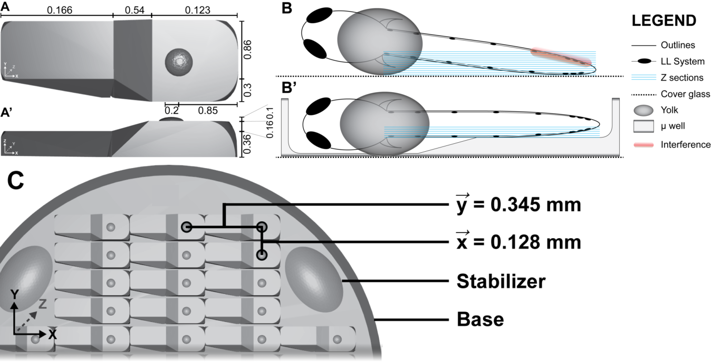
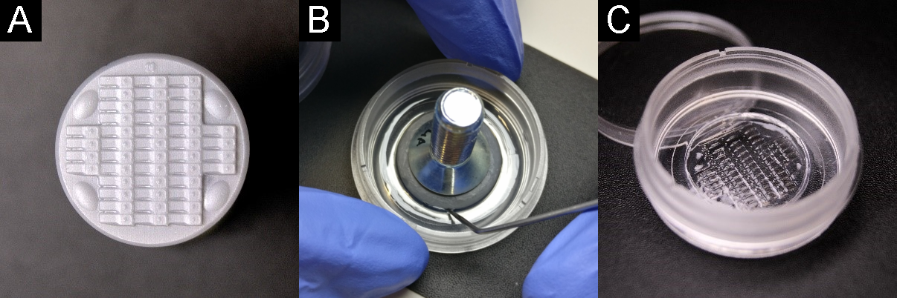
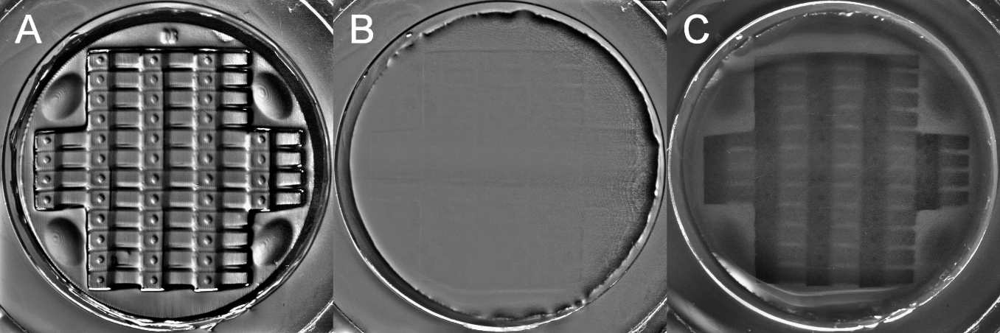
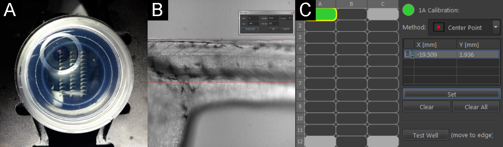

# Materials and Methods {#mat-met}
## Materials {#mat}

### Chemicals {#mat-chem}

---------------------------------------------------------------------------------------------
              **Chemical**    Company                                         cat.-no.   
-------------------------- -------------------------------------------------- ---------------
Agarose                     Roth                                                    6351.2           

Agar-Agar                   Roth                                                    5210.3

Ampicillin                  Roth                                                    K029.2

ATP                         Epicentre                                               E311K

Blocking Reagent            Roche                                                   11096176001

BCIP                        Fermentas                                               R0822

CaCl\textsubscript{2}       Roth                                                    886.1

Calyculin

DIG RNA Mix                 Roche                                                   11277073910

DMSO                        Roth                                                    4720.2

EtBr                        Roth                                                    2218.3

EtOH                        Roth                                                    9065.3

Formaldehyde                Roth                                                    7398.1

Formamide                   Roth                                                    P040.1

Glycerol                    Roth                                                    3783.2

IPTG                        Thermo                                                  R1171

KCl                         Roth                                                    P017.1

Low melting point Agarose   Roth                                                    A9539 

Maleic Acid

MeOH                        Roth                                                    CP43.3

MgCl\textsubscript{2}       Roth                                                    2189.1

NaCl                        Roth                                                    9265.2

NaHCO\textsubscript{3}      Roth                                                    855.1

NaOH                        Roth

NGS                         Sigma                                                   C6767

_p_-Formaldehyd             Sigma                                                   P6148

Phenol Red                  Sigma                                                   P0290

Propan-2-ol                 VWR                                                     20842330

Proteinase K                Roth                                                    7528.4

PTU                         Sigma                                                   P7629

Rockout

SSC

SU5402                      CALBIOCHEM                                              572630

Torula RNA                  Sigma                                                   R6625

Tricaine                    Fluka                                                   A5040

Tris Base                   Roth                                                    4855.2

Triton-X100                 Roth                                                    3051.2

Trizol                      Ambion                                                  15596018

Tween20                     Sigma                                                   P1379
-------------------------- -------------------------------------------------- ---------------
Table: (\#tab:mat-chem) Chemicals

### Solutions {#mat-sol}

---------------------------------------------------------------------------------------------
         **Solution**     Company                                             cat.-no.   
--------------------- ------------------------------------------------------- ---------------
Ambion Water

Cut Smart Buffer        NEB                                                     B7204S

Generuler 100 bp        Thermo                                                  SM0241

Generuler 1kb           Thermo                                                  SM0311
--------------------- ------------------------------------------------------- ---------------
Table: (\#tab:mat-sol) Solutions

### Antibodies {#mat-anitb}

---------------------------------------------------------------------------------------------
         **Antibody**     Company                                             cat.-no.   
--------------------- ------------------------------------------------------- ---------------
Anti-Digoxigenin        Roche                                                   11093274910

JL8     

Anti-TAZ
--------------------- ---------------- ------------ ------------ ------------ ---------------
Table: (\#tab:mat-antib) Antibodies

### Enzymes {#mat-enz}

---------------------------------------------------------------------------------------------
               **Enzyme**     Company                                         cat.-no.   
------------------------- --------------------------------------------------- ---------------
BtsCI                       NEB                                                     #R0647  

DdeI                        NEB                                                     #R0175    

HaeIII                      NEB                                                     #R0108   

MnlII                       NEB                                                     #R0163  

NlaIII Restriction          NEB                                                     #R0125   

NsiI-HF Restriction         NEB                                                     #R3127  

Phusion Polymerase          NEB                                                     #M0530L

Ribolock                    Thermo                                                  #EO0381

RNase A                     Quiagen                                                 1006657

RNase H                     NEB                                                     M0297L

sp6 RNA Polymerase          Thermo                                                  #EP0131

T4 Ligase                   NEB                                                     #M0202T

T7 RNA Polymerase           Thermo                                                  #EP0111

Taq DNA Polymerase          Invitrogen                                              #10342-020 

Taq DNA Polymerase          VWR                                                     
------------------------- ---------------- ------------ ------------------------- -----------
Table: (\#tab:mat-enz) Enzymes

### Molecular Biology Kits {#mat-mobikits}

---------------------------------------------------------------------------------------------
                                           **Kit**    Company                 cat.-no.   
-------------------------------------------------- -------------------------- ---------------
mMessage mMachine Sp6 Polymerase                    Invitrogen                   AM1340

pGEM-T TA Cloning                                   Promega                      A3600

Superscript III cDNA Synthesis                      Thermo                      18080051

Wizard SV Gel and PCR Clean-Up                      Promega                      A9282

PCR & Gel Clean-Up                                  Sigma
-------------------------------------- -------------------------------------- ---------------
Table: (\#tab:mat-mobikits) Molecular Biology Kits

### Buffers {#mat-buff}

---------------------------------------------------------------------------------------------
**Buffer**                 
------------------------- -------------------------------------------------------------------
Blocking Reagent (BR) 

Cut Smart Buffer

E3

Hybridization buffer

LB Medium / Agar

NTMT                        75 mM NaCl + 15 mM MgCl\textsubscript{2} + 15 mM

PBS                         2.7 mM KCl + 12 mM HPO\textsubscript{4}\textsuperscript{2-} 

PBST                        PBS + 0.1% Tween20

PBDT                        PBS + 1% BSA + 1% DMSO + 0.3% Triton

P1

P2

P3

Tricaine

TNT
------------------------- -------------------------------------------------------------------
Table: (\#tab:mat-buff) Buffers

### Zebrafish lines {#mat-lines}

-----------------------------------------------------------------------------------------------
  **Allele**    **name**                   **zfin**             
------------ ----------------------------- ----------------------------------------------------
zf106Tg       _cldnb:lyn-gfp_              [_Tg(-8.0cldnb:LY-EGFP)_](//zfin.org/ZDB-ALT-060919-2)

fu13Tg        _cxcr4b_(BAC):_H2BRFP_       -

nns8Tg        _atoh1a:Tom_                 [_atoh1a_](//zfin.org/ZDB-FISH-150901-21622)

fu50          _shroom3_                    -

m1274Tg       _hsp70:shr3v1FL-taqRFP_      -
------------ ----------------------------- ----------------------------------------------------
Table: (\#tab:mat-lines) Zebrafish lines

### ISH probes {#mat-probes}

---------------------------------------------------------------------------------------------
**Probe**  **Sequence**                
---------- ----------------------------------------------------------------------------------
atoh1a      \scriptsize \texttt{TCCGTCCCTGTATCCATAGCCACAAACTTTCCTCCCAAAAGCACAAACCAACAGAATGGATGGAATGAGCACGGATACAAGAGA\newline 
            GGTGGTTGAACTCGACGTCCAGCATTCGAGCTTGGGGCGGGGGGAGCAGAGCGAGTACCCACCAGCCTTGGCACTCATGGCCAG\newline 
            CAGTGACCCACGCGCCTGGCTGGCTCCCGTGCAGGCTGGCACCTGCGCGGCACACGCCGAATACCTGCTGCACTCGCCCGGCTC\newline 
            GAGCGCGGAAGGCGTGTCCTCTGCCTCCAACTTCAGGAAGAGCAGCAAGAGTCCTGTCAAAGTACGCGAGCTCTGCCGGCTTAA\newline 
            AGGAGCTGTGGGGGCAGATGAGGGCAGACAGCGGGCCCCATCCAGCAAATCCACCAACGTCGTGCAGAAACAGAGGCGAATGGC\newline 
            TGCCAATGCCCGGGAGAGGCGAAGAATGCACGGATTGAACCACGCGTTCGACGAGCTGCGCAGTGTCATCCCAGCCTTTGACAA\newline 
            CGACAAGAAACTCTCCAAGTACGAAACCCTGCAGATGGCCCAGATCTACATCAACGCCCTGTCCGACTTACTACAGGGCCCCGG\newline 
            TGCTAAAGCCGACCCGCCAAACTGCGACCTGCTGCATGCCAACGTGTTAGAAACGGACCGATCTCCCAGAGGATCACCGGGCGT\newline 
            CTGTCGGAGAGGCACGGGCGTGGGTTACCCGTACCAGTACGAGGACGGAACATTCAAC}

deltaD      see [@Haddon1998]
---------- ----------------------------------------------------------------------------------
Table: (\#tab:mat-probes) ISH probes

### Hardware {#mat-hrdwr}

#### Mounting Stamp {#mat-stamp}

The stl file for printing can be found at [github.com/KleinhansDa/3DModels](https://github.com/KleinhansDa/3DModels)

#### Spinning Disc Microscopy {#mat-SD}

---------------------------------------------------------------------------------------------
       **Component**    Company         Product               Specs    
-------------------- ---------------- ----------------------- -------------------------------
 Microscope            Nikon              Eclipse Ti-E             fully motorized 
 
 PFS                   Nikon              Perfect focus system     Z repositioning 
 
 XY-table              Merzhaeuser        XY motorized table       1 $\mu$m accuracy  
 
 Piezo                                    Piezo Z-table            300 $\mu$m scan range
 
 SD system             Yokogawa           CSU-W1                   50 $\mu$m pattern
 
 Laser                                    Laser Combiner           see table \@ref(tab:lasers)

 FRAPPA                Revolution         FRAPPA                   -
 
 Borealis              Borealis           Borealis                 flat field correction 
 
 sCMOS                 Andor              ZYLA PLUS                4.2Mpix; 82%QE
 
 Immersion             Merzhaeuser        Liquid Dispenser         -
-------------------- ---------------- ----------------------- -------------------------------
Table: (\#tab:SDcomp) Spinning Disc system components

------------------------------------------------------------------------------------
                       **Lasers**        Type      Power
--------------------------------- ---------------- ---------------------------------
405 nm                              diode             100 mW  

445 nm                              diode             80 mW  

488 nm                              DPSS              100 mW  

561 nm                              DPSS              100 mW 

640 nm                              diode             100 mW  
--------------------------------- ---------------- ---------------------------------
Table: (\#tab:lasers) Available lasers

---------------------------------------------------------------------------
 **Objective**  Company   Type         Immersion   N.A.  working distance
-------------- --------- ------------ ----------- ------ ------------------
 10x            Nikon    CFI APO        air        0.45   4.00 mm 
 
 20X            Nikon    CFI APO        water      0.95   0.95 mm  
 
 40X            Nikon    CFI APO        water      1.15   0.60 mm  
 
 60X            Nikon    CFI APO        water      1.20   0.30 mm            
-------------- --------- ------------ ----------- ------ ------------------
Table: (\#tab:objectives) Available objectives

#### Workstation {#mat-work}

Statistical computation and image analysis were done on a Fujitsu Siemens (FS) Workstation CELSIUSM740 with the following hardware components...

-------------------------------------------------------------------------------
   **Component**      Company         Product          Specs
---------------- ----------------- ------------------- ------------------------
CPU                 Intel           Xeon E5-1660v4      3.2 GHz, 20MB, 8cores  

RAM                 Fujitsu         -                   4x16GB DDR4-2400 

Graphics            NVIDIA          Quadro M4000        8GB RAM 
---------------- ----------------- ------------------- ------------------------
Table: (\#tab:PCcomp) Workstation hardware components

### Software {#mat-sftwr}

----------------------------------------------------------------------------
                  **Software**   Version      web                    
------------------------------ -------------- ------------------------------ 
 Imagej FIJI                    1.48            [https://fiji.sc/]
 
 RStudio                        1.0.153         [https://www.rstudio.com/]
 
 Ubuntu                         17.1            [https://www.ubuntu.com/]
 
 Windows 10 Pro                 10.0.16299
 
 Total Commander                9.0             [http://ghisler.com/]
------------------------------ -------------- ------------------------------
Table: (\#tab:sftwr) Used software

### Ground Truth Data {#mat-GrTrDat}

Analyzing images and extracting quantitative measurements can be a tedious task, especially when the analysis becomes more complex. Fortunately, there are ways to automate image analysis by using either machine learning approaches or by tailoring hand-crafted algorithms in an image analysis software tool like e.g. ImageJ[@Schindelin2012]. 

The main advantages of doing so are.

-	to be independent of confirmation bias
-	to make the analysis more robust against oversight
-	to increase the statistical power by increasing the number of data points[@Button2013]
-	to increase effect size by increasing the measurement accuracy[@Button2013]

However, to reassure the measurements taken by a tailored or trained algorithm are meaningful, they must be compared to a _ground truth_ dataset which again describes a general measure of algorithmic quality performance[@Krig2014].

#### 2-D Ground Truth

#####  Ground Truth Design

To assess the quality of the _ClusterAnalysis_ algorithm for nuclei detection the ground truth was designed as follows.

###### Model

-	each CellCluster (CC) consists of a number of objects (cells)
-	each object is part of the respective CC and defines one cell entity
-	each object is determined via a fluorescent nucleus label
- embryos are mounted within a 3D mold to reduce noise

---------------------------------- ----------------------------------
                          XY scale 0.32 px/$\mu$m
 
                         Z-spacing 4 $\mu$m
 
                            Camera Rolera
---------------------------------- ----------------------------------
Table: (\#tab:imgcond3DGrT) Cluster Analysis Model

###### Training data

The training set consists of three randomly picked wild type PLLps. For each the algorithm is run with standard parameters. Cell cluster ROIs and nuclei multi point labels are edited manually.

###### Test data

To test the algorithm, it is run at different nuclei detection thresholds on the same image data.

##### Results

###### Image Analysis

For image analysis a custom IJ macro script was developed that segments individual cell clusters based on morphological filtering[@Legland2016], Gaussian blurring and subsequent thresholding. The user is then presented the segmentation ROIs to manually edit them, if necessary. Using those ROIs as masks, the nuclei within them are count based on Gaussian blurring and a 2-D maxima finder. To detect the right amount of nuclei however, it is necessary to evaluate the distance over which the blurring should be applied.

A typical nucleus in the PLLp is about 5 $\mu$m in diameter. To determine the right blurring value, a range of 4-6 $\mu$m in steps of 0.5 is tested.

###### Macro modules

The macro developed consists of the following main modules:

1. Background subtraction, morphological filtering, Gaussian blurring & segmentation
2. Manual correction for cell cluster segmentation masks
3. ROI indexing from left (1) to right (n)
3. Nuclei counting within cell cluster masks
4. Export of results table (Area, Count, ...)

###### Registered data

Figure \@ref(fig:maxllreg) shows a registered maximum Z projected lateral line used for ground truth evaluation.

(ref:maxllreg) Registered, Maximum Z projected data with cell cluster labels
```{r maxllreg, echo=FALSE, warning=FALSE, fig.align='center', dpi=200, out.width='90%', fig.cap="(ref:maxllreg)"}

```

###### Ground Truth data

Figure \@ref(fig:countP05) shows the single registered cell clusters from figure 1 and the manually labeled nuclei within.

(ref:countP05) Nuclei labels
```{r countP05, echo=FALSE, warning=FALSE, fig.align='center', dpi=200, out.width='90%', fig.cap="(ref:countP05)"}

```

##### Data Analysis

###### Nuclei Count

```{r, echo=F}
load("figure/02-MaMo/GrTr/ClusterAnal/GroundTruth2D.RData")
```


Comparing the segmented objects count of the Gaussian parameters with the ground truth gives an indication for over- resp. under-segmentation. In figure \@ref(fig:GrTratioCC) the relative numbers for each parameter can be seen in percentage above or below the mean cell count of the ground truth (blue horizon). The red area represents over-segmentation, the green under-segmentation. Additionally, table \@ref(tab:meanabsnuc) shows the absolute numbers.

(ref:GrTratioCC) Relative difference of segment counts (N=3, Errorbars = Std./2)
```{r GrTratioCC, out.width='65%', fig.height=2.5, dpi=400, fig.cap="(ref:GrTratioCC)", fig.scap = "Relative difference of segment counts"}
ggplot(NB_all_diff_mean, aes(Group, mean_diff)) +
  #geom_polygon(aes(x=c(0,1,1,0),y=c(0.5,0.5,4.5,4.5)),fill="#FFFF0044",color=NA)+
  geom_bar(aes(fill=Group), colour = "black", stat="identity", show.legend = FALSE) +
    geom_rect(aes(xmin=-Inf, xmax=Inf, ymin=0, ymax=Inf), fill="red", alpha=.05) +
      annotate(geom="text", x=5.5, y=5, fontface="bold", label="false negative", color="red") +
    geom_rect(aes(xmin=-Inf, xmax=Inf, ymin=-Inf, ymax=0), fill='green', alpha=.025) +
      annotate(geom="text", x=1.5, y=-5, fontface="bold", label="false positive", color="darkgreen") +
  #scale_fill_identity(name = 'the fill', guide = 'legend',labels = c('m1', 'm2')) +
  geom_bar(aes(fill=Group), colour = "black", stat="identity", show.legend = FALSE) +
  geom_hline(aes(yintercept = 0, linetype="Ground Truth 100%"), colour="blue", size=1) +
  geom_errorbar(aes(fill=Group, ymin=mean_diff-(sd_diff/2), ymax=mean_diff+(sd_diff/2)), width=.2, position=position_dodge(.9)) +
  labs(title = "", x = "Blurring Parameters", y = "Rel. Count Difference [%]") +
  scale_fill_brewer(palette = "Greys", direction=-1) +
  scale_linetype_manual(name = "", values = c(1)) +
  mythemeLIGHT_bottom() + 
    theme(legend.position = c(0.18, 0.22)) + 
    theme(legend.text = element_text(size=11))
```

```{r meanabsnuc, results='asis'}
knitr::kable(NB_all_mean_mean, "latex", booktabs = T, caption="Nuclei count") %>%
  kable_styling(full_width = T, latex_options = "striped")
#pander(NB_all_mean_mean, style ="rmarkdown")
```

\noindent To estimate the quality of nuclei detection for each parameter, the ratio of automatically detected and ground truth objects count can be calculated and compared (table \@ref(tab:nrcount)). The closer it is to 1, the better.

```{r nrcount, results='asis'}
knitr::kable(NB_all_CC_NR_mean, "latex", booktabs = T, caption = "Nuclei count ratio") %>%
  kable_styling(full_width = T, latex_options = "striped")
#pander(NB_all_CC_NR_mean, style ="rmarkdown")
```

##### Summary

Maximum performance is achieved at a scaled parameter of 6 $\mu$m, with a ratio of of `r NB_all_CC_NR_mean[1,"NB60"]` for the count objects and a standard deviation of `r NB_all_CC_NR_mean[2,"NB60"]`.

#### 3-D Ground Truth

##### Ground Truth Design

To assess the quality of the PLLpANALYZER3D algorithm the ground truth was designed as follows.

###### Model

-	each PLLp consists of a number of objects (cells)
-	each object is part of the PLLp and defines one cell entity
-	cell boundaries are determined via the transgene _cldnb:lyn-gfp_ +/+
-	embryos are imaged live to conserve signal and membrane integrity
- embryos are mounted within a 3D mold for improved 3D alignment

----------------- ------------------------------------------------------
 Exposure time    100 ms         
 
 Laser intensity  100% / 9.3 mW
 
 Objective        40X; Nikon CFI APO LWD WI; N.A. = 1.15, W.D. = 0.60 mm
 
 Z-spacing        0.4 - 0.5 $\mu$m
 
 Camera           Andor ZYLA PLUS sCMOS; 4.2 M.Pix; 82% Q.E.
 
 SD system        Yokogawa CSU - W1; 50 $\mu$m pattern
 
 Piezo            Piezo Z-table; 300 $\mu$m scan range
----------------- ------------------------------------------------------
Table: (\#tab:model3DGrT) PLLpANALYZER3D Model

###### Training data

The training set consists of three randomly picked wildtype PLLps. For each the algorithm is run with no filters (X, Y, Z border objects, size) and a minimum segmentation threshold. Afterwards the segmentation result is corrected manually for over- and under-segmentation and objects that are not part of the PLLp.

###### Test data

To test the algorithm it is run at different segmentation thresholds on the same image data.

##### Image Analysis

For image analysis a custom IJ macro script was developed that recognizes the cell boundaries via the fluorescence signal emitted by a Lyn Kinase tethered eGFP which expression is controlled by the _cxcr4b_ lateral line specific promotor. The central IJ tool used to do this is the MorphoLibJ's[@Legland2016] _Morpholigical Segmentation_ plugin. The plugin however requires to choose for a 'segmentation threshold' that determines the quality and the quantity of segmented objects. This parameter therefore plays an essential role in the truthfulness of the analysis results.

###### Macro modules

The macro developed consists of the following main modules:

1. PLLp registration and cropping in X, Y and Z
2. Image segmentation using the MorphoLibJ's[@Legland2016] _Morpholigical Segmentation_ plugin
3. Extration of 3-D measurements using the 3D ImageJ Suite's[@Ollion2013] _3D Manager_ plugin
4. Cropping, clearing and measurement of single cell volumes using a custom IJ script

###### Registration

The first module of the macro is PLLp registration in X, Y and cropping in Z. This is accomplished by an initial maximum Z projection and blurring of the image, 2-D segmentation using a minimum threshold and lastly by measuring the angle the segment is rotated against the horizon (at 0$^{\circ}$). After rotation the PLLp is then registered in Y and the image is cropped by drawing a rectangle with fixed height. 

###### Unprocessed data

(ref:maxraw) Unregistered, Maximum Z projected data
```{r maxraw, dpi=200, out.width='90%', fig.align='center', echo=FALSE, fig.cap="(ref:maxraw)"}
knitr::include_graphics(path = "figure/02-MaMo/GrTr/Morphology/zmax_comb_2.png")
```

---------------------------------- ----------------------------------
                  X / Y resolution 0.1625 / 0.1625 $\mu$m        
 
                      Z resolution 0.4 $\mu$m 
 
                     $\Delta$T - Z 0.5428 s
---------------------------------- ----------------------------------
Table: (\#tab:imgprop) Physical image properties (scaling)

###### Registered data

During the registration process, the image is rotated against the horizon and cropped in X and Y. Additionally, the centers of the most constricting areas are detected via an intensity based dynamic threshold and highlighted as magenta circles in \@ref(fig:maxreg). Table \@ref(tab:imgregpar) sums up the registration parameters.

(ref:maxreg) Registered, Maximum Z projected data
```{r maxreg, dpi=200, out.width='95%', fig.align='center', echo=FALSE, fig.cap="(ref:maxreg)"}

```

-----------------------------------------------------------------------------
 **Position**   Angle of rotation   Constriction centers   Y registration
-------------- ------------------- ---------------------- -------------------
 P05              -4.4$^{\circ}$              4               168.25 px
 
 P07             12.3$^{\circ}$               4               188.35 px                                          
 
 P08                0$^{\circ}$               3               153.83 px
-------------- ------------------- ---------------------- -------------------
Table: (\#tab:imgregpar) Registration parameters

#### Segmentations

##### Membrane signal

Watershed segmentation depends on a continuous signal along the boundary of the object to be segmented. Since the PLLp lies within the zebrafish larvae and since light gets scattered more when traveling through more organic tissues, the fluorescence signal in deeper tissue sections is more disturbed. Still, the PLLp is located just superficial to the skin, so the effect may be minor. In figure \@ref(fig:stackmem) the fluorescence signal of the three PLLps tested is shown in a single central cross-section in the dorso-ventral and the apico-basal axis.

(ref:stackmem) Signal intensities in XY and YZ at central cross-sections
```{r stackmem, dpi=200, out.width='50%', fig.align='center', echo=FALSE, fig.cap="(ref:stackmem)"}

```

##### Ground Truth & Threshold segments

```{r load3DGrT, eval=TRUE, echo=FALSE}
load("figure/02-MaMo/GrTr/Morphology/GroundTruth.RData")
```

To compare the results between the ground truth segments and the segments obtained from different threshold levels graphically, for a single PLLp the ground truth and threshold level[n] are shown as a composite color image in figure \@ref(fig:stackcomp). By using a green lookup table (LUT) for the ground truth and a magenta LUT for the threshold level[n], one can readily detect overlapping objects (white), over segmentation (magenta) and under segmentation (green).

(ref:stackcomp) Graphical comparison of the thresholds tested
```{r stackcomp, dpi=200, out.width='85%', fig.align='center', echo=FALSE, fig.cap="(ref:stackcomp)"}

```

\noindent Volume renderings have been done with IJ's [VolumeViewer]("https://github.com/fiji/Volume_Viewer/releases/tag/Volume_Viewer-2.01.2")

#### Data Analysis

##### Cell Count

In figure \@ref(fig:gtratio) the relative numbers for each threshold level can be seen in percentage above or below the mean cell count of the ground truth (blue horizon). Analogous to the graphical inspection, the magenta area represents over segmentation, the green under segmentation. Additionally, table \@ref(tab:gtrcellcount) shows the absolute numbers.

(ref:gtratio) Relative difference of segment counts (N=3, Errorbars = Std./2)
```{r gtratio, out.width='65%', fig.height=2.5, dpi=400, fig.cap="(ref:gtratio)", fig.scap = "Relative difference of segment counts"}
load("figure/02-MaMo/GrTr/Morphology/GroundTruth.RData")
library(ggplot2)
ggplot(all_count_diff_mean, aes(Group, mean_diff)) +
  #geom_polygon(aes(x=c(0,1,1,0),y=c(0.5,0.5,4.5,4.5)),fill="#FFFF0044",color=NA)+
  geom_bar(aes(fill=Group), colour = "black", stat="identity", show.legend = FALSE) +
    geom_rect(aes(xmin=-Inf, xmax=Inf, ymin=0, ymax=Inf), fill="magenta", alpha=.025) +
      annotate(geom="text", x=4.5, y=5, fontface="bold", label="over segmentation", color="magenta") +
    geom_rect(aes(xmin=-Inf, xmax=Inf, ymin=-Inf, ymax=0), fill='green', alpha=.025) +
      annotate(geom="text", x=1.5, y=-5, fontface="bold", label="under segmentation", color="darkgreen") +
  #scale_fill_identity(name = 'the fill', guide = 'legend',labels = c('m1', 'm2')) +
  geom_bar(aes(fill=Group), colour = "black", stat="identity", show.legend = FALSE) +
  geom_hline(aes(yintercept = 0, linetype="Ground Truth 100%"), colour="blue", size=1) +
  geom_errorbar(aes(fill=Group, ymin=mean_diff-(sd_diff/2), ymax=mean_diff+(sd_diff/2)), width=.2, position=position_dodge(.9)) +
  labs(title = "", x = "Threshold levels", y = "Rel. Count Diff. [%]") +
  scale_fill_brewer(palette = "Greys", direction=-1) +
  scale_linetype_manual(name = "", values = c(1)) +
  mythemeLIGHT_bottom() + 
    theme(legend.position = c(0.18, 0.3)) + 
    theme(legend.text = element_text(size=11))
```

```{r gtrcellcount, echo=FALSE, out.width='75%',fig.align='center', warning=FALSE, fig.cap="cellcount ground truth"}
load("figure/02-MaMo/GrTr/Morphology/GroundTruth.RData")
library(kableExtra)
#knitr::kable(all_count_cells, format ="rmarkdown", align = 'c', caption="Cellcount")
pander(all_count_cells, style ="rmarkdown")
```
Table: (\#tab:gtrcellcount) Absolute numbers

##### Cell Morphology

>  _There is always a precision / recall trade-off in detection tasks, e.g., when we set a lower threshold [. . .], we can get a higher recall with a lower precision ([. . .], but meanwhile we also get more false-positives in the results)._[@Liu]

Inspecting the cell count unfortunately does not directly tell us how well the cell morphology is conserved at different threshold levels, since at higher threshold levels the cell boundaries are differently determined and eventually not even recognized as such anymore. 

\noindent The volume of a cell is a very robust morphological feature. Therefore, if its volume does not differ significantly at a given threshold level we consider its morphology to be conserved.

#### Sample distribution

In figure \@ref(fig:volsecdffull) and \@ref(fig:volsecdfzoom) the distribution and amount of the cell volumes across the different threshold levels can be inspected via the 'empirical cumulative distribution function' (ECDF). The closer the slopes are to the ground truth, the stronger they are conserved. Figure \@ref(fig:volsecdffull) shows the full distribution, where the major differences seem to appear within the 0.4 quantile (red line). Therefore, in figure \@ref(fig:volsecdfzoom) only the values within the 0.4 quantile are shown to get a more detailed impression.

(ref:volsecdffull) ECDF - All cell volumes
```{r volsecdffull, echo=FALSE, fig.height=2.3, out.width='90%', warning=FALSE, fig.cap="(ref:volsecdffull)"}
load("figure/02-MaMo/GrTr/Morphology/GroundTruth.RData")
library(ggplot2)
ggplot(all_vol, aes(Vol..unit., colour=Group)) +
  geom_vline(aes(xintercept = quantile(Vol..unit., 0.4, na.rm=TRUE)), colour="red") +
  stat_ecdf(geom="step", pad=FALSE, size=1.1) +
  labs(title = "test", x = "Volumes", y = "Relative amount", color = "group") +
  scale_x_continuous(limits = c(0, 750), breaks = seq(0, 1000, 200)) +
  scale_colour_brewer(palette = "Greys", direction=-1) +
  facet_grid(.~Obj, scale="free", labeller = label_parsed) +
  mythemeLIGHT_bottom() + 
    theme(panel.background = element_rect(fill = "slategray3", colour = "black")) + 
    theme(legend.background = element_rect(fill = "slategray3", colour = "black")) + 
    theme(legend.text = element_text(size=9))
```

(ref:volsecdfzoom) ECDF - Small cell volumes
```{r volsecdfzoom, echo=FALSE, fig.height=2.3, out.width='90%', warning=FALSE, fig.cap="(ref:volsecdfzoom)"}
load("figure/02-MaMo/GrTr/Morphology/GroundTruth.RData")
library(ggplot2)
ggplot(all_vol, aes(Vol..unit., colour=Group)) +
  stat_ecdf(geom="step", pad=FALSE, size=1.1) +
  labs(title = "test", x = "Volumes", y = "Relative amount", color = "group") +
  scale_x_continuous(limits = c(0, 600), breaks = seq(0, 1000, 50)) +
  scale_colour_brewer(palette = "Greys", direction=-1) +
  coord_cartesian(ylim = c(0, 0.5), xlim = c(20, 210)) +
  facet_grid(.~Obj, scale="free", labeller = label_parsed) +
  mythemeLIGHT_bottom() + 
    theme(panel.background = element_rect(fill = "slategray3", colour = "black")) + 
    theme(legend.background = element_rect(fill = "slategray3", colour = "black")) + 
    theme(legend.text = element_text(size=9))
```

#### Confidence level

To statistically check how closely related each threshold value sample distribution is compared to the ground truth, a Kolmogorov-Smirnov-Test (ks.test) was performed. The ks.test is a nonparametric test whose null hypothesis is that the both groups compared were sampled from populations with identical populations. Therefore, the closer the p-value is to 1, the more similar the tested sample distribution would be to the ground truth (figure \@ref(fig:kstestvol); 5% confidence threshold indicated by red line).

\[H_{0} : F_X(x)=F_0(x)\]

(ref:kstestvol) Volumetric conservation confidence level
```{r kstestvol, out.width='60%', fig.height=1.7, dpi=400, fig.cap="(ref:kstestvol)"}
load("figure/02-MaMo/GrTr/Morphology/GroundTruth.RData")
library(ggplot2)
ggplot(ks.test_all, aes(variable, value)) +
  geom_hline(yintercept = 0.95, colour="red") +
  geom_point(aes(fill=group, shape=group), size=5, colour="black") +
  labs(title = "", x = "PLLp", y = "p value") +
  scale_fill_brewer(palette = "Greys", direction = -1) +
  scale_y_reverse(limits = c(1, 0), breaks = seq(0, 1, 0.1)) +
  coord_flip() +
  mythemeLIGHT_bottom() + theme(legend.text = element_text(size=11))
```

\noindent In comparison to the Mann-Whitney test, the ks.test is more sensitive to detect changes in the shape of the distribution than to detect a shift of the median[@Lehman]

##### Summary

For the cell count 

## Methods {#met}

### Zebrafish {#Zeb-met}

#### Husbandry

The zebrafish husbandry is maintained at the University of Frankfurt am Main. All the legal procedures were followed while handling and maintaining the zebrafish husbandry. All the zebrafish lines used in and generated for this study are listed in the Appendix A.

#### Handling and rearing

12 h before the embryo collection, males and females are set up in crossing cages filled ~75. Next day, before noon, separators are removed and eggs are laid. The zebrafish eggs are then collected and reared untill the larval stage (Day 5) in the well-defined culture medium E3 (Kimmel et.al. 1995, Table no. 6 in 'List of Buffers' section) at 25, 28.5, or 30 degrees celsius, according to the need of experiments.

To grow larvae to the adulthood, they were transferred to the system on day 5. Till day 12, larvae were fed Vinegar Eels, Paramecia, and Caviar powder. After the 12 th day, water supply was started and fish were fed Brine Shrimp, Artemia, Paramecia and Vinegar Eels. Adult fish (>1 Month) were fed Artemia and the dry flakes.

#### Zebrafish fin clips

Adult fish were anesthetized with buffered Tricaine (1X, see 'List of Buffers') until stage II-III of anaestezia. About 1/3 rd of the pectoral fin was cut with a sterile scalpel in a sterile petri plate. Immediately the cut fin was transferred to 50 mM NaOH. Fish were returned to system water and kept in the single tanks with 200 micro liters of 0.01 percent methylen blue, maximum up to 4 days. 

#### Adult Genotyping

The clipped fins were digested for 1 h at 95 degrees celsius and neutralized subsequently with 1M Tris-HCl of pH 9.

#### Embryo Genotyping

Single fixed/live embryos were denatured at 95 degrees Celsius in 50mM NaOH for 1 hour and neutralized by adding 1/10 th volume of 1 M Tris-HCl (pH 8.2).

#### Zebrafish Euthanasia

Adult zebrafish were anesthetized in tricaine (1X) till stage II-III of anaestezia and put in the ice cold water so as to sacrifice them by hypothermia.

#### Fixation

Embryos and dechorionated larvae were fixed in 2 ml of 4 PFA in 1X PBS overnight at 4 degrees Celsius.

### Wetlab Methods {#Wet-met}

#### In Situ Hybridization {#ISH-met}

##### 0. Breeding & Fixation

* Embryos are grown till desired stage
    + from 24 hpf on in 1X PTU
* Dechorionation in 0.1 mg/mL Pronase
    + 150 $\mu$L per 10 mL for ~30 min.
    + For embryos younger than 18s, keep embryos in solution while washing and gently add fresh E3
* Fixation at desired stage in 4% PFA in 0.1% PBST at 4$^\circ$C o.n.
* Rinse 3x5 min. in PBST
* Pass through MeOH series (25% $\rightarrow$ 50% $\rightarrow$  75% $\rightarrow$  100% MeOH/PBST (V/V))
* Store in 100% MeOH at -20$^\circ$C for > 2h

##### 1. Permeabilisation & Probe Hybridization \newline \newline

**Permeabilisation** \newline $\rightarrow$ without shaking

* Rehydrate embryos (75% $\rightarrow$ 50% $\rightarrow$  25% $\rightarrow$  0% PBST)
* Wash 2x in PBST
* Digest embryos in 10 $\mu$g/mL Proteinase K according to table

-------------------------------------------------------------------------------------------------------------
**Stage**    0-6 s      7 s        18 s      24 hpf     32 hpf     36 hpf     42 hpf     48 hpf     72 hpf   
---------- ---------- ---------- ---------- ---------- ---------- ---------- ---------- ---------- ----------
min.        0           4           6         15           30         40         50        60          60
-------------------------------------------------------------------------------------------------------------
Table: (\#tab:met-protk) Proteinase K digestion
    
* Wash 2x in PBST
* PostFix in 4% PFA at 4$^\circ$C for > 30 min.
* Wash 3x in PBST

**Probe Hybridisation** \newline $\rightarrow$ all steps at 60$^\circ$C, except stated differently

* Prehybridise in 350 $\mu$L of Hyb buffer for 1 - 8 h
* Heat the probe in 200 $\mu$L of Hyb to 80$^\circ$C, then replace Hyb buffer with it
* Incubate o.n.

##### 2. Probe removal & Antibody incubation

* Collect probe \newline $\rightarrow$ For reuse, store at -20$^\circ$C
* Wash at the same temperature as hybridisation \newline $\rightarrow$ use Thermo-Block and waterbath or oven to keep solutions at temperature
    + 1 x 20 min. Hyb buffer
    + 2 x 30 min. 50% Formamide
    + 1 x 20 min. 25% Formamide
    + 2 x 15 min. 2X SSCT
    + 2 x 30 min. 0.2X SSCT
    + 1 x 5 min. TNT
* Block for 1 - 8 h in 350 $\mu$L of 2% BR/TNT at RT
* Incubate in 100 $\mu$L antibody in 2% BR/TNT for 2 h at RT or o.n. at 4$^\circ$C
    + antibody = Anti-Digoxigenin (1/4000 (V/V))
    + diluent = NTMT buffer

##### 3. Probe detection

* Wash 6 x 20 min. in TNT (or one wash o.n.)
* Wash 2 x 5 min. in NTMT
* Replace with... 
    + 4.5 NBT $\mu$L + 3.5 $\mu$L BCIP per mL NTMT or
    + 150 $\mu$L BM Purple
* Develop at RT in the dark without shaking \newline $\rightarrow$ 2 - 8 h depending on probe
* Wash 3x in PBST
* If necessary, proceed to immunostaining
* For permanent storage, keep specimen in 50% Glycerol at 4$^\circ$C

#### Immuno staining {#immuno-met}

* Breeding and Fixation as for ISH
* Block for 30 min. in 2% Goat Serum / PBDT (V/V)
* Primary Antibody
    + Incubate for 2 h at RT (or o.n. at 4$^\circ$C) in 150 $\mu$L of 2% NGS / PBDT (V/V)
    + Wash in PBDT for 2 h (change solution ~6x)
* Secondary Antibody
    + Incubate for 2 h at RT (or o.n. at 4$^\circ$C) in 150 $\mu$L of 2% NGS / PBDT (V/V)
    + Wash in PBDT for 2 h (change solution ~6x)

#### Mounting {#mount-met}

For mounting, an improved 3D specimen preparation and well-plate like sample navigation for zebrafish larvae confocal microscopy was developed which offers the following improvements...

1. **To obtain a sufficient amount of data that is closely staged and still comprises > 4 independent groups.** Using this protocol, it is possible to define a custom well plate (figure 5) in your preferred imaging software, which greatly facilitates the imaging procedure and therefore helps to stay focused. However, once the well plate is aligned and the positions are defined it still needs some minor correction in Z. 
2. **To do the imaging live. Most of the time, especially in morphological analyses, live imaging is preferred since any fixation alters cell and therefore organ morphology.** Live imaging guarantees an undisturbed and unbiased look at the in vivo situation. Using this protocol, the embryonic body axes will be more in line with the movement axes of the microscopic table which results, depending on the volume of interest, in narrower Z-stacks. This ultimately also leads to a reduction of photo-bleaching, phototoxicity and expenditure of time. The won time difference can then be used to image shorter time-intervals in timelapse imaging. 

3. **To have the embryos aligned with the 3D movements of the microscopic table.** Instead of transforming and aligning the image data in a post-processing approach, the specimen can be imaged in the right spacial configuration in the first place. This is not only important for 3D analysis, but also for Z projected data. If the specimen body axes are not aligned with the axes of the microscopic table, the image stacks need to be bigger to record the volume of interest. In the Z projections, this will end up in X Y coordinates not aligned in Z, as noise or false signal (figure 1B). The method therefore provides significant improvement over existing mounting techniques. 

(ref:mountmicro) Stamp and $\mu$-well properties **A** single micro well in XY and **A'** in XZ **B** mounting without $\mu$-well and **B'** mounting with $\mu$-well **C** elements and dimensions of the stamp.
```{r Mountmicro, dpi=200, out.width='80%', fig.align='center', echo=FALSE, fig.cap="(ref:mountmicro)", fig.scap = "Stamp and micro-well properties"}

```

#### **PROTOCOL**

##### Preparations

--------------------------------------------------------------------------------------------
**item**                   Company   Product                                        cat.-no.
------------------------- --------- ---------------------------------------------- ---------
$\mu$-Dish                 ibidi     20-35 mm polymer, #1.5, high wall             81218-200

3D Mould Stamp             IBG3D     20-35 mm                               

Preparation needles        VWR                                                     USBE5470

Glass pipettes             Roth                                                     4518

Silicone bulbs             VWR                                                     612-2327

Microtubes 2 mL            Sarstedt                                                2691    

Heating block              PeqLab                                                  HX2

Microwave oven             Severin                                                 MW7849

Stereo microscope          Leica                                                   M165FC 

Transmitted Light Base     Leica                                                   MDG36 
------------------------- --------- ---------------------------------------------- ---------
Table: (\#tab:mounthard) Mounting hardware

--------------------------------------------------------------------------------
**solution**                           Info    
--------------------------------- ---------------------------------------------- 
1.0% (m/V) Agarose / E3           -               

0.3% (m/V) LMPA / E3              incl. 20% (v/v) 25X TMS for live imaging 

0.5% (m/V) LMPA / E3              incl. 20% (v/v) 25X TMS for live imaging
--------------------------------- ----------------------------------------------    
Table: (\#tab:mountsol) Mounting solutions

##### Preparation

First, make sure your stamp is clean of dust or other particles. If necessary clean it with 70% Ethanol and / or pressured air. Of a 1% standard Agarose in E3, apply...

- 600 $\mu$L in case of a $\varnothing$ 35 mm ibidi dish 
- 2000 $\mu$L in case of a $\varnothing$ 50 mm mattek dish 

to the glass or polymer surface and place the stamp on it so that it touches the cover. Place it as central as possible. Excessive agarose not needed for the imprint will fill the surrounding area in the dish and stabilize the structure when removing the stamp again. 

gently rotate the dish so that excess agarose solution will cover the whole dish.

Wait for ~45 min., then use a clean preparation needle and slip it through stamp - polymerized agarose interface. Remove the stamp carefully by lifting it and holding the $\mu$-Dish in place.

(ref:stampprod) Stamping procedure **A** clean stamp surface **B** preparation of the stamp before lifting **C** ) ready-for-use agarose imprint.
```{r stampprod, dpi=200, out.width='60%', fig.cap="(ref:stampprod)", fig.scap = "Stamping procedure"}

```

(ref:mounting) 44x mounting stamp **A** without LMPA **B and C** with LMPA, while the latter shows the imprint with light coming from a different angle, making the chambers visible again.
```{r mounting, dpi=200, out.width='60%', fig.cap="(ref:mounting)", fig.scap = "44x mounting stamp"}

```

(ref:setup) Imaging setup **A** Positioning of the $\mu$-well **B** Alignment in Brightfield and **C** Definition of a custom well plate.
```{r setup, dpi=200, out.width='60%', fig.cap="(ref:setup)", fig.scap = "Imaging setup"}

```

### Computational Methods {#comp-met}

#### Rosette Detection {#CNN}

The method used for rosette detection is based on a convolutional neuronal network (CNN) and is similar method to what was used before by Ernst _et al._(2012)[@Ernst2012a; @Liu] for the description of the _shroom3_ morpholino injected phenotype. Since the former method was technically deprecated and since we had new data to detect rosettes, we updated the former method to a state of the art CNN using Caffe[@Jia2014] as a backend. The training was done by our partners at the institute for informatics, Albert-Ludwigs-University Freiburg.

The CNN was trained on 17 wildtype DMSO control and SU5402 treated (Fgf signaling depleted embryos which do not form rosettes[@Lecaudey2008a]) embryos each. In order togive the network something to learn, the data had to be labeled manually, which was done in imagej by placing multipoint rois at the center of the rosettes. The data was then further permutated to artificially increase the amount of training data and make the detection more robust against different kinds of input. Further parameters about the training data is listed in Table \@ref(tab:CNNtraining). One example for each is shown in figure \@ref(fig:CNNtrain).

(ref:CNNtrain) Example for rosette detection on the training data. **left** Maximum Z-projected input data. **middle** heatmap of scores. blue indicates a low score, red a high one. **right** score map projected onto the input data.
```{r CNNtrain, dpi=200, out.width='75%', fig.cap="(ref:CNNtrain)", fig.scap = "Example for rosette detection on the training data"}
knitr::include_graphics(path = "figure/02-MaMo/CNN/CNNtrain.png")
```

\noindent The main advantages for using a neural network in a task like this are...

1. Objectivity
    + Unlike the human brain, one a CNN is trained it is static and does not keep on learning. This makes it possible to have an unbiased quantification of rosette counts.
2. Degree of rosette registration    
    + The output data are continous rational numbers ($\mathbb{Q}$) instead of integers ($\mathbb{Z}$) which does not only tell if a rosette is there fore not, but also for 'how much' (50-100%) it is there.
3. Training is done relatively quick

|                 | compound  | conc. | nm  | intensity | exposure  | z-planes| magnification |
| ----            | ----      | ----  | --- | ---       | ---       | ---     | ---           |
| Rosette control | DMSO      | 1%    | 488 | 100%      | 100 ms    | ~70     | 40X           |
| SU5402 treated  | SU5402    | 10 $\mu$M | 488 | 100%      | 100 ms    | ~70     | 40X           |
Table: (\#tab:CNNtraining) CNN training data

#### Proliferation Analysis {#prolif}

The basic principle is based on work done by Laguerre _et al._, 2009[@Laguerre2009a].

\noindent For manual tracking of mitotic events 'MTrackJ'[@Meijering2012] was used

* Mitotic events were tracked in the pLLP exclusively from Prometa- / Meta-phase till Ana- / Telo-phase
* After tracking, the track file was saved and measured
* 'Tracks' and 'Points' data was saved as '.txt' files (tab seperated)
  
\noindent Figure \@ref(fig:mitodatapoints) shows an exemplary track for the data analyzed.

(ref:mitodatapoints) Tracking of mitotic events
```{r mitodatapoints, out.width='50%', fig.cap="(ref:mitodatapoints)"}
knitr::include_graphics(path = "figure/02-MaMo/Prol/Prolif.png")
```

#### Apical Index {#ACI}

The earliest attempt found for indexing AC can be found in a study published by Lee _et al_[@Lee2009] where they were interested in the 'apical index' (A.I.) of bottle cells during _X.laevis_ gastrulation(figure \@ref(fig:ACLee)).

(ref:ACLee) A.I. of _X.leavis_ bottle cells.
```{r ACLee, out.width='75%', fig.cap="(ref:ACLee)"}
knitr::include_graphics(path = "figure/02-MaMo/ACI/Jen_yi_Lee.png")
```

\noindent Another example for measuring AC is the apical _constriction_ index (ACI, figure \@ref(fig:ACHard)) for the cells of the _D.rerio_ lateral line primordium (PLLp), which can be found in a study from 2012 where it was shown that Fgfr-Ras-MAPK signaling is required for AC and Rock2a localization6 [@Harding2012; @Harding2013].

(ref:ACHard) Apical constriction index. **A** 3D reconstructed cells of a CLCLNA control primordium and **B** of a primordium deficient of Fgf signaling.

```{r ACHard, dpi=200, out.width='75%', fig.cap="(ref:ACHard)", fig.scap = "Apical constriction index"}
knitr::include_graphics(path = "figure/02-MaMo/ACI/Harding.jpg")
```

\noindent In both cases, the measurements for the A.I.[@Lee2009] or ACI[@Harding2013] does not differ and describes the ratio for lateral height over apical width \@ref(fig:ACICells). 

\[\mathbf{ACI} = \frac{lateral\;height\;[\mu m]}{apical\;width\;[\mu m]}\]

\noindent While trying to reproduce these results we found two principal weaknesses of applying this ratio to the cells of the PLLp. First, it does not respect the independence of lateral height to AC. Second, it does not differentiate between _anterio-posterior_ (AP) and _dorso-ventral_ (DV) tissue polarization. Third, it is really more an A.I. than a constriction index.

##### Rationale

###### Parameter definition {#ACI-param}

To obtain a precise and biologically meaningful quantity for AC, first a couple of definitions have to be made.

1. AC is independent of orientation and polarization
    + Cells can be polarized along the AP axis
    + Cells can also be polarized along the DV axis
2. AC is independent of lateral height
    + Lateral height can be described as the distance of the two farthest points on the surface area of a cell
    + Two cells with different lateral heights can be equally apically constricted
3. AC is independent of cell size
    + The size of a cell is its volume
    + Two cells of different volume can be equally apically constricted

###### Adaption for variation in lateral height {#ACI-lat}

To test different ACI conditions, an apically constricted cell can be approximated by modeling a tetrahedron. For example, shrinking or enlarging a cell symmetrically should not affect the ACI. As described by Harding(2014)[@Harding2013], the _apical width_ of a cell is measured first by manual 3-D object reconstruction, second manual re-orientation, and third by going 1 $\mu$m from the apical tip into the cell (from now on referred  to as $\Delta$ap, \@ref(fig:ACICells)B). Finally, _apical width_ is the total width of the 2-D object.

If $\Delta$ap is a constant, the ACI in a symmetrically enlarged cell increases from e.g. 15 to 23, since _apical width_ stays the same but lateral height increases. On the contrary, if $\Delta$ap is adjusted relative to a cells lateral height, e.g. by percentage, the ACI in a symmetrically enlarged cell stays the same \@ref(fig:ACICells)

(ref:ACICells) ACI model **A-A’’** ACI Cell Models. A’ and A’’ show cells that are symmetrically increased versions of A. While in A’, constant delta was used, in A’’ delta was adjusted relative to the lateral height. **B** Illustrating delta ap. (left) apically constricted cells volume rendered in XY (top) and as a lateral cross-section in X-Z (bottom). (right) 2D area as seen at delta ap of 1 or 2.5 $\mu$m.
```{r ACICells, dpi=200, out.width='75%',fig.cap="(ref:ACICells)", fig.scap = "ACI Cell Models"}
knitr::include_graphics(path = "figures/summary/aci_fig-01.png")
```

Therefore the measurement for apical width has to be relative to lateral height.

\[\mathbf{ACI} = \frac{lateral\;height\;[\mu m]}{relative\;apical\;width\;[\mu m]}\]

###### Adaption for tissue polarization {#ACI-pol}

Organs develop in a 3-D space and are polarized along each axis. AC usually describes a 2-D morphogenetic movement towards a center along the X-Y axes. However, the contraction movements along X and Y might be independent of one another. This could mean that they happen at different speeds, or that one is absent. As a result, the tissue would look less radially \@ref(fig:cellpol) constricted, but more constricted against a line. In order to separate those two AC dimensions, the ACI can be calculated for the _anterio-posterior_ and for the _dorso-ventral_ axis \@ref(fig:cellpol).

(ref:cellpol) Schematic AC along the A-P and D-V axis. **A** shows a A-P and D-V constricted cluster of cells. **B** shows a D-V constricted cluster of cells.
```{r cellpol, dpi=200, out.width='75%', fig.cap="(ref:cellpol)", fig.scap = "Schematic anisotropic AC"}

```

\noindent By fitting an ellipsoid to the volume area taken at $\mathrm{\Delta}$ap, one will obtain the following parameters.

1. Length of Major axis (figure \@ref(fig:ellipse))
    + constituting _apical width_
2. Length of Minor axis (figure \@ref(fig:ellipse))
    + constituting _apical height_
3. Angle of Major from 0$^\circ$ (figure \@ref(fig:ellipse))
    + indicative for orientation of _lateral height_

(ref:ellipse) Scheme of ellipsoid measures. **A** shows the major axis as apical width and the minor axis as apical height. **B** shows the angular displacement from the horizon in steps of 30$^\circ$.
```{r ellipse, dpi=200, out.width='75%', fig.cap="(ref:ellipse)", fig.scap = "Scheme of ellipsoid measures"}
knitr::include_graphics("figure/02-MaMo/ACI/ellipse.png")
```

The two dimensions of AC indices can therefore be described as the following ratios...

\[\mathbf{ACI_{Major}} = \frac{lateral\;height\;[\mu m]}{Major\;axis\;[\mu m]}\]
\[\mathbf{ACI_{Minor}} = \frac{lateral\;height\;[\mu m]}{Minor\;axis\;[\mu m]}\]
\[\mathbf{Angle_{Major}} = \measuredangle = \mathrm{\Delta}\;from\;horizont\;[0-90^\circ]\]

##### Measurements {#ACI-Dis}

```{r, echo = F}
load("figure/02-MaMo/ACI/SN180_ACI.RData")
```

###### Single Cell measurements {#ACI-singlecell}

Each geometric object has a centroid coordinate in X and Y (and Z) which is represented as the mean of all X or Y coordinates within the object. Here, the centroid coordinates in X and Y are used to plot the cells as points in the X-Y plane. Additionally, each point is colored for the ACI value (high values are blue-violet, middle values are green, low values are yellow-red). 

(ref:ACIMajor) ACI~Major~ single cell measurements
```{r ACIMajor, out.width='85%', fig.height = 1.75, dpi=400, fig.cap="(ref:ACIMajor)"}
ggplot(SN180, aes(CXN, CY..unit.)) +
  geom_point(aes(colour=ACI_Major), size = 2, shape = 16, show.legend = TRUE) +
  scale_colour_gradientn(colours = rainbow(5)) +
  labs(title = "", x = "X centroid normalized to leading edge [µm]", y = "Y centroid [µm]") +
  facet_grid(.~GT, labeller = label_parsed) +
  mythemeLIGHT_bottom()
```

(ref:ACIMinor) ACI~Minor~ single cell measurements
```{r ACIMinor, out.width='85%', fig.height = 1.75, dpi=400, fig.cap="(ref:ACIMinor)"}
library(ggplot2)
ggplot(SN180, aes(CXN, CY..unit.)) +
  geom_point(aes(colour=ACI_Minor), size = 2, shape = 16, show.legend = TRUE) +
  scale_colour_gradientn(colours = rainbow(5)) +
  labs(title = "", x = "X centroid normalized to leading edge [µm]", y = "Y centroid [µm]") +
  facet_grid(.~GT, labeller = label_parsed) +
  mythemeLIGHT_bottom()
```

<!--
```{r acicellcount, echo=FALSE, fig.align='center', fig.cap="Cellcount ACI"}
load("figure/02-MaMo/ACI/SN180_ACI.RData")
#knitr::kable(head(SN180_count), format ="rmarkdown", align = 'c', caption="Cellcount")
pander(SN180_count, style ="rmarkdown")
```
Table: (\#tab:cellcountaci) ACI Cellcount
-->

Harding(2013)[@Harding2013] were using a constant $\mathrm{\Delta}$ap to measure the apical width, which we have shown to be incorrect in certain cases. In their study they found that certain mean ACI values in the DMSO go as high as 15, which might be related to this \@ref(fig:ACICells). 
By measuring apical width at a relative $\mathrm{\Delta}$ap the mean values for ACI~Major~ are at `r round(mean(SN180_DMSO$ACI_H_F20), digits=1)` for the DMSO control and `r round(mean(SN180_SU$ACI_H_F20), digits=1)` for the SU5402 treated condition, which seems to somewhat correlate with their findings\@ref(fig:HardingACI). .

However overall our results indicate that the AC difference is not as strong, at least if all the cells of the PLLp are taken into account.

(ref:HardingACI) **E-G** 3-D reconstructions of the highlighted cell. **H** ACIs for embryos treated with DMSO, SU5402, PD0325901 or following induction of hsp70:dn-Ras. (n=180 cells / N = 6 embryos).
```{r HardingACI, out.width='60%', dpi=200, fig.cap="(ref:HardingACI)", fig.scap = "Published ACI"}
knitr::include_graphics("figure/02-MaMo/GrTr/HardingACI.png")
```

```{r, out.width='30%', fig.width=3.5, fig.height=3, echo=FALSE, eval=TRUE, include=FALSE}
ggplot(SN180_ACIs_melt, aes(value)) +
  geom_density(aes(fill=GT), alpha=.5, colour="black", show.legend = TRUE) +
  #stat_density(aes(y=..density.., colour=group), geom="line", bw=2.5, size=1.5) +
  labs(title = "ACI value densities", x = "value", y = "density") +
  facet_grid(~variable, scales="free", labeller = label_parsed) +
  scale_x_continuous(limits = c(0, 0.6), breaks = seq(0, 1, 0.25)) +
  mythemeLIGHT()
```

###### Angle densities {#ACI-Angledens}

To check whether there is a bias in orientation of the apical width, the angle measurements \@ref(fig:ellipse) can be shown as a function of density along X. Here, a binwidth of 2.5 and a grouping factor to color the two conditions 'DMSO' and 'SU5402' was used.

\noindent Interestingly the results indicate that there is less of a difference for the Major~Angle~ at angles bigger than 15-20°. This would mean that the _apical width_ in SU5402 treated embryos is more strongly oriented along the horizontal _antero-posterior_ axis.

(ref:angledens) Major~Angle~ density
```{r angledens, out.width='40%', fig.width=3.5, fig.height=2.5, dpi=400, fig.cap="(ref:angledens)"}
ggplot(SN180, aes(ACI_Angle)) +
  #geom_density(aes(y=..density.., colour=GT), size=1.5, alpha=.5, bw=2.5) +
  #geom_hline(yintercept=0, colour="white", size=1.5) +
  stat_density(aes(colour=GT), geom="line", bw=2.5, size=1.5, position = "identity") +
  scale_x_continuous(breaks = seq(0, 90, 15)) +
  labs(title = "", x = "Major Angle", y = "KDE") +
  #facet_grid(~GT) +
  mythemeLIGHT_bottom() + theme(legend.title=element_blank()) + theme(legend.position = c(0.8, 0.85))
```

###### ACI magnitude at different Angles {#ACI-mag}

Now, to get an idea of the magnitude ACI~Major~ and ACI~Minor~ have at each angle, each can be shown as a function of the Major~Angle~ over ACI (while Major~Angle~ is the same for both ACIs). Again, the grouping factor 'GT' was used to color the two conditions 'DMSO' and 'SU5402'.

\noindent Since AC is a 3-D morphogenetic process and since cells in a wild type PLLp are mostly radially organized, it does make sense to try to look at AC from more than just one perspective. Here we propose to separate the ACI into an _antero-posterior_ and a _dorso-ventral_ dimension.

1. Interestingly there does not seem to be much of a difference in ACI~Minor~, which can also be shown by the mean values which are at `r round(mean(SN180_DMSO$ACI_V_F20), digits=1)` for the DMSO control and at `r round(mean(SN180_SU$ACI_V_F20), digits=1)` for the SU5402 treated condition. This indicates that there is no significant difference in contraction along the _dorso-ventral_ axis.

2. For the ACI~Major~ the base constriction for both, DMSO and SU5402 is at around 3.6, however there is a peak at around 40-60° in the DMSO control where cells are most constricted having a maximum ACI at `r round(max(SN180_DMSO$ACI_H_F20), digits=1)`. This indicates that cells coming from `r round(mean(SN180_DMSO$apAngle), digits=1)`° are most constricted in the _anterior-posterior_ axis.

(ref:angletoACI) ACI~Major~ / ACI~Minor~ over Major~Angle~
```{r angletoACI, out.width='60%', fig.width=5, fig.height=2.75, fig.cap="(ref:angletoACI)"}
ggplot(SN180_ACIs, aes(Angle, value)) +
  stat_smooth(aes(colour=GT), geom = "line", se=FALSE, method="loess", span=.3, size=1.5) +
  scale_x_continuous(breaks = seq(0, 90, 25)) +
  labs(title = "", x = "Major Angle", y = "ACI") +
  scale_x_continuous(limits= c(0, 90), breaks = seq(15, 75, 15)) +
  scale_y_continuous(breaks = seq(2, 7, 1)) +
  facet_grid(.~ACI, labeller = label_parsed) +
  mythemeLIGHT_bottom() + theme(legend.title=element_blank()) + theme(legend.position = c(0.85, 0.85))
```

##### Summary

In summary our results suggest that there is no significant difference either in the exact _anterior-posterior_ axis (at 0°), nor in the exact _dorso-ventral_ axis (at 90$^\circ$) between a DMSO control and a SU5402 treated embryo, but mostly in an angle in between.

## Image Data Sets {#mat-datasets}

### Cell-Cluster {#cc-data}

----------------- ---------------------------------------------------------------
**Crossings** 
 
 Pairs            4         
 
 Transgenes       _cldnb:lyn-gfp_ +/?
 
 Mutation         _shroom3_
 
 Staging          60 min.
 
**Mounting**

 Fixation         4% PFA o.N.
 
 agarose          1% LMPA
 
**Imaging**
 
 Magnification    25X objective
 
 Channels         488 nm
 
 Z-Stack          2.5 $\mu$m Z-spacing; 110 $\mu$m stack size; 12*X large image
 
**Processing**
 
 Projection       Maximum intensity
 
 Transformations  Rotation and cropping in XY
----------------- ---------------------------------------------------------------
Table: (\#tab:ccdata) Cell Cluster dataset

### Apical Index {#aci-data}

----------------- ---------------------------------------------------------------
**Crossings** 
 
 Pairs            4     
 
 Transgenes       _cldnb:lyn-gfp_ +/+
 
 Mutation         _shroom3_
 
 Staging          30 min.
 
**Mounting**

 Protocol         190930 D.S. Kleinhans
 
 agarose          0.5% LMPA + 20% Tricaine (V/V%)
 
 stamp            stamp v4A
 
**Imaging**
 
 Magnification    40X
 
 Camera           Binning 1x1; Gain 1; Exposure 100 ms
 
 Channels         488 nm (100%)
 
 Positions        4x36 positions 
 
 Z-Stack          0.4 $\mu$m Z-spacing
----------------- ---------------------------------------------------------------
Table: (\#tab:acidata) AI dataset

### Proliferation {#tl-data}

----------------- ---------------------------------------------------------------
**Crossings** 
 
 Pairs            6         
 
 Transgenes       _cldnb:lyn-gfp_ +/?; _cxcr4b_(BAC) _:H2BRFP_ +/0
 
 Mutation         _shroom3_
 
 Staging          30 min.
 
**Mounting**

 Protocol         190930 D.S. Kleinhans
 
 Agarose          0.3% LMPA + 20% Tricaine (V/V%)
 
 Stamp            stamp v4A
 
**Imaging**
 
 Magnification    20X + 1.5x zoom
 
 Camera           Binning 2x2; Gain 4; Exposure 35 ms; full FOV*150 $\mu$m
 
 Channels         651 nm (25%)
 
 Positions        36 positions 
 
 Z-Stack          2.5 $\mu$m Z-spacing; 110 $\mu$m stack size; 2*X large image
 
 Time             20 h / 7 min. interval / start ~ 2 p.m. (32 hpf)
 
**Processing**
 
 Projection       Maximum intensity
 
 Transformations  Rotation and cropping in XY and T
----------------- ---------------------------------------------------------------
Table: (\#tab:prolifdata) Proliferation dataset

### Detection {#detect-data}

----------------- ---------------------------------------------------------------
**Crossings** 
 
 Pairs            6         
 
 Transgenes       _cldnb:lyn-gfp_ +/?
 
 Mutation         _shroom3_
 
 Staging          30 min.
 
**Mounting**

 Protocol         190930 D.S. Kleinhans
 
 Agarose          0.3% LMPA + 20% Tricaine (V/V%)
 
 Stamp            stamp v5A
 
**Imaging**
 
 Magnification    20X + 1.5x zoom
 
 Camera           Binning 2x2; Gain 4; Exposure 20 ms; full FOV*100 $\mu$m
 
 Channels         488 nm (25%)
 
 Positions        36 positions 
 
 Z-Stack          3 $\mu$m Z-spacing; 100 $\mu$m stack size; 3*X large image
 
 Time             20 h / 10 min. interval / start ~ 2 p.m. (32 hpf)
 
**Processing**
 
 Projection       Maximum intensity
 
 Transformations  Rotation and cropping in XY and T
----------------- ---------------------------------------------------------------
Table: (\#tab:detectdata) Detection dataset

### Atoh1a {#mat-ato-set}

----------------- ---------------------------------------------------------------
**Crossings** 
 
 Pairs            4         
 
 Transgenes       _cldnb:lyn-gfp_ +/?; _atoh1a:Tom_ +/0
 
 Mutation         _shroom3_
 
 Staging          30 min.
 
**Mounting**

 Protocol         190930 D.S. Kleinhans
 
 Agarose          0.3% LMPA + 20% Tricaine (V/V%)
 
 Stamp            stamp v5A
 
**Imaging**
 
 Magnification    20X
 
 Camera           Binning 2x2; Gain 4; full FOV*100 $\mu$m
 
 Channels         488 nm (Int: 20%; Exp: 25ms)
 
                  561 nm (Int: 30%; Exp: 50ms)
 
 Positions        36 positions 
 
 Z-Stack          2.5 $\mu$m Z-spacing; 100 $\mu$m stack size; 2*X large image
 
 Time             20 h / 20 min. interval / start ~ 2 p.m. (32 hpf)
 
**Processing**
 
 Projection       Maximum intensity
 
 Transformations  Rotation and cropping in XY and T
----------------- ---------------------------------------------------------------
Table: (\#tab:atoset) atoh1a dataset
