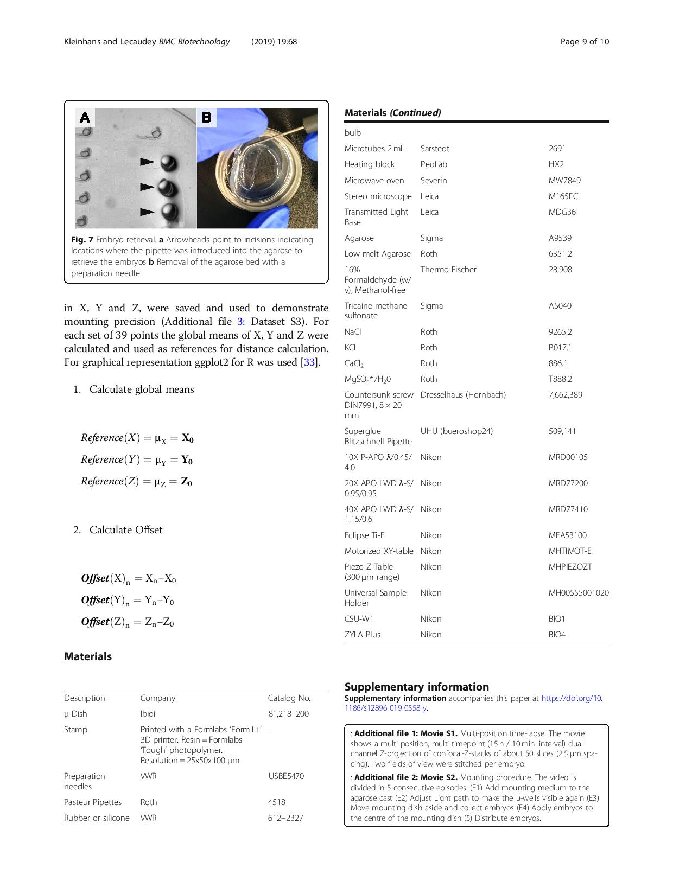
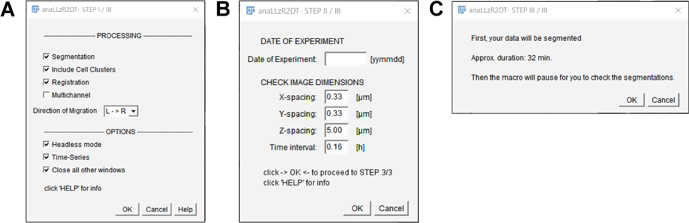

```{r, echo = F}
load("data/ground_truth_2D.RData")
load("data/SN180_ACI.RData")
load("data/ac.RData")
load("data/ground_truth_3d.RData")
```

# Materials and Methods {#mat-met}

## Materials {#mat}

### Chemicals {#mat-chem}

---------------------------------------------------------------------------------------------
              **Chemical**    Company                                         cat.-no.   
-------------------------- -------------------------------------------------- ---------------
Agarose                       Roth                                                6351.2           

Agar-Agar                     Roth                                                5210.3

Ampicillin                    Roth                                                K029.2

ATP                           Epicentre                                           E311K

Blocking Reagent              Roche                                               11096176001

BCIP                          Fermentas                                           R0822

CaCl\textsubscript{2}         Roth                                                886.1

Calyculin                     Sigma                                               208851

DAPI                          Sigma                                               D9542

DIG RNA Mix                   Roche                                               11277073910

DMSO                          Roth                                                4720.2

EtBr                          Roth                                                2218.3

EtOH                          Roth                                                9065.3

Formaldehyde                  Roth                                                7398.1

Formamide                     Roth                                                P040.1

Glycerol                      Roth                                                3783.2

IPTG                          Thermo                                              R1171

KCl                           Roth                                                P017.1

Low melting point Agarose     Roth                                                A9539 

Maleic Acid                   Roth                                                3810.3

MeOH                          Roth                                                CP43.3

MgCl\textsubscript{2}         Roth                                                2189.1

NaCl                          Roth                                                9265.2

NaHCO\textsubscript{3}        Roth                                                855.1

NaOH                          Roth                                                6771.3

NGS                           Sigma                                               C6767

_p_-Formaldehyd               Sigma                                               P6148

Phenol Red                    Sigma                                               P0290

Propan-2-ol                   VWR                                                 20842330

Proteinase K                  Roth                                                7528.4

PTU                           Sigma                                               P7629

Rockout                       Sigma                                               555553

SSC                           Roth                                                1232.1

SU5402                        CALBIOCHEM                                          572630

Torula RNA                    Sigma                                               R6625

Tricaine                      Sigma                                               A5040

Tris Base                     Roth                                                4855.2

Triton-X100                   Roth                                                3051.2

Trizol                        mbion                                               15596018

Tween20                       Sigma                                               P1379
-------------------------- -------------------------------------------------- ---------------
Table: (\#tab:mat-chem) Chemicals

### Solutions {#mat-sol}

---------------------------------------------------------------------------------------------
         **Solution**     Company                                             cat.-no.   
--------------------- ------------------------------------------------------- ---------------
Cut Smart Buffer        NEB                                                     B7204S

Generuler 100 bp        Thermo                                                  SM0241

Generuler 1kb           Thermo                                                  SM0311
--------------------- ------------------------------------------------------- ---------------
Table: (\#tab:mat-sol) Solutions

### Antibodies {#mat-anitb}

---------------------------------------------------------------------------------------------
         **Antibody**     Company / Provider                concentration     cat.-no.   
--------------------- ----------------------------------- ------------------- ---------------
Anti-Digoxigenin        Roche                                 1:200            11093274910

anti-GFP                Torrey Pines                          1:200            -

Anti-TAZ (rabbit)       Cell Signaling Technology             1:200            D24E4

Alexa Fluor488          Invitrogen                            1:500            710369

Alexa Fluor555          Invitrogen                            1:500            Z25005
--------------------- ----------------------------------- ------------------- ---------------
Table: (\#tab:mat-antib) Antibodies

### Enzymes {#mat-enz}

---------------------------------------------------------------------------------------------
               **Enzyme**     Company                                         cat.-no.   
------------------------- --------------------------------------------------- ---------------
BtsCI                       NEB                                                 R0647  

DdeI                        NEB                                                 R0175    

HaeIII                      NEB                                                 R0108   

MnlII                       NEB                                                 R0163  

NlaIII                      NEB                                                 R0125   

NsiI-HF                     NEB                                                 R3127  

Phusion Polymerase          NEB                                                 M0530L

Pronase                     Sigma                                               P5147

Ribolock                    Thermo                                              EO0381

RNase A                     Quiagen                                             1006657

RNase H                     NEB                                                 M0297L

SP6 RNA Polymerase          Thermo                                              EP0131

T4 Ligase                   NEB                                                 M0202T

T7 RNA Polymerase           Thermo                                              EP0111

Taq DNA Polymerase          Invitrogen                                          10342-020 

Taq DNA Polymerase          VWR                                                 733-1301
------------------------- --------------------------------------------------- ---------------
Table: (\#tab:mat-enz) Enzymes

### Molecular Biology Kits {#mat-mobikits}

---------------------------------------------------------------------------------------------
                                           **Kit**    Company                 cat.-no.   
-------------------------------------------------- -------------------------- ---------------
EdU Click-iT                                        Invitrogen                  MP 10083

mMessage mMachine Sp6 Polymerase                    Invitrogen                  AM1340

PCR & Gel Clean-Up                                  Sigma                       NA1020

pGEM-T TA Cloning                                   Promega                     A3600

Superscript III cDNA Synthesis                      Thermo                      18080051

Wizard SV Gel and PCR Clean-Up                      Promega                     A9282
-------------------------------------------------- -------------------------- ---------------
Table: (\#tab:mat-mobikits) Molecular Biology Kits

### Buffers {#mat-buff}

---------------------------------------------------------------------------------------------
**Buffer**                 
------------------------- -------------------------------------------------------------------
Blocking Reagent (BR)       2% BR in maleic buffer + 5% serum

E3                          [@Westerfield2007]

Hybridization buffer        50% Formamide + 25 % 20x SSC + 50mg/mL  Heparine + mQ

Maleic buffer               250 mM maleic acid + 5M NaCl + 10%  0.1% Tween-20 + mQ

NTMT                        75 mM NaCl + 15 mM MgCl\textsubscript{2} + 15 mM

PBS                         2.7 mM KCl + 12 mM HPO\textsubscript{4}\textsuperscript{2-} 

PBST                        PBS + 0.1% Tween20

PBDT                        PBS + 1% BSA + 1% DMSO + 0.3% Triton

PFA                         4% paraformaldehyde in PBS

P1                          50 mM Tris-HCl pH 8.0 + 10 mM EDTA pH 8.0 + 100 µg/mL RNAse

P2                          1M NaOH + 10 % (w/v) SDS

P3                          3M KOAc pH 5.5

TNT                         50 mM Tris-HCl pH 8.0 + 100 mM NaCl + 0.1% Tween-20 

Tricaine
------------------------- -------------------------------------------------------------------
Table: (\#tab:mat-buff) Buffers

### Zebrafish lines {#mat-lines}

-----------------------------------------------------------------------------------------------
  **Allele**    **name**                   **zfin**             
------------ ----------------------------- ----------------------------------------------------
zf106Tg       _cldnb:lyn-gfp_              [_Tg(-8.0cldnb:LY-EGFP)_](//zfin.org/ZDB-ALT-060919-2)

fu13Tg        _cxcr4b_(BAC):_H2BRFP_       -

nns8Tg        _atoh1a:Tom_                 [_atoh1a_](//zfin.org/ZDB-FISH-150901-21622)

fu50          _shroom3_                    -

m1274Tg       _hsp70:shr3v1FL-taqRFP_      -
------------ ----------------------------- ----------------------------------------------------
Table: (\#tab:mat-lines) Zebrafish lines

### ISH probe list {#mat-probes}

---------------------------------------------------------------------------------------------
**Probe**  **Sequence**                
---------- ----------------------------------------------------------------------------------
atoh1a      see [@Lecaudey2008a]

deltaD      see [@Haddon1998]
---------- ----------------------------------------------------------------------------------
Table: (\#tab:mat-probes) ISH probes

### ISH probe list {#mat-mos}

---------------------------------------------------------------------------------------------
**Probe**  **Sequence**                   **Concentration** 
---------- ------------------------------ ---------------------------------------------------
MoAtoh1a    see [@Lecaudey2008a; @Ma2009]  0.4 ng/mM

p53         see [@Robu2007]                2 ng/mM
---------- ------------------------------ ---------------------------------------------------
Table: (\#tab:mat-mos) Morpholinos

### Hardware {#mat-hrdwr}

#### Mounting Stamp {#mat-stamp}

An stl file for 3D printing can be found at [github.com/KleinhansDa/3DModels](https://github.com/KleinhansDa/3DModels)

#### Spinning Disc Microscopy {#mat-SD}

---------------------------------------------------------------------------------------------
       **Component**    Company         Product               Specs    
-------------------- ---------------- ----------------------- -------------------------------
 Microscope            Nikon            Eclipse Ti-E            fully motorized 
 
 PFS                   Nikon            Perfect focus system    Z repositioning 
 
 XY-table              Merzhaeuser      XY motorized table      1 $\mu$m accuracy  
 
 Piezo                                  Piezo Z-table           300 $\mu$m scan range
 
 SD system             Yokogawa         CSU-W1                  50 $\mu$m pattern
 
 Laser                                  Laser Combiner          see table \@ref(tab:lasers)

 FRAPPA                Revolution       FRAPPA                  -
 
 Borealis              Borealis         Borealis                flat field correction 
 
 sCMOS                 Andor            ZYLA PLUS               4.2Mpix; 82%QE
 
 Immersion             Merzhaeuser      Liquid Dispenser        -
-------------------- ---------------- ----------------------- -------------------------------
Table: (\#tab:SDcomp) Spinning Disc system components

------------------------------------------------------------------------------------
                       **Lasers**        Type      Power
--------------------------------- ---------------- ---------------------------------
405 nm                              diode             100 mW  

445 nm                              diode             80 mW  

488 nm                              DPSS              100 mW  

561 nm                              DPSS              100 mW 

640 nm                              diode             100 mW  
--------------------------------- ---------------- ---------------------------------
Table: (\#tab:lasers) Available lasers

---------------------------------------------------------------------------
 **Objective**  Company   Type         Immersion   N.A.  working distance
-------------- --------- ------------ ----------- ------ ------------------
 10x            Nikon    CFI APO        air        0.45   4.00 mm 
 
 20X            Nikon    CFI APO        water      0.95   0.95 mm  
 
 40X            Nikon    CFI APO        water      1.15   0.60 mm  
 
 60X            Nikon    CFI APO        water      1.20   0.30 mm            
-------------- --------- ------------ ----------- ------ ------------------
Table: (\#tab:objectives) Available objectives

#### Workstation {#mat-work}

Statistical computation and image analysis were done on a Fujitsu Siemens (FS) Workstation CELSIUSM740 with the following hardware components...

-------------------------------------------------------------------------------
   **Component**      Company         Product          Specs
---------------- ----------------- ------------------- ------------------------
CPU                 Intel           Xeon E5-1660v4      3.2 GHz, 20MB, 8cores  

RAM                 Fujitsu         -                   4x16GB DDR4-2400 

Graphics            NVIDIA          Quadro M4000        8GB RAM 
---------------- ----------------- ------------------- ------------------------
Table: (\#tab:PCcomp) Workstation hardware components

### Software {#mat-sftwr}

----------------------------------------------------------------------------
                  **Software**   Version      web                    
------------------------------ -------------- ------------------------------ 
 Imagej FIJI                    1.48            https://fiji.sc/
 
 RStudio                        1.0.153         https://www.rstudio.com/
 
 Ubuntu                         17.1            https://www.ubuntu.com/
 
 Windows 10 Pro                 10.0.16299
 
 Total Commander                9.0             http://ghisler.com/
------------------------------ -------------- ------------------------------
Table: (\#tab:sftwr) Used software

## Methods {#met}

### Data Strategy and Analysis

Due to the history of Developmental Biology and the complexity of biological processes _per se_, the field heavily relies on image data. Since the advent of electronic imaging techniques^[e.g. photomultipliers or charge-coupled devices] scientific image data can be processed and analyzed _in silico_. To make use of the possibility of 

1. live imaging, which (as compared to fixation techniques) conserves the cellular integrity and morphology while also offers the possibility of recording time-lapses 
2. the optically clear specimen and 
3. high throughput image analysis and state-of-the-art data science using algorithmic implementations, 

the three following points were paid special attention to.

#### Sample Preparation

For fluorescence microscopy zebrafish embryos are usually immersed in a 1% solution of _low melting-point agarose_ (LMPA) solution and then oriented on an optical cover slip manually until the LMPA has solidified. This process allows to mount^[the process of embedding the samples in agarose] eight to ten embryos _per_ dish. To make use of the high number of offspring a single zebrafish female may lay, which rapidly leads to a sample number of more than 300, a new sample preparation technique was devised that allows for (1) a four to five times increase in samples per dish (2) a facilitated navigation _via_ a grid-like orientation through the samples and (3) an improved spatial orientation where the embryos body axes are aligned parallel to the optical Z-sections of the confocal microscope. For details, see Materials and Methods section \@ref(mount-met) and Kleinhans _et al._, 2019[@Kleinhans2019].

#### Imaging

Technically, speed and sensitivity are most important for live imaging. Considering these two parameters a light-sheet [@Keller2010c] fluorescence microscope (LSFM) would be the best fit. However, LSFMs also have several limitations. First, due to the sample preparation methods available the number of samples that can be imaged at a time is highly restricted. Second, for subcellular resolution a high magnification is required, which is limited by working distances and third - for optimal image analysis a high Signal-to-Noise ratio (SNR) and numerical aperture (N.A.) is preferable. Therefore a spinning disc [@Graf2005] system was chosen for most of the imaging. 
The system makes use of (1) an extra-large field of view (FOV) ideal for large specimen (2) the possibility of a high degree of automation with state-of-the-art software and (3) a water dispension system for long-term water immersion imaging. For details about the system see Materials and Methods section \@ref(mat-SD).

#### Data handling

Subsequently after data acquisition and pre-processing the image data was transferred from the microscope system to the labs main workstation. To uniquely identify each file and have them appear in a structured manner, a file-naming system was established after the following structure

\makebox[\linewidth]{$[stage]\_[group]\_[id]\_[date]$}
\newline

Where _stage_ would e.g. be 32hpf, _group_ would be a genotype or drug treatment, _id_ would be a positional identifier on an imaging dish like B1P01^[Where B stands for a batch, that is if multiple dishes were imaged and P stands for the position within a single batch] and _date_ would be a date in the form of YYMMDD.

#### Image and Data Analysis

In order to be as objective an as high throughput as possible, almost all of the analyses performed for this study was solved using either algorithmically or state-of-the-art convolutional neural networks (CNNs). Furthermore, to meet the terms and conditions of _open science_^[“movement to make scientific research […] and its dissemination accessible to all levels of an inquiring society” – Wikipedia/en/Open_science] standards, all pipelines were implemented in open source software frameworks such as _Fiji is just image J_ (FIJI) and R. For further information about training datasets, algorithms and versions used see Materials and Methods section \@ref(mat-sftwr).

### Zebrafish {#Zeb-met}

#### Husbandry

Zebrafish husbandry was maintained at the University of Frankfurt am Main. All legal procedures were followed while handling and maintaining zebrafish husbandry. All zebrafish lines used in and generated for this study are listed in the Appendix A.

#### Handling and rearing

In the afternoon preceding the embryo collection, 1 male and female were set up in crossing cages, physically separated by a transparent separator. Next day, before noon, separators were removed allowing fertilization. Fertilized eggs were then collected, sorted and reared in the well-defined culture medium E3 (Kimmel et.al. 1995, section \@ref(mat-buff)) at 25$^\circ$, 28.5$^\circ$, or 30$^\circ$ Celsius depending on the experimental condition required.

To grow larvae to the adulthood, they were transferred to the system on day 5. Till day 12, larvae were fed Vinegar Eels, Paramecia, and Caviar powder. After the 12 th day, water supply was started and fish were fed Brine Shrimp, Artemia, Paramecia and Vinegar Eels. Adult fish (>1 Month) were fed Artemia and the dry flakes.

#### Zebrafish fin clips

Adult fish were anesthetized with buffered Tricaine (1X, see section \@ref(mat-buff)) until. About 1/3 rd of the caudal fin was cut with a sterile scalpel in a sterile Petri Dish. Immediately the cut fin was transferred to 50 mM NaOH. Fish were returned to system water and kept in 1L system water in single tanks with 200 $\mu$L of 0.01$\%$ Methylene Blue.

#### Adult Genotyping

The clipped fins were digested for 1 h at 95$^\circ$ Celsius and neutralized subsequently with 1M Tris-HCl of (pH 9).

#### Embryo Genotyping

Single fixed/live embryos were denatured at 95$^\circ$ Celsius in 50mM NaOH for 1 hour and neutralized by adding 1/10 the volume of 1 M Tris-HCl (pH 8.2).

#### Zebrafish Euthanasia

Adult zebrafish were anesthetized in tricaine (1X) till stage II-III of anaestezia and put in the ice cold water so as to sacrifice them by hypothermia.

#### Fixation

Embryos and dechorionated larvae were fixed in 2 ml of 4$\%$ PFA in 1X PBS overnight at 4$^\circ$ Celsius.

### Wet lab {#Wet-met}

#### Sample preparation {#sampleprep}

For samples **later than 24 hpf**, embryos were grown in 1X PTU till desired stage and treated with 150 $\mu$L per 10 mL of 0.1 mg/mL Pronase for ~30 min.. Choria were removed by gentle pipetting with a 2 mL plastic pasteur pipette. To replace the Pronase solution with fresh E3, embryos were immobilized by anesthesia and collected in the center of the dish by gentle rotational movement. Then the medium was poured away by collecting the embryos at the corner bottom of the dish while taking care not to loose any. After, the dish was filled with fresh E3. This process was repeated three times.

For samples **earlier than 18s**, embryos were treated with 150 $\mu$L per 10 mL of 0.1 mg/mL Pronase directly. Choria were removed the same way as for > 24 hpf embryos but when pouring away the Pronase solution, the dish was simultaneously and very carefully filled with fresh E3 again. Since younger embryos are more fragile and to avoid damage, they must be kept in solution constantly.

Fixation started at the desired stage in 4% PFA in 0.1% PBST at 4$^\circ$C o.n.. The next day, samples were rinsed 3 times for ~5 min. in PBST and passed through a MeOH series of 25$\%$ $\rightarrow$ 50$\%$ $\rightarrow$ 75$\%$ $\rightarrow$ 100$\%$ MeOH/PBST (V/V)). For permanent storage, samples were stored in 100$\%$ MeOH at -20$^\circ$C.

#### Plasmid preparation {#miniprep}

To remove solvent and medium, in a 1.5 or 2 mL tube, the bacteria were centrifuged in 2 mL tubes for 3 min. at 12000 rpm. To solve the pellet, the supernatant was discarded by pouring on a tissue and 200 $\mu$L of buffer P1 were added followed by thorough vortexing. To lyse the bacteria 400 $\mu$L of P2 were added, standing still. After a maximum of 5 min. 300 $\mu$L of P3 were added to neutralize the reaction and bind cellular material, and the tube was inverted five to six times.

To harvest the plasmid DNA the solution was then first centrifuged for 10 min. at 12000 rpm and at RT. After, the supernatant was transferred to a new 2 mL tube. Second, to precipitate the DNA, 700 $\mu$L of iso-propanol were added and centrifuged for 20 min. at full speed and at 4$^\circ$C. After, the tube was checked for a opaque pellet and the supernatant was discarded. Third, to wash the pellet, 200 $\mu$L of 70$%$ EtOH were added and centrifuged for 7 min. at full speed and at 4$^\circ$C. The supernatant was discarded again. Finally, the pellet was air dryed under the hood and re-suspended in 50 $\mu$L ddH\textsubscript{2}O.

#### In Situ Hybridization {#ISH-met}

Sample preparation as described in section \@ref(sampleprep).

##### 1. Permeabilisation & Probe Hybridization

**Permeabilisation** \newline $\rightarrow$ without shaking

Samples were rehydrated in an inverse MeOH series of 75$\%$ $\rightarrow$ 50$\%$ $\rightarrow$ 25$\%$ $\rightarrow$ 0$\%$ PBST and washed again for 5 min. two times in pure PBST. Finally, samples were digested in 10 $\mu$g/mL Proteinase K according to table \@ref(tab:met-protk).

```{r met-protk}
tab <- read.delim("figures/materials/protkdig.txt")
knitr::kable(tab, booktabs = T, caption="Proteinase K digestion", align = "c",
             col.names = c("Stage", "0.6 s", "7 s", "18 s", "24 hpf", "32 hpf", "36 hpf", "42 hpf", "48 hpf", "72 hpf")) %>%
  kable_styling(full_width = T, latex_options = c('striped', 'hold_position'))
```
    
Samples were washed again for 5 min. two times in PBST and post-fixated in 4$\%$ PFA at 4$^\circ$C for > 30 min. Samples were washed again for 5 min. three times in PBST.

**Probe Hybridisation** \newline $\rightarrow$ all steps at 60$^\circ$C, except stated differently

Samples were pre-hybridized in 350 $\mu$L of hybridization buffer (section \@ref(mat-buff)) for 1 - 8 h. Just before detection probe treatment, the probe was denatured at 80$^\circ$C in 1:200 of hybridization buffer. Subsequently, hybridization buffer was taken off the samples and replaced with the heated probe. Finally, samples were incubated o.n. at a desired temperature (around 65$^\circ$C).

##### 2. Probe removal & Antibody incubation

The next day the probe got collected and stored at -20$^\circ$C for re-use. Washing took place at the same temperature as hybridization (from step 1) To keep solutions at temperature a Thermo-Block was used. For the washing series the samples were first washed one time for 20 min. in hybridization buffer, then two times for 30 min. in 50$\%$ Formamide and one time for 20 min. in 25$\%$ Formamide. Then two times for 15 min. in 2X SSCT and two times for 30 min. in 0.2X SSCT. Finally, one time for 5 min. in TNT.

To reduce noise and increase specific signal strength, the samples were treated with blocking solution (section \@ref(mat-buff)) for 1 - 8 h in 350 $\mu$L of 2% BR/TNT at room temperature (RT). Afterwards the samples were incubated in 100 $\mu$L Anti-Digoxigenin diluted in NTMT buffer (1/4000 (V/V)) in 2$\%$ BR/TNT for 2 h at RT or o.n. at 4$^\circ$C.

##### 3. Probe detection

First, the samples were washed six times for ~20 min. (or one wash o.n.) in TNT and two times for ~ 5min. in NTMT. After washing, color staining was performed with 4.5 NBT $\mu$L + 3.5 $\mu$L BCIP per mL NTMT in the dark and at RT without shaking (in a drawer) for 2 - 8 h, regularly checking the progression of the reaction. As soon as an appropriate degree of color intensity on the target site was achieved (up to two days), the samples were again washed three times in PBST. 

Afterwards the samples were either prepared for immunostaining or imaging. For permanent storage samples were kept in 50$\%$ Glycerol at 4$^\circ$C.

#### Immuno staining {#immuno-met}

Sample preparation as described in section \@ref(sampleprep).

First, samples were blocked in 2$\%$ Goat Serum / PBDT (V/V) for 30 min.. For protein target site detection, a **primary antibody** (150 $\mu$L of 2% NGS / PBDT (V/V)) was incubated for ~2 h at RT or o.n. at 4$^\circ$C. Samples were washed for 2 h in PBDT while changing the solution 5 - 6 times. To stain the now bound primary antibody, a **secondary antibody** (150 $\mu$L of 2% NGS / PBDT (V/V)) was incubated for 2 h at RT or o.n. at 4$^\circ$C. Samples were washed for 2 h in PBDT while changing the solution 5 - 6 times.

#### Mounting {#mount-met}

For mounting, an improved 3D specimen preparation and well-plate like sample navigation for zebrafish larvae confocal microscopy was developed which offers the following improvements...

1. **To obtain a sufficient amount of data that is closely staged and still comprises > 4 independent groups.** Using this protocol, it is possible to define a custom well plate in your preferred imaging software, which greatly facilitates the imaging procedure and therefore helps to stay focused. However, once the well plate is aligned and the positions are defined it still needs some minor correction in Z.

2. **To do the imaging live. Most of the time, especially in morphological analyses, live imaging is preferred since any fixation alters cell - and therefore organ morphology.** Live imaging guarantees an undisturbed and unbiased look at the _in vivo_ situation. Using this protocol, the embryonic body axes will be more in line with the XY displacement of the microscope stage which results, depending on the volume of interest, in narrower Z-stacks. This ultimately also leads to a reduction of photo-bleaching, phototoxicity and expenditure of time. The gained time can then be used to image shorter time-intervals in timelapse imaging. 

3. **To reduce background signal and noise.** Instead of transforming and aligning the image data in a post-processing approach, the specimen can be imaged in the right spacial configuration in the first place. This is not only important for 3D analysis, but also for Z projected data. If the specimen body axes are not aligned with the axes of the microscopic table, the image stacks need to be bigger to record the volume of interest. In Z projections, for X Y coordinates out of the volume of interest, this will end up as background signal or noise, complicating quantitative analysis and interpretation. The method therefore provides significant improvement over existing mounting techniques. 

##### Protocol

(ref:stampprod) Stamping procedure **Agarose Cast** (A) clean stamp surface (B) preparation of the stamp before lifting (C) ready-for-use agarose imprint. **Mounting** (A) without LMPA (B and C) with LMPA, while the latter shows the imprint with light coming from a different angle, making the chambers visible again. (D) Horizontal alignment of embryos. **Imaging** (A) Positioning of the $\mu$-well (B) Alignment in Brightfield and (C) Definition of a custom well plate.

```{r stampprod, out.width = '95%', fig.cap = "(ref:stampprod)", fig.scap = "Steps during improved zebrafish mounting"}




```

### Dry lab {#comp-met}

#### Image J macros

Three IJ macros have been developed to facilitate image analysis and make results more reproducible. Each of them is specifically designed for input of LL and pLLP images of the _cldnb:lyn-gfp_ transgenic line.

Hence, they are called __anaLLzr__ ...

- **2D** - analysis of Z-projected images of the LL at end of migration
- **2DT** - analysis of Z-projected images of the LL during migration
- **3D** - analysis of 3D image stacks of the pLLP at a given timepoint

##### anaLLzr2D {#mat-anallzr2d}

From the opening dialog (figure \@ref(fig:anallzr2ddialog)) the user can choose to _count nuclei_ and / or _sort ROIs_. 

If nuclei count is chosen, the macro expects a dual-channel _tiff_-file as input. 
If ROI sorting is selected, segmented CCs are numbered and sorted from left to right instead of IJ's native sorting method (from top to bottom). 

Slider values are optimized for the the microscope setup described in section \@ref(mat-SD).

- _Membrane label blur_ controls the detail of pLLP and CC segmentation, where lower values result in more detail
- _Closing filter_ controls how harsh objects are separated from each other
- _Nuclei label blur_ controls the details of single nuclei and is evaluated after ground truth data described in section \@ref(mat-GrTrDat)

(ref:anallzr2ddialog) anaLLzR2D opening dialog **checkboxes** Choose to count nuclei and whether ROIs sorting should be applied. **sliders** Choose filter and blurring levels.

```{r anallzr2ddialog, out.width = '40%', fig.cap = "(ref:anallzr2ddialog)", fig.scap = "anaLLzR2D opening dialog"}
knitr::include_graphics("figures/materials/macros/anallzr2D_macro.png")
```

Code-snippets describing the main functionality are described in the next couple of sub-sections.

###### Segmentation

The membrane labeled image is segmented based on optimized hard coded values which are based on experience. After, the macro halts for manual correction.

```{r anallzr2d_seg, echo = TRUE, eval = FALSE}
# Background subtraction
	run("Subtract Background...", "rolling = 50");
	run("Morphological Filters", "operation = Opening element = Disk radius = 20");
	run("Gaussian Blur...", "sigma = 5 scaled");
# Thresholding
	setAutoThreshold("Moments dark");
	setOption("BlackBackground", false);
	run("Convert to Mask");
# Particle analysis
	run("Analyze Particles...", "size = 250-Infinity exclude add");
	roiManager("Show All without labels");
	run("Enhance Contrast", "saturated = 0.35");
	waitForUser("Check ROIs, correct if necessary");
	if (sort) {
		sortROIs();
	}
```

###### Sorting

To sort manually corrected ROIs from left to right, each ROIs position in calculated relatively to total image width.

```{r anallzr2d_sorting, echo = T, eval = F}
# Sort ROIs from left to right
function sortROIs() {
	run("Set Measurements...", "centroid redirect = None decimal = 0");
			for (j = 0 ; j<roiManager("count"); j++) {
    			roiManager("select", j);
   			 	roiManager("measure");
    			x = getResult("X", 0);
    			w = getWidth();
    			a = x/w;
    			roiManager("rename", a);
    			run("Clear Results");
				}
		setBatchMode(false);
		roiManager("sort");	
			for (j = 0 ; j < roiManager("count"); j++) {
    			roiManager("select", j);
    			roiManager("rename", j);
    			run("Clear Results");
				}	
			for (j = 0 ; j < roiManager("count"); j++) {
    			roiManager("select", j);
    			roiManager("rename", j+1);
    			run("Clear Results");
				}
}
```

###### Count nuclei

After smoothing the nuclei signal in the DAPI labeled channel, maxima are detected only within each ROI.

```{r anallzr2d_counts, echo = T, eval = F}
# count nuclei within segmented cell clusters
# steps performed on DAPI channel
# count nuclei
	run("Gaussian Blur...", "sigma = 0.6 scaled");
	roiManager("open", datdir + filename + "_ROIset.zip");
	rcount = roiManager("count");
# for each ROI
	for (j = 0 ; j < rcount; j++) {
		roiManager("open", datdir + filename + "_ROIset.zip");
  		roiManager("select", j);
  			run("Duplicate...", " ");
  			run("Enhance Contrast", "saturated = 0.35");
  			run("Find Maxima...", "noise = 0 output = [Point Selection]");
  			run("Capture Image");
  		roiManager("select", j);
		run("Find Maxima...", "noise = 0 output = Count");
		NC = getResult("Count");
		setResult("Nuclei", j, NC);
		setResult("Pos", j, j + 1);
	}
```

##### anaLLzR2DT {#mat-anallzr2dt}

Upon macro execution the opening dialog is presented which is divided in three sections (figure \@ref(fig:anallzr2dtdialog)A).

In the **processing** section the user may choose which modules are executed. 

- _Segmentation_ controls whether the images are segmented before measurement. If de-seleted the user has to provide segmentation masks seperately.
- _Include Cell Clusters_ controls whether Cell Clusters should be included in the analysis. If de-selected, only the pLLP will be considered.
- _Registration_ controls whether the pLLP should be captured in time and space and saved in a separate stack.
- _Multichannel_ controls whether on a second channel summary statistics from each ROI at each timepoint should be taken.
  + measurements taken are the mean, standard deviation, minimum and maximum intensity

In the **options** section the user may choose whether the macro should be run in _headless mode_ (without showing every single action), whether the input images are timeseries and whether all other windows should be closed upon start of processing.

After confirmation, the user has to enter a date of experiment as an identifier in a second dialog. Furthermore the user is presented the images physical properties pre-filled where the idea here is just a review since this is a major source of mistakes. Finally, a third dialog is presented to the user giving an approximate duration and basic instructions.

(ref:anallzr2dtdialog) anaLLzR2DT opening dialog **A** Opening dialog: Main functionality **B** Opening Dialog: metadata setup options **C** Time approximation dialog and basic instructions.

```{r anallzr2dtdialog, out.width = '95%', fig.cap = "(ref:anallzr2dtdialog)", fig.scap = "anaLLzR2DT opening dialog"}

```

Code-snippets describing the main functionality are described in the next couple of sub-sections.

###### Registration

```{r anallzr2dt_reg, echo = T, eval = F}
#	Subtract background
		run("Z Project...", "projection=[Average Intensity]");
		ZPAVG = getTitle();
  		if (reg) {
			print("Calculating registration parameters...");
			selectWindow(ORG);
			setSlice(n);
			run("Duplicate...", " "); 
			DORG = getTitle();
			imageCalculator("Subtract create", DORG, ZPAVG);
			IC = getTitle();
			close(DORG);
			run("Morphological Filters", "operation=Closing element=Disk radius=15");
			REG = getTitle();
			close(IC);
			close(IC);
			close(DORG);
		#	Thresholding 
			run("Gaussian Blur...", "sigma=6 scaled"); 
			REG = getTitle();
			run("Duplicate...", " ");
			REGD = getTitle();
			selectWindow(REG);
			run("Enhance Contrast...", "saturated=0.3 normalize");
			run("8-bit");
			selectWindow(REG);
			setAutoThreshold("MaxEntropy  dark");
			run("Convert to Mask");
			REG = getTitle();

	# ############################################## ANALYSIS ###########################################
	
		run("Analyze Particles...", "size=150-10000 include exclude add");
		rmcount = roiManager("count")-1;
		print("rois: "+rmcount);
		
	# ############################################## ANGLE ###########################################
	
		if(roiManager("count") == 1) {
			roiManager("select", 0);
			List.setMeasurements;
			Angle = List.getValue("FeretAngle");
			print("Angle: "+Angle);
			if (Angle < 0) {Angle = Angle*(-1);}
			if (Angle > 90) {Angle = (180-Angle)*(-1);}
		} else {
			roiManager("select", rmcount);
			List.setMeasurements;
			X1Line = List.getValue("X");
			Y1Line = List.getValue("Y");
			roiManager("select", 0);
			List.setMeasurements;
			X2Line = List.getValue("X");
			Y2Line = List.getValue("Y");
			makeLine(X1Line, Y1Line, X2Line, Y2Line);
			List.setMeasurements;
			Angle = List.getValue("Angle");
			if (Angle < 0) {Angle = Angle*(-1);}
			if (Angle > 90) {Angle = (180-Angle)*(-1);}
			}
			print("Angle: "+Angle);
			selectWindow(ZPAVG);
			run("Rotate... ", "angle="+Angle+" grid=1 interpolation=Bilinear");
			ZPAVG = getTitle();
			selectWindow(REG);
			run("Rotate... ", "angle="+Angle+" grid=1 interpolation=Bilinear");
			run("Make Binary");
			REG = getTitle();
		
		# ############################################ CROPPING ######################################### 

			roiManager("reset");
			run("Analyze Particles...", "size=150-10000 include add");
			roiManager("select", 0); # oder doch rmcount?
			List.setMeasurements;
			XRect = List.getValue("X");
			YRect = List.getValue("Y");
			selectWindow(REG);
			getDimensions(width, height, channels, slices, frames);
			List.setMeasurements;
			height = 120/sizeX; # change height of rect here
			toUnscaled(YRect);
			YRect = YRect-(height/2);
			print("YRectcor: "+YRect);
			close(REG);
			close(REGD);
  		} 

	# ############################################ REGISTER ###########################################
	
		resetMinAndMax();
		if (dual) {
		# 	C1
			selectWindow(ORG);
			if (reg) {
				print("  Registering "+embryoID+"...");
				run("Rotate... ", "angle="+Angle+" grid=1 interpolation=Bilinear stack");
				makeRectangle(0, YRect, width, height);
				run("Crop");
			}
			print("    Saving: "+embryoID+"_RC_C1");
			saveAs("Tiff", rcdirc1 + orgname + "_RC.tif");
		# 	C2
			open(dualdir+dualdirlist[q]);
			dualname = replace(dualdirlist[q], ".tif", ""); 
			ORGC2 = getTitle();
			if (reg) {
				run("Rotate... ", "angle="+Angle+" grid=1 interpolation=Bilinear stack");
				makeRectangle(0, YRect, width, height);
				run("Crop");
			}
			print("    Saving: "+embryoID+"_RC_C2");
			saveAs("Tiff", rcdirc2 + orgname + "_RC.tif");
			close();
		} else {
			selectWindow(ORG);
			if (reg) {
				run("Rotate... ", "angle="+Angle+" grid=1 interpolation=Bilinear stack");
				makeRectangle(0, YRect, width, height);
				run("Crop");
				print("    Saving: "+orgname+"_RC");
				saveAs("Tiff", rcdir + orgname + "_RC.tif");
			} else {
				print("    Saving: "+orgname);
				saveAs("Tiff", rcdir + orgname);	
			}
		}
		ORG = getTitle();  # Name ORG changed by saving
	# crop ZPAVG for image calc
		selectWindow(ZPAVG);
		if (reg) {
		makeRectangle(0, YRect, width, height);
		run("Crop");
		}
```

###### Segmentation

```{r anallzr2dt_seg, echo = T, eval = F}
#  #################################### Background correction ####################################
	
	print("  Segmenting "+embryoID+"_RC...");
		selectWindow(ORG);
		getDimensions(width, height, channels, slices, frames);
		imageCalculator("Subtract create stack", ORG, ZPAVG);
		IC = getTitle();
		close(ZPAVG);
	selectWindow(IC);
		print("Bleach correction...");
		run("Bleach Correction", "correction=[Simple Ratio] background=0");
		BC = getTitle();
		close(IC);
		selectWindow(BC);
		nslbc = nSlices();
		for (j = 1; j < nslbc; j++) {
			selectWindow(BC);
			setSlice(j);
			run("Morphological Filters", "operation=Closing element=Disk radius=15");
		}
		close(BC);
		run("Images to Stack", "name="+ ORG +" title = [] use");
		MC = getTitle();
		
	#	############################################ SEGMENTATION #######################################
	
		selectWindow(MC);
		run("Gaussian Blur...", "sigma=5.5 scaled stack");
	#	Normalize saturated pixels
		run("Enhance Contrast...", "saturated=0.5 normalize process_all");
		setSlice(n);
		resetThreshold();
		setAutoThreshold("MaxEntropy dark");
		run("Convert to Mask", "method=MaxEntropy background=Dark black");
		run("Invert LUT");
		run("Fill Holes", "stack");
		run("Options...", "iterations=2 count=1 pad do=Erode stack");
		run("Options...", "iterations=2 count=1 pad do=Open stack");
		run("Options...", "iterations=1 count=1 pad do=Dilate stack");
		print("    Saving binary");
		saveAs("Tiff", bindir + orgname + "_RC_bin.tif");
		MC = getTitle();
		close(MC); # close BIN
		T2 = getTime();
		Tdiff = T2-T1;
		print("  Duration: "+Tdiff+"ms");
	}
	month = month+1;
	selectWindow("Log");  //select Log-window 
	saveAs("Text", par + File.separator + "Log_v" + version + "_" + year+"0"+month+dayOfMonth+".txt"); 
	closelog();
	roiManager("reset");
	cleanup();
	setBatchMode(false);
	wait(500);
	call("bar.Utils.revealFile", bindir);
	waitForUser("Check Segmentations");
	} 
	if (pre) {
		close(ORG);	
	}
	if (dual) {
		rcdirc1list = getFileList(rcdirc1);
		rcdirc2list = getFileList(rcdirc2);
	} else {
		rcdirlist = getFileList(rcdir);
	}
	bindirlist = getFileList(bindir);
```

###### Analysis

```{r anallzr2dt_anal, echo = T, eval = F}
for (b = 0; b < orgdirlist.length; b++) {
# 	get genotypes and embryoIDs from arrays
		type = types[b];
		embryoID = embryoIDs[b];
		orgname = replace(orgdirlist[b], ".tif", "");
# 	create directories for single embryos to save results
		embryodir = output + File.separator + orgname + File.separator;
		File.makeDirectory(embryodir);
# 	print StatsLog descriptors
		if (b==0) {
			StatsLogInfo();
			}
# 	open and define binary
		open(bindir+bindirlist[b]);
		  BIN = getTitle();
# open and define orginal 
		if (dual) {
			open(rcdirc1+rcdirc1list[b]);
		} else {
			open(rcdir+rcdirlist[b]);
		}
		RC = getTitle();
		dotIndex = indexOf(RC, ".");
		title = substring(RC, 0, dotIndex);
	
# #############################  ENTER 2nd LOOP TO INCREMENT OVER EACH SLICE OF THE TIME-SERIES ##############################

	selectWindow(BIN); 	 # select binary
	pangles = newArray(nSlices()+1);
		for (i=1 ; i<=nSlices(); i++) {
			s = nSlices();
			setSlice(i);
			if (ccs) {
				run("Analyze Particles...", "size=150-10000 include add");
			} else {
				run("Analyze Particles...", "size=750-10000 include add");
			}
		# 	Loop though ROI List
			for (j=0 ; j<roiManager("count"); j++) {
				roiManager("select", j);
				run("Set Scale...", "distance=1 known=0.00005 pixel=1 unit=micron");
				List.setMeasurements;
  				x = List.getValue("X");
    			roiManager("rename", x);
			}
			run("Properties...", "channels=1 slices=1 frames=[s] unit=micron pixel_width=[xs] pixel_height=[ys] voxel_depth=[zs] frame=[time] global");
		# 	Sort ROIs and select last one
			roiManager("Sort");
			for (j=0 ; j<roiManager("count"); j++) {
				ccn = roiManager("count")+j;
				if (ccn == roiManager("count")) {
					ccn = "prim";
					roiselect = roiManager("count")-1;
				} else {
					ccn = "CC"+j;
					roiselect = j-1;
				}
				roiManager("select", roiselect);
				roiManager("rename", ccn);
			}
			rmc = roiManager("count");
			m = rmc-1;
			selectWindow(RC);
  #   Prim registration
			run("Select None");
			roiManager("Select", m);
			sln = getSliceNumber();
			run("Enlarge...", "enlarge=6");
			run("Fit Ellipse");
			run("Duplicate...", "use");
			rename(sln);
			resetMinAndMax();
	# 	Rotate
			List.setMeasurements;
			A = List.getValue("Angle");
			run("Select None");
			if (A < 10) {
				A = A;
			} else {
				A = 180-A;
				A = A*(-1);
			}
			pangles[i] = A;
			run("Rotate... ", "angle=[A] grid=1 interpolation=Bilinear slice");
			run("Flip Horizontally");
			selectWindow(RC); # select & deselect to remove selected ROIs
			run("Select None");
	# 	Measure and save segmented Mask ROI
			pLLProis = embryodir + File.separator + "ROIs" + File.separator;
			File.makeDirectory(pLLProis);
			pLLPxy = embryodir + File.separator + "ROIsXY" + File.separator;
			File.makeDirectory(pLLPxy);
			selectWindow(BIN);
			roiManager("show none"); # supress roimanager popping up
			roiManager("Select", m);
		#	Save ROIs and XY coordinates
			if (i<10) {
				slice = d2s(0,0) + d2s(i,0);
				roiManager("save", pLLProis + "s" + slice + ".zip");
				saveAs("XY Coordinates", pLLPxy + "s" + slice + ".txt");
			} else {
				roiManager("save", pLLProis + "s" + i + ".zip");
				saveAs("XY Coordinates", pLLPxy + "s" + i + ".txt");
			}
	# 	Measure
			run("Set Measurements...", "area centroid bounding fit shape feret's stack redirect=None decimal=2");
    		roiManager("measure");
    		roiManager("reset");
    		run("Select None");
    #  Calculate additional variables based on measurements
    		n = nResults();
    		r = n-1;  # actual RowNumber
    		r2 = n-2; # RowNumber -1
    		if (i == 1) {  # get X & Y coordinates, keep X0 and Y0 for normalization
    			X0 = getResult("X");
    			Y0 = getResult("Y");
    		} else {
    			X1 = getResult("X", r2);
    			X2 = getResult("X", r);
    			Y1 = getResult("Y", r2);
    			Y2 = getResult("Y", r); 
    		}
    # 	Width of bounding rectangle
    		W = getResult("Width");
    # 	Calculations (XN = normalized X; LE = Leading Edge)
    # 	Euclidian Distance of X + normalized to offspring 'zero'
    		if (i == 1) {
    			XED = 0;
    			XN = 0;
    		} else {
    			XED = sqrt((X2-X1)*(X2-X1)+(Y2-Y1)*(Y2-Y1));
    			XN = (X2 - X0) + XED;
    		}
    		LE = XN + (W/2); # Leading Edge 
    		T = time * r; # Time interval
    		setResult("embryo", r, orgname); # set Results
    		setResult("group", r, type);
    		setResult("time", r, T);
    		setResult("deg", r, A);
    		setResult("X_ED", r, XED);
    		setResult("X_N", r, XN);
    		setResult("LE", r, LE);
    		updateResults();
    # 	Velocitiy LE (LE1 = LE @ timepoint 1; LEN = normalized value of LE, LENV = Velocity of the normalized value of LE)
    		if (i == 1) {
    			LE1 = LE; # LE1 will be the same for all further timepoints
    			LEN = 0; #
    			LENED = NaN; # 'Leading Edge Normalized Euclidian Distance'
    			LEV = NaN; # For the first timepoint there can be no speed, since there was no coordinate of X and Y before
    		} else {
    			LEN = LE - LE1; # The value of 'LE Normalized' to zero 
    			LED = getResult("LE_N", r2); # LED = The value of LE one row before
    			LENED = sqrt((LEN-LED)*(LEN-LED)+(Y2-Y1)*(Y2-Y1)); # LENED = LEN - (LEN-LED);
    			LEV = LENED / time;
    		}
    		setResult("LE_N", r, LEN); # setResult Leading Edge Normalized (LE_N)
    		setResult("LE_N_ED", r, LENED); # setResult Leading Edge Normalized Euclidian Distance (LE_N_ED)
    		setResult("LE_V", r, LEV); # setResult Leading Edge Velocity (LE_V)
    		updateResults();
			}
			close(BIN); # could be reduced to close(BIN, ORG); or close (".tif");
			close(RC);
		# 	Merge registered prim timepoints
			setBatchMode("exit and display");
			run("Images to Stack", "method=[Copy (top-left)] name=Stack title=[] use");
			run("Properties...", "channels=1 slices=1 frames=[s] unit=micron pixel_width=[xs] pixel_height=[ys] voxel_depth=[zs] frame=[time] global");	
			run("Flip Horizontally", "stack");
			if (dual) {
			#	save C1
				saveAs("Tiff", pLLPdir + orgname + "-C01.tif");
				close();
			#	open C2
				open(rcdirc2+rcdirc2list[b]);
				resetMinAndMax();
				RC = getTitle();
				dotIndex = indexOf(RC, ".");
				title = substring(RC, 0, dotIndex);
				for (i=1 ; i<=nSlices(); i++) {
					s = i;
					setSlice(i);
					wait(200);
			# 	Prim registration
					if (i<10) {
						slice = d2s(0,0) + d2s(i,0);
						roiManager("open", pLLProis + "s" + slice + ".zip");
					} else {
						roiManager("open", pLLProis + "s" + i + ".zip");
					}
					rmc = roiManager("count");
					m = rmc-1;
					roiManager("Select", m);
					selectWindow(RC);
					sln = getSliceNumber();
					run("Enlarge...", "enlarge=6");
					run("Fit Ellipse");
					run("Duplicate...", "use");
					rename(sln);
				#	Rotate
					A = pangles[s];
					run("Select None");
					run("Rotate... ", "angle=[A] grid=1 interpolation=Bilinear slice");
					run("Flip Horizontally");
					selectWindow(RC); # select & deselect to remove selected ROIs
					run("Select None");
					roiManager("reset");
				}
			#	close and merge
				close(RC);
				run("Images to Stack", "method=[Copy (top-left)] name=Stack title=[] use");
				run("Properties...", "channels=1 slices=1 frames=[s] unit=micron pixel_width=[xs] pixel_height=[ys] voxel_depth=[zs] frame=[time] global");	
				run("Flip Horizontally", "stack");
				roiManager("reset");
		  #	save C2
				saveAs("Tiff", pLLPdir + orgname + "-C02.tif");
				close();
			} else {
				saveAs("Tiff", pLLPdir + orgname + ".tif");
				close();
			}
	# 	Save Results Table
			run("Input/Output...", "jpeg=100 gif=-1 file=.txt use_file copy_column copy_row save_column");
			saveAs("results", embryodir + orgname + "_Results" + ".txt");
		# Calulate Stats and show in Log
			StatsLog();
			cleanup();
```

##### anaLLzR3D {#mat-anallzr3d}

Upon macro execution the opening dialog is presented which is divided in three sections (figure \@ref(fig:anallzr3ddialog)A). 

In the **processing** section the user has to define the input format as well as in which direction the Z-stack was recorded. Furthermore, the user may choose choose to have the pLLP registered, save intermediate steps for debugging and to have objects segmented without any restrictions and manual ROI correction. 

In the **thresholds** section the user may fine tune segmentation and filter levels

- _Segmentation_ controls the segmentation threshold at which the membrane signal is detected, cell volumes are seperated from each other and is evaluated after ground truth data described in section \@ref(mat-GrTrDat)
- _Min. volume_ controls the minimum volume, below which objects are discarded
- _Max. volume_ controls the maximum volume, above which objects are discarded

In the **measurements** section the user may choose may choose whether apical constriction measurement should be applied or not.

In case apical constriction measurement was selected the user may choose whether ACI should be measured at an absolute- or relative- distance from the tip. Furthermore, the user has the option to measure from a fit ellipsoid or rectangle.

(ref:anallzr3ddialog) anaLLzR3D opening dialog **A** Opening dialog: Main functionality **B** Opening Dialog: Apical Constriction options **C** Log window after startup

```{r anallzr3ddialog, out.width = '95%', fig.cap = "(ref:anallzr3ddialog)", fig.scap = "anaLLzR3D opening dialog"}
knitr::include_graphics("figures/materials/macros/anallzr3D_macro.png")
```

Code-snippets describing the main functionality are described in the next couple of sub-sections.

###### Registration

```{r anallzr_macro_mod_1, echo = T, eval = F}
# get registration parameters angle and height
# steps performed on z-projected data

# 2D segmentation mask
  run("Z Project...", "projection=[Max Intensity]");
	run("Gaussian Blur...", "sigma = 8 scaled");
	setAutoThreshold("Minimum dark");
	run("Convert to Mask");
	run("Select None");
# angle from horizontal midline
	run("Analyze Particles...", "include add");
	rmcount = roiManager("count")-1;
	if(roiManager("count") == 1) {
		roiManager("select", 0);
		run("Fit Ellipse");
		List.setMeasurements;
		Angle = List.getValue("FeretAngle");
		if (Angle < 0) {Angle = Angle * (-1);}
		if (Angle > 90) {Angle = (180 - Angle) * (-1);}
	} else {
		roiManager("select", 0);
		run("Fit Ellipse");
		roiManager("update");
		List.setMeasurements;
		X1Line = List.getValue("X");
		Y1Line = List.getValue("Y");
		roiManager("select", rmcount);
		List.setMeasurements;
		X2Line = List.getValue("X");
		Y2Line = List.getValue("Y");
		makeLine(X1Line, Y1Line, X2Line, Y2Line); 
		List.setMeasurements;
		Angle = List.getValue("Angle");
		if (Angle < 0) {Angle = Angle*(-1);}
		if (Angle > 90) {Angle = (180-Angle)*(-1);}
	}
	run("Select None");
	run("Rotate... ", "angle = "+ Angle +" grid = 1 interpolation = Bilinear");
# height to crop image to
	roiManager("reset"); # the image was rotated, so we need to get the ROIs again
	run("Select None");
	run("Make Binary");
	run("Erode");
	run("Analyze Particles...", "size = 150-10000 include exclude add");
	rmcount = roiManager("count") - 1;
	if(roiManager("count") == 1) {
		roiManager("select", 0);
	} else {
		roiManager("select", rmcount);
	}
	List.setMeasurements;
	XRect = List.getValue("X");
	YRect = List.getValue("Y");
	getDimensions(width, height, channels, slices, frames);
	Regwidth = width;
	Regheight = 400; # change height of rectangle here
	toUnscaled(YRect);
	YRect = YRect - (Regheight/2);
```

###### Transformation

```{r anallzr_macro_mod_2, echo = T, eval = F}
# pllp registration
# steps performed on 3D data
# register pllp
	run("Rotate... ", "angle = "+ Angle +" grid = 1 interpolation = Bilinear stack");
	makeRectangle(0, YRect, Regwidth, Regheight);
	run("Crop");
# Create threshold mask to clear signals outside ROI
	run("Normalize Local Contrast", "block_radius_x = 300 block_radius_y = 20 standard_deviations = 4 stretch");
	run("Gaussian Blur...", "sigma = 1 scaled");
	setAutoThreshold("Otsu dark");
	run("Convert to Mask");
# most right roi
	for (j = 0 ; j < roiManager("count"); j++) {
		roiManager("select", j);
		run("Set Scale...", "distance = 1 known = 0.00005 pixel = 1 unit = micron");
		List.setMeasurements;
  	x = List.getValue("X");
  	roiManager("rename", x);
	}
	roiManager("Sort");
	run("Properties...", "channels = 1 slices = 1 frames = 1 unit = micron pixel_width = [sizeX] pixel_height = [sizeY] voxel_depth = [sizeZ]");
	primroi = roiManager("count") - 1;
	roiManager('select', primroi);
# enlarge
	run("Enlarge...", "enlarge=10");
	run("Fit Ellipse");
	roiManager('update');
```

###### Rosette detection

```{r anallzr_macro_mod_3, echo = T, eval = F}
# rosette detection
# register pllp based on registration parameters
#  [...] registration
	run("Gaussian Blur...", "sigma = 4 scaled");
# detect points based on individual image max finder threshold
	List.setMeasurements;
  	mean = List.getValue("Mean");
  	pointthresh = mean/2.5;
  	pointthresh = round(pointthresh);
	run("Find Maxima...", "noise = "+pointthresh+" output = [Point Selection]");
	run("Point Tool...", "type = Dot color = Green size = [Extra Large] label counter = 0");
	getSelectionCoordinates(xpoints, ypoints);
	roiManager("Add");
# measure intensities along horizontal midline
#	[...] registration
	Rlx = lengthOf(xpoints); # collect Arrays
	RX = Array.sort(xpoints); # put xpoints in right order
	RX = Array.invert(RX);
# put number of AC into array + print to log
	ACnum = newArray(list.length);
	ACnum[i] = Rlx;
# Fill ypoints with mean values of all y coordinates
	Array.getStatistics(ypoints, min, max, mean, stdDev);
	meanline = mean;
	Array.fill(ypoints, meanline);
	RY = ypoints;
	getDimensions(width, height, channels, slices, frames);
	makeLine(0, meanline, width, meanline, 1);
	run("Clear Results");
	profile = getProfile();
	for (a = 0; a < profile.length; a++) {
    setResult("Value", a, profile[a]);
		updateResults();
	}
```

###### Segmentation

```{r anallzr_macro_mod_4, echo = T, eval = F}
# Image segmentation using the MorphoLibJ's[@Legland2016] _Morpholigical Segmentation_ plugin
# steps performed on 3D data

# 3D gaussian blur
	run("Gaussian Blur 3D...", "x=2 y=2 z=0.5");
	resetMinAndMax();
# run segmentation
	run("Morphological Segmentation");
	selectWindow("Morphological Segmentation");
	call("inra.ijpb.plugins.MorphologicalSegmentation.setInputImageType", "border");
	call("inra.ijpb.plugins.MorphologicalSegmentation.segment", "tolerance="+tol+"", "calculateDams=true", "connectivity=6");
# wait till segmentation is done
	initTime = getTime(); 
  oldTime = initTime; 
	while (isOpen("Morphological Segmentation")) {
	  elapsedTime = getTime() - initTime; 
		newTime = getTime() - oldTime;
		if (newTime > 10000) {
   		oldTime = getTime(); 
   		newTime = 0;
   		loginfo = getInfo("log");
			loginfo = split(loginfo, " ");
			loginfo = Array.reverse(loginfo);
			loginfo = Array.trim(loginfo, 5);
			loginfo = Array.reverse(loginfo);
			loginfo = split(loginfo[0], ".");
			loginfo = Array.reverse(loginfo);
			loginfo = loginfo[0];
			if (loginfo == "\nWhole") {
				call("inra.ijpb.plugins.MorphologicalSegmentation.setDisplayFormat", "Catchment basins");
				call("inra.ijpb.plugins.MorphologicalSegmentation.createResultImage");
				run("Grays");
				selectWindow("Morphological Segmentation");
				close();
			}
   	}
	}
  run("Properties...", "channels = 1 slices = "+ n +" frames = 1 unit = microns pixel_width="+ sizeX +" pixel_height="+ sizeY + "voxel_depth ="+ sizeZ);
```

###### Filter and clearing

```{r anallzr_macro_mod_5, echo = T, eval = F}
# erase objects V < vmin and V > vmax
  run("3D Manager Options", "volume surface compactness fit_ellipse 3d_moments feret centroid_(pix) centroid_(unit) distance_to_surface centre_of_mass_(unit) bounding_box radial_distance surface_contact closest exclude_objects_on_edges_xy sync distance_between_centers = 10 distance_max_contact = 1.80");
	run("3D Manager");
  selectWindow(OMap);
	Ext.Manager3D_AddImage();
# get number of objects
	Ext.Manager3D_Count(nb);
	Ext.Manager3D_MultiSelect();
# loop through all the objects and erase by filter settings
	for(k = 0; k < nb; k++) {
		showStatus("Processing "+ k +"/"+ nb);
		Ext.Manager3D_Measure3D(k, "Vol",V);
		if (V < vmin) {
			Ext.Manager3D_Select(k);
			Ext.Manager3D_Erase();
			if (V > vmax) {
				Ext.Manager3D_Select(k);
				Ext.Manager3D_Erase();
			}
		}
	}
# clean blank slices from bottom and top
	getDimensions(width, height, channels, slices, frames);
	var done = false; 
	for(l = 1; l < slices &&!done; l++) {
		setSlice(l);
		getStatistics(area, mean, min, max, std, histogram);
		if(max > 0) {
	  	amax = l-1;
			run("Slice Remover", "first = 1 last = "+ amax +" increment = 1");
			run("Reverse");
			getDimensions(width, height, channels, slices, frames);
			for(l = 1; l < slices &&!done; l++) {
				setSlice(l);
				getStatistics(area, mean, min, max, std, histogram);
				if(max > 0) {
	  			bmax = l-1;
					run("Slice Remover", "first = 1 last = "+ bmax +" increment = 1");
					run("Reverse");
					done = true;
					}
			}
		}
	}
```

###### Apical Constriction

```{r anallzr_macro_mod_6, echo = T, eval = F}
# define Z values

	if (rosAC) {
		cellum = rosum; # I copy pasted the code, so rosette um would be cell um
		Zslice = rosum/sizeZ;
		round(Zslice);
	}

# cell Constriction

	if (cellAC) {
		aciza = cellum / sizeZ;
		Zslice = aciza;
		round(Zslice);
		round(aciza);
		if (fixAC||symAC) {
	# crop single objects and measure ----------------------
	  selectWindow(OMap);
		run("3D Manager Options", "volume surface compactness fit_ellipse 3d_moments feret centroid_(pix) centroid_(unit) distance_to_surface centre_of_mass_(unit) bounding_box radial_distance surface_contact closest exclude_objects_on_edges_xy sync distance_between_centers = 10 distance_max_contact = 1.80");
		run("3D Manager");
		Ext.Manager3D_AddImage();
	# get number of objects
		Ext.Manager3D_Count(nb);
	# create arrays to fill with measurements
		objlabelArray = newArray(nb);
		MajorAngle = newArray(nb);
		if (ACM == "ellipsoid") {
		  ACIMajor = newArray(nb);
			ACIMinor = newArray(nb);
			Dap = newArray(nb);
		}
		if (ACM == "bounding") {
		  apbw = newArray(nb);
			apbh = newArray(nb);
		}
		Ext.Manager3D_MultiSelect();
		for(k = 0; k < nb; k++) {
			if (k > 0) {
			  Ext.Manager3D_AddImage();
			}
		Ext.Manager3D_GetName(k, obj);
		Ext.Manager3D_Centroid3D(k, cx, cy, cz);
	# if dynamic ACI
		if (symAC) {
		  Ext.Manager3D_Measure3D(k, "Feret", ferr); 
			da = ferr * cellum;
			da = round(da);
		  if (da == 0) {
			  da = 1;
		  }
		Dap[k] = da;
		}
		toString(obj);
		objlabelArray[k] = obj;
	# erase all objects except k
		Ext.Manager3D_SelectAll();
		Ext.Manager3D_Select(k);
		Ext.Manager3D_Erase();
		run("Enhance Contrast...", "saturated=0.3 equalize process_all");
		run("8-bit");
		run("Crop Label", "label=255 border=5");
	# clear cell stack in Z
		getDimensions(width, height, channels, slices, frames);
		var done = false; 
		for(l = 1; l < slices &&!done; l++) {
		  setSlice(l);
			getStatistics(area, mean, min, max, std, histogram);
			if(max > 0) { // from apical
  			smax = l-1;
  			run("Slice Remover", "first=1 last="+smax+" increment=1");
  			run("Reverse");
  			getDimensions(width, height, channels, slices, frames);
  			for(l = 1; l < slices &&!done; l++) { // from basal
				  setSlice(l);
					getStatistics(area, mean, min, max, std, histogram);
					if(max > 0) {
					  smax = l-1;
						run("Slice Remover", "first = 1 last = "+ smax +" increment = 1");
						run("Reverse");
						done = true;
					}
				}
			}
		}
		naci = nSlices();
		nacimax = naci/2;
		run("Properties...", "channels = 1 slices = "+ naci +" frames = 1 unit = microns pixel_width = "+ sizeX +" pixel_height = "+ sizeY +" voxel_depth = "+ sizeZ);
		if (symAC) {
			aciza = da / sizeZ;
			db = naci - da;
		}
	# if fixed ACI
		if (aciza < (nacimax)) {
		  acizb = naci - aciza;
	# measure apical
		run("Make Binary", "method = Default background=Default calculate black");
		setSlice(aciza);
		run("Set Measurements...", "area centroid bounding fit feret's redirect = None decimal = 2");
		run("Analyze Particles...", "display slice");
	# get angle
		MajorAngle[k] = getResult("FeretAngle", 0);
		if (MajorAngle[k] > 90) {
		  MajorAngle[k] = 90 - (MajorAngle[k] - 90);
		}
	# get max feret / bounding width / area / major
		resultsArray = newArray(nResults());
		if (ACM == "ellipsoid") {
			for(p = 0; p < nResults(); p++) { 
				resultsArray[p] = getResult("Major", p);	
  		}
  		total = 0; 
			for(p = 0; p < nResults(); p++) { 
 				total = total + resultsArray[p]; 
			}
		}
		if (ACM == "ellipsoid") {
			ACIMajor[k] = total;
		}
		if (ACM == "bounding") {
			apbw[k] = total;
		}
	# get min feret / bounding height / minor
		resultsArray = newArray(nResults());
		if (ACM == "ellipsoid") {
			for(p = 0; p < nResults(); p++) { 
    		resultsArray[p] = getResult("Minor", p); 
  			}
  			total = 0; 
			for(p = 0; p < nResults(); p++) { 
 				total = total + resultsArray[p]; 
			}
		}
		if (ACM == "ellipsoid") {
			ACIMinor[k] = total;
		}
		if (ACM == "bounding") {
			apbh[k] = total;
		}
```

###### Single cell measurement

```{r anallzr_macro_mod_7, echo = T, eval = F}
  run("3D Manager Options", "volume surface compactness fit_ellipse 3d_moments feret centroid_(pix) centroid_(unit) distance_to_surface centre_of_mass_(unit) bounding_box radial_distance surface_contact closest exclude_objects_on_edges_xy sync distance_between_centers=10 distance_max_contact=1.80");
  run("3D Manager");
  Ext.Manager3D_AddImage();
# refresh RoiManager
  Ext.Manager3D_DeselectAll();
  Ext.Manager3D_Measure();
  Ext.Manager3D_SaveResult("M", datcelldir + name + ".csv");
  Ext.Manager3D_CloseResult("M");
  Ext.Manager3D_Reset();
  Ext.Manager3D_Close();
```

###### Functions

```{r anallzr_macro_mod_8, echo = T, eval = F}
# sliceclear
  function sliceclear() {
  		for (j = 1; j <= n; j++) {
  		roiManager("reset");
  		setSlice(j);
  		run("Analyze Particles...", "include add slice");
  		if (roiManager("count") == 0) {
  			setSlice(j);
  			makeRectangle(0, 0, width, height);
  			run("Cut");
  		}
  		if (roiManager("count") == 1) {
  			setSlice(j);
  			allroi();
  			wait(200);
  			run("Clear Outside", "slice");
  		}
  		if (roiManager("count") > 1) {
  			setSlice(j);
  			allroi();
  			roiManager("Combine");
  			run("Clear Outside", "slice");
  		}
  	}
  }
```

#### Rosette Detection {#CNN}

The method used for rosette detection is based on a convolutional neuronal network (CNN) and was modified from the "rosette detector" algorithm previously used in the lab and described in [@Ernst2012a; @Liu]. Since the former method was technically outdated and since we had new data in which we needed to detect rosettes, we updated the former method to a _state-of-the-art_ CNN using Caffe[@Jia2014] as a backend. Network configuration and training was done by our collaborators at the institute for Informatics, Albert-Ludwigs-University Freiburg.

The training dataset consitsts of 17 DMSO- and SU5402- treated embryos each. SU5402 is an inhibitor of FGF receptors and embryos treated with these inhibitors show a strongly reduced number of rosettes ([@Lecaudey2008a]). In order to give the network something to learn, the data had to be labeled manually, which was done in ImageJ by placing multipoint ROIs at the center of the rosettes. The data was then further permutated to artificially increase the amount of training data and make the detection more robust against different kinds of input. Further parameters about the training data is listed in Table \@ref(tab:CNNtraining). One example for each is shown in figure \@ref(fig:CNNtrain).

(ref:CNNtrain) Example for rosette detection on the training data. **left** Maximum Z-projected input data. **middle** heatmap of scores. blue indicates a low score, red a high one. **right** score map projected onto the input data.

```{r CNNtrain, out.width='75%', fig.scap="(ref:CNNtrain)", fig.scap = "Example for rosette detection on the training data"}
knitr::include_graphics("figures/materials/cnn/CNNtrain.png")
```

\noindent The main advantages for using a neural network in a task like this are...

1. Objectivity
    + A computer model is not biased in a way that it prefers one outcome over the other. It evaluates based on what it was trained to.
    + Unlike the human brain, once a CNN is trained it is static and does not keep on learning. 
2. Degree of rosette registration    
    + The output data are continous rational numbers ($\mathbb{Q}$) instead of integers ($\mathbb{Z}$) which does not only tell if a rosette is there fore not, but also for 'how much' (50-100$\%$) it is there.
3. Training is done relatively quick

```{r CNNtraining}
tab <- read.delim("tables/train_dat/cnn_train_dat.txt")
knitr::kable(tab, booktabs = T, caption = "CNN training data", align = 'c', escape = F) %>%
  kable_styling(full_width = T, latex_options = c('striped', 'hold_position')) %>%
  row_spec(0, bold = T) %>%
  column_spec(2, width = "1cm") %>%
  column_spec(3, width = "2cm" ) %>%
  column_spec(4, width = "1.6cm") %>%
  column_spec(5, width = "1.5cm") %>%
  column_spec(6, width = "1.4cm")
```

#### Proliferation Analysis{#prolif}

The basic principle is based on work done by Laguerre _et al._, 2009[@Laguerre2009a]. For registration of mitotic events an IJ manual tracking tool was used was used that allows to track an image feature through a stack of images creating tracks as it progresses through volume / time ('MTrackJ'[@Meijering2012]).

For mounting the procedure described in section \@ref(mount-met) was used. Nuclei were visualized in a _cxcr4b_(BAC):_H2BRFP_ transgenic line. Z-projection of volumetric timelapses, Mitotic events were tracked in each CC and the pLLP. Afterwards the data was exported as one table per embryo and processes by counting mitoses per pLLP / CC / total CC mitoses per embryo.
  
\noindent Figure \@ref(fig:mitodatapoints) shows an exemplary track for the data analyzed.

(ref:mitodatapoints) Tracking of mitotic events

```{r mitodatapoints, out.width='60%', fig.scap="(ref:mitodatapoints)", fig.scap = "Tracking of mitotic events"}
knitr::include_graphics("figures/materials/prol/Prolif.png")
```

#### Apical Index{#ACI}

##### Rationale

The earliest attempt found for indexing AC can be found in a study published by Lee _et al_[@Lee2009] where they were interested in the 'apical index' (A.I.) of bottle cells during _X.laevis_ gastrulation(figure \@ref(fig:ACLee) Lee). Another example for measuring AC is the apical _constriction_ index (ACI, figure \@ref(fig:ACLee) Harding) for the cells of the _D.rerio_ lateral line primordium (pLLP), which can be found in a study from 2012 where it was shown that Fgfr-Ras-MAPK signaling is required for AC and Rock2a localization [@Harding2012; @Harding2013].

(ref:ACLee) A.I. indeces in the literature. **Lee** A.I. of _X.leavis_ bottle cells measured in 2D. **Harding** A.I. of _D.r._ pLLP cells measured in 3D.

```{r ACLee, out.width = '75%', fig.scap = "(ref:ACLee)", fig.scap = "A.I. indeces in the literature"}
knitr::include_graphics("figures/materials/models/ai.png")
```

\noindent In these two publications, the way they measure A.I. [@Lee2009] and ACI [@Harding2013] respectively, does not differ and is the ratio of lateral height over apical width. 

\[\mathbf{ACI} = \frac{lateral\;height\;[\mu m]}{apical\;width\;[\mu m]}\]

\noindent We found two principal weaknesses of applying this ratio to the cells of the PLLp. First, it does not respect the independence of lateral height to AC. Second, it does not differentiate between _anterio-posterior_ (AP) and _dorso-ventral_ (DV) tissue polarization. Third, it actually represents the A.I. rather than the apical _constriction_ index.

###### Parameter definition {#ACI-param}

To obtain a precise and biologically meaningful quantity for AC, first a couple of definitions had to be made.

1. AC is independent of orientation and polarization
    + Cells may be polarized along the AP axis
    + Cells may also be polarized along the DV axis
2. AC is independent of lateral height
    + Lateral height can be described as the distance of the two farthest points on the surface area of a cell
    + Two cells with different lateral heights can be equally apically constricted
3. AC is independent of cell size
    + The size of a cell is its volume
    + Two cells of different volume can be equally apically constricted

###### Adaption for variation in lateral height {#ACI-lat}

To test different A.I. conditions, an apically constricted cell can be approximated by modeling a tetrahedron. For example, shrinking or enlarging a cell symmetrically should not affect the ACI. As described by Harding(2014)[@Harding2013], the _apical width_ of a cell is measured first by manual 3-D reconstruction, second manual re-orientation, and third by going 1 $\mu$m from the apical tip into the cell (from now on referred to as $\Delta$ap, \@ref(fig:ACICells)B). Finally, _apical width_ is the total width of the 2-D object in the respective Z-stack plane.

If $\Delta$ap is a constant, the A.I. in a symmetrically enlarged cell increases from e.g. ~15 to ~23, since _apical width_ stays the same but lateral height increases. On the contrary, if $\Delta$ap is adjusted relative to a cells lateral height, e.g. by percentage, the A.I. in a symmetrically enlarged cell stays the same (figure \@ref(fig:ACICells)).

(ref:ACICells) A.I. model **A-A’’** A.I. Cell Models. A’ and A’’ show cells that are symmetrically increased versions of A. While in A’, constant delta was used, in A’’ delta was adjusted relative to the lateral height. **B** Illustrating delta ap. (left) apically constricted cells volume rendered in XY (top) and as a lateral cross-section in X-Z (bottom). (right) 2D area as seen at delta ap of 1 or 2.5 $\mu$m.

```{r ACICells, dpi = 200, out.width = '75%', fig.cap = "(ref:ACICells)", fig.scap = "ACI Cell Models"}
knitr::include_graphics(path = "figures/summary/aci_fig-01.png")
```

Therefore the measurement for apical width has to be relative to lateral height.

\[\mathbf{ACI} = \frac{lateral\;height\;[\mu m]}{relative\;apical\;width\;[\mu m]}\]

###### Adaption for tissue polarization {#ACI-pol}

Organs develop in a 3-D space and are polarized along each axis. AC usually describes a 2-D morphogenetic movement towards a center along the X-Y axes. However, the contraction movements along X and Y might be independent of one another. This could mean that they happen at different speeds, or that one is absent. As a result, the tissue would look less radially (figure \@ref(fig:cellpol)B) constricted, but more constricted along one particular axis (anisotropic). In order to separate those two AC dimensions, the A.I. can be calculated for the _anterio-posterior_ and for the _dorso-ventral_ axis (figure \@ref(fig:cellpol), horizontal vs. vertical).

(ref:cellpol) Schematic AC along the A-P and D-V axis. **A** shows a A-P and D-V constricted cluster of cells. **B** shows a D-V constricted cluster of cells.

```{r cellpol, out.width = '75%', fig.cap = "(ref:cellpol)", fig.scap = "Schematic anisotropic AC"}
knitr::include_graphics("figures/materials/models/ACI_Cells_pol.png")
```

\noindent By fitting an ellipsoid to the volume area taken at $\mathrm{\Delta}$ap, one will obtain the following parameters (figure \@ref(fig:ellipse)).

1. Length of Major axis
    + constituting _apical width_
2. Length of Minor axis
    + constituting _apical height_
3. Angle of Major from 0$^\circ$
    + indicative for orientation of _lateral height_: If the angle is close to 0$^\circ$, the long axis of the apical area is parallel to the AP axis (the cell is constricted along the DV axis). If the angle is close to 90$^\circ$, the long axis of the apical area is parallel to the DV axis (the cell is constricted along the AP axis).

(ref:ellipse) Scheme of ellipsoid measures. **A** shows the major axis as apical width and the minor axis as apical height. **B** shows the angular displacement from the horizon in steps of 30$^\circ$.
```{r ellipse, out.width='75%', fig.scap="(ref:ellipse)", fig.scap = "Scheme of ellipsoid measures"}
knitr::include_graphics("figures/materials/models/ellipse.png")
```

The two dimensions of AC indices can therefore be described as the following ratios...

\[\mathbf{A.I._{Major}} = \frac{lateral\;height\;[\mu m]}{Major\;axis\;[\mu m]}\]
\[\mathbf{A.I._{Minor}} = \frac{lateral\;height\;[\mu m]}{Minor\;axis\;[\mu m]}\]
\[\mathbf{Angle_{Major}} = \measuredangle = \mathrm{\Delta}\;from\;horizont\;[0-90^\circ]\]

##### Measurements {#ACI-Dis}

###### Single Cell measurements {#ACI-singlecell}

Each geometric object has a centroid coordinate in X and Y (and Z) which is represented as the mean of all X or Y coordinates within the object. Here, the centroid coordinates in X and Y are used to plot the cells as points in the X-Y plane. Additionally, each point is colored for the A.I. value (high values are red - dark red, middle values are green, low values are cyan - blue). 

```{r include = FALSE}
SN180_long <-
SN180 %>% 
  as_tibble() %>% 
  select(CXN, 
         CYU = CY..unit., 
         ACI_Minor, 
         ACI_Major,
         GT) %>% 
  pivot_longer(
    cols = c(ACI_Minor, ACI_Major)
    ) %>%
  mutate(
    name =
    case_when(
      name == 'ACI_Minor' ~ 'ACI[Minor]',
      name == 'ACI_Major' ~ 'ACI[Major]'
      )
  ) %>%
  #group_by(GT, name) %>%
  filter(
    value < quantile(.$value, .95),
    !CXN < quantile(.$CXN, .01) & !CXN > quantile(.$CXN, .99)
  ) 

SN180_summary <-
  SN180_long %>% 
  group_by(GT, name) %>% 
  summarize(
    min_x = min(CXN, na.rm = T),
    max_ac = max(value, na.rm = T),
    mean_ac = mean(value)
    )
```

(ref:ACIMinor) A.C.I.~Major / Minor~ single cell measurements
```{r, out.width = '90%', fig.cap = "(ref:ACIMinor)"}
ggplot(SN180_long, aes(CXN, CYU)) +
  geom_vline(
    data = SN180_summary,
    aes(xintercept = min_x, fill = "L.E."), 
    linetype = 2, size = .5, show.legend = TRUE) +
  geom_point(aes(colour = value), size = 1.5, shape = 16) +
  labs(title = "", 
       caption = 'L.E. = leading edge',
       x = "X centroid normalized to leading edge [µm]", 
       y = "Y centroid [µm]") +
  #scale_colour_gradientn(colours = rev(rainbow(5))) +
  scale_colour_gradientn(colours = jet.colors(5)) +
  facet_grid(name~GT, labeller = label_parsed) +
  scale_y_continuous(limits = c(-10, 55)) +
  coord_fixed() +
  mythemeLIGHT_bottom() +
    theme(
      legend.title = element_blank(),
      strip.background = element_blank(),
      strip.text = element_text(size = rel(1.2), face = 'bold')
      )
```

```{r include = FALSE}
load("data/SN180_ACI.RData")
SN180_summary <-
SN180 %>% 
  as_tibble() %>% 
  select(CXN, 
         CYU = CY..unit., 
         ACI_Minor, 
         ACI_Major,
         GT) %>% 
  pivot_longer(
    cols = c(ACI_Minor, ACI_Major)
    ) %>%
  mutate(
    name =
    case_when(
      name == 'ACI_Minor' ~ 'ACI[Minor]',
      name == 'ACI_Major' ~ 'ACI[Major]'
      )
  ) %>%
  group_by(GT, name) %>% 
  summarize(
    min_x = min(CXN, na.rm = T),
    max_ac = max(value, na.rm = T),
    mean_ac = mean(value)
    )
```

Harding(2013)[@Harding2013] were using a constant $\mathrm{\Delta}$ap to measure the apical width, which we have shown to be incorrect in certain cases. In their study they found that certain mean A.I. values in the DMSO go as high as 15, which might be related to this \@ref(fig:ACICells). 
By measuring apical width at a relative $\mathrm{\Delta}$ap and taking into account all pLLP cells these two exemplary pLLPs show a mean difference in the Major of `r round(SN180_summary %>% filter(GT == 'DMSO', name == 'ACI[Major]') %>% pull(mean_ac) - SN180_summary %>% filter(GT == 'SU5402', name == 'ACI[Major]') %>% pull(mean_ac), 2)` and `r round(SN180_summary %>% filter(GT == 'DMSO', name == 'ACI[Minor]') %>% pull(mean_ac) - SN180_summary %>% filter(GT == 'SU5402', name == 'ACI[Minor]') %>% pull(mean_ac), 2)` in the Minor (see table \@ref(tab:aci_summary)).

(ref:HardingACI) AI indices by Harding et al. **E-G'** 3-D reconstructions of the highlighted cell. **H** A.I.s for embryos treated with DMSO, SU5402, PD0325901 or following induction of _hsp70:dn-Ras_. (n = 180 cells / N = 6 embryos).
```{r HardingACI, out.width='60%', dpi=200, fig.scap="(ref:HardingACI)", fig.scap = "AI indices by Harding et al."}
knitr::include_graphics("figures/materials/models/harding.png")
```

###### Angle densities {#ACI-Angledens}

To check whether there is a bias in orientation of the apical width, the angle measurements \@ref(fig:ellipse) can be shown as a function of density along X. Here, a binwidth of 2.5 and a grouping factor to color the two conditions 'DMSO' and 'SU5402' was used.

\noindent Interestingly the results indicate that there is less of a difference for the Major~Angle~ at angles bigger than 15-20$^\circ$. This would mean that the _apical width_ in SU5402 treated embryos is more strongly oriented along the horizontal _antero-posterior_ axis.

###### ACI magnitude at different Angles {#ACI-mag}

Now, to get an idea of the magnitude ACI~Major~ and ACI~Minor~ have at each angle, each can be shown as a function of the Major~Angle~ over ACI (while Major~Angle~ is the same for both ACIs). Again, the grouping factor 'GT' was used to color the two conditions 'DMSO' and 'SU5402'.

\noindent Since AC is a 3-D morphogenetic process and since cells in a wild type PLLp are mostly radially organized, it does make sense to try to look at AC from more than just one perspective. Here we propose to separate the ACI into an _antero-posterior_ and a _dorso-ventral_ dimension.

1. Interestingly there does not seem to be much of a difference in ACI~Minor~, which can also be shown by the mean values which are at `r round(mean(SN180_DMSO$ACI_V_F20), digits=1)` for the DMSO control and at `r round(mean(SN180_SU$ACI_V_F20), digits=1)` for the SU5402 treated condition. This indicates that there is no significant difference in contraction along the _dorso-ventral_ axis.

2. For the ACI~Major~ the base constriction for both, DMSO and SU5402 is at around 3.6, however there is a peak at around 40-60° in the DMSO control where cells are most constricted having a maximum ACI at `r round(max(SN180_DMSO$ACI_H_F20), digits=1)`. This indicates that cells coming from `r round(mean(SN180_DMSO$apAngle), digits=1)`° are most constricted in the _anterior-posterior_ axis.

(ref:angletoACI) ACI~Major~ / ACI~Minor~ over Major~Angle~

```{r angletoACI, out.width='49%', fig.width = 5, fig.height = 2.9, fig.cap = "(ref:angletoACI)", fig.keep = 'all', fig.show = 'hold'}
# Major Angle KDE

ggplot(SN180, aes(ACI_Angle)) +
  stat_density(aes(group = GT), geom = "area", bw = 3, size = 1.5, position = "identity", fill = "black", alpha = .1) +
  stat_density(aes(colour = GT), geom = "line", bw = 3, size = 1.5, position = "identity") +
  scale_x_continuous(breaks = seq(0, 90, 15)) +
  labs(
    title = "",
    caption = 'curve = kernel density estimate',
    x = "Major Angle", 
    y = "Density") +
  coord_cartesian(
    xlim = c(5, 82), 
    ylim = c(0.002, 0.035)
    ) +
  annotate("text", x = 5, y = 0.032, label = "A", size = 6) +
  mythemeLIGHT_bottom() + 
    theme(
      strip.background = element_blank(),
      legend.title = element_blank(),
      legend.position = c(0.85, 0.85)
      )

# Major Angle over ACI Major and Minor

ann_text <- 
  data.frame(
    value = c(6.7, 6.7),
    Angle = c(6.1, 6.1),
    lab = c('B','B\''), 
    ACI = factor(c("ACI[Minor]", "ACI[Major]"))
    )

ggplot(SN180_ACIs, aes(Angle, value)) +
  stat_smooth(aes(colour = GT), geom = "line", se = FALSE, method = "loess", span = .3, size = 1.5) +
  scale_x_continuous(breaks = seq(0, 90, 25)) +
  labs(
    title = "",
    caption = 'curve = local polynomial regression',
    x = "Major Angle", 
    y = "ACI") +
  scale_x_continuous(limits = c(0, 90), breaks = seq(15, 75, 15)) +
  scale_y_continuous(breaks = seq(2, 7, 1)) +
  coord_cartesian(xlim = c(5, 82)) +
  geom_text(data = ann_text, label = c('B\'', 'B'), size = 6, face = 'bold') +
  facet_grid(.~ACI, labeller = label_parsed) +
  mythemeLIGHT_bottom() + 
    theme(
      strip.background = element_blank(),
      strip.text = element_text(size = rel(1.2), face = 'bold'),
      legend.title = element_blank(),
      legend.position = c(0.85, 0.85)
      )
```

## Ground Truth {#mat-GrTrDat}

Analyzing images and extracting quantitative measurements can be a tedious task, especially when the analysis becomes more complex. Fortunately, there are ways to automate image analysis by using either machine learning approaches or by tailoring hand-crafted algorithms in an image analysis software tool like e.g. ImageJ[@Schindelin2012]. 
The main advantages of doing so are to...

-	be independent of confirmation bias
-	make the analysis more robust against oversight
-	increase the statistical power by increasing the number of data points[@Button2013]
-	increase effect size by increasing the measurement accuracy[@Button2013]

However, to ensure the measurements taken by a tailored or trained algorithm are meaningful, they must be compared to a _ground truth_ dataset which again describes a general measure of algorithmic quality performance[@Krig2014].

### Cluster Analysis

The _anaLLzR2D_ algorithm was designed for semi-automatic cell cluster detection in the _cldnb:lyn-gfp_ transgenic line and optional nuclei counting in a second DAPI labeled channel within the Regions of Interest (ROIs) derived from the cell cluster detection.

####  Design

To assess the quality of the _anaLLzR2D_ algorithm for nuclei detection the ground truth was designed as follows.

##### Model

-	each Cell Cluster (CC) consists of a number of objects (cells)
-	each object is part of the respective CC and defines one cell entity
-	each object is determined via a fluorescent nucleus label
- embryos are mounted within a 3D mold (section \@ref(mount-met)) to reduce noise

---------------------------------- ----------------------------------
                          XY scale 0.32 px/$\mu$m
 
                         Z-spacing 4 $\mu$m
 
                            Camera Rolera
---------------------------------- ----------------------------------
Table: (\#tab:imgcond3DGrT) Cluster Analysis Model

##### Training & test data

The training set consists of three randomly picked wild type pLLPs. For each the algorithm was run with standard parameters. Cell cluster ROIs and nuclei multi-point labels were edited manually.

To test the algorithm, it is run at different nuclei detection thresholds on the same image data.

### Morphometric analysis

The _anallzr3D_ algorithm was designed for fully automated, single cell volume segmentation in the _cldnb:lyn-gfp_ transgenic line. In addition to 3D cellular metrics, it offers Apical Constriction measurement of each cell.

#### Design

To assess the quality of the anaLLzr3D algorithm the ground truth was modeled as follows.

##### Model

-	each PLLp consists of a number of objects (cells)
-	each object is part of the PLLp and defines one cell entity
-	cell boundaries are determined via the transgene _cldnb:lyn-gfp_ +/+
-	embryos are imaged live to conserve signal and membrane integrity
- embryos are mounted within a 3D mold for improved 3D alignment

```{r model3DGrT}
tab <- read.delim("tables/ground_truth/anallzrmodel.txt")
knitr::kable(tab, booktabs = T, caption="anaLLzr3D Model", align = c("r", "l"), escape = F, col.names = NULL) %>%
  kable_styling(full_width = T, latex_options = c('striped', 'hold_position')) %>%
  column_spec(1, width = "4cm")
```

##### Training & test data

The training set consists of three randomly picked wildtype PLLps. For each the algorithm is run with no filters (X, Y, Z border objects, size) and a minimum segmentation threshold. Afterwards the segmentation result is corrected manually for over- and under-segmentation and objects that are not part of the PLLp.

To test the algorithm it is run at different segmentation thresholds on the same image data.

## Image Data Sets {#mat-datasets}

Summaries of Image datasets

```{r imgdatcc}
tab <- read.delim("tables/img_data/imgdat_cc.txt")
knitr::kable(tab, booktabs = T, caption = "Cell Cluster dataset", escape = F, col.names = NULL) %>%
  kable_styling(full_width = T, latex_options = c('striped', 'hold_position')) %>%
  collapse_rows(columns = 1, latex_hline = "none", valign = "top") %>%
  column_spec(1, width = "2cm") %>%
  column_spec(2, width = "2.5cm")
```

```{r imgdatai}
tab <- read.delim("tables/img_data/imgdat_ai.txt")
knitr::kable(tab, booktabs = T, caption = "AI dataset", escape = F, col.names = NULL) %>%
  kable_styling(full_width = T, latex_options = c('striped', 'hold_position')) %>%
  collapse_rows(columns = 1, latex_hline = "none", valign = "top") %>%
  column_spec(1, width = "2cm") %>%
  column_spec(2, width = "2.5cm") 
``` 

```{r imgdatprol}
tab <- read.delim("tables/img_data/imgdat_prol.txt")
knitr::kable(tab, booktabs = T, caption = "Proliferation dataset", escape = F, col.names = NULL) %>%
  kable_styling(full_width = T, latex_options = c('striped', 'hold_position')) %>%
  collapse_rows(columns = 1, latex_hline = "none", valign = "top") %>%
  column_spec(1, width = "2cm") %>%
  column_spec(2, width = "2.5cm")
```

```{r imgdatdet}
tab <- read.delim("tables/img_data/imgdat_det.txt")
knitr::kable(tab, booktabs = T, caption = "Detection dataset", escape = F, col.names = NULL) %>%
  kable_styling(full_width = T, latex_options = c('striped', 'hold_position')) %>%
  collapse_rows(columns = 1, latex_hline = "none", valign = "top") %>%
  column_spec(1, width = "2cm") %>%
  column_spec(2, width = "2.5cm")
```

```{r imgdatato}
tab <- read.delim("tables/img_data/imgdat_ato.txt")
knitr::kable(tab, booktabs = T, caption = "Atoh1a dataset", escape = F, col.names = NULL) %>%
  kable_styling(full_width = T, latex_options = c('striped', 'hold_position')) %>%
  collapse_rows(columns = 1, latex_hline = "none", valign = "top") %>%
  column_spec(1, width = "2cm") %>%
  column_spec(2, width = "2.5cm")
```
