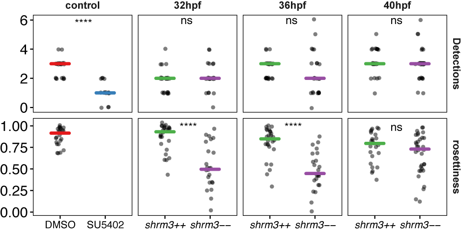

# Results {#results}

## Increased number of Neuromasts at end of migration 

```{r loadccsdata, eval=TRUE, echo=FALSE}
load("data/CCs/ccs.RData")
```

Based on the working model and due to the morphological similarity to _fgf3/10_\-- and drug treated fgf inhibited pLLPs[@Lecaudey2008a] we expected a reduced number of NMs to be deposited at the end of PLLp migration. Surprisingly, what we found instead is that there were more NMs or 'Cell Clusters' (CCs) deposited (figure \@ref(fig:zmaxccs)).

To confirm these findings quantitatively we first collected a dataset of ~100 zebrafish embryos fixed at the end of PLLp migration derived from three different parent pairs (N=3). This gave us ~33 wildtype, ~66 heterozygous and ~33 homozygous mutants to statistically show the increased number of deposited cell clusters. Furthermore, since an increased number of deposited CCs could potentially indicate (1) that CCs are deposited prematurely and that CC area (in Z-projected MaxIPs) would therefore be reduced or (2) an increase in proliferation which would lead to an increase in cell number, we also measured the area each CC took up and counted the number of cells each CC was made up of.

While in wild type embryos there are `r CC_all_count_mean[1,2]` $\pm$ `r CC_all_count_mean[1,3]` CCs, in _shroom3_\-- embryos there are `r CC_all_count_mean[2,2]` $\pm$ `r CC_all_count_mean[2,3]` CCs deposited. Even though CCs are deposited more random in _shroom3_\-- embryos, we got the impression that the position of the first deposited CC was mostly conserved, which by statistically testing if there's a difference in its position (p = `r round(tt.P01$p.value, digits=1)`) seems to be true. However, for the rest of the CCs there seems to be an average lag of around -`r round(mean((subset(CC_all_mean_XED, group == "control"))$meanxed)-mean((subset(CC_all_mean_XED, group == "mutant"))$meanxed), digits=1)`$\mu$m. If this was the case, it could be that Shroom3 dependent regulation of CC deposition becomes important only after deposition of the first CC (~36hpf) and that the deposition machinery in _shroom3_\-- embryos is deregulated. Figure \@ref(fig:ccdensed), upper panel, shows the density kernel estimation for all CCs without grouping at a bandwidth of `r round((CC_all_mean_XEDsd[1,2]+CC_all_mean_XEDsd[2,2])/2, digits=0)`, which is the mean standard deviation for both groups and all CC positions. Figure \@ref(fig:ccdensed), lower panel, shows the mean CC position (grey values indicate Position number).

(ref:figure1) _shroom3_ mutant phenotype 
```{r zmaxccs, echo=FALSE, dpi=200, out.width='100%', fig.cap="(ref:figure1)"}
knitr::include_graphics("figure/03-Results/figure1")
```

**(A-B)** Mutant allele **A** left and right oligo binding sites to direct TAL nuclease and restriction site of enzyme NsiI (grey highlight) **A’** wild-type nucleotide sequence and 8 bp deletion of generated allele fu50 **B** wild-type Shroom3 amino acid sequence and pre-mature stop-codon **B’** Schematic of wild-type Shroom3 domains and region (asterics) of stop-codon in the mutant allele **(C-C’)** Adult (6 months) phenotype C Lateral view of live anaesthetised examples **C’** Magnification of the head shows swollen gills in homozygous mutants (scale bar = 1mm)  **(D-D’’)** Lateral Line Phenotype of embryos fixed at end of migration D Neuromast (cell cluster) pattern in a wild-type and a mutant example with area and number highlighted (0 = reference) (Objective = 20X CFI APO LWD $\lambda$ -S; N.A. = 0.95) **D’** KDE and mean cell cluster (CC) position (red bars = sd) **D’’** Lateral Line Morphometrics. Upper row = CC medians per embryo. Lower row = sums per embryo. **E** pLLP phenotype of live embryos at stages 32, 36 and 40 hpf. Rosette morphology in mutant embryos is further split up into weak and severe phenotype. Arrows indicate presence of constricted membranes (Objective = 40X CFI APO LWD $\lambda$ -S; N.A. = 1.15).

(ref:ccmeanxeddiff) CC Euclidian Distance [$\mu$m]
```{r ccmeanxeddiff, out.width='40%', fig.height=3, fig.width=3.5, dpi=400, fig.cap="(ref:ccmeanxeddiff)"}
load("data/CCs/ccs.RData")
ggplot(CC_all, aes(XEDsum, Pos)) +
  geom_jitter(aes(shape=group), size=2, alpha=1, height = 0.25, width = 0, show.legend=F) +
  geom_smooth(aes(colour=group), method=loess, size=1.5, se=F) +
  labs(title = "", x = "Sum Euclidian Distance", y = "CC Position") +
  scale_x_continuous(breaks = seq(400, 3000, 600)) +
  scale_y_continuous(breaks = seq(2, 15, 1)) +
  scale_shape_manual(values=c(1, 20)) +
  scale_colour_manual(values = c("#4DAF4A", "#984EA3"), labels=mylabels) +
  #scale_colour_brewer(palette = "Set1") +
  mythemeLIGHT_bottom() + theme(legend.position = c(0.2, 0.85)) + theme(legend.title=element_blank()) 
```

### Neuromasts

To check weather the reduction in size and cell count of NMs in _shroom3_\-- embryos had an effect on their morphology too, we prepared eight samples for each group for scanning electron microscopy.

(ref:scanem) Neuromast scanning EM
```{r scanem, echo=FALSE, dpi=200, out.width='50%', fig.cap="(ref:scanem)"}

```

### Haircells

Furthermore, to check weather the reduction in size and cell count of NMs in _shroom3_\-- embryos had an effect on hair cell development, we performed immunostainings on 4dpf embryos with a hair cell specific marker.

### Summary

We find two additional CCs being deposited in _shroom3_\-- embryos and a net increase in cell number of ~`r round((median(CCP_nuc_mut$CCP_Cells)-median(CCP_nuc_wt$CCP_Cells))/median(CCP_nuc_mut$CCP_Cells), digits=2)*100`% (`r round(mean(CCP_nuc_mut$CCP_Cells), digits=0)-round(mean(CCP_nuc_wt$CCP_Cells), digits=0)` cells), which raises the question if there is an increase in proliferation and if it played a role in the rosette formation defect (shown by rosette detector).

The cell count and area per CC show an average reduction of `r (round(median(CC_wt_nuc$Cells_per_Cluster)/median(CC_hom_nuc$Cells_per_Cluster), digits=2)-1)*100`% respectively and no difference for the density (cells per area). The reduction in area can also be seen in scanning electron microscopy (SEM) pictures (figure \@ref(fig:scanem).1). Furthermore figure \@ref(fig:scanem).2 indicates a disruption in the bundle of kinocilia, suggesting that mature NMs are not fully functional. 

The difference of the total cell count per LL is highly significant when counting only CC cells (figure \@ref(fig:ccnucs), CC_Cells), but less when counting CC cells plus the cells of the PLLp (figure \@ref(fig:ccnucs), CCP_Cells), which could indicate a reduced number of cells in _shroom3_\-- PLLps. However, statistical analysis of PLLp cell count and area shows no difference (figure \@ref(fig:ccnucs), PLLp_Cells).

## Proliferation in CCs is facilitated to regenerate NMs

```{r loadproldata, eval=TRUE, echo=FALSE}
load("data/Prol/prol.RData")
```

In the CC analysis we found that deposited CCs were on average slightly smaller and had fewer cells incorporated. However, due to the additional two cell clusters deposited in _shroom3_\-- embryos, overall the LL consists of ~10% more cells at the end of migration.
 
To test whether this is due to facilitated proliferation in _shroom3_\-- embryos and if the additional cells originate from the migrating PLLp or if CCs proliferate further after deposition to reach a certain threshold density, first timelapse movies were recorded (12 h / $\Delta$T = 8.82 min.) to count the number of Mitoses in a cxcr4b(BAC):H2BRFP +/+ transgenic (similar to Laguerre _et al._, 2009[@Laguerre2009a]) line carrying the _shroom3_ mutation. Figure \@ref(fig:mitodata) shows a wild type and a _shroom3_\-- LL after ~12 h with all tracks for mitotic events that occured overlaid (each track represented by an individual colour). Second, an EdU Cell Proliferation Assay was conducted. Furthermore, proliferation was assessed using EdU Cell Proliferation Assay and a phospho-Histone Immuno-fluorescence Marker.

(ref:mitodata) Mitotic tracks in wild type and _shroom3_\-- embryos
```{r mitodata, echo=FALSE, dpi=200, out.width='90%', fig.cap="(ref:mitodata)"}

```

On average we find one mitosis occuring every `r round(MTJ_Points_PID1_count_mean[1,2], digits=1)` $\pm$ `r round(MTJ_Points_PID1_count_mean[1,3], digits=1)` min. for the wild type and `r round(MTJ_Points_PID1_count_mean[2,2], digits=1)` $\pm$ `r round(MTJ_Points_PID1_count_mean[2,3], digits=1)` min. for _shroom3_\-- embryos (N=3, n=6 _shroom3_++;4 _shroom3_\--), which reflects an increase in proliferative activity of `r round((MTJ_Points_PID1_count_mean[1,2]/MTJ_Points_PID1_count_mean[2,2])-1, digits=1)*100`%.

\noindent To test the Null Hypothesis that throughout time (12 h / ~80 frames per embryo) there are _not_ more mitotses occuring than in the wild type, the non-parametric kolmogorov smirnov test was used - resulting in a high probability for the proliferation to be increased in _shroom3_\-- embryos (figure \@ref(fig:mtjpecdf)).

To index the proliferative activity (min. per mitosis) per embryo, the product of total number of timepoints and $\Delta$T in min. was divided by the total number of mitotic events. From this we get to know the average time [min.] during which one mitosis occurs.

\[Min.\;per\;Mitosis = \frac{timepoints(n*\Delta T\;[min.])}{mitotses\;[n]}\]

(ref:figure2) Proliferation in the Lateral Line 
```{r figure2, echo=FALSE, dpi=200, out.width='100%', fig.cap="(ref:figure2)"}
knitr::include_graphics("figure/03-Results/figure2")
```

**A** Cell Counts at different developmental stages **B** For analysis of mitotic events, the data was split into events happening in the pLLP and CCs exclusively **(C-C’)** pLLP Mitoses C Mitoses within a 1 h interval. Dots represent the median, error the std. Curve represents the KDE throughout time **C’** The proliferation index represents the ratio of detected cells (by either EdU or p-Histone) over total cells **(D-D’)** Count of Mitoses in pooled CCs **D** Mitoses throughout time **D’** Mitoses E Model of Mitotic count (p-values = wilcox-ranksum, bars = 95%CI)

\noindent Finally, we checked the lag by plotting each CC position over the summed euclidian distance. This revealed that the lag increases at later CC positions and/or time (figure \@ref(fig:xedcorr)).

### Summary

We find an increase of proliferative activity, of around `r round((MTJ_Points_PID1_count_mean[1,2]/MTJ_Points_PID1_count_mean[2,2])-1, digits=1)*100`% in the PLLp only. When looking at proliferation in terms of cell count, each proliferative event gives rise to net=1 additional cell, therefore the percentage of increase in proliferative activity is proportional to an increase in cell number, which in this case is mostly consistent with the observed 9% more cells in _shroom3_\-- embryos at the end of migration.

\noindent An important regulator for proliferation and organ size is the mechanosensitive hippo signaling pathway where the transcription factors Yap and Taz are the most downstream targets that, when dephosphorylated, translocate from the cytoplasm to the nucleus to induce target gene expression. To check whether hippo signaling was involved in the increased proliferation we performed immunostainings for Taz (figure \@ref(fig:proltaz) shows a wild type and a _shroom3_\-- PLLp with nuclei labeled in magenta and Taz in green, split up in a more basal, a medial and a more apical Z section). On average the immunostainings suggest that Taz localization is more concentrated in the leading region and in the nuclei of peripherical PLLp cells in _shroom3_\-- embryos. Since Taz signaling is a response to mechanic signaling, if Taz was indeed more active in _shroom3_\-- embryos this would suggest that the absense of rosettes also influences the micromecanical environment of PLLp cells.

## Micro-rosette formation in shroom3 mutant embryos

(ref:shrmloc) Shroom3 subcellular localization
```{r shrmloc, echo=FALSE, dpi=400, out.width='75%', fig.cap="(ref:shrmloc)"}

```

To get a better idea of the mechanisms that lead to deregulated CC deposition we wanted to have a better picture of rosette assembly and how and when rosettes form in the migrating pLLP at different stages. First we used a rosette detector (see chapter \@ref(CNN)) to quantify rosettes at early (32 hpf), mid (36 hpf) and late (40 hpf) stage of pLLP migration and time series.

(ref:rdbox) Rosettes at different stages
```{r rdbox, echo=FALSE, dpi=400, out.width='85%', fig.cap="(ref:rdbox)"}

```

CC deposition and arrangement in the wild type LL development is highly conserved, however, the exact mechanisms leading to rosette formation and final deposition of the most trailing proto-NM are not fully understood. Moreover, there are inconsistent ideas about the process concerning whether proliferation is involved[@Aman2008] or not[@Gamba2010] or if the region within the PLLp where proliferation takes place might be important[@Valdivia2011a; @McGraw2011a]. To get an idea about whether facilitated proliferation contributes to the phenotype we observe in _shroom3_\-- embryos, we compared the average number of cells and size (area) per CC plus the total LL cell count with (CC+PLLp) and without (CC) the PLLp (figure \@ref(fig:ccnucs)). 

(ref:figure3) Cell Cluster Deposition and Rosette Formation
```{r figure3, echo=FALSE, dpi=200, out.width='100%', fig.cap="(ref:figure3)"}
knitr::include_graphics("figure/03-Results/figure3")
```

**A** Timelapse in 30 min. interval **(B-B'') Correlations** **B** Depositions to velocity in 1.5 h interval **B’** Depositions to velocity in total **B’’** Rosettiness to velocity in 1.5 h **C** Kymograph of registered pLLP **(D-E)** Model of Rosette detection **D** Distinctions and quantities **E** Example of Rosette Detection in a timelapse **F** Quantification of (i) detected rosettes and (ii) normalized rosette weight  **G** Ectopic expression of _shroom3_ via a heat-shock promoter rescues the phenotype at 32 hpf **H** Temperature rescue.

### Speed of Migration

```{r loadaccdata, eval=TRUE, echo=FALSE}
load("data/Acc/acc.RData")
```

(ref:rdtl) Smoothed Timelapse Data (10 min. interval)
```{r tltime, out.width='75%', fig.height = 3.5, fig.width = 5, eval=T, echo=FALSE, fig.cap="(ref:rdtl)"}
ggplot(tl_sub, aes(Time, value)) +
  geom_smooth(aes(fill=group),method="loess", span=.2, size=.1, show.legend = F, alpha=.3) +
  geom_smooth(aes(colour=group),method="loess", span=.2, size=1, se=F) +
  #stat_smooth(aes(colour=group),geom = "line", method = "loess", span=.2, size=.75,show.legend = T) +
  labs(title = "", x = "Time [h]", y = "values") +
  scale_x_continuous(limits = c(0, 15), breaks = seq(1, 14, 2)) +
  scale_colour_manual(values = c("#4DAF4A", "#984EA3"), labels = c("shroom3++", "shroom3--", "Detections", "Weighted Detection", "Detection")) +
  scale_fill_manual(values = c("#4DAF4A", "#984EA3")) +
  facet_grid(variable~., scales = "free_y") +
  mythemeLIGHT_bottom() + 
    theme(legend.position="top") + 
    theme(strip.background = element_rect(color = "transparent", fill="transparent")) + 
    theme(strip.text = element_text(size=10, face = "bold")) + 
    theme(legend.title=element_blank())
```

## Apical Constriction and Tissue Organization in _shroom3_ mutant embryos

```{r loadacdata, eval=TRUE, echo=FALSE}
load("data/ACI/ac.RData")
```

Rosette formation and AC are thought to be necessary for proper CC deposition and are generally understood as a conjugate, where one implies the other. Since the current model suggests that without Shroom3 there should be no AC and no rosette formation and if CC deposition depended on both, CC deposition frequency should be absent or decreased. We therefore had a closer look at _fgf_ inhibited and _shroom3_\-- PLLps and found that in _shroom3_\-- PLLps, the horizontal midline was more pronounced (figure \@ref(fig:shrmrecap)) and that its cells were still higher than in _fgf_ inhibited embryos, suggesting that the role of Shroom3 as a mediator of Fgf signaling and epithelialization in the PLLp still isn't fully understood yet. Since we already know about the defect in rosette formation (see chapter \@ref(res-rd)) we asked outselfs how AC was affected in _shroom3_\-- embryos, which we did by measuring the apical constriction index (see chapter \@ref(ACI)).

Second, we had another look at the relationship of radial organization and AC in the cells of the PLLp (see chapter \@ref(ACI)). Both analyses were done on the
same datasets.

(ref:cellmorph) single cell 3-D morphology
```{r cellmorph, echo=FALSE, dpi=400, out.width='85%', fig.cap="(ref:cellmorph)"}

```

To check for AC a dataset was generated consisting of `r count_group[1,2]` DMSO controls, `r count_group[2,2]` SU5402 treated, `r count_group[3,2]` _shroom3_++
and `r count_group[4,2]` _shroom3_\-- embryos plus respective rescue controls (N>3). Furthermore, the experiment was repeated for three different timepoints at 32, 36 and 45 hpf.

(ref:figure4) Apical Constriction and tissue organization in _shroom3_ mutant embryos
```{r figure4, echo=FALSE, dpi=200, out.width='100%', fig.cap="(ref:figure4)"}
knitr::include_graphics("figure/03-Results/figure4")
```

**A** _cldnb:lyn-gfp_ membrane signal of the pLLP in XY max-intensity projection, and XZ, YZ cross-sections at 32, 36 and 40 hpf. Arrows in YZ indicate the rosette apical tip. Bars in XY indicate the width of the rosettes. Dotted bars indicate absence of rosettes. **(B-B’’)** Morphological and measurement models **B** Volumetric renderings and modelled schematics of cell shapes in _shroom3_++ and _shroom3_\-- embryos. **B’** Model of the measurements taken **B’’** Angle measurements **C** Quantitative representation of pLLP morphology. Each timepoint represents multiple primordia. Each hexagon represents the median height of a number of centroids falling in. **D** Median ACI Major and Minor. Bars indicate the 95 \% CI. p-values = wilcox-ranksum. **D’** Angles are counted for intervals of 15$^\circ$C, then divided by the total number of cells. **D-D’** p-values = wilcox-ranksum F Correlation between ACI and cellular orientation **(D-F)** (++ = , \-- = )

<!--
(ref:acimeanbox2) Mean ACI and Max Height 
```{r acimeanbox2, out.width='50%', fig.height=3.5, fig.width=3.5, dpi=400, message=FALSE, fig.cap="(ref:acimeanbox2)"}
load("data/ACI/ac.RData")
mylabels <- c("DMSO", 
              "SU5402", 
              expression(italic("shrm3++")), 
              expression(italic("shrm3--")))
my_comparisons <- list(c("DMSO","SU5402"),
                       c("shrm3_ctr","shrm3_hom"),
                       c("DMSO","shrm3_ctr"),
                       c("SU5402","shrm3_hom"))
ggplot(all_mean, aes(group, value)) +
  geom_jitter(aes(), shape=16, height=.05, width=.1, colour = "black", alpha=.5) +
  stat_summary(aes(colour=group), geom = "crossbar", width =.4, size=1.5, show.legend = F, fatten=0, 
                 fun.data = function(x){c(y=median(x), ymin=median(x), ymax=median(x))}) +
  scale_colour_manual(breaks = levels(all_mean$group), values = c("#E41A1C", "#377EB8", "#4DAF4A", "#984EA3")) +
  scale_x_discrete(labels=mylabels) + 
  stat_compare_means(comparisons=my_comparisons, method = "t.test", label="p.format") +
  labs(title = "Mean distribution", x = "Group", y = "Mean values") +
  facet_grid(variable~., scales = "free") +
  mythemeLIGHT_bottom() + 
    theme(axis.title.x = element_blank()) + 
    theme(axis.title.y = element_blank()) +
    theme(axis.text.x = element_text(size = 10)) + 
    theme(strip.background = element_rect(color = "transparent", fill="transparent")) + 
    theme(strip.text = element_text(size=10, face = "bold"))
```

(ref:acidens) ACI densities
```{r acidens, out.width='50%', fig.height=2.5, fig.width=4, dpi=400, echo=FALSE, message=FALSE, warning=FALSE, fig.cap="(ref:acidens)"}
load("data/ACI/ac.RData")
ggplot(all, aes(ACIMinor)) + 
  geom_vline(aes(xintercept = 3.1), colour="black", size=15, alpha=.1) +
  geom_vline(aes(xintercept = 6), colour="black", size=30, alpha=.1) +
  stat_density(aes(y=..density.., colour=group), geom="line", bw=.2, size=1, position = "identity") +
  labs(title = "", x = "ACI Minor", y = "Density profile") +
  scale_x_continuous(limits = c(1, 10),breaks = seq(1, 10, 1)) +
  scale_colour_manual(breaks = levels(all$group), values = c("#E41A1C", "#377EB8", "#4DAF4A", "#984EA3")) +
  mythemeLIGHT_bottom() + 
    theme(legend.title=element_blank()) + 
    theme(legend.position = c(0.85, 0.70))
```

(ref:aciangles2) ACI~Major~ and ACI~Minor~ as a function of $\measuredangle$~Major~
```{r aciangles2, out.width='85%', fig.height=2.5, fig.width=8.5, dpi=400, message=F, warning=F, fig.cap="(ref:aciangles2)"}
load("data/ACI/ac.RData")
#library("ggplot2")
ggplot(all_Angle, aes(Angle, value)) +
  stat_smooth(aes(linetype=ACI), geom = "smooth", colour="black", method="loess", span=.3, size=1.1) +
  labs(title = "", x = "0-90 deg. apical orientation", y = "ACI") +
  scale_x_continuous(limits = c(0, 90), breaks = seq(15, 75, 30)) +
  facet_grid(.~group) +
  mythemeLIGHT_bottom() + 
    theme(legend.position="right") + 
    theme(legend.title=element_blank()) + 
    theme(strip.background = element_rect(color = "transparent", fill="transparent")) + 
    theme(strip.text = element_text(size=10, face = "bold"))
```
-->

However, this still doesn't tell us how CC deposition is deregulated in _shroom3_\-- embryos.

## Changes in organ morphology affect cellular specification

(ref:figure5) Apical Constriction and tissue organization in _shroom3_ mutant embryos
```{r figure5, echo=FALSE, dpi=200, out.width='100%', fig.cap="(ref:figure5)"}
knitr::include_graphics("figure/03-Results/figure5")
```

Increased signal intensity and cell count of Atoh1a expressing cells **(A-A’’)** A Kymographs of primordium morphogenesis registered to leading edge **A’** Relative numbers of Tom expressing cells throughout time (++ = 972, 405, 156, 31, 2; \-- = 621, 316, 131, 51, 12, 2, 1) **A’'** Mean Tom expressing cell count in 3 h intervals (++, \-- = 261, 189 each interval) **(B-B’)** **B** Kymographs of pLLP migration along the LL **B’** Maximum Tom signal intensities in the pLLP (positive X axis; ++ = 1134, \-- = 1134) and in Neuromasts (negative X axis; ++ = 2499, \-- = 3566). Zero marks timepoint of Neuromast deposition. 

* We wanted to check if in a scenario of fragmented rosettes and reduced AC, hair cells would still specify and if deposited Neuromasts would be functionally intact.
* To our surprise not only is _atoh1a_ still expressed, but the signal of the Atoh1a:Tom transgene is stronger and the count of _atoh1a_ expressing cells within the Primordium from 32-35 hpf is increased by ~25 \%.
* This leads to the conclusion that micro-rosette morphology is still sufficient for hair-cell specification.

## Shroom3 interaction partners

Yeast-2-Hybrid screen

### _lpp_

### _dnmbp_

### _trip6_

### _limD1_
