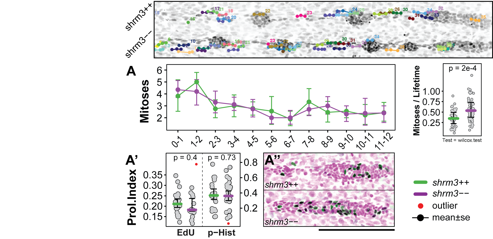
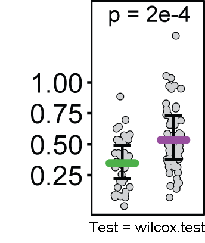
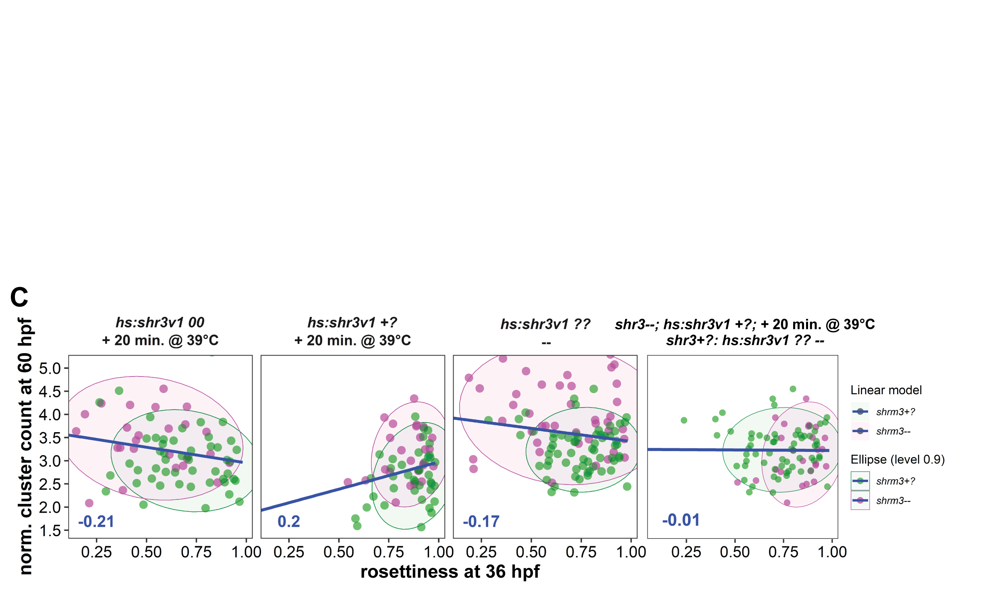
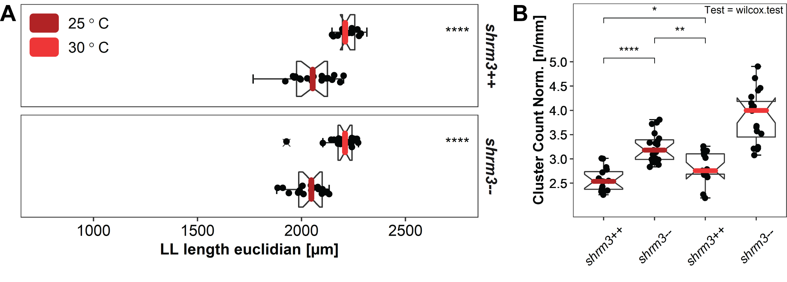

# Results {#res}

## Lateral Line Morphometrics

Based on the working model and due to the morphological similarity to _fgf3/10_$--$ and drug treated Fgfr1 inhibited pLLPs [@Durdu2014a; @Harding2012; @Lecaudey2008a; @Nechiporuk2008], a reduced number of CCs was expected to be deposited at the end of pLLP migration. Instead we found more CCs deposited \@ref(fig:shrmmut)E.

### Dataset

To confirm these findings quantitatively a dataset was put together consisting of ~100 zebrafish embryos fixed at the end of PLLp migration, derived from four different parent pairs. After genotyping, this gave us ~33 wildtypes, ~66 heterozygous and ~33 homozygous mutants for statistical tests. Furthermore, since an increased number of deposited CCs could potentially indicate

- that CCs are deposited prematurely and that CC area^[in Maximum intensity Z projections (MaxIP)] would therefore be reduced 
- an increase in proliferation which would lead to an increase in cell number in the total system,

we also measured the area each CC took up and counted the number of cells each CC was made up of.

### Number and Position of Cell Clusters {#res-ccounts}

To normalize the number of deposited CCs to individual LL lengths, for comparison the ratio of LL length over CC count is used \@ref(fig:llcounts)B. To correct for uneven LL paths^[fixation with PFA may introduce a slight bending of the embryo] and irregularities in mounting^[When mounted, all embryos have a different tilt], CC distances are calculated in Euclidian space rather than solely in dimension X. While _shrm3++_ embryos deposit 6 $\pm$ 0.7 CCs, _shroom3_$--$ embryos deposit 8 $\pm$ 0.9 CCs \@ref(fig:llcounts)A. This difference stays true also when normalizing against length \@ref(fig:llcounts)B.

(ref:llcounts) Cluster counts **A** cluster count **B** normalized to length (LL length [µm] / cluster count [n])

```{r llcounts, out.width = "0.6\\textwidth", fig.cap="(ref:llcounts)", fig.scap="Cluster Counts"}
knitr::include_graphics("figures/results/01_morphometrics/ll_counts.png")
```

Even though CC position in individual _shroom3_$--$ embryos seems more random, the position of the first deposited CC is mostly conserved (\@ref(fig:llpos)A, $p$ for difference in position = 0.2). Similarly, the position of the pLLP also isn’t significantly changed. While for the remaining CCs an average lag of -50.4 $\mu$m as compared to _shroom3_++ CC positions is observed, it also seems to increase with later CC positions. For _shroom3_++ embryos CC position is mostly conserved through development, however it remains elusive if this is true for _shroom3_$--$ embryos too. 
\@ref(fig:llpos)A', shows the kernel density distribution for the CC position without grouping individual positions. At a binwidth of 50 $\mu$m, the distribution curves show a high and narrow density at around 350 $\mu$m, which is the average location of CC1 (\@ref(fig:llpos) 2A). For the remaining CCs the kernel distribution does, neither for _shroom3_++ nor for _shroom3_$--$ embryos, reveal a precise location. In contrast, if based on CC sequential identity the mean position and standard deviation is calculated, a more explicit pattern emerges which clearly shows the increased count and average frequency (\@ref(fig:llpos) 2A).

(ref:llpos) Cell Cluster positions **A** Exemplary _shroom3_++ and $--$ embryos with CCs hightlighted. CC0 marks the reference location to compare individual embryos. Scale bar = 1 mm **A'** Kernel Density Estimate without (KDE) grouping (n++=162, n--=206) **A'\'** Dots = mean positions, bars = standard deviation (nmax for both ++ and -- =26).

```{r llpos, out.width = "0.85\\textwidth", fig.cap="(ref:llpos)", fig.scap="Cell Cluster Positions"}
knitr::include_graphics("figures/results/01_morphometrics/ll_positions.png")
```

### Cell Count and Area of CCs {#res-llmorph}

To get an idea about whether facilitated proliferation contributes to the phenotype we observe in _shroom3_$--$ embryos, the cell count per CC was determined by counting DAPI stained cells within CC segments derived from the _cldnb:lyn-gfp_ membrane signal (section \@ref(mat-GrTrDat)). Both cells per CC and area per CC are shrunk by about 6% in _shroom3_$--$ embryos, while the density of cells per area remains unchanged (\@ref(fig:llclus)A). Interestingly, when comparing net cell counts per embryo an increase of 9% is observed (\@ref(fig:llclus)B). Both the sum of CC cells and total LL cells (CC+pLLP) are significantly increased in _shroom3_$--$ embryos, while the count of only pLLP cells remains unchanged.

(ref:llclus) LL Morphometrics **A** individual CC statistics **B** Sums per embryo. (Bars = median, errorbars = 95% CI)

```{r llclus, out.width = "0.7\\textwidth", fig.cap="(ref:llclus)", fig.scap="LL Morphometrics"}
knitr::include_graphics("figures/results/01_morphometrics/ll_clusters.png")
```

## Proliferation

LL morphometric analysis revealed that deposited CCs in _shroom3_$--$ embryos were on average slightly smaller and had fewer cells incorporated. However, due to the additional two cell clusters deposited, the net count is ~9$\%$ increased at the end of migration. 
To test whether this is due to higher proliferative activity a dataset of time-lapse movies (12 h / $\Delta$T = 6 min.) was generated to count the number of mitoses in a _cxcr4b(BAC):H2BRFP_ transgenic background similar to previous proliferation studies in the pLLP [@Laguerre2005a; @Laguerre2009a].

### Dataset

The dataset consists of so and so many embryos and different groups. For counting, tracks were created for each proliferative cell on MaxIPs (section \@ref(prolif)). Figure \@ref(fig:prollabs) shows a _shroom3_++ and a _shroom3_$--$ LL after 12 h of imaging where each mitotic track is individually colored and overlaid to the image data.

(ref:prollabs) Tracks of Mitosis. Each connection between two dots represents 6 min.

```{r prollabs, out.width = "0.95\\textwidth", fig.cap="(ref:prollabs)", fig.scap="Tracks of Mitosis"}

```

To index the proliferative activity (minutes per mitosis) per embryo, the product of total number of timepoints and $\Delta$T in minutes was divided by the total number of mitotic events. From this we get to know the average time [min.] during which one mitosis occurs.


\makebox[\linewidth]{$Proliferation Index = \frac{Mitotses [\Bbb{n}]}{Timepoints[\Bbb{n}] * \Delta T [\Bbb{min.}]}$}
\newline

### Mitoses in the pLLP {#res-prolpllp}

Tracking mitoses in the pLLP does not reveal any difference in proliferation from start (~28 hpf) till about mid of migration 12 hours later (\@ref(fig:prolpllp)A). For confirmation, this finding was also validated via two more traditional methods. During mitosis genetic material is replicated in S-phase^[‘S‘ like ‚Synthesis‘], while in meta-phase chromosomes are found to be heavily phosphorylated [@Hans2001]. With an EdU^[5-Ethynyl-2'-deoxyuridine] assay [@Fischer] cells in S-phase can be detected (\@ref(fig:prolpllp)B'). Using a specific phospho-histone (p-Hist.) antibody cells in meta-phase can be detected. When comparing the relative numbers of EdU resp. p-Hist cells over total pLLP cells, again, no difference in proliferation can be detected. Still, at end of migration the LL system in _shroom3_$--$ embryos does incorporate 9$\%$ more cells.

(ref:prolpllp) pLLP proliferation **A** **B-B'**

```{r prolpllp, out.width = "0.6\\textwidth", fig.cap="(ref:prolpllp)", fig.scap="pLLP proliferation"}

```

### Mitoses in Cell Clusters {#res-prolcc}

Due to their high regenerative ability, zebrafish are a popular model in regenerative research [@Chitnis2012a; @Mokalled2016; @Harding2014a]. It is well known that zebrafish NMs have a very high regenerative capacity [@Cruz2015; @Pinto-Teixeira2015; @Wada2013]. Since individual _shroom3_$--$ CCs are smaller, we wondered if there could be compensation mechanisms activated that increase proliferation to restore wildtype CC size once they are deposited. To verify this, CC mitoses were tracked on the same data as before. Other than the pLLP, which can be observed throughout the time-lapse, CCs only begin to _exist_ when they are deposited. To normalize for individual CC lifetimes, the number of mitoses per CC is divided by the duration of the total time-lapse minus the time span to when it first appeared. This way it becomes evident that the additional cells in _shroom3_$--$ embryos are derived from CC proliferation, rather than pLLP proliferation.

(ref:prolcc) CC proliferation

```{r prolcc, out.width = "0.2\\textwidth", fig.cap="(ref:prolcc)", fig.scap="CC proliferation"}

```

## Rosette Formation and Cluster Deposition

Having shown that the additional CC deposition in _shroom3_$--$ embryos is not caused by an over-proliferation in the migrating pLLP, the next step was to have a closer look at the dynamics of rosette formation, in relation to pLLP morphometrics and CC deposition. To test dependencies between different observations and developmental dynamics, variables can be correlated. To do this and to have a coherent dataset to work with, the data of three different analyses on a single set of image data were merged. 
First, to get to know the exact timing of CC deposition, a manual tracking tool [@Meijering2012] was used (\@ref(fig:rdt), Tracking). Second, to deduce pLLP morphometrics a self-made IJ macro [@Kleinhansa] was developed^[anaLLzr2DT - https://github.com/KleinhansDa/anaLLzr2DT] for spatiotemporal registration of the pLLP and to yield information about its speed, area, roundness, etc. (\@ref(fig:rdt), Registration). Third, to detect rosettes and quantify their weights^[as a decimal from 0-1 (1 being a wild-type rosette). For further info see section \@ref(CNN)], a CNN [@Falk2019] was used on the registered pLLP output from the anaLLzr2DT (\@ref(fig:rdt), Detection). Finally, all three datasets were merged by a unique identifier for each datapoint by a unique identifier for each embryo and timepoint.

### Dataset

The image data set analyzed consists of 20 time-lapse movies (11 _shroom3_$--$, 9 _shroom3_++). Each time-lapse has a duration of ~20 h (~8 min. interval)^[for further details about dataset acquisition see section \@(refdetect-data)], summing up to ~1650 _shroom3_$--$, and ~1350 _shroom3_++ timepoints.

(ref:rdt) Merged Datasets. (Tracking) pLLP is marked as no.1. The rest of the CCs is numbered sequentially as they appear. (Registration) The black outline marks the region of interest (ROI) that is the pLLP as it is detected by the anaLLzr2DT. The red line highlights the pLLPs leading edge. (Detection) Each square highlights a detected rosette by the CNN, colors represent rosette weights.

```{r rdt, out.width = "0.7\\textwidth", fig.cap="(ref:rdt)", fig.scap="RDT Merged Datasets"}
knitr::include_graphics("figures/results/03_rosettes/RDT-01.png")
```

### Cluster Deposition

Figure \@(fig:rdtdepo)A shows a montage of a _shroom3_++ and a _shroom3_$--$ scenario in cluster deposition (3.5 h / ~20 min. interval). For _shroom3_++ the rosette structure seems tight and two depositions occur in a regular manner. In the _shroom3_$--$ on the other hand, rosette structure seems more fragile with less pronounced rosette centers and four observed depositions. Interestingly, based on the _cldnb:lyn-gfp_ signal the area of constriction seems to be less radially organized but more oriented towards the horizontal midline. Furthermore, the trailing rosettes are significantly smaller and do not seem to delaminate as clean from the migrating primordium. In addition, for L3 it first seems like two CCs could be deposited, until they merge again to a single CC about 1.5 h later.
On average, as it was shown before (section \@(res-ccounts)), there’s a significant increase in clusters deposited (\@(fig:rdtdepo)B). Also, neither _shroom3_++ nor _shroom3_$--$ CCs drastically change their position once they are deposited.

(ref:rdtdepo) Cluster Deposition **A** _shroom3_++ and _shroom3_$--$ LL development in comparison. L1 - L4 are deposited CCs. Arrows indicate deposition events. Dotted lines are tracks of rosette to CC transition. **B** Statistics of deposited cluster counts **C** Change of CC position through time. Each line represents the locally weighted scatterplot smoothing (LOESS) of all CCn positions observed. 

```{r rdtdepo, out.width = "0.95\\textwidth", fig.cap="(ref:rdtdepo)", fig.scap="Cluster Deposition"}
knitr::include_graphics("figures/results/03_rosettes/tracking-01.png")
```

### Registration

As shown in figure\@(fig:rdtreg)A-A’ neither speed not acceleration drastically differ throughout the complete course of migration. Speed drops from an initial ~75 $\mu$m/h to about ~30 $\mu$m/h for both _shroom3_++ and _shroom3_$--$ 17 h later (figure 3.3 A). Similarly, while there is a positive acceleration of almost ~2 $\mu$m/h peaking after ~2-3 hours, the remaining two peaks progressively get smaller (\@(fig:rdtreg)A’). 
While for the area no difference can be detected (\@(fig:rdtreg)B), interestingly the roundness is on average significantly reduced in _shroom3_$--$ pLLPs (\@(fig:rdtreg)C). This is also evident from the montage in \@(fig:rdtdepo)A. 

(ref:rdtreg) pLLP time-resolved morphometrics **A-A’** Leading edge (l.e.) speed and acceleration in $\mu$m/h, displayed as LOESS curves with at a span of 0.5 **B** Area in square $\mu$m and **C** Roundness displayed as mean±se (standard error).

```{r rdtreg, out.width = "0.95\\textwidth", fig.cap="(ref:rdtreg)", fig.scap="pLLP time-resolved morphometrics"}
knitr::include_graphics("figures/results/03_rosettes/registration.png")
```

### Rosette Detection {res-rdtdet}

The kymographs^[a kymograph is a tool to record position over time. Here, its position of fluorescence signal intensities.] in figure\@(fig:rdtdet)A-A’ were generated on pLLPs that were registered in space and time. After registration, a line was drawn along the horizontal midline (\@(fig:rdtreg)A). Finally, recorded kymographs were turned to false color^[blue = low intensity, red = high intensity] for better visual display. In _shroom3_++ the higher intensities are highly concentrated to two to three distinct regions within the migrating pLLP, while in the _shroom3_$--$ pLLP the higher intensities are more fragmented and overall reduced. To analyze this statistically all pLLPs were quantified in terms of rosette count and average rosette weight or ‘rosettiness’ (see section \@(CNN)). 
The numbers reveal two very interesting things. First, the medians show that rosette count (\@(fig:rdtreg)B’) is only reduced for the first six hours, while rosettiness is reduced almost throughout the entire 20 hours. Second, while for rosette counts two to six indeed half or more of the pLLPs are _shroom3_++, for counts below two and above six there are more _shroom3_$--$ pLLPs (\@(fig:rdtreg)B). Furthermore figure \@(fig:rdtreg)C shows that at a rosettiness of ~0.7 there are about as many _shroom3_++ as there are _shroom3_$--$ pLLPs, marking this point as a threshold were pLLPs above are more like likely to be _shroom3_++ and below more likely to be _shroom3_$--$. At ~0.1 rosettiness there are almost only _shroom3_$--$ pLLPs, while at ~0.9 rosettiness there are almost only _shroom3_++ pLLPs. 
In addition, the data distributions attached to the sides (\@(fig:rdtreg)B’’ and C’’) reveal that for the rosettiness the KDE did not actually shifted to a lower number, but rather flattened and variance is increased.

(ref:rdtdet) Rosette counts and weights. **A-A’** pLLP kymographs. Length = 100 $\mu$m. (A) shows the signal and line drawn. (A') shows the signal through time **B-B’’ and C-C’’** Different graphic representation of rosette count data. (B) Filled histogram (B’) Median$\pm$standard deviation (B’’) KDE.

```{r rdtdet, out.width = "0.95\\textwidth", fig.cap="(ref:rdtdet)", fig.scap="Rosette counts and weights"}

```

### Correlations

The intent behind generating this combined dataset was to be able to efficiently detect interdependencies between different variables in time and space. The single dots in the scatterplots below represent the variables scatter in $x$ and $y$, the red line shows a linear model through the point cloud, the red digits are the correlation coefficient. Black spots with grey circles indicate the centers for clusters calculated on these two sets of data. Clustering was performed hierarchical.
For my questioning the most interesting variable to find dependencies with is rosettiness. In figure\@(fig.rdtcorr)A and B, the $x$ axis is occupied with the median rosettiness of all timepoints. As mentioned in section \@(intro-phen) when we had a first closer look at the pLLP phenotype we found that a fraction of the clearly as _shroom3_$--$ identified ones still were reminiscent of the _shroom3_++ phenotype. The hypothesis to test for figure \@(fig:rdtcorr)A was that higher speeds lead to a lower degree of rosettiness and _vice versa_. The correlation coefficient and model indicate a rather low interdependence. However, both also showed (\@(fig:rdtdet)C' and \@(fig:rdtreg)A) a high timely dependence, an effect that is lost when reducing the time dimension to the median. Interestingly, however, the line that goes through the centers determined by clustering shows is much steeper and potentially a much higher interdependence. 
The hypothesis to test for figure \@(fig:rdtcorr)B was if lower rosettiness leads to a higher number of CCs deposited and _vice versa_. Since here the end of migration cluster count is one-dimensional, there is no other way than correlating to a summary statistic rosettiness. Here the correlation coefficient is rather high, the interdependence seems to be true. Additionally, the clusters determined are nicely separated from each other and the _shroom3_++ and _shroom3_$--$ pLLPs seem to form two independent groups in this space.

(ref:rdtcorr) Developmental interdependencies. Digits = pearson coefficient **A** **B** 

```{r rdtcorr, out.width = "0.95\\textwidth", fig.cap="(ref:rdtcorr)", fig.scap="Developmental interdependencies"}
knitr::include_graphics("figures/results/03_rosettes/rdt_corr_speed-ros.png")
```

## Apical Constriction

To gain further insight into rosette assembly and the contribution of apical constriction, it is appropriate to have a closer look at rosette conformation on a cellular scale. To do so, first a set of high spatial resolution, volumetric image data was generated (XY = 0.164 $\mu$m / pixel; Z = 0.4 $\mu$m) that allowed for

1. A more rigorous inspection of morphological differences, and
2. automated and unbiased single cell 3D reconstruction1[section \@(ref:ACI-singlecell)] using a newly developed IJ macro^[anaLLzr3D - https://github.com/KleinhansDa/anaLLzr3D]. Secondly, to investigate the contribution of various single cell morphometrics to rosette formation an app was developed^[LLMapR - https://dskleinhans.shinyapps.io/LLmapR/] that allows for a convenient handling of large amounts of retrieved data.

(ref:acdata) High resolution, volumetric image data. Upper row shows the fluorescence signal at the membranes. Lower row shows the 3D reconstructed cells. Columns show the same pLLP from different angles.

```{r acdata, out.width = "0.95\\textwidth", fig.cap="(ref:acdata)", fig.scap="High resolution, volumetric image data"}
knitr::include_graphics("figures/results/04_constriction/reconstriction_data.png")
```

Inhibition of Fgfr1 _via_ drug treatment^[Drug name = SU-5402 (section \@(mat-chem))] results in a concentration dependent loss of morphogenesis and rosette assembly in the pLLP [@Durdu2014a; @Harding2012; @Lecaudey2008a]. As a proof of principle and to validate previous studies, data of drug treated embryos (20 $\mu$M) and appropriate DMSO (0.1$\%$ DMSO / E3^[‘Embryo Medium 3’, standard zebrafish embryo incubation medium]) controls were included.

### Dataset

The dataset generated consists of three pLLP stages (\@(fig:acstages)), four groups (DMSO, SU5402, _shrm3_++ and _shroom3_$--$), 267 pLLPs and 33.163 single cells.

```{r acstages, out.width = "0.60\\textwidth", fig.cap="(ref:acstages)", fig.scap="Recorded developmental stages for 3D reconstruction"}
knitr::include_graphics("figures/results/04_constriction/Yolk_ext.png")
```

```{r acdatatab}
acdata <- read.delim("data/tables/acdata.txt")
knitr::kable(acdata, "latex", booktabs=T) %>%
  kable_styling(full_width = T) %>%
  add_header_above(c("id labels" = 2, "metrics" = 3)) %>%
  footnote(general = "ratio = cells/pLLPs")
```

### Cell Shape and Arrangement

Figure \@(fig.acshape)B’ illustrates the three developmental stages used here. For _shrm3_++ pLLPs two (\@(fig.acshape)A, 32 hpf) to four (\@(fig.acshape)A, 40 hpf) areas of constricting regions can be observed (XZ pane), in _shroom3_$--$ its three (\@(fig.acshape)A, 36 hpf) to seven (\@(fig.acshape)A, 40 hpf), confirming the results of rosette detection (\@(res-rdtdet)). While at 32 and 36 hpf the spread of those regions is wider in _shroom3_$--$, at 40 hpf they are smaller but also increased in number. When looking at the central rosette along the width (YZ pane), it seems like there is no considerable difference between _shroom3_++ and _shroom3_$--$ rosettes. In SU5402 treated embryos, neither in XZ nor in YZ constriction can be observed and the cells seem to be mostly retained in their mesenchymal character and columnar shape. In addition, while constriction seems isotropic in the shroom3++ rosette center, constriction in the shroom3—rosette center cells appears anisotropic.

(ref:acshape) Apical Constriction in 3D. The stages are in columns, the groups are in rows. Each panel shows a MaxIP (top left), and orthogonal views along the length (XZ, bottom left) and along the width (YZ, right). Arrow annotations in YZ panels indicate points of constriction, bar annotations in XZ indicate the spread of region of constriction.

```{r acshape, out.width = "0.95\\textwidth", fig.cap="(ref:acshape)", fig.scap="Apical Constriction in 3D"}
knitr::include_graphics("figures/results/04_constriction/Figure_5-1.png")
```

### Single Cell Metrics

To put the above mentioned in numbers and to gain a more objective view on cell geometry, apical constriction and other metrics such as height were quantified . To get a hold on AC anisotropy we measured the length of the minor and major axis of a fit oval (\@(fig.acaci)A). If AC was anisotropic and more cells are oriented towards the horizontal midline instead of being radially oriented, this could be shown by degrees of divergence ($\measuredangle$) from the horizontal midline (\@(fig.acshape)A’).
For angle measurements, all angles are normalized to a 90$^\circ$ range, where 0$^\circ$ is along the horizontal midline. When comparing the ratio of cells in intervals of 15$^\circ$ along a range of 90$^\circ$ it can be shown that there are more _shroom3_$--$ than _shroom3_++ cells within the 0-15$^\circ$ interval through all three stages (\@ref(fig:acstages)). Even more, it shows that there are more _shroom3_++ than _shroom3_$--$ cells within the remaining intervals – confirming the model of constriction anisotropy.
While reduction in ACI Major is stronger than the ACI Minor in shroom3$--$ cells (\@(fig:acaci)C-C’), both are significantly reduced throughout time – again confirming the increase in constriction anisotropy. The ACI for SU5402 treated embryos depicts the base value for both Major and Minor. For all three timepoints, this value stays at the same level. Interestingly, the ACI measurements for all other measurements are progressively approximating this level.

(ref:acaci) 3D metrics and pLLP maps. **A-A’** Measurements. (A) Oval (black outline) represents the fit ellipse. Red arrows represent major and minor axes which are representative for A-P and D-V respectively (A’) Angle measurements and intervals **B** Cellular orientation as bar chart. Statistics are indicated as stars. **C-C’** Apical Constriction measurements. Colored bars represent the median. Errorbars indicate 95% CI.

```{r acaci, out.width = "0.95\\textwidth", fig.cap="(ref:acaci)", fig.scap="Apical Constriction in 3D"}
knitr::include_graphics("figures/results/04_constriction/Figure_5-2.png")
```

## Haircell Specification {#res-hc}

Due to the rather strong cellular phenotype and overall smaller CCs we were interested if hair-cell specification would still take place and therefore if the LLs function as a sensory system would still be intact. First, to check if _atoh1a_ was still expressed in _shroom3_$--$ cells and if there were further implications in feedback loops with Notch signaling, an _In Situ Hybridization_ (ISH) experiment was conducted. For 36 and 40 hpf the count of _atoh1a_ and _deltaD_ expressing cells (\@ref(fig:hcish)) seemed to be increased. Furthermore, especially at 40 hpf, the signal seems to be a lot more fragmented and fuzzier. 
Traditional ISH allows for extremely sensitive detection of RNA transcripts on a whole embryo scale via a hybridizing anti-sense probe (section \@ref(ISH-met)). However, since embryos are fixed, it only allows to analyze single time points. Furthermore, since images are taken in brightfield, there is a problem of background signal and quantification of intensity.

(ref:hcish) Expression of deltaD and atoh1a in the pLLP. Recorded in greyscale at brightfield at 20X Magnification. Images show background subtracted and de-noised EDFs of original Z-stack data.

```{r hcish, out.width = "0.95\\textwidth", fig.cap="(ref:hcish)", fig.scap="Expression of deltaD and atoh1a in the pLLP"}
knitr::include_graphics("figures/results/05_atoh/hc_ish.png")
```

To get access to developmental dynamics we made use of an additional, besides _cldnb:lyn-gfp_, transgenic construct where tdTomato^[Short ‚Tom‘] [@Shaner2004] is expressed under direct control of the _atoh1a_ promotor. By simultaneous observation of both fluorophores in a time-lapse setup (\@ref(fig:hctl)B), the strategy was to follow up the dynamics of tom expression to count quantities and to measure the strength of expression by measuring signal intensity. 

### Dataset

The dataset generated consists of two groups, _shroom3_++ and _shroom3_$--$, where the segmented lateral line images are split into pLLP and CC (Materials and Methods...). Each time-lapse movie has a total duration of 18-20 hours, consists of about 54 timepoints and two channels (488 & 561 nm).


```{r}
hcdata <- read.delim("data/tables/hcdata.txt")
knitr::kable(hcdata, "latex", booktabs=T) %>%
  #kable_styling(full_width = T) %>%
  add_header_above(c("id labels" = 2, "metrics" = 3))
```

### Atoh1a in the LL

While in both _shroom3_++ and _shroom3_$--$ Tom signal intensities are rising as soon as CCs are deposited (\@ref(fig:hctl)A), in _shroom3_$--$ embryos intensities are on the rise in the pLLP already in the first four hours of migration. When comparing signal intensities in deposited CCs for both, _shroom3_++ and _shroom3_$--$ show a similar pattern of decreasing Tom signal intensity with progressive depositions. Similarly, when looking ungrouped overall development in CC signal intensity (\@ref(fig:hctl)B), no difference can be detected.
While there is no difference in relative numbers of _atoh1a_ expressing cells within the migrating pLLP throughout time (\@ref(fig:hctl)C), when comparing mean cell counts at specific intervals the numbers reveal a significant difference from 0 – 3 and 12 – 15 hours (\@ref(fig:hctl)C’). The extrusions to the left in the kymographs in figure \@ref(fig:hctl)D are representative to the elongating pLLP during the process of CC deposition. Magenta curves represent expression of _atoh1a_. For the _shroom3_$--$ pLLP, premature expression of _atoh1a_ can be detected. The diagonal lines in the kymographs in figure \@ref(fig:hctl)D’ represent the moving pLLP along the LL. Vertical curves represent deposited CCs. As for the registered pLLP, Magenta curves represent expression of _atoh1a_.

(ref:hctl) Haircell specification in the LL. **A and B** maximum Tom intensities in the pLLP and CCs. All CC lifetimes were normalized to the timepoint of deposition (timepoint zero, highlighted by striped vertical line). pLLP intensities are shows to the right, CC intensities are shows on a negative scale to the left. **C** Relative numbers of _atoh1a_ expressing cells and **C’** mean counts of _atoh1a_ expressing cells. **D-D’** Kymographs along the horizontal midline showing nascent signal of Tom (in magenta) **D** two individual pLLPs that were registered in time and to the leading edge. And **D’** Tom signal during LL development. 

```{r hctl, out.width = "0.95\\textwidth", fig.cap="(ref:hctl)", fig.scap="Haircell specification in the LL"}
knitr::include_graphics("figures/results/05_atoh/Figure_7-white-01.png")
```

## Rescue Experiments

Rescue experiments are focused on LL CC count and pLLP rosettiness. Since Shroom3 affects development not linearly as e.g. a simple signaling molecule, but by providing a scaffold where different dimensions can act together, we tried rescuing by manipulating those single dimensions to find out which one had the most impact.

### Shroom3 Ectopic Expression {#res-shrmresc}

To find out if the LL phenotype can be rescued by ectopic expression of Shroom3, a transgene was used where _shroom3v1_ is fused to RFP and expressed under control of a heatshock protein^[In this case ‚hsp70‘]. While this construct was used for rescue before [@Ernst2012a] (see section \@ref(intro-shroom)), here it was used to test for CC count and rosettiness too. Rescuing the _shroom3_$--$ phenotype with Shroom3 itself is interesting to control for LL unspecific effects that might have happened earlier in development and to find out about Shroom3s morphogenic potential. 
For this experiment, embryos were imaged two times. First at around 36 hpf, and a second time at end of migration after about 24 hours of incubation at 28.5$^\circ$. This way it is possible to test for correlations between rosettiness earlier in development and CC count at end of migration.
While CC count is restored in heat-shocked, _shroom3_$--$, transgene carrying embryos, it also seems to reduce the number of CCs deposited in _shroom3_++ (\@ref(fig:rescshrm)A). For the rosettiness however, we still get a significant difference (\@ref(fig:rescshrm)B). Correlation between CC count and rosettiness for heat-shocked embryos without hs:shr3v1 transgene (\@ref(fig:rescshrm)C, _hs:shr3v1_ 00) is about the same as for embryos not heat-shocked (\@ref(fig:rescshrm)C, _hs:shr3v1_ ??), but inverse to heat-shocked embryos with transgene (\@ref(fig:rescshrm)C, _hs:shr3v1_ +?). Importantly, correlation is lost between heat-shocked _shroom3_$--$ embryos with transgene and not heat-shocked _shroom3_++ embryos (\@ref(fig:rescshrm)C, right panel). Table 3 summarizes the number of datapoints.

(ref:rescshrm) shroom3 ectopic expression  (A) (B) (C)

```{r rescshrm, out.width = "0.95\\textwidth", fig.cap="(ref:rescshrm)", fig.scap="shroom3 ectopic expression"}

data <- read.delim("data/tables/hsdata.txt")
knitr::kable(data, "latex", booktabs=T) %>%
  kable_styling(full_width = T) %>%
  add_header_above(c("id labels" = 2, "metrics" = 3))
```

### Morphogen Rescue

It is known that increasing concentrations of SU5402 inhibit pLLP migration and rosette formation, leading to a reduced length of the LL system and the number of CCs deposited [@Durdu2014a; @Lecaudey2008a]. 
The idea for this experiment was to rescue the _shroom3_ phenotype by combining it with the phenotype of impaired Fgf signaling. Since inhibition of Fgf also reduces LL length, a titration experiment was planned to find a concentration that would not affect the length of the LL but still restore _shroom3_++ levels of CC count. While concentrations 0.10 and 0.20 $\mu$M do not show a significant reduction in LL length, they also do not exhibit any difference in cell count.

(ref:rescsu) Titration of Fgf inhibitor (A) (B) 

```{r rescsu, out.width = "0.95\\textwidth", fig.cap="(ref:rescsu)", fig.scap="Titration of Fgf inhibitor"}
knitr::include_graphics("figures/results/06_rescues/su54/rescue_su.png")
data <- read.delim("data/tables/sudata.txt")
knitr::kable(data, "latex", booktabs=T) %>%
  kable_styling(full_width = T) #%>%
  #add_header_above(c("id labels" = 2, "metrics" = 3))
```

### Mechanic Rescue {#res-rockresc}

It is very well known that Rho kinases are necessary for mechanic force transmission in various developmental processes [@Ridley2015; @Das2014a; @Harding2014b; @Plageman2011; @Wang2011]. Since Rock is also thought to be a key player of the Shroom force mediation pathway in the pLLP, the idea for a mechanic rescue was to titrate different concentrations of a Rock inhibitor^[Rockout (section \@ref(#mat-chem))] and an inductor^[Calyculin (section \@ref(mat-chem))] to see if this way the _shroom3_$--$ phenotype can be mimicked in _shroom_++ embryos resp. restored in _shroom3_$--$. 

#### Rock inhibition

Embryos were incubated at distinct (figure \@ref(fig:rescrock) legend) concentrations from 24 hpf till end of migration (about 60 hpf). At this stage embryos incubated at higher concentrations displayed a significant reduction in overall body length (\@ref(fig:rescrock)A'). Therefore, to see if there is a lateral line specific effect on LL length, LL length was normalized to body length. Rockout treatment at 10 $\mu$M does not lead to a significant reduction in LL length but does significantly increase the number of cell clusters deposited.

(ref:rescrock) Titration of Rock inhibitor (A) (B) 

```{r rescrock, out.width = "0.95\\textwidth", fig.cap="(ref:rescrock)", fig.scap="Titration of Rock inhibitor"}
knitr::include_graphics("figures/results/06_rescues/rockout/rescue_rockout.png")
data <- read.delim("data/tables/rkoutdata.txt")
knitr::kable(data, "latex", booktabs=T) %>%
  kable_styling(full_width = T) #%>%
  #add_header_above(c("id labels" = 2, "metrics" = 3))
```

#### Rock induction

The idea for this experiment was to rescue _shroom3_$--$ embryos by enhancing the effects of Rock. Incubation at 100 nM, the maximum solubility, does not lead any significant differences.

(ref:resccal) Calyculin treatment (A) (B) 

```{r resccal, out.width = "0.95\\textwidth", fig.cap="(ref:resccal)", fig.scap="Calyculin treatment"}

data <- read.delim("data/tables/caldata.txt")
knitr::kable(data, "latex", booktabs=T) %>%
  kable_styling(full_width = T) #%>%
  #add_header_above(c("id labels" = 2, "metrics" = 3))
```

### Thermodynamic Rescue {#res-tempresc}

Increasing temperature usually leads to an acceleration in thermodynamics and embryonic development, while lower temperatures decelerate [@Dettlaff1991]. Decelerated development also leads to a reduction in speed of migration and therefore to a reduction in forces that act on cells, cell-cell junctions and organ structures. In this experiment the hypothesis was that it should be possible to at least partially restore the _shroom3_++ number of CCs since reduced forces would stabilize rosettes and therefore rosettes would have longer time to develop properly. Since embryos develop at different speeds, it is more challenging to exactly stage match them at end of migration. To account for this the CC count was normalized to LL length.
Even though the CC count in _shroom3_$--$ embryos incubated at 25$^\circ$C cannot be completely restored, they are hardly more different than levels of _shroom3_++ embryos incubated at 30$^\circ$C.

(ref:resctemp) Thermodynamic rescue (A) (B) 

```{r resctemp, out.width = "0.95\\textwidth", fig.cap="(ref:resctemp)", fig.scap="Thermodynamic rescue"}

data <- read.delim("data/tables/tempdata.txt")
knitr::kable(data, "latex", booktabs=T) %>%
  kable_styling(full_width = T) #%>%
  #add_header_above(c("id labels" = 2, "metrics" = 3))
```

### atoh1a knockdown

Referring back to the results we got from the hair cell analysis in section \@ref(res-hc), the hypothesis to test was if premature CC deposition in _shroom3_$--$ embryos is determined by a premature rise in Atoh1a signaling. To inhibit Atoh1a, a morpholino (MO) for _atoh1a_ mRNA was injected at 0.4 ng/mL, a concentration that had already been shown to be sufficient to deplete Atoh1a signaling [@Lecaudey2008a]. Furthermore, since many MOs have been shown to induce cell death [@Eisen2008b], in a second group we co-injected embryos with an MO for p53^[p53 is a gene upregulated in cancer cells, which would then self-destruct]. Interestingly injection of _atoh1a_ MO leads to a loss of the first CC deposited usually deposited at around 400 $\mu$m distance (\@ref(fig:rescato)A). Furthermore, while median CC counts in _atoh1a_ MO injected _shroom3_$--$ embryos are actually restored to _shroom3_++ levels, CC counts in _shroom3_++ embryos are reduced as well.

(ref:rescato) atoh1a knockdown (A) (B) 

```{r rescato, out.width = "0.95\\textwidth", fig.cap="(ref:rescato)", fig.scap="atoh1a knockdown"}
knitr::include_graphics("figures/results/06_rescues/atoh1a/rescue_atoh.png")
data <- read.delim("data/tables/atodata.txt")
knitr::kable(data, "latex", booktabs=T) %>%
  kable_styling(full_width = T) #%>%
  #add_header_above(c("id labels" = 2, "metrics" = 3))
```