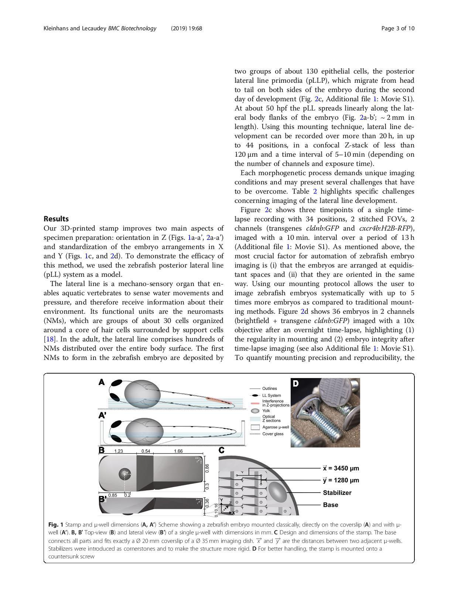
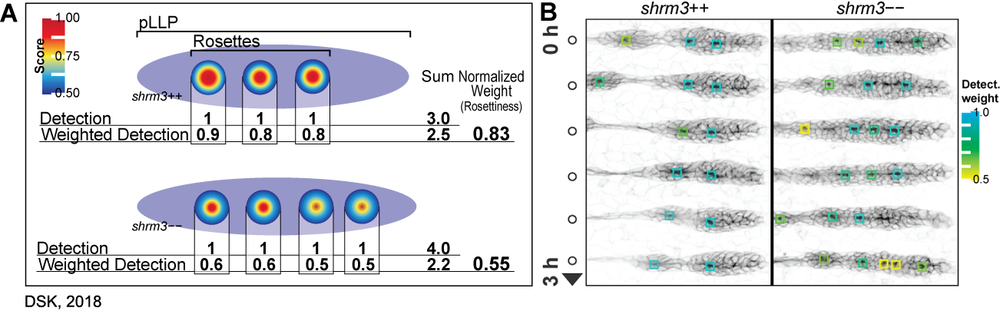
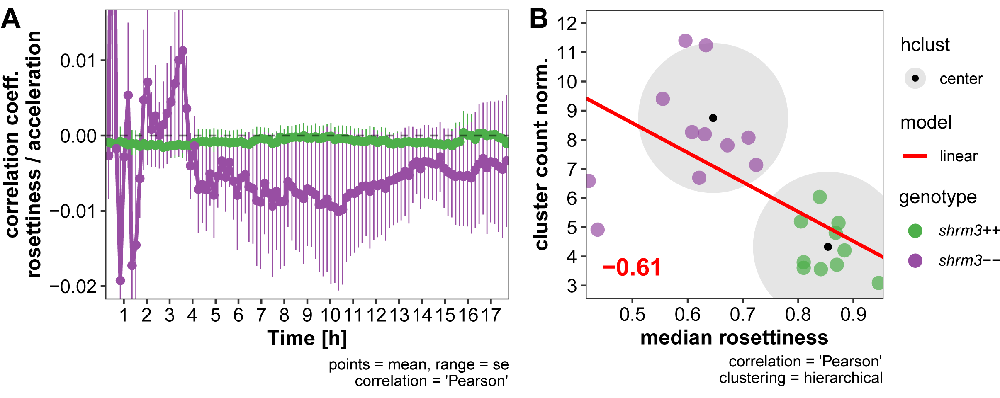

```{r, echo = F}
load("data/ac.RData")
```

# Results {#res}

## Methods

### Standardized mounting

For live microscopy zebrafish embryos are usually immersed in a 1$%$ solution of low melting-point Agarose (LMPA) solution and then oriented on an optical cover slip manually until the LMPA has solidified. This process allows to mount eight to ten embryos per dish. 

To take advantage of the high number of offspring a single zebrafish female may lay, a new sample preparation technique was designed that allows for (1) a four to five times increase in samples per dish (2) a facilitated navigation _via_ a grid-like orientation through the samples and (3) an improved spatial orientation where the embryos body axes are aligned parallel to the optical Z-sections of the confocal microscope. For details, see Materials and Methods section \@ref(mount-met).

```{r klein_2019_results, out.width = '95%', fig.keep = 'all', fig.show = 'hold'}


```

### anaLLzr2D - CC segmentation

#### Image Analysis

A custom IJ macro script was developed (section \@ref(mat-anallzr2d)) that segments individual cell clusters and the pLLP. Using ROIs as masks, the nuclei within counted with a 2-D maxima finder. To detect the right amount of nuclei however, it is necessary to evaluate the distance over which the blurring should be applied.

A typical nucleus in the PLLp is about 5 $\mu$m in diameter. To determine the right blurring value, a range of 4-6 $\mu$m in steps of 0.5 is tested. Figure \@ref(fig:maxllreg) shows a registered maximum Z projected lateral line used for ground truth evaluation.

(ref:maxllreg) Registration of 2D data.  **Cluster Segments** Registered, MaxIP data with cell cluster segments of the lyn-GFP signal laid upon the DAPI signal. **Cell Labels** Magenta dots represent the maxima found within each ROI and hence the nuclei labels.

```{r maxllreg, out.width = '90%', fig.cap = "(ref:maxllreg)", fig.scap = "Registration of 2D data"}
knitr::include_graphics("figures/materials/ground_truth/clusters/clusters.png")
```

#### Data Analysis

Comparing the segmented objects count of the Gaussian parameters with the Ground Truth gives an indication for over- resp. under-segmentation. In figure \@ref(fig:GrTratioCC) the relative numbers for each blurring parameter can be seen in percentage above or below the mean cell count of the ground truth (blue horizon). The red area represents over-segmentation, the green under-segmentation.

(ref:GrTratioCC) Relative difference of segment counts

```{r GrTratioCC, out.width = '65%', fig.height = 2.75, fig.cap = "(ref:GrTratioCC)", fig.scap = "Relative difference of segment counts"}
ggplot(NB_all_diff_mean, aes(Group, mean_diff)) +
  geom_bar(aes(fill = Group), colour = "black", stat = "identity", show.legend = FALSE) +
    geom_rect(aes(xmin = -Inf, xmax = Inf, ymin = 0, ymax = Inf), fill = "red", alpha = .05) +
      annotate(geom = "text", x = 5.5, y = 5, fontface = "bold", label = "false negative", color = "red") +
    geom_rect(aes(xmin = -Inf, xmax = Inf, ymin = -Inf, ymax = 0), fill = 'green', alpha = .025) +
      annotate(geom = "text", x = 1.5, y = -5, fontface = "bold", label = "false positive", color = "darkgreen") +
  geom_bar(aes(fill = Group), colour = "black", stat = "identity", show.legend = FALSE) +
  geom_hline(aes(yintercept = 0, linetype = "Ground Truth 100%"), colour = "blue", size = 1) +
  geom_errorbar(
    aes(fill = Group, ymin = mean_diff-(sd_diff/2), 
        ymax = mean_diff + (sd_diff/2)), width = .2, position = position_dodge(.9)) +
  labs(
    title = "N = 3, Error bars = Std./2, NB = nuclei blurring",
    caption = '',
    x = "Blurring Parameters", 
    y = "Rel. Count Diff. [%]") +
  scale_fill_brewer(palette = "Greys", direction = -1) +
  scale_linetype_manual(name = "", values = c(1)) +
  mythemeLIGHT_bottom() + 
    theme(legend.position = c(0.18, 0.22),
          legend.text = element_text(size = 11)
          )
```

\noindent To estimate the quality of nuclei detection for each parameter, the ratio of automatically detected and ground truth objects count can be calculated and compared (table \@ref(tab:nrcount)). The closer it is to 1, the better.

```{r nrcount}
knitr::kable(NB_all_CC_NR_mean, booktabs = T, caption = "Nuclei count ratio") %>%
  kable_styling(full_width = T, latex_options = "striped")
```

In summary, maximum performance is achieved at a scaled parameter of 6 $\mu$m, with a ratio of of `r NB_all_CC_NR_mean[1,"NB60"]` for the count objects and a standard deviation of `r NB_all_CC_NR_mean[2,"NB60"]`.

### anaLLzr3D - pLLP segmentation

#### Image Analysis

A custom IJ macro script was developed (section \@ref(mat-anallzr3d)) that recognizes cell boundaries via the fluorescence signal emitted by a Lyn Kinase tethered eGFP which expression is controlled by the _cxcr4b_ lateral line specific promotor [@Haas2006c]. The central IJ tool used to do this is the MorphoLibJ's[@Legland2016] _Morpholigical Segmentation_ plugin. The plugin however requires to choose for a 'segmentation threshold' that determines the quality and the quantity of segmented objects. This parameter therefore plays an essential role in the reliability of the analysis results.

##### Registration

The first module of the macro is PLLp registration in X, Y and cropping in Z. This is accomplished by an initial maximum Z projection and blurring of the image, 2D segmentation using a minimum threshold and lastly by rotating the segment through the angle formed by the long axis of the ellipsoid and the horizon (at 0$^{\circ}$). After rotation the image is cropped according to the obtained ROI. Additionally, the centers of the most constricting areas are detected via an intensity based dynamic threshold and highlighted as magenta circles in \@ref(fig:maxraw).

(ref:maxraw) Registration of 3D data. **raw** location and orientation of the raw data in XY (shown here as Z-projections). The red line indicates the angle in degrees from the horizontal midline. The blue oval indicates registration ROI as determined by the macro. **registered** pLLPs after XY transformation took place. red circles indicate rosettes as detected by the macro.

```{r maxraw, out.width = '80%', fig.cap = "(ref:maxraw)", fig.scap = "Registration of 3D data"}
knitr::include_graphics(path = "figures/materials/ground_truth/registration.png")
```

```{r imgprop, out.extra = '', fig.pos = "h"}
tab <- read.delim("tables/ground_truth/scaling_3D.txt")
knitr::kable(tab, booktabs = T, caption = "Physical image properties (scaling)", 
             align = c("r", "l"), escape = F, col.names = NULL) %>%
  kable_styling(full_width = T, latex_options = c('striped', 'hold_position'))
```

##### Image data

In figure \@ref(fig:stackmem) the fluorescence signal of the three pLLPs tested is shown in a single central cross-section in the dorso-ventral and the apico-basal axis.

(ref:stackmem) _cldnb:lyn-gfp_ fluorescence signal in a cross-section of the pLLP (Obj.: 40X APO)

```{r stackmem, out.width = '70%', fig.cap = "(ref:stackmem)"}
knitr::include_graphics("figures/materials/ground_truth/stackmem.png")
```

To compare the results between the Ground Truth segments and the segments obtained from different threshold levels graphically, for a single pLLP the Ground Truth and threshold level are shown as a composite color image in figure \@ref(fig:anallzrvols). By using a green lookup-table (LUT) for the ground truth and a magenta LUT for the threshold level[n], one can readily detect overlapping objects (white), over segmentation (magenta) and under segmentation (green).

(ref:anallzrvols) Graphical comparison of the thresholds tested. Volume renderings have been done with IJ's [VolumeViewer]("https://github.com/fiji/Volume_Viewer/releases/tag/Volume_Viewer-2.01.2")

```{r anallzrvols, out.width = '85%', fig.cap = "(ref:anallzrvols)", fig.scap = 'anaLLzr3D - Graphical comparison of tested thresholds'}
knitr::include_graphics("figures/materials/ground_truth/volumes.png")
```

\noindent 

#### Data Analysis

##### Cell Count

In figure \@ref(fig:gtratio) the relative numbers for each threshold level can be seen in percentage above or below the mean cell count of the ground truth (blue horizon). Analogous to the graphical inspection, the magenta area represents over segmentation, the green under segmentation. Additionally, table \@ref(tab:gtrcellcount) shows the absolute numbers.

(ref:gtratio) Relative difference of segment counts

```{r gtratio, out.width = '65%', fig.height = 2.75, fig.cap = "(ref:gtratio)", fig.scap = "Relative difference of segment counts"}
ggplot(all_count_diff_mean, aes(Group, mean_diff)) +
  #geom_polygon(aes(x=c(0,1,1,0),y=c(0.5,0.5,4.5,4.5)),fill="#FFFF0044",color=NA)+
  geom_bar(aes(fill = Group), colour = "black", stat = "identity", show.legend = FALSE) +
    geom_rect(aes(xmin = -Inf, xmax = Inf, ymin = 0, ymax = Inf), fill = "magenta", alpha = .025) +
      annotate(geom = "text", x = 4.5, y=5, fontface = "bold", label = "over segmentation", color = "magenta") +
    geom_rect(aes(xmin = -Inf, xmax = Inf, ymin = -Inf, ymax = 0), fill = 'green', alpha = .025) +
      annotate(geom = "text", x = 1.5, y=-5, fontface = "bold", label = "under segmentation", color = "darkgreen") +
  #scale_fill_identity(name = 'the fill', guide = 'legend',labels = c('m1', 'm2')) +
  geom_bar(aes(fill=Group), colour = "black", stat = "identity", show.legend = FALSE) +
  geom_hline(aes(yintercept = 0, linetype = "Ground Truth 100%"), colour = "blue", size = 1) +
  geom_errorbar(
    aes(fill = Group, ymin = mean_diff - (sd_diff/2),
    ymax = mean_diff + (sd_diff/2)), width = .2, position = position_dodge(.9)) +
  labs(
    title = "",
    caption = 'N = 3, Errorbars = Std./2',
    x = "Threshold levels", 
    y = "Rel. Count Diff. [%]") +
  scale_fill_brewer(palette = "Greys", direction = -1) +
  scale_linetype_manual(name = "", values = c(1)) +
  mythemeLIGHT_bottom() + 
    theme(legend.position = c(0.18, 0.3)) + 
    theme(legend.text = element_text(size = 11))
```

```{r gtrcellcount, include = F}
knitr::kable(all_count_cells, booktabs = T, caption = "Cellcount ground truth") %>%
  kable_styling(full_width = T, latex_options = c('striped', 'hold_position')) %>%
  row_spec(1, bold = T)
```

##### Apical Constriction

For a proof of concept of segmentation results and concept around measuring apical constriction index, analog to Harding(2013)[@Harding2013], 13 DMSO and 15 SU5402 treated embryos were imaged, segmented and processed. The results show a strong significant difference between DMSO und SU5402 treated embryos in both ACI~Major~ and ACI~Minor~, validating the general concept.

(ref:resacimeasure) A.C.I.\textsubscript{Major / Minor} proof of concept. **A and B** Each dot represents the average of all cells of a whole pLLP (DMSO = 1769 cells / 13 pLLPs; SU5402 = 2066 cells / 15 pLLPs).

```{r resacimeasure, out.width = '60%', fig.height = 3, fig.width = 5, fig.cap = "(ref:resacimeasure)", fig.scap = "A.C.I. Major / Minor prood of concept"}
ann_text <- 
  data.frame(
    group = c(0.6, 0.6),
    mean_ac = c(4.6, 2.5),
    lab = c('A','B'), 
    name = factor(c("ACI[Minor]", "ACI[Major]"))
    )

all %>%
  as_tibble() %>%
  select(
    Obj,
    group,
    ACIMajor,
    ACIMinor
  ) %>%
  pivot_longer(
    c(ACIMajor, ACIMinor)
  ) %>%
  group_by(Obj, group, name) %>%
  summarise(
    mean_ac = mean(value, na.rm = T)
  ) %>%
  mutate(
    name =
    case_when(
      name == 'ACIMinor' ~ 'ACI[Minor]',
      name == 'ACIMajor' ~ 'ACI[Major]'
      )
  ) %>%
  filter(
    !grepl('shr', group)
  ) %>%
  ggplot(aes(group, mean_ac)) +
    geom_boxplot(notch = T, outlier.shape = 4, outlier.size = 3, show.legend = F) +
    stat_summary(geom = "crossbar", position = position_dodge(width = .75),
                 col = 'blue', width =.4, size = 2, fatten = 0, 
                 fun.data = function(x){c(y=median(x), ymin=median(x), ymax=median(x))}) +
    geom_jitter(width = .1, height = 0, size = 2, alpha = .5, shape = 16) +
    stat_compare_means(
      aes(label = ..p.signif..),
      ref.group = 'DMSO',
      method = 'wilcox.test',
      hide.ns = F,
      size = 5) +
    labs(
      y = 'Apical Constriction Index', 
      caption = paste('Test statistic:', 'Mann-Whitney')) +
    geom_text(data = ann_text, label = c('B', 'A'), size = 6, face = 'bold') +
    facet_wrap(.~name, labeller = label_parsed, scales = 'free_y') +
    mythemeLIGHT() +
    theme(
      plot.title = element_blank(),
      strip.background = element_blank(),
      strip.text = element_text(size = rel(1.2), face = 'bold'),
      axis.title.x = element_blank(),
      axis.title.y = element_text(face = 'bold')
    )
```

##### Cell Morphology

>  _There is always a precision / recall trade-off in detection tasks, e.g., when we set a lower threshold [. . .], we can get a higher recall with a lower precision ([. . .], but meanwhile we also get more false-positives in the results)._[@Liu]

Inspecting the cell count unfortunately does not directly tell us how well the cell morphology is conserved at different threshold levels, since at higher threshold levels the cell boundaries are differently determined and eventually not even recognized as such anymore. 

\noindent The volume of a cell is a very robust morphological feature. Therefore, if its volume does not differ significantly at a given threshold level we consider its morphology to be conserved.

In figure \@ref(fig:volsecdffull) the distribution and amount of the cell volumes across the different threshold levels can be inspected _via_ the 'empirical cumulative distribution function' (ECDF). The closer the slopes are to the ground truth, the stronger they are conserved. The upper graph of figure \@ref(fig:volsecdffull) shows the full distribution, where the major differences seem to appear within the 0.4 quantile (red line). Therefore, the lower graph of figure \@ref(fig:volsecdffull) only the values within the 0.4 quantile are shown to get a more detailed impression.

(ref:volsecdffull) **upper** Cell volumes full distribution (red line = .4 Quantile) **lower** Cell volumes distribution within .4 Quantile

```{r volsecdffull, fig.height = 2.7, out.width = '90%', fig.cap = "(ref:volsecdffull)", fig.keep = 'all', fig.show = 'hold'}
ggplot(all_vol, aes(Vol..unit., colour = Group)) +
  geom_vline(aes(xintercept = quantile(Vol..unit., 0.4, na.rm=TRUE)), colour="red") +
  stat_ecdf(geom = "step", pad = FALSE, size = 1.1) +
  labs(
    title = "test", 
    x = "", 
    y = "Relative amount", 
    color = "level") +
  scale_x_continuous(limits = c(0, 750), breaks = seq(0, 1000, 200)) +
  scale_colour_brewer(palette = "Greys", direction = -1) +
  facet_grid(.~Obj, scale = "free", labeller = label_parsed) +
  mythemeLIGHT_bottom() + 
    theme(
      axis.text = element_text(size = 9),
      panel.background = element_rect(fill = "slategray3", colour = "black"),
      strip.background = element_blank(),
      strip.text = element_text(size = rel(1.2), face = 'bold'),
      legend.background = element_rect(fill = "slategray3", colour = "black"),
      legend.text = element_text(size = 9))

ggplot(all_vol, aes(Vol..unit., colour = Group)) +
  stat_ecdf(geom = "step", pad = FALSE, size = 1.1) +
  labs(
    title = "test", 
    x = "Volumes", 
    y = "Relative amount", 
    color = "level") +
  scale_x_continuous(limits = c(0, 600), breaks = seq(0, 1000, 50)) +
  scale_colour_brewer(palette = "Greys", direction = -1) +
  coord_cartesian(ylim = c(0, 0.5), xlim = c(20, 210)) +
  facet_grid(.~Obj, scale = "free", labeller = label_parsed) +
  mythemeLIGHT_bottom() + 
    theme(
      axis.text = element_text(size = 9),
      panel.background = element_rect(fill = "slategray3", colour = "black"),
      strip.background = element_blank(),
      strip.text = element_text(size = rel(1.2), face = 'bold'),
      legend.background = element_rect(fill = "slategray3", colour = "black"),
      legend.text = element_text(size = 9))
```

##### Confidence Level

To statistically check how closely related each threshold level sample distribution is compared to the ground truth, a Kolmogorov-Smirnov-Test (ks.test) was performed. The ks.test is a nonparametric test whose null hypothesis is that the both groups compared were sampled from populations with identical populations. Therefore, the closer the p-value is to 1, the more similar the tested sample distribution would be to the Ground Truth (figure \@ref(fig:kstestvol)).

\[H_{0} : F_X(x)=F_0(x)\]

(ref:kstestvol) Volumetric conservation (red line = 5$\%$ confidence threshold)

```{r kstestvol, out.extra = '', fig.pos = "h", out.width = '70%', fig.height = 1.7, fig.cap = "(ref:kstestvol)"}
ggplot(ks.test_all, aes(variable, value)) +
  geom_hline(yintercept = 0.95, colour="red") +
  geom_point(aes(fill=group, shape=group), size=5, colour="black") +
  labs(title = "", x = "PLLp", y = "p value") +
  scale_fill_brewer(palette = "Greys", direction = -1) +
  scale_y_reverse(limits = c(1, 0), breaks = seq(0, 1, 0.1)) +
  coord_flip() +
  mythemeLIGHT_bottom() + 
    theme(legend.text = element_text(size = 11))
```

\noindent In comparison to the Mann-Whitney test, the ks.test is more sensitive to detect changes in the shape of the distribution than to detect a shift of the median[@Lehman]

## Shroom3

### Phenotype description {#intro-phen}

While birth rates follow a distribution of Mendelian inheritance (after genotyping at 3 months of age), mutant adults seem to be more sensitive to mechanical stress and have a shortened lifespan (~6-9 months). In body shape, _shroom3_ mutants are not smaller or posses any other striking phenotype (figure \@ref(fig:shrmmut)C), however their gill flaps seem to be increased in size, swollen, and not exactly streamlined with the body. This is also evident by an increased frequency of gill flap beating. When looking at the pLLP at different stages (figure \@ref(fig:shrmmut)D), they exhibit the same phenotype as the MO injected embryos.

(ref:shrmmut) _shroom3_ mutant phenotype **(A-A’)** mutation strategy (A) Talen arms (black blocks) bordering a sequence within SD1 including a restriction site for NsiI (indicated back arrows and grey background) (A’) wildtype and mutant allele with 8 bp deletion **(B-B’)** Amino acid code and protein schematic with functional domains and stop codon (indicated by asterisk) **(C-C’)** Adult phenotype with closeup to gill flaps **(D)** pLLP phenotype for three different stages (columns) and different manifestations (rows) (40X WI objective). Arrows indicate epithelial rosettes. **(E)** LL phenotype at end of migration (10X air objective). Scale bars = 1 mm. MaxIPs for D-E.

```{r shrmmut, fig.cap = "(ref:shrmmut)", fig.scap = "shroom3 mutant phenotype"}
knitr::include_graphics("figures/intro/shrm_mutants.png")
```

_Shroom3_ heterozygous zebrafish show no phenotypic abnormality. When incrossed, genotyping of two to five days post fertilization (dpf) embryos results in a Mendelian distribution. However, for stock-fish that are regenerated and genotyped by finclip at about 3 months of age show only a rate of 5-10 $\%$ of _shroom3_-\-. After another 3 – 6 months those would usually decease too. Therefore, defect Shroom3 in _D.rerio_ leads to increased mortality.

### Lateral Line Morphometrics

Since in the previous study performed on _shroom3_ morphants we found a significantly reduced number of rosettes in the pLLP, a reduced number of CCs was expected to be deposited at the end of pLLP migration as well. Instead we found more CCs deposited \@ref(fig:shrmmut)E.

#### Dataset

To analyze this observation quantitatively a dataset was put together consisting of ~100 zebrafish embryos fixed at the end of pLLP migration, derived from four different parent pairs. After genotyping, this gave us 33 wildtypes, 66 heterozygous and 33 homozygous mutants for statistical tests. In addition to the number and position of deposited NMs, we also measured the area and the number of nuclei in each deposited CC.

#### Number and Position of Cell Clusters {#res-ccounts}

Although the embryos were closely staged ($\pm$ 20 min.), there are always some individual variations in the distance migrated by the pLLP of each. To compare the number of deposited CCs independently of LL length the ratio of LL length over CC count (\@ref(fig:llcounts)B) was calculated. Fixation with PFA may introduce a slight bending of the embryo and mounting introduces a different tilt for each embryo, to correct for uneven LL paths and irregularities in mounting, CC distances are calculated in Euclidean space rather than solely in dimension X.

While _shrm3++_ embryos deposit 6 $\pm$ 0.7 CCs, _shroom3_-\- embryos deposit 8 $\pm$ 0.9 CCs (\@ref(fig:llcounts)A). This difference stays true also when normalizing against length (\@ref(fig:llcounts)B).

(ref:llcounts) Cluster counts. **A** cluster count [$n$] **B** normalized to length (LL length [$mm$] / cluster count [$n$])

```{r llcounts, out.width = '60%', fig.cap = "(ref:llcounts)", fig.scap = "Cluster Counts"}
knitr::include_graphics("figures/results/01_morphometrics/ll_counts.png")
```

Even though CC position in individual _shroom3_-\- embryos seems more random, the position of the first deposited CC is mostly conserved (\@ref(fig:llpos)A), $p$ for difference in position = 0.2). Similarly, the position of the pLLP also isn’t significantly changed confirming that Shroom3 activity is not required for migration, as was already shown in _shroom3_ morphants [@Ernst2012a]. While for the remaining CCs an average lag of -50.4 $\mu$m as compared to _shroom3_++ CC positions is observed, it also seems to increase with later CC positions. For _shroom3_++ embryos CC position is mostly conserved through development, however it remains elusive if this is true for _shroom3_-\- embryos too. 
Figure \@ref(fig:llpos)A', shows the kernel density distribution for the CC position without grouping individual positions. At a binwidth of 50 $\mu$m, the distribution curves show a high and narrow density at around 350 $\mu$m, which is the average location of CC1 (\@ref(fig:llpos) 2A). For the remaining CCs the kernel distribution does, neither for _shroom3_++ nor for _shroom3_-\- embryos, reveal a precise location. In contrast, if based on CC sequential identity the mean position and standard deviation is calculated, a more explicit pattern emerges which clearly shows the increased count and average frequency (\@ref(fig:llpos) 2A). 

This shows that in the absence of Shroom3 activity, more NMs form. This is particularly surprising since the lad had previously shown that _shroom3_ knock-down leads to a defect in rosette formation and these rosettes prefigure the deposited NM.

(ref:llpos) Cell Cluster positions. **A** Exemplary _shroom3_++ and -\- embryos with CCs highlighted. CC0 marks the reference location to compare individual embryos. Scale bar = 1 mm **A'** Kernel Density Estimate without (KDE) grouping ($n$++ = 162, $n$-\- = 206) **A'\'** Dots = mean positions, bars = standard deviation ($n$max for both ++ and -\- = 26).

```{r llpos, out.width = '85%', fig.cap = "(ref:llpos)", fig.scap = "Cell Cluster Positions"}
knitr::include_graphics("figures/results/01_morphometrics/ll_positions.png")
```

#### Cell Count and Area of CCs {#res-llmorph}

The CC count and position analysis clearly shows that more CCs are deposited in _shroom3_ mutant embryos. In order to determine whether these additional clusters are comprised of as many cells as their wild-type counterparts or less, I quantified the number of cells and the size of each clusters in _shroom3_-\- embryos, the cell count per CC was determined by counting DAPI stained cells within CC segments derived from the _cldnb:lyn-gfp_ membrane signal (section \@ref(mat-GrTrDat)). Both cells per CC and area per CC are shrunk by about 6% in _shroom3_-\- embryos, while the density of cells per area remains unchanged (\@ref(fig:llclus)A). Interestingly, when comparing not individual CC cell counts but cell counts per embryo an increase of 9% is observed (\@ref(fig:llclus)B). Both the sum of CC cells and total LL cells (CC+pLLP) are significantly increased in _shroom3_-\- embryos, while the count of only pLLP cells remains unchanged. 

(ref:llclus) LL Morphometrics **A** individual CC statistics **B** Sums per embryo. (Bars = median, errorbars = 95% CI)

```{r llclus, out.width = '85%', fig.cap = "(ref:llclus)", fig.scap = "LL Morphometrics"}
knitr::include_graphics("figures/results/01_morphometrics/ll_clusters.png")
```
#### Thermodynamic Rescue {#res-tempresc}

Increasing temperature usually leads to an acceleration in thermodynamics and embryonic development, while lower temperatures slow down development [@Dettlaff1991]. Slowing down development also leads to a reduction in speed of migration and therefore to a reduction in forces that act on cells, cell-cell junctions and organ structures. 

For this experiment the hypothesis to test was that it should be possible to at least partially restore the _shroom3_++ number of CCs by giving rosettes a longer time to develop properly. Since embryos develop at different speeds, it is more challenging to exactly stage match them at end of migration. To account for this the CC count was normalized to LL length.

(ref:resctemp) Thermodynamic rescue **A** LL lengths and end of migration stage matching **B** groupwise comparison of the length normalized CC count _per_ temperature. 

```{r resctemp, out.extra = '', fig.pos = "h", out.width = '85%', fig.cap = "(ref:resctemp)", fig.scap = "Rescue: Thermodynamics"}
knitr::include_graphics("figures/results/06_rescues/temp/rescue_temp.png")
```

The question was if we could restore wildtype CC counts in _shroom3_-\- embryos when incubating at lower temperatures. Therefore, we need to compare CC counts between T25-\- and T30++ resp. p-values between the pairs T30-\- _vs_ for T30++ (the original) and T25-\- _vs_ T30++ (the actual hypothesis). Even though the CC count T25-\- cannot be completely restored (~3.2 to ~2.8 in median normalized CC count), the difference between tested pairs shrunk from 0.00000 (T30-\- _vs_ for T30++) to 0.00210 (T25-\- _vs_ T30++), which is much closer to a rejection of $H_0$. At this point, the question remains open but seems probable that at even lower temperatures the wildtype CC count could be rescues in _shroom3_-\- embryos.

```{r resctemptab, out.extra = '', fig.pos = "h"}
data <- read.delim("data/tables/tempdata.txt")
knitr::kable(data, booktabs = T, caption = 'Thermodynamic rescue dataset summary', align = c('c', 'c', 'c'), escape = F,
             col.names = c("genotype", "treatment", "LLs", "genotype", "treatment", "LLs")) %>%
  kable_styling(full_width = T) %>%
  kable_styling(font_size = 11) %>%
  add_header_above(c("shroom3++" = 3, "shroom3--" = 3), bold = T)
```

```{r resctempsignif, out.extra = '', fig.pos = "h"}
data <- read.delim("data/tables/tempsignif.txt")
knitr::kable(data, booktabs = T, caption = 'Thermodynamic rescue statistics',
             align = c('l','l','c','c','c')) %>%
  collapse_rows(columns = 1, latex_hline = "none", valign = "top") %>%
  kable_styling(full_width = T) %>%
  kable_styling(font_size = 7)
```

#### Summary

Taken together I could show that while each CC is comprised of less cells, in sum there are more cells in embryos deficient for Shroom3. Rescuing the CC count by slowing down embryonic development was only partially successful, but seems probable at even lower temperatures. For the pLLP at end of migration however, the number of cells is unaffected - which raises the question if Shroom3 has a regulatory role in Proliferation.

### Proliferation

LL morphometric analysis revealed that deposited CCs in _shroom3_-\- embryos were on average slightly smaller and had fewer cells incorporated. However, due to the additional two cell clusters deposited, the net count is ~9$\%$ increased at the end of migration. 
To test whether this is due to higher proliferative activity a dataset of time-lapse movies (12 h / $\Delta$T = 6 min.) was generated to count the number of mitoses in a _cxcr4b(BAC):H2BRFP_ transgenic background similar to previous proliferation studies in the pLLP [@Laguerre2005a; @Laguerre2009a].

#### Datasets

The live imaging dataset consists of 12 _shrm3_++ and 18 _shrm3_-\- embryos with about 75 timepoints for each pLLP and 150 the cell clusters. For counting, tracks were created for each proliferative cell on MaxIPs (section \@ref(prolif)). Figure \@ref(fig:prolpllp)A shows a _shroom3_++ and a _shroom3_-\- LL after 12 h of imaging where each mitotic track is individually colored and overlaid to the image data. 

To support and validate this data two more datasets from fixed embryos were generated, one with a EdU (N = 3, n++ = 26, n-\- = 17) and one with a phospho-Histone marker (N = 3, n++ = 22, n-\- = 29).

#### Lateral Line Mitoses {#res-prolpllp}

Tracking mitoses in the pLLP does not reveal any difference in proliferation from start (~28 hpf) till about mid of migration 12 hours later (\@ref(fig:prolpllp)B). For confirmation, this finding was also validated _via_ two more additional methods. During the cell cycle genetic material is replicated in S-phase, while in metaphase of mitosis histones are found to be heavily phosphorylated [@Hans2001]. With an 5-Ethynyl-2'-deoxyuridine (EdU) assay [@Fischer], cells in S-phase can be detected (\@ref(fig:prolpllp)B'). Using a specific phospho-Histone (p-Hist.) antibody cells in meta-phase can be detected. When comparing the 
EdU index (EdU positive cells over total pLLP cell number) or the mitotic index (p-Hist. positive cells over total pLLP cell number) I could confirm that there is no difference in proliferation in the migrating pLLP. Still, at end of migration the LL system in _shroom3_-\- embryos does incorporate 9$\%$ more cells (figure \@ref(fig:llclus)).

(ref:prolpllp) pLLP proliferation **A** Tracks of Mitosis. (Image data) Last timepoint of Z-projected time-lapse movie. (Labels) each dots marks a mitotic events. Each color represents one mitosis. Each connection between two dots represents 6 min. **B-B'\'** Mitoses in the pLLP. (B) Count of Mitoses through time (mean$\pm$sd) (B') Proliferation Index at 36 hpf for EdU and phospho Histone labeled pLLPs (B'') Examples of EdU staining (scale bar = 100 $\mu$m) **C** Mitoses in CCs. B' and C, the colored bar indicated the median, bars indicate the 95% CI. 

```{r prolpllp, out.width = '85%', fig.cap="(ref:prolpllp)", fig.scap = "pLLP proliferation"}

```

Since individual _shroom3_-\- CCs are smaller, we wondered if there could be compensation mechanisms activated that increases proliferation to restore wildtype CC size once they are deposited. To verify this, CC mitoses were tracked on the same data as before. Other than the pLLP, which can be observed throughout the time-lapse, CCs only begin to _exist_ when they are deposited. To normalize for individual CC lifetimes, the number of mitoses per CC is divided by the duration of the total time-lapse minus the time span to when it first appeared. 

$\frac{mitoses\ per\ CC\ [n]}{total\ time- time\ of\ deposition\ [T]}$

This clearly shows that the additional cells in _shroom3_-\- embryos are derived from CC proliferation, rather than pLLP proliferation (\@ref(fig:prolpllp)C).

#### Summary

These results show that the additional cells at end of migration observed in the LL analysis do not stem from an increase in proliferation in the pLLP, but instead from increased proliferation after CCs are deposited.

### Rosette Formation and Cluster Deposition

Having shown that the additional CC deposition in _shroom3_-\- embryos is not caused by an over-proliferation in the migrating pLLP, the next step was to have a closer look at the dynamics of rosette formation, in relation to pLLP morphometrics and CC deposition. To test dependencies between different observations and developmental dynamics, variables can be correlated. To do this and to have a coherent dataset to work with, the data of three different analyses on a single set of image data were joined.

**First**, to get to know the exact timing of CC deposition, a manual tracking tool [@Meijering2012] was used (figure \@ref(fig:rdt), tracking). **Second**, to deduce pLLP morphometrics an IJ macro was developed (anaLLzr2DT, section \@ref(mat-anallzr2dt)) for spatiotemporal registration of the pLLP and to yield information about its speed, area, roundness, etc. (\@ref(fig:rdt), Registration). **Third**, to detect rosettes and quantify their weights, a CNN [@Falk2019] was used on the registered pLLP output from the before mentioned IJ macro (section \@ref(CNN); figure \@ref(fig:rdt) - Detection). 
Finally, all three datasets were joined by embryo id and timepoint.

#### Dataset

The image data set analyzed consists of 20 time-lapse movies (11 _shroom3_-\-, 9 _shroom3_++). Each time-lapse has a duration of ~20 h (~8 min. interval)^[for further details about dataset acquisition see section \@(refdetect-data)], summing up to ~1650 _shroom3_-\-, and ~1350 _shroom3_++ timepoints.

(ref:rdt) Rosette Formation Joined Datasets. **Tracking** pLLP is marked as no.1. The rest of the CCs is numbered sequentially as they appear. **Registration** The black outline marks the region of interest (ROI) that is the pLLP as it is detected by the anaLLzr2DT. The red line highlights the pLLPs leading edge. **Detection** Each square highlights a detected rosette by the CNN, colors represent rosette weights.

```{r rdt, out.width = '85%', fig.cap = "(ref:rdt)", fig.scap = "Rosette Formation Joined Datasets"}
knitr::include_graphics("figures/results/03_rosettes/RDT-01.png")
```

#### Cluster Deposition

Figure \@ref(fig:rdtdepo)A shows a montage of a _shroom3_++ and a _shroom3_-\- scenario in cluster deposition (3.5 h / ~20 min. interval). For _shroom3_++ the rosette structure seems tight and two depositions occur in a regular manner. In the _shroom3_-\- on the other hand, rosette structure are more fragile with less pronounced rosette centers and four observed depositions. Interestingly, based on the _cldnb:lyn-gfp_ signal the area of constriction seems to be less radially organized but more oriented towards the horizontal midline. Furthermore, the trailing rosettes are significantly smaller and do not seem to separate as clean from the migrating primordium. In addition, for L3 it first seems like two CCs could be deposited, until they merge again to a single CC about 1.5 h later.

(ref:rdtdepo) Cluster Deposition. **A** _shroom3_++ and _shroom3_-\- LL development in comparison. L1 - L4 are deposited CCs. Arrows indicate deposition events. Dotted lines are tracks of rosette to CC transition. **B** Statistics of deposited cluster counts **C** Change of CC position through time. Each line represents the locally weighted scatterplot smoothing (LOESS) of all CCn positions observed. 

```{r rdtdepo, fig.cap = "(ref:rdtdepo)", fig.scap = "Cluster Deposition"}

```

On average, as it was shown in section \@ref(res-ccounts), there’s a significant increase in clusters deposited (\@ref(fig:rdtdepo)B). Also, neither _shroom3_++ nor _shroom3_-\- CCs drastically change their position once they are deposited.

#### Registration

As the pLLP migrates it moves through space and time. To measure velocity and acceleration, one needs to detect where in space (the image in X and Y) the pLLP is located at multiple timepoints. When duplicating the pLLP based on a detection ROI from the whole image, the pLLP is registered in time and space (figure \@ref(fig:rdtreg)A).

As shown in figure \@ref(fig:rdtreg)B-B’ neither speed nor acceleration drastically differ throughout the complete course of migration. Speed drops from an initial ~75 $\mu$m/h to about ~30 $\mu$m/h for both _shroom3_++ and _shroom3_-\- 17 h later (figure 3.3 A). Similarly, while there is a positive acceleration of almost ~2 $\mu$m/h peaking after ~2-3 hours, the remaining two peaks progressively get smaller (\@ref(fig:rdtreg)A’). 
While for the area no difference can be detected (\@ref(fig:rdtreg)C), interestingly the roundness is on average significantly reduced in _shroom3_-\- pLLPs (\@ref(fig:rdtreg)D). This is also evident from the montage in figure \@ref(fig:rdtdepo)A. 

(ref:rdtreg) pLLP time-resolved morphometrics. **A** Registration procedure **B-B’** Leading edge (l.e.) speed and acceleration in $\mu$m/h, displayed as LOESS curves with at a span of 0.5 **C** Area in square $\mu$m and **D** Roundness displayed as mean±se (standard error).

```{r rdtreg, fig.cap = "(ref:rdtreg)", fig.scap = "pLLP time-resolved morphometrics"}
knitr::include_graphics("figures/results/03_rosettes/registration.png")
```

#### Rosette Detection {#res-rdtdet}

To quantify the maturity of rosettes within the pLLP a CNN was used which allows to detect objects within images (Region Proposal based CNN). Inherent to object detection and classification by a neural network is that the network not only tells us if an object was _detected_ (of numbers room $\mathbb{N_0}$), but also how secure it is - the probability - that the object detected is the right one (of numbers room $x\in[0, 1]\subset\mathbb{R}$) - the _weighted detection_. Furthermore, the weighted detection was capped a score $\leq$ 0.5, since below 0.5 the probability would be to insecure. In our case the network was trained to detect wildtype rosettes, while also presenting pLLPs of embryos treated with a compound that inhibits rosette formation (SU5402) to refine learning. Therefore, if the network detected 1 rosette with a probability of 0.99, it is very likely that this is a wildtype rosette. However, at different developmental stages and genetic background (e.g. mutants with impaired rosette formation) the pLLP exhibits a different count of rosettes. Therefore it would be wrong to compare just the sum of _detections_ or _weighted detections_ per pLLP, but it is necessary to normalize for the different count of rosettes to get a global figure of pLLP rosettization - the _rosettiness_.

\[\textbf{Rosettiness} = \frac{\sum_{} \textrm{Weighted Detections}}{\sum_{} \textrm{Detections}} = \textrm{Normalized Weight}\]

(ref:rdtdetmdl) Quantification of rosettes. **A** Model of _detection_ and _weighted detection_ in _shroom3_++ and _shroom3_-\- embryos **B** Actual detection in pLLPs of _shroom3_++ and _shroom3_-\- embryos at six different timepoints and highlighted detection weight.

```{r rdtdetmdl, out.extra = '', fig.pos = "h", fig.cap = "(ref:rdtdetmdl)", fig.scap = "Quantification of rosettes"}

```
The kymographs^[a kymograph is a tool to record position over time] in figure \@ref(fig:rdtdet)A-A’ were generated from pLLPs that were previously registered with the anaLLzr2DT IJ macro (section \ref(mat-anallzr2dt)). After registration, a line was drawn along the horizontal midline (\@ref(fig:rdtreg)A). Finally, recorded kymographs were turned to false color (blue = low intensity, red = high intensity) for better visual interpretation. In _shroom3_++ the higher intensities are highly concentrated to two to three distinct regions within the migrating pLLP, while in the _shroom3_-\- pLLP the higher intensities are more fragmented and overall reduced. To analyze this statistically, all pLLPs were quantified in terms of rosette count and average rosette weight or ‘rosettiness’ (section \@ref(CNN)).

The numbers reveal two very interesting things. First, the medians show that rosette count (\@ref(fig:rdtreg)B’) is only reduced for the first six hours, while rosettiness is reduced almost throughout the entire 20 hours. Second, while for rosette counts two to six indeed half or more of the pLLPs are _shroom3_++, for counts below two and above six there are more _shroom3_-\- pLLPs (\@ref(fig:rdtreg)B). Furthermore figure \@(fig:rdtdet)C shows that at a rosettiness of ~0.7 there are about as many _shroom3_++ as there are _shroom3_-\- pLLPs, marking this point as a threshold were pLLPs above are more like likely to be _shroom3_++ and below more likely to be _shroom3_-\-. At ~0.1 rosettiness there are almost only _shroom3_-\- pLLPs, while at ~0.9 rosettiness there are almost only _shroom3_++ pLLPs. 
In addition, the data distributions attached to the sides (\@ref(fig:rdtreg)B’’ and C’’) reveal that for the rosettiness the KDE did not actually shift to a lower number, but rather flattened and variance is increased.

(ref:rdtdet) Rosette counts and weights. **A-A’** pLLP kymographs. Length = 100 $\mu$m. (A) shows the signal and line drawn. (A') shows the signal through time **B-B’’ and C-C’’** Different graphic representation of rosette count data. (B) Filled histogram (B’) Median$\pm$standard deviation (B’’) KDE.

```{r rdtdet, fig.cap = "(ref:rdtdet)", fig.scap = "Rosette counts and weights"}
knitr::include_graphics("figures/results/03_rosettes/detection.png")
```

#### Interdependences

In the previous sections I have shown that in embryos deficient for Shroom3 more NMs are deposited and that this is not caused by an overproliferation in the pLLP. In this section my goal was to collect detailed information about LL morphometrics and rosette formation to find out what is causing the additional CCs to be deposited.

To do this I combined the results of three different analyses to be able to detect inter-dependencies between variables. For my questioning the most interesting variable to find dependencies with is rosettiness. As mentioned in section \@ref(intro-phen) when we had a first closer look at the pLLP phenotype we found that many of the clearly as _shroom3_-\- identified embyros still were reminiscent of the _shroom3_++ phenotype. However, what surprised us the most (due to to previous results indicating an important role during rosette assembly for Shroom3), was that a fraction had significantly more CCs deposited. To test the interdependence between rosettiness and CCs deposited quantitatively we set up two hypotheses.

First, when we had a closer look at timelapse movies of the migrating pLLP at a high temporal resolution we had the impression that while in _shroom3_++ embryos the pLLP stalled for a moment during CC deposition, this was not the case in _shroom3_-\- embryos. Therefore the hypothesis to test (figure \@ref(fig:rdtcorr)A) was that higher speeds lead to a lower degree of rosettiness and _vice versa_. Unfortunately the correlation coefficient and model indicate a rather low interdependence. However, both _shroom3_++ and _shroom3_-\- also showed a high timely dependence in rosettiness and acceleration (\@ref(fig:rdtdet)C' and \@ref(fig:rdtreg)B).

Second, since we know Shroom3 plays a role in rosette assembly and that embryos deficient for Shroom3 have on average more CCs deposited, we wanted to test if there is a direct link between the two and have statistical certainty. Therefore, the hypothesis to test for figure \@ref(fig:rdtcorr)B was if lower rosettiness leads to a higher number of CCs deposited and _vice versa_. Since here the end of migration cluster count is one-dimensional (one number per embryo), we had to correlate it to a _per embryos_ summary statistic rosettiness. Here the correlation coefficient is rather high, the interdependence seems to be true. Additionally, the clusters determined are nicely separated from each other and the _shroom3_++ and _shroom3_-\- pLLPs seem to form two independent groups. 

(ref:rdtcorr) Developmental interdependencies. **A** Pearson correlation coefficient between rosettiness and speed of migration through time **B** Single dots in the scatterplots in represent the variables scatter in $x$ and $y$, the red line shows a linear model through the point cloud, red digits indicate the correlation coefficient. Black spots with grey circles indicate the centers for clusters calculated on these two sets of data. Clustering was performed hierarchical.

```{r rdtcorr, fig.cap = "(ref:rdtcorr)", fig.scap = "Developmental interdependencies"}

```

#### Shroom3 Rescue {#res-shrmresc}

To find out if the phenotype of increased CCs deposited can be rescued by ectopic expression of Shroom3, a transgene was used where _shroom3v1_ is fused to RFP and expressed under control of heatshock promotor (HSP70). While this construct was used to rescue rosette number in Shroom3 morphants before [@Ernst2012a] (section \@ref(intro-shroom)), here it was used to test if CC count and rosettiness can be restored. Furthermore, by rescuing the _shroom3_-\- phenotype with Shroom3 itself it is possible to control for LL unspecific effects introduced by the mutation that might have happened earlier in development. 

To do a comparable analysis like in the inter-dependencies analysis, embryos were imaged two times. First at around 36 hpf, and a second time at end of migration after about 24 hours of incubation at 28.5$^\circ$. This way it is possible to test for correlations between rosettiness earlier in development and CC count at end of migration. Unlike in the first experiment, here rosettiness is not the median of multiple timepoints, but the measurement from a single timepoint. However, as shown in figure \@ref(fig:rdtdet), rosettiness is most affected at the beginning of migration. Furthermore, I had difficulties identifying embryos carrying the transgene by PCR, which is why they were partially identified visually _via_ expression od RFP. In addition _shroom_++ and _shroom_+\- embyos were pooled to increase statistical power.

(ref:rescshrm) _shroom3_ ectopic expression. **A** Normalized cluster count and statistics **B** Rosettiness and statistics **C** Correlations between beginning of migration rosettiness and end of migration cluster count

```{r rescshrm, fig.cap = "(ref:rescshrm)", fig.scap = "Rescue: shroom3 ectopic expression"}

```

```{r rescshrmtab, out.extra = '', fig.pos = "h"}
data <- read.delim("data/tables/hsdata.txt")
knitr::kable(data, booktabs=T, caption = 'Heatshock rescue dataset summary', escape = F, align=c('r', 'c', 'c', 'c', 'c')) %>%
  kable_styling(full_width = T) %>%
  kable_styling(font_size = 11) %>%
  collapse_rows(columns = 1, latex_hline = "none", valign = "top") %>%
  add_header_above(c("id labels" = 3, "metrics" = 2), bold=T)
```

```{r rescshrmsignif, out.extra = '', fig.pos = "h"}
data <- read.delim("data/tables/hssignif_clus.txt")
knitr::kable(data, booktabs=T, caption = 'Heatshock statistics',
             col.names = c("group1", "group2", "p", "adj.p", "level", "p", "adj.p", "level"),
             align = c('l','l','c','c','c','c','c','c')) %>%
  kable_styling(full_width = T) %>%
  kable_styling(font_size = 7) %>%
  collapse_rows(columns = 1, latex_hline = "none", valign = "top") %>%
  column_spec(1, width = "2cm") %>%
  column_spec(2, width = "2cm") %>%
  add_header_above(c("id labels" = 2, "cluster counts" = 3, "rosettiness" = 3), bold = T)
```

While CC count is restored in heat-shocked, _shroom3_-\- transgene carrying embryos, it also seems to reduce the number of CCs deposited in _shroom3_++ (\@ref(fig:rescshrm)A). For the rosettiness however, we still get a significant difference (\@ref(fig:rescshrm)B). 

Correlation between CC count and rosettiness (figure \@ref(fig:rescshrm)C) for heat-shocked embryos without _hs:shr3v1_ transgene (_hs:shr3v1_00, left panel) is about the same as for embryos non heat-shocked (_hs:shr3v1_??, second panel from right), but inverse to heat-shocked embryos with transgene (_hs:shr3v1_ +?, second panel from left). Importantly, correlation is lost between heat-shocked _shroom3_-\- embryos with transgene and non heat-shocked _shroom3_+? embryos (right panel). Table 3 summarizes the number of datapoints.

#### Mechanic Rescue {#res-rockresc}

It is very well known that Rho kinases are necessary for mechanic force transmission in various developmental processes [@Ridley2015; @Das2014a; @Harding2014b; @Plageman2011; @Wang2011]. Since Rock is also thought to be a key player of the Shroom force mediation pathway in the pLLP, the idea for a mechanic rescue was to titrate different concentrations of a Rock inhibitor (Rockout, section \@ref(mat-chem)) and a non-muscle myosin II (NMII) activator (Calyculin, section \@ref(mat-chem)) to see if this way can confirm the correlation between rosettiness and CC number in an independent manner.

##### Rock inhibition

Rock2a, upon interaction with Shroom3, phosphorylates NMII which is necessary for contraction of the actin network and apical constriction (section \@ref{intro-shroom}). Here we wanted to mimic the _shroom3_-\- phenotype in _shroom3_++ embryos.

Embryos were incubated at distinct (figure \@ref(fig:rescrock) legend) concentrations from 24 hpf till end of migration (about 60 hpf). At this stage embryos incubated at higher concentrations displayed a significant reduction in overall body length (\@ref(fig:rescrock)A'). Therefore, to see if there is a specific effect on length, LL length was normalized to body length.

(ref:rescrock) Titration of Rock inhibitor. **A** LL lengths are reduced with increased concentrations of Rock inhibitor and **B** groupwise comparison of the length normalized cluster count per concentration of Fgf inhibitor.

```{r rescrock, out.extra = '', fig.pos = "h", fig.cap = "(ref:rescrock)", fig.scap = "Rescue: Titration of Rock inhibitor"}
knitr::include_graphics("figures/results/06_rescues/rockout/rescue_rockout.png")
```

Rockout treatment at 10 $\mu$M does not lead to a significant reduction in LL length but does significantly increase the number of CCs deposited, confirming the current hypothesis that Shroom3 acts though Rock.\newline

```{r rescrocktab, out.extra = '', fig.pos = "h"}
data <- read.delim("data/tables/rkoutdata.txt")
knitr::kable(data, booktabs=T, caption = 'Rockout rescue dataset summary', align=c('r', 'c', 'l'), escape = F,
             col.names = c("genotype", "conc. ($\\mu$M)", "LLs")) %>%
  kable_styling(full_width = T) %>%
  kable_styling(font_size = 11)  %>%
  footnote(general = "concentrations in 0.1% DMSO")
```

##### NMII activation

Downstream of Shroom3 NMII, as a motor protein, is necessary for contraction of the actin network and apical constriction (section \@ref{intro-shroom}). The idea for this experiment was to rescue the _shroom3_-\- phenotype by over-activation of NMII. Unfortunately, even when incubation at 100 nM (the maximum solubility), no significant differences can be detected.\newline

(ref:resccal) Calyculin treatment. **A** LL lengths and **B** groupwise comparison of the length normalized cluster count.

```{r resccal, out.extra = '', fig.pos = "h", out.width = '85%', fig.cap = "(ref:resccal)", fig.scap = "Calyculin treatment"}
knitr::include_graphics("figures/results/06_rescues/caliculyn/rescue_cali.png")
```

```{r resccaltab, out.extra = '', fig.pos = "h"}
data <- read.delim("data/tables/caldata.txt")
knitr::kable(data, booktabs=T, caption = 'Calyculin rescue dataset summary', align=c('c', 'c', 'c'), escape=F,
             col.names = c("genotype", "conc. (nM)", "LLs", "genotype", "conc. (nM)", "LLs")) %>%
  kable_styling(full_width = T) %>%
  kable_styling(font_size = 11) %>%
  footnote(general = "concentrations in 0.1% DMSO")
```

#### Summary

I could (**1**) reproduce the results of more deposited CCs on live data as well, gaining more insight in the deposition process which shows smaller and more fragmented CCs and a more chaotic deposition process overall (**2**) show that neither speed nor acceleration are significantly different. Also the area of the pLLP is not affected, but roundness, confirming our impression that the pLLP in _shroom3_-\- embryos is more elongated (**3**) show that while the integer number of rosettes in the pLLP is only significantly increased during the first 6-8 hours of migration, the overall _rosettiness_ (rosette integrity per PLLP) is significantly reduced over the whole path of migration.

Rosettiness is strongly correlated to the final number of CCs deposited (\@ref(fig:rdtcorr)B) which is also evidenced by rescue of correlation between rosettiness at the beginning of migration and CC count at the end of migration (\@ref(fig:rescshrm)C), concluding that rosettiness is the key parameter for the future outcome of CC pattern. Still, the question is what determines rosette weight. Although acceleration and rosettiness are correlated only weakly, they are significantly stronger correlated in _shroom3_-\- than they are in _shroom3_++ embryos throughout time (\@ref(fig:rdtcorr)A). This finding is also confirmed by an experiment where the CC count of _shroom3_-\- can be rescued when incubated at lower temperature (section \@ref(res-tempresc)). In conclusion these results lead to the conclusion that _shroom3_-\- rosettes are destabilized with increasing thermodynamics.

Finally and importantly I found a high correlation between CCs deposited at end of migration and the median rosettiness throughout pLLP migration, which clearly demonstrates a direct link between rosette integrity and numbers of CCs deposited. Interestingly however not as previously, and intuitively, assumed. Here, Shroom3 is important not to strengthen rosette integrity in order to have CCs of the right size deposited.

### Apical Constriction

In the previous analysis I have shown a direct relationship between rosette integrity and CCs deposited, where lower rosette integrity leads to a fragmented rosettes and therefore to an increase in CC deposition frequency.

To preserve rosette integrity and for proper CC maturation cells need to apically constrict. To gain further insight into Shroom3s contribution to apical constriction, it is appropriate to have a closer look at rosette conformation on a cellular scale. To do so, first a set of high spatial resolution, volumetric image data was generated (XY = 0.164 $\mu$m / pixel; Z = 0.4 $\mu$m) that allowed for...

1. a more rigorous inspection of morphological differences, and
2. automated and unbiased single cell 3D reconstruction (\@ref(ACI-singlecell)) using a newly developed IJ macro (section \@ref(mat-anallzr3d)). Secondly, to investigate the contribution of various single cell morphometrics to rosette formation an app was developed^[LLMapR - https://dskleinhans.shinyapps.io/LLmapR/] that allows for a convenient handling of large amounts of retrieved data.

(ref:acdata) High resolution, volumetric image data. Upper row shows the fluorescence signal at the membranes. Lower row shows the 3D reconstructed cells. Columns show the same pLLP from different angles.

```{r acdata,, fig.cap = "(ref:acdata)", out.extra = '', fig.pos = "h", fig.scap = "High resolution, volumetric image data"}
knitr::include_graphics("figures/results/04_constriction/reconstriction_data.png")
```

Inhibition of FGFR1 _via_ drug treatment^[Drug name = SU-5402 (section \@ref(mat-chem))] results in a concentration dependent loss of morphogenesis and rosette assembly in the pLLP [@Durdu2014a; @Harding2012; @Lecaudey2008a]. As a proof of principle and to validate previous studies, data of drug treated embryos (20 $\mu$M) and appropriate DMSO (0.1$\%$ DMSO / E3^[‘Embryo Medium 3’, section \@ref(mat-buff)]) controls were included.

#### Dataset

The dataset generated consists of three pLLP stages (\@ref(fig:acstages)), four groups (DMSO, SU5402, _shrm3_++ and _shroom3_-\-), 267 pLLPs and 33.163 single cells.\newline

(ref:acstages) Scheme showing a part of the posterior part of a zebrafish embryo and recorded developmental stages for 3D reconstruction

```{r acstages, out.width = '60%', out.extra = '', fig.pos = "h", fig.cap = "(ref:acstages)", fig.scap = "Recorded developmental stages for 3D reconstruction"}

```

```{r acdatatab, out.extra = '', fig.pos = "h"}
acdata <- read.delim("data/tables/acdata.txt")
knitr::kable(acdata, booktabs=T, align=c('l', 'l', 'c', 'c', 'c'), escape = F, 
             caption = 'Apical Constriction dataset summary') %>%
  kable_styling(full_width = T) %>%
  kable_styling(font_size = 11) %>%
  add_header_above(c("id labels" = 2, "metrics" = 3), bold=T) %>%
  collapse_rows(columns = 1, latex_hline = "none", valign = "top") %>%
  footnote(general = "ratio = cells/pLLPs")
```

Use the sample data in the [LLMapR](https://dskleinhans.shinyapps.io/LLmapR/) web-app to explore the dataset.

#### Cell Shape and Arrangement

Figure \@ref(fig:acshape)B’ illustrates the three developmental stages used for this analysis. For _shroom3_++ pLLPs two (\@ref(fig:acshape)A, 32 hpf) to four (\@ref(fig:acshape)A, 40 hpf) areas of constricting regions can be observed (XZ pane), in _shroom3_-\- its three (\@ref(fig:acshape)A, 36 hpf) to seven (\@ref(fig:acshape)A, 40 hpf), confirming the results of rosette detection (\@ref(res-rdtdet)). While at 32 and 36 hpf the spread of those regions (indicated by bars in \@ref(fig:acshape), XZ panes) is wider in _shroom3_-\-, at 40 hpf they are smaller but also increased in number. When looking at the central rosette along the width ((indicated by arrows in \@ref(fig:acshape)), YZ panes), it seems like there is no considerable difference between _shroom3_++ and _shroom3_-\- rosettes. In SU5402 treated embryos, neither in XZ nor in YZ constriction can be observed and the cells seem to be mostly columnar in shape. In addition, while constriction seems isotropic in the _shroom3_++ rosette center, constriction in the _shroom3_-\- rosette center cells appears an-isotropic.

(ref:acshape) Apical Constriction in 3D. **Stages are in columns**, the **groups are in rows**. Each panel shows a MaxIP (top left), and orthogonal views along the length (XZ, bottom left) and the width (YZ, right). Arrow annotations in YZ panels indicate points of constriction. Bar annotations in XZ indicate the spread of region of constriction.

```{r acshape, out.extra = '', fig.pos = "h", fig.cap = "(ref:acshape)", fig.scap = "Apical Constriction in 3D"}

```

#### Single Cell Metrics

To quantify AC in width and length and to gain a more objective view on cell geometry, apical constriction and other metrics such as height were quantified .To get a hold on AC an-isotropy we measured the length of the minor and major axis of a fit ellipsoid (as described in section \ref(ACI-pol) and illustrated in figure \@ref(fig:acaci)A). If AC was an-isotropic and more cells are oriented towards the horizontal midline instead of being radially oriented, this could be shown by degrees of divergence (degrees $\measuredangle$) from the horizontal midline (\@ref(fig:acaci)A’).
For angle measurements, all angles are normalized to a 90$^\circ$ range, where 0$^\circ$ is along the horizontal midline. 

When comparing the ratio of cells in intervals of 15$^\circ$ along a range of 90$^\circ$ it can be shown that there are more _shroom3_-\- than _shroom3_++ cells within the 0-15$^\circ$ interval through all three stages (\@ref(fig:acstages)). Even more, it shows that there are more _shroom3_++ than _shroom3_-\- cells within the remaining intervals – confirming the model of constriction an-isotropy.

While _reduction_ in ACI\textsubscript{Major} is stronger than the ACI\textsubscript{Minor} in shroom3-\- cells (\@ref(fig:acaci)C-C’), both are significantly reduced throughout time – again confirming the increase in constriction an-isotropy. For all three timepoints the ACI for SU5402 treated embryos is not only the smallest, but also stays at the same level (~2 in the ACI\textsubscript{Major}, ~3.4 in the ACI\textsubscript{Minor}), therefore it can be seen as a lower threshold. Interestingly, the ACIs for DMSO, _shroom3_++ and _shroom3_-\- are progressively converging this threshold from earlier to later stages.

(ref:acaci) Apical Constriction metrics. **A-A’** Measurements. (A) Oval (black outline) represents the fit ellipse. Red arrows represent major and minor axes which are representative for A-P and D-V respectively (A’) Angle measurements and intervals **B** Cellular orientation as bar chart. p-value levels (wilcox-test) are indicated as stars. **C-C’** Apical Constriction measurements. Colored bars represent the median. Errorbars indicate 95% CI.

```{r acaci, fig.cap = "(ref:acaci)", fig.scap = "3D metrics and pLLP maps"}
knitr::include_graphics("figures/results/04_constriction/Figure_5-2.png")
```

#### Summary

Here I could show that while AC is generally impaired in _shroom3_-\- embryos, there is an an-isotropy where the reduction in AC is stronger in the 

### Haircell Specification {#res-hc}

In the analyses presented so far I have shown that embryos deficient for Shroom3 deposit more CCs, that this is caused by a fragmentation of rosettes (not by overproliferation) and that AC, which is important for CC maturation, is only partially diminished (more in A-P than in D-V axis).

As described in section \@ref(intro-morph), a cells shape has direct impact on its ability to perceive and react to external cues. Here we were interested if the reduction in AC (change in cell shape, section \@ref(ACI-pol)) and overall smaller CCs (but not change in density, section \@ref(res-llmorph)) , two mechanical features, had an impact on HC specification and therefore if the LLs function as a sensory system would still be intact. Atoh1a (section \@ref(intro-atoh), a TF that gives cells the potential to become sensory HCs), in the pLLP is locally expressed between leader and follower cells and is finally restricted to a single center cell _via_ lateral inhibition (section \@ref(intro-notch)). Since till today it was not shown why the center cell becomes the HC - here we wanted our hypothesis was that rosette assembly (radial organization) resp. AC could play a role.

First, to check if _atoh1a_ was still expressed in _shroom3_-\- cells and if there were further implications in feedback loops with Notch signaling, an _In Situ Hybridization_ (ISH, section \@ref(ISH-met)) experiment was conducted (probes in section \@ref(mat-probes)). For 36 and 40 hpf the count of _atoh1a_ and _deltaD_ expressing cells (\@ref(fig:hcish)) seemed to be increased. Furthermore, especially at 40 hpf, the signal seems to be a lot more fragmented and fuzzier. 

(ref:hcish) Expression of deltaD and atoh1a in the pLLP. Recorded in greyscale at brightfield at 20X Magnification. Images show background subtracted and de-noised EDFs of original Z-stack data.

```{r hcish, out.width = '85%', fig.cap = "(ref:hcish)", fig.scap = "Expression of deltaD and atoh1a in the pLLP"}
knitr::include_graphics("figures/results/05_atoh/hc_ish.png")
```

Traditional ISH allows for detection of RNA transcripts on a whole embryo scale _via_ a hybridizing anti-sense probe. However, since embryos are fixed, it only allows to analyze single time points. Furthermore, since images are taken in brightfield, quantification of signal intensity is difficult.

To get access to developmental dynamics we made use of an additional, besides _cldnb:lyn-gfp_, transgenic construct where tdTomato^[Short ‚Tom‘] [@Shaner2004] is expressed under direct control of the _atoh1a_ promotor. By simultaneous observation of both fluorophores in a time-lapse setup (\@ref(fig:hctl)B), the strategy was to follow up the dynamics of tdTomato to quantify the expression of _atoh1a_ in cell count and intensity of expression. 

#### Dataset

For each group, _shroom3_++ and _shroom3_-\-, and timepoint the dataset was split into pLLP and CC (table \@ref(tab:hcdatatab)). Each time-lapse has a duration of 18-20 hours, consists of about 54 timepoints and two channels (488 & 561 nm).\newline

```{r hcdatatab, out.extra = '', fig.pos = "h"}
hcdata <- read.delim("data/tables/hcdata.txt")
knitr::kable(hcdata, booktabs=T, align=c('l', 'l', 'c', 'c', 'c'), escape = F,
             caption = 'Hair-cell specification dataset summary',
             col.names = c("genotype", "sub-structure", "embryos", "timepoints", "per 3h")) %>%
  kable_styling(full_width = T) %>%
  kable_styling(font_size = 11) %>%
  add_header_above(c("id labels" = 2, "metrics" = 3), bold = T)
```

#### Atoh1a in the LL

While in both _shroom3_++ and _shroom3_-\- tdTomato signal intensities are rising as soon as CCs are deposited (figure \@ref(fig:hctl)A), in _shroom3_-\- pLLPs intensities are on the rise already in the first four hours of migration. Comparing signal intensities in deposited CCs for both, _shroom3_++ and _shroom3_-\- show a similar pattern of decreasing tdTomato signal intensity with progressive CC depositions. Similarly, when looking at ungrouped CC signal intensity (not _per_ CC, but as one group), no difference can be detected (figure \@ref(fig:hctl)B).

While there is no difference in relative numbers of _atoh1a_ expressing cells within the migrating pLLP throughout time (figure \@ref(fig:hctl)C), when comparing mean cell counts at specific intervals the numbers reveal a significant increase from 0 – 3 and 12 – 15 hours for _shroom3_-\- embryos(figure \@ref(fig:hctl)C’). 

The extrusions to the left in the Kymographs in figure \@ref(fig:hctl)D are representative to the elongating pLLP during the process of CC deposition. Magenta curves represent expression of _atoh1a_. For the _shroom3_-\- pLLP, premature expression of _atoh1a_ can be detected. The diagonal lines in the kymographs in figure \@ref(fig:hctl)D’ represent the moving pLLP along the LL. Vertical curves represent deposited CCs. As for the registered pLLP, Magenta curves represent expression of _atoh1a_.

(ref:hctl) Hair-cell specification in the LL. **A and B** Maximum tdTomato intensities in the pLLP and CCs. All CC lifetimes were normalized to the timepoint of deposition (timepoint zero, highlighted by striped vertical line). pLLP intensities are shown to the right (black curve), CC intensities are shown on a negative scale to the left (colored curves). **C** Relative numbers of _atoh1a_ expressing cells to number of timepoints and **C’** mean counts of _atoh1a_ expressing cells. **D-D’** Kymographs along the horizontal midline showing nascent signal of Tom (in magenta) **D** two individual pLLPs that were registered in time and to the leading edge. And **D’** Tom signal during LL development. 

```{r hctl, fig.cap = "(ref:hctl)", fig.scap = "Hair-cell specification in the LL"}

```

Deposition and position of the first CC is more independent of Shroom3 (section \@ref(res-ccounts)) than for the remaining CCs. Interestingly during the first four hours, when the first CC is deposited, analysis of hair-cell specification shows that not only the promotor for _atoh1a_ is more active in _shroom3_-\- embryos (figure \@ref(fig:hctl) A and B), but also that more cells are differentiating to become HCs (figure \@ref(fig:hctl)C and C’). This leads to the conclusion that the morphological changes introduced by the _shroom3_ mutation lead to a pre-mature activation of the _shroom3_ promotor, subsequently leading to deposition of the CC the HC is associated with.

#### Morphogen Rescue

As stated in section \@ref(intro-fgf) and \@ref(into-shroom), FGF plays a key role during LL development and, additionally, more recent research shows that levels FGF activity have direct impact on the number of CCs deposited [@Durdu2014a].

Since in embryos deficient for Shroom3 there are significantly more CCs deposited and since we observe a pre-mature activation of Atoh1a (which activates FGF signaling), we wanted to test whether the increase in CCs deposited can be explained by an increase in FGF activity.

Inhibition of FGF also reduces LL length [@Durdu2014a; @Lecaudey2008a]. Therefore, a titration series experiment with an FGF inhibitor (SU5402) was planned to find a concentration that would not affect the length of the LL but still restore _shroom3_++ levels of CC count.\newline

(ref:rescsu) Titration of FGF inhibitor. **A** LL lengths are reduced with increased concentrations of FGF inhibitor and **B** groupwise comparison of the length normalized cluster count per concentration of FGF inhibitor.

```{r rescsu, out.extra = '', fig.pos = "h", fig.cap = "(ref:rescsu)", fig.scap = "Rescue: Titration of FGF inhibitor"}

```

Concentrations 0.10 and 0.20 $\mu$M do not show a significant reduction in LL length, but they also do not exhibit any difference in CC count. While the titration worked out well, we reach wildtype levels of CC count only at a concentration of 1 $\mu$M of SU5402, however at this concentration the LL length is also reduced by ~ 1 mm. Since FGF plays a crucial role in many developmental processes and since SU5402 affects all of these, $H_0$ can at this point neither be rejected nor accepted. More precise methods need to be applied.

```{r rescsutab, out.extra = '', fig.pos = "h"}
data <- read.delim("data/tables/sudata.txt")
knitr::kable(data, booktabs = T, caption = 'Morphogen rescue dataset summary', escape = F, align = c('c', 'c', 'c', 'c', 'c', 'c'),
             col.names = c("genotype", "conc. ($\\mu$M)", "LLs", "genotype", "conc. ($\\mu$M)", "LLs")) %>%
  kable_styling(full_width = T) %>%
  kable_styling(font_size = 11) %>%
  collapse_rows(columns = c(1, 4), latex_hline = "none", valign = "top") %>%
  add_header_above(c("shroom3++" = 3, "shroom3--" = 3), bold = T) %>%
  footnote(general = "concentrations in 0.1% DMSO")
```

#### _atoh1a_ knockdown

The hypothesis to test was if premature CC deposition in _shroom3_-\- embryos is determined by a premature rise in Atoh1a signaling. 

To test this hypothesis, I injected _shroom3_-\- embryos with an anti-sense morpholino (MO) that had previously been shown to inhibit _atoh1a_ mRNA translation. Furthermore, since many MOs have been shown to induce unspecific, p53-mediated cell death [@Eisen2008b], in a second group I co-injected embryos with an MO for p53 (section \@ref(mat-mos) for details about MOs). 

Interestingly injection of _atoh1a_ MO leads to a loss of the first CC, usually deposited at around 400 $\mu$m distance from the otic vesicle (figure \@ref(fig:rescato)A). Furthermore, while median CC counts in _atoh1a_ MO injected _shroom3_-\- embryos are actually restored to _shroom3_++ levels, CC counts in _shroom3_++ embryos are significantly reduced as well.\newline

(ref:rescato) _atoh1a_ knockdown. **A** CC mean positions and **B** groupwise comparison of the length normalized cluster count.

```{r rescato, out.extra = '', fig.pos = "h", fig.cap = "(ref:rescato)", fig.scap = "Rescue: atoh1a knockdown"}

```

In the expression analysis of _atoh1a_ in _shroom3_-\- embryos I could show a premature activity of Atoh1a in the pLLP. When trying to rescue the phenotype by knocking down _atoh1a_, neither in _shroom3_-\- nor in _shroom3_++ embryos the first NM is deposited anymore. Both of these results would in theory argue for an Atoh1a dependent mechanism of CC deposition, however this result has not been reported before and would need further validation. Furthermore, even though an MO for p53 was co-injected, MO injection has been shown to potentially have many more unspecific effects due to the high concentrations usually injected [@Schulte-Merker2014c]. For this reason double mutants ( _shroom3_-\-; _atoh1a_-\-) were generated - which at this timepoints however are not analyzed yet.

```{r rescatotab, out.extra = '', fig.pos = "h"}
data <- read.delim("data/tables/atodata.txt")
knitr::kable(data, booktabs=T, caption = 'Atoh rescue dataset summary', align=c('c', 'c', 'c'), escape=F,
             col.names = c("genotype", "group", "LLs", "genotype", "group", "LLs")) %>%
  kable_styling(full_width = T) %>%
  kable_styling(font_size = 11) %>%
  add_header_above(c("shroom3++" = 3, "shroom3--" = 3), bold=T)
```

```{r rescatosignif, out.extra = '', fig.pos = "h"}
data <- read.delim("data/tables/atosignif.txt")
knitr::kable(data, booktabs=T, caption = 'Atoh1a MO rescue statistics',
             align = c('l','l','c','c','c')) %>%
  collapse_rows(columns = 1, latex_hline = "none", valign = "top") %>%
  kable_styling(full_width = T) %>%
  kable_styling(font_size = 7) #%>%
  #add_header_above(c("id labels" = 2, "metrics" = 3))
```

#### Summary


