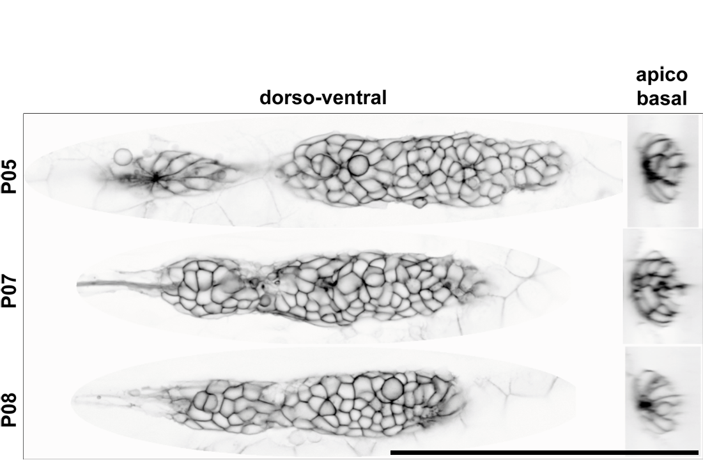
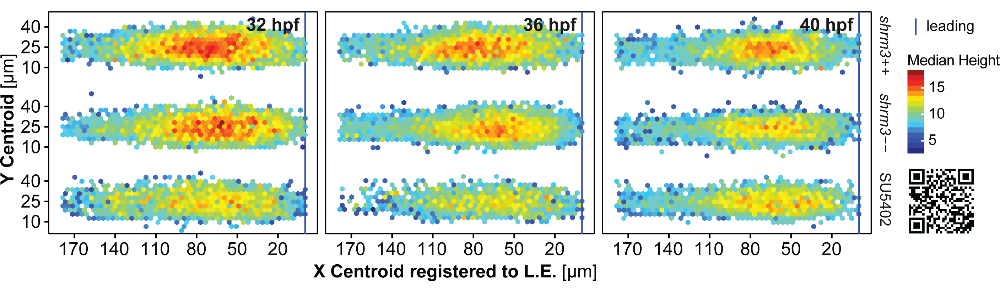
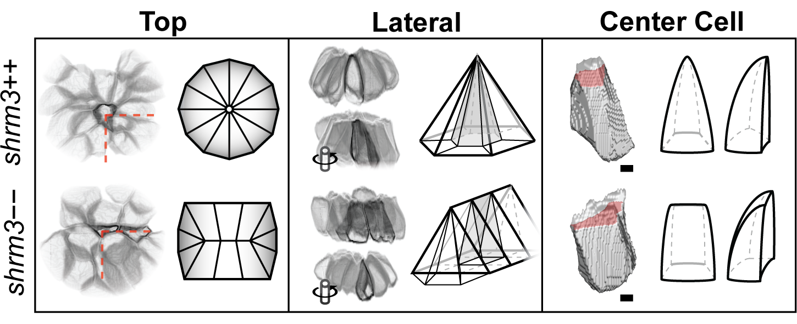

```{r, echo = F}
load("data/ac.RData")
```

# Results {#res}

## Tools for quantitative imaging and image analysis {#res-met}

### A 3D-printed stamp to standardize sample mounting and semi-automatize imaging {#res-mount}

\begin{tcolorbox}[colback = white, sharp corners = northwest]
\textbf{NOTE}
\tcblower
Most of Chapter 3.1.1 has been published as an article in the Journal BMC Biotechnology (Kleinhans and Lecaudey, BMC Biotechnology (2019) 19:68). The author contribution was described in the paper as follows: DSK designed the study, carried out the experiments and analysis of the results. VL provided the infrastructure and funding for performing the experiments. DSK and VL wrote the final manuscript. All authors read and approved the final manuscript. 
Some passages in this section 3.1.1 have been quoted \textit{verbatim} from the above-mentioned article for the scientific accuracy of the terms used.
\end{tcolorbox}

Even though on a macroscopic scale development is remarkably similar and synchronized process in zebrafish, when investigating a single biological process on a _microscopic_ scale even in sibling embryos can look drastically different. Given the noisy and variable character of biological systems, it is important to record a sufficient number of samples to obtain a quantitative and representative view of a biological process. Furthermore, to process biological samples of whole organisms in a high-content manner it is important to have a standardized way of sample mounting, data acquisition, data processing and analysis. 

However, imaging a high number of samples and generating large datasets to date is still largely limited by the classical way most scientists mount embryos for imaging. A number of factors limiting the standardization are summarized in table \@ref(tab:resmountingtab)

```{r resmountingtab, fig.pos = "h"}
read.delim("data/tables/mountdata.txt", sep = ",", row.names = NULL, quote = "\"") %>%
  kable(format = 'latex', booktabs = T, escape = F,
        col.names = c('Standard Method', 'Limitations', 'Solutions', 'Improvement'), 
        caption = 'Limitations of traditional zebrafish mounting techniques') %>%
  kable_styling(full_width = T, latex_options = "striped", font_size = 9) %>%
  column_spec(4, width = "4.5cm") %>%
  row_spec(0, bold = T)
```

Therefore, especially for 3D segmentation and 2D tracking experiments where an exact staging and orientation of the embryo is necessary, there is a need for methods to standardize sample mounting and image acquisition of multiple embryos. 

The protocol we describe here was designed to be used with XY scanning universal sample holders that usually come with any motorized-stage inverted microscope. Similar to previous approaches [@Campinho2018; @Donoughe2018; @Wittbrodt2014; @Yu2018], it uses a 3D-printed stamping device to produce an Agarose imprint with a diameter of 20 mm on the cover glass of a 35 mm $\mu$-dish. The imprint consists of 44 equally spaced $\mu$-wells, which are designed to fit the average morphology of a zebrafish embryo between 24 and 96 hours-post-fertilization (hpf). 

The aim was to develop a standardized mounting method allowing us to: (i) mount many samples in parallel in a 2D coordinate system of rows and columns, (ii) reduce the acquisition time and thus photo-bleaching and photo-toxicity during imaging, (iii) semi-automatize the acquisition, (iv) reduce the post-processing steps, and (v) facilitate subsequent processing such as genotyping due to a 1:1 correlation between image data and specimen arrangement sequence.

For mounting, an improved 3D specimen preparation and well-plate like sample navigation for zebrafish larvae confocal microscopy was developed with which lateral line development can be recorded over more than 20 h, in up to 44 positions, in a confocal Z-stack of less than 120 $\mu$m and a time interval of 5–10 min. (depending on the number of channels and exposure time). The stamp was designed to be used for embryos between 24 and 96 hpf. For a tailor-made well, embryos were fixed and imaged _in toto_ to measure the dimensions in X, Y and Z of different (whole embryo, trunk, yolk) embryonic structures (figure \@ref(fig:mountmicro)B-B'). Using Microsoft 3D-Builder a well was assembled from basic shapes like cube, sphere and wedge. After, the well was duplicated a couple of times and put in a grid-like arrangement to fit on a disc base 20 mm in diameter. Printing was performed on a Formlabs extrusion printer (figure \@ref(fig:mountmicro)C).

(ref:mountmicro) Stamp and $\mu$-well properties. **A - A'** Mounting (A) without and with (A') $\mu$-well. Legend to the right. **B - B'** Dimensions of a single micro well in (B) X-Y and (B') X-Z in mm **C** Elements and dimensions of the stamp wafer. *D* Assembled stamp with a screw mounted on the back of the stamp wafer.

```{r mountmicro, fig.cap = "(ref:mountmicro)", fig.scap = "Stamp and micro-well properties"}
knitr::include_graphics("figures/results/00_methods/mounting/stamp_dims.png")
```

(ref:stampresults) Mounting Results. **A - A'** Maximum intensity projection of a 50 hpf embryo mounted on its side in XY and XZ. (right) Color scale indicates depth encoding. **C** Multi-position (36), multi-channel (2) time-lapse recording (13 h duration; 15 min. interval). **D** Multi-channel (2) Extended Depth of Focus (EDF) projections from widefield Z-stacks (recorded with 20x Objective). Scale Bar = 1mm **E** Multipoint coordinates in X, Y and Z (recorded with 40x Objective). The offset describes the distance of each point from the mean of all points in X, Y and Z. Panel 1–3 (top to bottom) show dimensions X, Y and Z in comparison for the pLLP, the eye and the otic vesicle. The red line indicates the median, the blue line indicates zero offset, error bars indicate mean $\pm$ s.d.. Numeric values indicate the variance in each group. **F-F''** Systematic retrieval for genotyping. **F** Mounted embryos in a 2-D coordinate system of rows (A-M) and columns (1–3). **F'** Imaging Sequence in a snake-by-column fashion. In a time-lapse setting, it starts at point 1 (P01) again to initiate the next timepoint. **F''** After imaging, the embryos are retrieved in the same sequence as they were imaged (snake by column, left panel). **F''** Each genotyping result on the electrophoresis gel is easily correlated to one imaging dataset with defined X-Y coordinates.

```{r stampresults, fig.cap = "(ref:stampresults)", fig.scap = "Mounting results", out.extra = '', fig.pos = "H"}

```

#### Procedure

##### Preparation of the agarose cast

To prepare the agarose cast, the stamp is first cleaned from dust and remnants with tissue soaked in 70$%$ Ethanol and pressured air (figure \@ref(fig:mounting) IA). To prepare the casting medium a 1$%$ Agarose (w/v) solution is prepared in an autoclaved 100 mL bluecap bottle by dissolving 200 mg of agarose in 20 mL of E3 using a microwave oven. From the ready solution 650 $\mu$L are applied to the $\varnothing$ 20 mm coverslip of a $\varnothing$ 35 mm imaging dish (materials in table \@ref(tab:mat-mount)). Subsequently the clean stamp is gently placed onto the placed solution and adjusted to the center. The dish is then rotated to distribute excess agarose over the entire dish surface to stabilize the imprint once polymerized. 

After about 30 min. the stamp is removed by first slipping a clean preparation needle between the stamp and the polymer and then lifting it from the cast (figure \@ref(fig:mounting)IB). If necessary, air bubbled appearing between the cover glass and the polymer are eliminated by punctuation with a preparation needle. The mounting cast may be used immediately or stored at 4$^\circ$C for several days (with lid closed).

##### Preparation of mounting media

Two solutions of low-melting point Agarose (LMPA) are prepared in autoclaved 100 mL bluecap bottles by dissolving 60 and 100 mg LMPA in 16 mL of E3 in a microwave oven - yielding 0.375 and 0.625 $\%$ respectively. Per stamped cast, 2 aliquots of 1.6 mL are prepared in 2 mL tubes for each LMPA concentration and placed in a heating block adjusted to 41$^\circ$C.For live imaging, 400 $\mu$L of 4.2 mg/mL Tricaine (25X) are added to keep the embryos anesthetized during imaging. Final concentrations of LMPA solution are therefore 0.3 and 0.5 $\%$, respectively. LMPA solutions containing Tricaine were prepared fresh for each mounting session. The LMPA solution and the mounting cast have almost equal refractive indices. Therefore, when adding the LMPA solution the cast becomes invisible. To still be able to locate the $\mu$-wells and to position the embryos accordingly, the illumination contrast and mirror angle of a transmitted light base are adjusted to make the $\mu$-wells visible again (figure \@ref(fig:mounting)IIA-C).

##### Mounting procedure

In case of live imaging the embryos are first anesthetized in a Petri dish with 4 to 5 drops of 4.2 mg/mL Tricaine (40 $\mu$g/mL in E3) added 4 to 5 min. before usage.

For mounting the cast is first gently filled from the border (figure \@ref(fig:mounting)II A3) with 500 $\mu$L of 0.3$\%$ LMPA solution. Then, 44 embryos (one for each well) are collected from their Petri dish with a glass Pasteur pipette. To minimize the amount of liquid added to the LMPA, the embryos are allowed to sink to the air – liquid interface and immediately added in one drop to the liquid LMPA solution in the stamped cast. Next, each embryo is moved to a separate $\mu$-well with a preparation needle by positioning the yolk within the half-spherical structure of each well and the tail aligned horizontally with the shape of the $\mu$-well (figure \@ref(fig:mounting)II C-D). The LMPA was allowed to polymerize for about 40 min. For time-lapse recording longer than 1 h, 1 mL of 0.5$\%$ LMPA was added on top and allowed to polymerize for another 10 min. to construct an Agarose _sandwich_ to stabilize the structure. Since the 0.3$\%$ LMPA will still be very fragile, the 0.5$\%$ LMPA should be added to the outer well first, carefully raising the level.

Since Agarose polymerization speed depends on temperature, for mounting the temperature of the room should not be less than 23$^\circ$C to give sufficient time. For indefinite time of embryo orientation, a higher room temperature or a 5 V terrarium heating mat (at maximum temperature ca. 38$^\circ$C) can be used. For the latter, a hole with the diameter of an imaging dish should first be cut in the middle of the heating mat. For mounting, the mat should then be placed and fixed on the stereo-microscope stage with the dish in the hole.

##### Imaging setup

The dish is placed onto the sample holder of an inverted confocal spinning disc microscope so that the embryos are aligned to the Y axis of the microscope stage. The stage is then moved to place the embryo at Position 01 (P01, top-left position) right above the objective (figure \@ref(fig:mounting)III A).

###### Define embryo positions

Since the embryos are mounted in a 3-D grid with well defined dimensions, all positions can be defined _via_ a pre-defined points list that is loaded into the microscope software. For our system we use the 'Nikon Imaging Software' where we move the stage to P01, define a multi-point list with distance X / distance Y = 3450 / 1280 $\mu$m, bring P01 into focus and offset all points in Z. The list can also be saved for re-use in a future experiment. Alternatively one can also define a custom well plate and calibrate the stage. 

###### Refine Positions

Even though the mounting method allows for a precise positioning, each embryos physiology is still a bit different resulting in differences between positions but same structures of up to 100 $\mu$m in X, Y and Z (figure \@ref(fig:stampresults)E). Therefore, before starting an experiment each position needs to be refined.

##### Retrieval

For further experiments such as genotyping, the embryos are retrieved from the agarose in the same sequence as they were imaged (figure \@ref(fig:stampresults)F'). To do so, a glass pipette is inserted into the agarose and directed to the head region of an embryo. By applying a gentle underpressure the embryo is then sucked into the glass pipette. 

To lyse the embryos and extract the genomic DNA, each embryo is placed in a single tube of an 8-tube PCR strip. Since 8-tube PCR strips are designed to work with multichannel pipettes, the genotyping PCR is performed and analysed by gel electrophoresis using an 8x-multichannel pipette. When using a 34-well comb, the pipette tips will reach every second well of the agarose gel. Filling the wells staggered (offset by 1), one can load 4 × 8 wells in one row (figure \@ref(fig:stampresults)F''). Since each embryo has a defined position, it is straightforward to associate each genotype to the corresponding image data (figure \@ref(fig:stampresults)F' - F'''). Since a single mismatch would mess up the entire experiment by resulting in a frameshift of the one-to-one correspondence, this is a very important feature. The imaging dish can be reused several times. For cleaning, the agarose bed is removed from the dish using a small scoop or preparation needle and wiped gently with a lint-free tissue soaked in Ethanol.

(ref:mounting) Stamping procedure **Agarose Cast** (A) clean stamp surface (B) preparation of the stamp before lifting (C) ready-for-use agarose imprint. **Mounting** (A) without LMPA (B and C) with LMPA, while the latter shows the imprint with light coming from a different angle, making the chambers visible again. (D) Horizontal alignment of embryos. **Imaging** (A) Positioning of the $\mu$-well (B) Alignment in Brightfield and (C) Definition of a custom well plate.

```{r mounting, fig.cap = "(ref:mounting)", fig.scap = "Stamping procedure", out.extra = '', fig.pos = "H"}
knitr::include_graphics("figures/results/00_methods/mounting/stamp_mounting.png")
```

#### Summary

The major improvements introduced by this method are (1) using a low percentage LMPA, which extends the timespan for mounting which is necessary to align a higher number of embryos. It also gives the embryo more freedom to grow during longer time-lapse imaging and facilitates retrieval of afterwards. (2) using a stamped cast, which allows for standardized and reproducible positions of the embryo as shown for the lateral line primordium, the eye and the otic vesicle (figure \@ref(fig:stampresults)E). A significant increase of number of embryos that can be imaged during a single experiment (figure \@ref(fig:stampresults)C-D). A significant reduction of the Z-stack size and therefore of the illumination of the samples (figure \@ref(fig:stampresults)A).

In comparison over existing methods we provide a solution that is easy and in-expensive even for non-specialized labs. Also, while similar methods are well suited for high throughput and lower resolutions, ours may also be used for long time-lapse and high resolution imaging. 

### anaLLzr2D - Automated 2D neuromast analysis and nuclei count {#mat-anallzr2d}

For LL analysis I developed a custom IJ macro script that segments individual cell clusters and the pLLP. From the opening dialog (figure \@ref(fig:anallzr2ddialog)) the user can choose to _count nuclei_ and / or _sort ROIs_.  If nuclei count is chosen, the macro expects a dual-channel (Ch1: _cldnb:lyn-gfp_; Ch2: a nuclei label) _tiff_-file as input. If ROI sorting is selected, segmented CCs are numbered and sorted from left to right instead of top to bottom (IJ's native sorting method). 

- _Membrane label blur_ controls the detail of pLLP and CC segmentation, where lower values result in more detail
- _Closing filter_ controls how harsh objects are separated from each other
- _Nuclei label blur_ controls the details of single nuclei and is evaluated after ground truth data described in section \@ref(mat-GrTrDat)

(ref:anallzr2ddialog) anaLLzR2D opening dialog **checkboxes** Choose to count nuclei and whether ROIs sorting should be applied. **sliders** Choose filter and blurring levels.

```{r anallzr2ddialog, out.width = '40%', fig.cap = "(ref:anallzr2ddialog)", fig.scap = "anaLLzR2D opening dialog", out.extra = '', fig.pos = "h"}
knitr::include_graphics("figures/materials/macros/anallzr2D_macro.png")
```

#### Image Analysis

Using ROIs as masks, the nuclei within each ROI are counted with a 2-D maxima finder. However, in their unprocessed form the images are too noisy to get meaningful results. The images therefore have to be smoothened with a blurring filter. To detect the right amount of nuclei, it is necessary to evaluate the distance over which the blurring should be applied. A typical nucleus in the pLLP is about 5 $\mu$m in diameter. To determine the right blurring value, a range of 4-6 $\mu$m in steps of 0.5 is tested. Figure \@ref(fig:maxllreg) shows a registered maximum Z projected lateral line used for ground truth evaluation.

(ref:maxllreg) Registration of 2D data.  **Cluster Segments** Registered, MaxIP data with cell cluster segments of the lyn-GFP signal laid upon the DAPI signal. **Cell Labels** Magenta dots represent the maxima found within each ROI and hence the nuclei labels.

```{r maxllreg, fig.cap = "(ref:maxllreg)", fig.scap = "Registration of 2D data", out.extra = '', fig.pos = "h"}
knitr::include_graphics("figures/materials/ground_truth/clusters/clusters.png")
```

#### Code Snippets

##### Segmentation

The membrane label image is segmented based on optimized filter parameters that were derived from trial and error. After, the macro halts for manual correction.

```{r anallzr2d_seg, echo = TRUE, eval = FALSE, size = "scriptsize", attr.source = '.numberLines'}
# Background subtraction
	run("Subtract Background...", "rolling = 50");
	run("Morphological Filters",
	    "operation = Opening element = Disk radius = 20");
	run("Gaussian Blur...", "sigma = 5 scaled");

# Thresholding
	setAutoThreshold("Moments dark");
	setOption("BlackBackground", false);
	run("Convert to Mask");

# Particle analysis
	run("Analyze Particles...", "size = 250-Infinity exclude add");
	roiManager("Show All without labels");
	run("Enhance Contrast", "saturated = 0.35");
	waitForUser("Check ROIs, correct if necessary");
	if (sort) {
		sortROIs();
	}
```

##### Sorting

To sort manually corrected ROIs from left to right, each ROIs position in calculated relatively to total image width.

```{r anallzr2d_sorting, echo = T, eval = F, size = "scriptsize", attr.source = '.numberLines'}
# Sort ROIs from left to right
function sortROIs() {
	run("Set Measurements...", "centroid redirect = None decimal = 0");
			for (j = 0 ; j < roiManager("count"); j++) {
    			roiManager("select", j);
   			 	roiManager("measure");
    			x = getResult("X", 0);
    			w = getWidth();
    			a = x/w;
    			roiManager("rename", a);
    			run("Clear Results");
				}
		setBatchMode(false);
		roiManager("sort");	
			for (j = 0 ; j < roiManager("count"); j++) {
    			roiManager("select", j);
    			roiManager("rename", j);
    			run("Clear Results");
				}	
			for (j = 0 ; j < roiManager("count"); j++) {
    			roiManager("select", j);
    			roiManager("rename", j+1);
    			run("Clear Results");
				}
}
```

##### Count nuclei

After smoothing the nuclei signal in the DAPI labeled channel, maxima are detected only within each ROI.

```{r anallzr2d_counts, echo = T, eval = F, size = "scriptsize", attr.source = '.numberLines'}
# count nuclei within segmented cell clusters
# steps performed on DAPI channel
# count nuclei
	run("Gaussian Blur...", "sigma = 0.6 scaled");
	roiManager("open", datdir + filename + "_ROIset.zip");
	rcount = roiManager("count");

# for each ROI
	for (j = 0 ; j < rcount; j++) {
		roiManager("open", datdir + filename + "_ROIset.zip");
  		roiManager("select", j);
  			run("Duplicate...", " ");
  			run("Enhance Contrast", "saturated = 0.35");
  			run("Find Maxima...", "noise = 0 output = [Point Selection]");
  			run("Capture Image");
  		roiManager("select", j);
		run("Find Maxima...", "noise = 0 output = Count");
		NC = getResult("Count");
		setResult("Nuclei", j, NC);
		setResult("Pos", j, j + 1);
	}
```

#### Data Analysis

Comparing the maxima counts of each Gaussian parameter with the Ground Truth gives an indication for false -positives resp. -negatives. In figure \@ref(fig:GrTratioCC) the relative numbers for each blurring parameter can be seen in percentage above or below the mean cell count of the ground truth (blue horizon). The red area represents false negatives, the green false positives.

(ref:GrTratioCC) Relative difference of maxima counts

```{r GrTratioCC, out.width = '65%', fig.height = 2.75, fig.pos = 'H', fig.cap = "(ref:GrTratioCC)", fig.scap = "Relative difference of maxima counts"}
NB_all_diff_mean %>%
  mutate(
    Group = as.character(as.numeric(str_replace(Group, 'NB', ''))/10)
  ) %>%
  ggplot(aes(Group, mean_diff)) +
  geom_bar(aes(fill = Group), colour = "black", stat = "identity", show.legend = FALSE) +
    geom_rect(aes(xmin = -Inf, xmax = Inf, ymin = 0, ymax = Inf), fill = "red", alpha = .05) +
      annotate(geom = "text", x = 5.5, y = 5, fontface = "bold", label = "false negative", color = "red") +
    geom_rect(aes(xmin = -Inf, xmax = Inf, ymin = -Inf, ymax = 0), fill = 'green', alpha = .025) +
      annotate(geom = "text", x = 1.5, y = -5, fontface = "bold", label = "false positive", color = "darkgreen") +
  geom_bar(aes(fill = Group), colour = "black", stat = "identity", show.legend = FALSE) +
  geom_hline(aes(yintercept = 0, linetype = "Ground Truth 100%"), colour = "blue", size = 1) +
  geom_errorbar(
    aes(fill = Group, ymin = mean_diff-(sd_diff/2), 
        ymax = mean_diff + (sd_diff/2)), width = .2, position = position_dodge(.9)) +
  labs(
    title = "N = 3, Error bars = Std./2, NB = nuclei blurring",
    caption = '',
    x = "Blurring Parameters", 
    y = "Rel. Count Diff. [%]") +
  scale_fill_brewer(palette = "Greys", direction = -1) +
  scale_linetype_manual(name = "", values = c(1)) +
  mythemeLIGHT_bottom() + 
    theme(legend.position = c(0.18, 0.22),
          legend.text = element_text(size = 11)
          )
```

\noindent To estimate the quality of nuclei detection for each parameter, the ratio of automatically detected and ground truth objects count can be calculated and compared (table \@ref(tab:nrcount)). The closer it is to 1, the better.

```{r nrcount}
NB_all_CC_NR_mean %>%
  rownames_to_column() %>%
  mutate(
    rowname = str_replace(rowname, 'Mean_ratio', 'mean ratio'),
    rowname = str_replace(rowname, 'STD', 'std')
  ) %>%
  knitr::kable(
    booktabs = T, caption = "Blurring parameter for nuclei count", 
    col.names = c('', '4.5', '5.0', '5.5', '6.0', '7.0'),
    align = c('r', 'c', 'c', 'c', 'c', 'c')) %>%
  kable_styling(full_width = T, latex_options = "striped") %>%
  footnote('blurring parameters', general_title = 'column headers')
```

In summary, maximum performance is achieved at a scaled parameter of 6 $\mu$m, with a ratio of of `r NB_all_CC_NR_mean[1,"NB60"]` for the count objects and a standard deviation of `r NB_all_CC_NR_mean[2,"NB60"]`.

### anaLLzr2DT - Automated 2D neuromast analysis and nuclei count through time {#mat-anallzr2dt}

Upon macro execution the opening dialog is presented which is divided in three sections (figure \@ref(fig:anallzr2dtdialog)A).

In the **processing** section the user may choose which modules are executed. 

- _Segmentation_ controls whether the images are segmented before measurement. If de-seleted the user has to provide segmentation masks seperately.
- _Include Cell Clusters_ controls whether Cell Clusters should be included in the analysis. If de-selected, only the pLLP will be considered.
- _Registration_ controls whether the pLLP should be captured in time and space and saved in a separate stack.
- _Multichannel_ controls whether on a second channel summary statistics from each ROI at each timepoint should be taken.
  + measurements taken are the mean, standard deviation, minimum and maximum intensity

In the **options** section the user may choose whether the macro should be run in _headless mode_ (without showing every single action), whether the input images are timeseries and whether all other windows should be closed upon start of processing.

After confirmation, the user has to enter a date of experiment as an identifier in a second dialog. Furthermore the user is presented the images physical properties pre-filled where the idea here is just a review since this is a major source of mistakes. Finally, a third dialog is presented to the user giving an approximate duration and basic instructions.

(ref:anallzr2dtdialog) anaLLzR2DT opening dialog **A** Opening dialog: Main functionality **B** Opening Dialog: metadata setup options **C** Time approximation dialog and basic instructions.

```{r anallzr2dtdialog, out.width = '95%', fig.cap = "(ref:anallzr2dtdialog)", fig.scap = "anaLLzR2DT opening dialog", out.extra = '', fig.pos = "h"}
knitr::include_graphics("figures/materials/macros/anallzr2DT_macro.png")
```

Code-snippets describing the main functionality are described in the next couple of sub-sections.

###### Registration

The first module of the macro is pLLP registration in X, Y and cropping in Z. For better segmentation results, first the SNR is enhanced by background subtraction. To rotate the image the pLLPs migrational path is approximated by the position of the first and the last segment, then the image is cropped to a fixed height. 

```{r anallzr2dt_reg, echo = T, eval = F, size = "scriptsize", attr.source = '.numberLines'}
#	subtract background
		run("Z Project...", "projection = [Average Intensity]");
		ZPAVG = getTitle();
  		if (reg) {
			print("Calculating registration parameters...");
			setSlice(n);
			run("Duplicate...", " "); 
			DORG = getTitle();
			imageCalculator("Subtract create", DORG, ZPAVG);
			close(DORG);
			run("Morphological Filters",
			    "operation = Closing element=Disk radius = 15");
			REG = getTitle();
			run("Gaussian Blur...", "sigma = 6 scaled"); 
			run("Duplicate...", " ");
			run("Enhance Contrast...", "saturated = 0.3 normalize");
			run("8-bit");
			setAutoThreshold("MaxEntropy  dark");
			run("Convert to Mask");

	# analyze segments
		run("Analyze Particles...", "size = 150-10000 include exclude add");
		rmcount = roiManager("count")-1;
		print("rois: " + rmcount);
		
	# angle
		if(roiManager("count") == 1) {
			roiManager("select", 0);
			List.setMeasurements;
			Angle = List.getValue("FeretAngle");
			print("Angle: " + Angle);
			if (Angle < 0) {Angle = Angle * (-1);}
			if (Angle > 90) {Angle = (180-Angle) * (-1);}
		} else {
			roiManager("select", rmcount);
			List.setMeasurements;
			X1Line = List.getValue("X");
			Y1Line = List.getValue("Y");
			roiManager("select", 0);
			List.setMeasurements;
			X2Line = List.getValue("X");
			Y2Line = List.getValue("Y");
			makeLine(X1Line, Y1Line, X2Line, Y2Line);
			List.setMeasurements;
			Angle = List.getValue("Angle");
			if (Angle < 0) {Angle = Angle*(-1);}
			if (Angle > 90) {Angle = (180-Angle)*(-1);}
			}
			print("Angle: " + Angle);
			run("Rotate... ", 
			    "angle = " + Angle + " grid = 1 interpolation = Bilinear");
			ZPAVG = getTitle();
			selectWindow(REG);
			run("Rotate... ", 
			    "angle = "+ Angle +" grid = 1 interpolation = Bilinear");
			run("Make Binary");
			REG = getTitle();
		
		# cropping
			roiManager("reset");
			run("Analyze Particles...", 
			    "size = 150 - 10000 include add");
			roiManager("select", 0);
			List.setMeasurements;
			XRect = List.getValue("X");
			YRect = List.getValue("Y");
			selectWindow(REG);
			getDimensions(width, height, channels, slices, frames);
			List.setMeasurements;
			height = 120 / sizeX; # change height of rect here
			toUnscaled(YRect);
			YRect = YRect - (height / 2);
			print("YRectcor: " + YRect);
  		} 

	# register
		resetMinAndMax();
		if (dual) {
		#	C1
			selectWindow(ORG);
			if (reg) {
				print("  Registering " + embryoID +"...");
				run("Rotate... ", 
				    "angle = "+ Angle +" grid = 1 interpolation = Bilinear stack");
				makeRectangle(0, YRect, width, height);
				run("Crop");
			}
		# C2
			open(dualdir + dualdirlist[q]);
			dualname = replace(dualdirlist[q], ".tif", "");
			if (reg) {
				run("Rotate... ",
				    "angle="+ Angle +" grid = 1 interpolation = Bilinear stack");
				makeRectangle(0, YRect, width, height);
				run("Crop");
			}
			close();
		} else {
			selectWindow(ORG);
			if (reg) {
				run("Rotate... ",
				    "angle = "+ Angle +" grid = 1 interpolation = Bilinear stack");
				makeRectangle(0, YRect, width, height);
				run("Crop");
			} else {	
			}
		}
		ORG = getTitle();
	# crop ZPAVG for image calc
		selectWindow(ZPAVG);
		if (reg) {
  		makeRectangle(0, YRect, width, height);
  		run("Crop");
		}
```

###### Segmentation

After registration of the image follows segmentation. For this we again improve SNR by background correction, following by disconnecting loosely joint segments.

```{r anallzr2dt_seg, echo = T, eval = F, size = "scriptsize", attr.source = '.numberLines'}
#  background correction
	print("  Segmenting "+ embryoID +"_RC...");
		getDimensions(width, height, channels, slices, frames);
		imageCalculator("Subtract create stack", ORG, ZPAVG);
		IC = getTitle();
	selectWindow(IC);
		print("Bleach correction...");
		run("Bleach Correction", 
		    "correction = [Simple Ratio] background = 0");
		nslbc = nSlices();
		for (j = 1; j < nslbc; j++) {
			setSlice(j);
			run("Morphological Filters",
			    "operation = Closing element = Disk radius = 15");
		}
		run("Images to Stack", "name ="+ ORG +" title = [] use");
		
	#	segmentation
		selectWindow(MC);
		run("Gaussian Blur...", "sigma = 5.5 scaled stack");
		
	#	disconnect segments
		run("Enhance Contrast...",
		    "saturated = 0.5 normalize process_all");
		setSlice(n);
		resetThreshold();
		setAutoThreshold("MaxEntropy dark");
		run("Convert to Mask",
		    "method = MaxEntropy background = Dark black");
		run("Invert LUT");
		run("Fill Holes", "stack");
		run("Options...", 
		    "iterations = 2 count = 1 pad do = Erode stack");
		run("Options...", 
		    "iterations = 2 count = 1 pad do = Open stack");
		run("Options...", 
		    "iterations = 1 count = 1 pad do = Dilate stack");
	}
	waitForUser("Check Segmentations");
	}
```

###### Analysis

Finally we measure and save the results in the defined names and directories

```{r anallzr2dt_anal, echo = T, eval = F, size = "scriptsize", attr.source = '.numberLines'}
for (b = 0; b < orgdirlist.length; b++) {
# get genotypes and embryoIDs from arrays
	type = types[b];
	embryoID = embryoIDs[b];
	orgname = replace(orgdirlist[b], ".tif", "");
	embryodir = output + File.separator + orgname + File.separator;
	File.makeDirectory(embryodir);
	
# open and define binary
	open(bindir+bindirlist[b]);
	BIN = getTitle();
		  
# open and define orginal 
	if (dual) {
		open(rcdirc1 + rcdirc1list[b]);
	} else {
		open(rcdir + rcdirlist[b]);
	}
	RC = getTitle();
	dotIndex = indexOf(RC, ".");
	title = substring(RC, 0, dotIndex);
	
# enter 2nd loop to increment over each slice of the time-series
	selectWindow(BIN); 	 # select binary
	pangles = newArray(nSlices() + 1);
	for (i = 1 ; i <= nSlices(); i++) {
	  s = nSlices();
		setSlice(i);
		if (ccs) {
			run("Analyze Particles...",
			    "size = 150-10000 include add");
		} else {
			run("Analyze Particles...",
			    "size = 750-10000 include add");
		}
	# loop though ROI List
		for (j = 0 ; j < roiManager("count"); j++) {
			roiManager("select", j);
			run("Set Scale...",
			    "distance = 1 known = 0.00005 pixel = 1 unit = micron");
			List.setMeasurements;
  			x = List.getValue("X");
  			roiManager("rename", x);
		}
		run("Properties...",
		    "channels = 1 slices = 1 frames = [s] unit = micron pixel_width = [xs]
		    pixel_height = [ys] voxel_depth = [zs] frame = [time] global");
		
	# Sort ROIs and select last one
		roiManager("Sort");
		for (j = 0 ; j < roiManager("count"); j++) {
			ccn = roiManager("count")+j;
			if (ccn == roiManager("count")) {
				ccn = "prim";
				roiselect = roiManager("count")-1;
			} else {
				ccn = "CC"+j;
				roiselect = j-1;
			}
			roiManager("select", roiselect);
			roiManager("rename", ccn);
		}
		rmc = roiManager("count");
		m = rmc-1;
		selectWindow(RC);
		
  # Prim registration
		run("Select None");
		roiManager("Select", m);
		sln = getSliceNumber();
		run("Enlarge...", "enlarge=6");
		run("Fit Ellipse");
		run("Duplicate...", "use");
		rename(sln);
		resetMinAndMax();
		
  # Rotate
		List.setMeasurements;
		A = List.getValue("Angle");
		run("Select None");
		if (A < 10) {
			A = A;
		} else {
			A = 180-A;
			A = A*(-1);
		}
		pangles[i] = A;
		run("Rotate... ", "angle = [A] grid = 1 interpolation = Bilinear slice");
		run("Flip Horizontally");
			
  # Measure and save segmented Mask ROI
		pLLProis = embryodir + File.separator + "ROIs" + File.separator;
		File.makeDirectory(pLLProis);
		pLLPxy = embryodir + File.separator + "ROIsXY" + File.separator;
		File.makeDirectory(pLLPxy);
		selectWindow(BIN);
		roiManager("show none"); # supress roimanager popping up
		roiManager("Select", m);
			
	#	Save ROIs and XY coordinates
		if (i < 10) {
			slice = d2s(0,0) + d2s(i,0);
			roiManager("save", pLLProis + "s" + slice + ".zip");
			saveAs("XY Coordinates", pLLPxy + "s" + slice + ".txt");
		} else {
			roiManager("save", pLLProis + "s" + i + ".zip");
			saveAs("XY Coordinates", pLLPxy + "s" + i + ".txt");
		}
			
	 # Measure
		run("Set Measurements...", "area centroid bounding fit shape feret's stack redirect=None decimal=2");
  		roiManager("measure");
  		roiManager("reset");
  		run("Select None");
    # Calculate additional variables based on measurements
  		n = nResults();
  		r = n-1;  # actual RowNumber
  		r2 = n-2; # RowNumber -1
  		if (i == 1) {  # get X & Y coordinates, keep X0 and Y0 for normalization
  			X0 = getResult("X");
  			Y0 = getResult("Y");
  		} else {
  			X1 = getResult("X", r2);
  			X2 = getResult("X", r);
  			Y1 = getResult("Y", r2);
  			Y2 = getResult("Y", r); 
  		}
    # Width of bounding rectangle
    	W = getResult("Width");
    # Calculations (XN = normalized X; LE = Leading Edge)
    # Euclidian Distance of X + normalized to offspring 'zero'
    	if (i == 1) {
    		XED = 0;
    		XN = 0;
    	} else {
    		XED = sqrt((X2-X1)*(X2-X1)+(Y2-Y1)*(Y2-Y1));
    		XN = (X2 - X0) + XED;
    	}
    	LE = XN + (W/2); # Leading Edge 
    	T = time * r; # Time interval
    	setResult("embryo", r, orgname); # set Results
    	setResult("group", r, type);
    	setResult("time", r, T);
    	setResult("deg", r, A);
    	setResult("X_ED", r, XED);
    	setResult("X_N", r, XN);
    	updateResults();
		}
		close(BIN); # could be reduced to close(BIN, ORG); or close (".tif");
		close(RC);
		
	#	Merge registered prim timepoints
		setBatchMode("exit and display");
		run("Images to Stack", "method = [Copy (top-left)] name = Stack title = [] use");
		run("Properties...",
		    "channels = 1 slices = 1 frames = [s] unit = micron pixel_width = [xs]
		    pixel_height = [ys] voxel_depth = [zs] frame = [time] global");	
		run("Flip Horizontally", "stack");
		if (dual) {
	  #	save C1
		  saveAs("Tiff", pLLPdir + orgname + "-C01.tif");
		  close();
	  #	open C2
		  open(rcdirc2+rcdirc2list[b]);
			resetMinAndMax();
			RC = getTitle();
			dotIndex = indexOf(RC, ".");
			title = substring(RC, 0, dotIndex);
			for (i = 1 ; i <= nSlices(); i++) {
				s = i;
				setSlice(i);
			#	Prim registration
				if (i < 10) {
					slice = d2s(0, 0) + d2s(i, 0);
					roiManager("open", pLLProis + "s" + slice + ".zip");
				} else {
					roiManager("open", pLLProis + "s" + i + ".zip");
				}
				rmc = roiManager("count");
				m = rmc-1;
				roiManager("Select", m);
				selectWindow(RC);
				sln = getSliceNumber();
				run("Enlarge...", "enlarge=6");
				run("Fit Ellipse");
				run("Duplicate...", "use");
				rename(sln);
			#	Rotate
				A = pangles[s];
				run("Select None");
				run("Rotate... ", "angle = [A] grid = 1 interpolation = Bilinear slice");
				run("Flip Horizontally");
			# select & deselect to remove selected ROIs
				selectWindow(RC);
				run("Select None");
				roiManager("reset");
			}
		#	close and merge individual pllp images into one stack
			close(RC);
			run("Images to Stack", "method=[Copy (top-left)] name=Stack title=[] use");
			run("Properties...", "channels=1 slices=1 frames=[s] unit=micron
			    pixel_width=[xs] pixel_height=[ys] voxel_depth=[zs] frame=[time] global");	
			run("Flip Horizontally", "stack");
			roiManager("reset");
				
	 #  Save Results Table
      run("Input/Output...", "jpeg = 100 gif = -1 file = .txt use_file copy_column copy_row save_column");
			saveAs("results", embryodir + orgname + "_Results" + ".txt");
```

### anaLLzr3D - Automated 3D single cell segmentation and A.I. analysis in the pLLP {#mat-anallzr3d}

Upon macro execution the opening dialog is presented which is divided in three sections (figure \@ref(fig:anallzr3ddialog)A). 

In the **processing** section the user has to define the input format as well as in which direction the Z-stack was recorded. Furthermore, the user may choose to have the pLLP registered, save intermediate steps for debugging and to have objects segmented without any restrictions and manual ROI correction. 

In the **thresholds** section the user may fine tune segmentation and filter levels

- _Segmentation_ controls the segmentation threshold at which (i) the membrane signal is detected, (ii)cell volumes are separated from each other and (iii) is evaluated after ground truth data described in section \@ref(mat-GrTrDat)
- _Min. volume_ controls the minimum volume, below which objects are discarded
- _Max. volume_ controls the maximum volume, above which objects are discarded

In the **measurements** section, the user may choose whether apical constriction measurement should be applied or not. In case apical constriction measurement was selected, the user may choose whether A.I. should be measured at an absolute- or relative- distance from the tip. Furthermore, the user has the option to measure from a fit ellipsoid or rectangle.

(ref:anallzr3ddialog) anaLLzR3D opening dialog **A** Opening dialog: Main functionality **B** Opening Dialog: Apical Constriction options **C** Log window after startup

```{r anallzr3ddialog, out.width = '95%', fig.cap = "(ref:anallzr3ddialog)", fig.scap = "anaLLzR3D opening dialog"}

```

#### Image Analysis

For pLLP analyses I developed a custom IJ macro script that recognizes cell boundaries _via_ the fluorescence signal emitted by a membrane tethered eGFP which expression is controlled by the _claudinB_ lateral line specific promotor [@Haas2006c]. The central IJ tool used to do this is the MorphoLibJ's[@Legland2016] _Morpholigical Segmentation_ plugin. The plugin however requires to choose for a 'segmentation threshold' that determines the quality and the quantity of segmented objects. This parameter therefore plays an essential role in the reliability of the analysis results.

##### Registration

The first module of the macro is the registration of the pLLP in X, Y and cropping in Z. This is accomplished by an initial maximum Z projection and blurring of the image, 2-D segmentation using a minimum threshold and lastly by rotating the segment through the angle formed by the long axis of the ellipsoid (see section \@ref(ACI-pol) for more information) and the horizon (at 0$^{\circ}$). After rotation the image is cropped according to the obtained ROI, as described before. Additionally, the centers of the most constricting areas are detected via an intensity based dynamic threshold and highlighted as magenta circles in \@ref(fig:maxraw).

(ref:maxraw) Registration of 3D data. **raw** location and orientation of the raw data in XY (shown here as Z-projections). The red line indicates the angle in degrees from the horizontal midline. The blue oval indicates registration ROI as determined by the macro. **registered** pLLPs after XY transformation took place. red circles indicate rosettes as detected by the macro.

```{r maxraw, fig.cap = "(ref:maxraw)", fig.scap = "Registration of 3D data"}
knitr::include_graphics(path = "figures/materials/ground_truth/registration.png")
```

```{r imgprop, out.extra = '', fig.pos = "H"}
read.delim("tables/ground_truth/scaling_3D.txt") %>%
knitr::kable(
  booktabs = T, escape = F, 
  caption = "3-D Ground Truth image scaling", 
  align = c("r", "l"), 
  col.names = NULL) %>%
  kable_styling(full_width = T, latex_options = c('striped', 'hold_position'))
```

##### Image data

In figure \@ref(fig:stackmem) the fluorescence signal of the three pLLPs used for the Ground-Truth is shown in a single central cross-section along the _dorso-ventral_ and the _apico-basal_ axis.

(ref:stackmem) _cldnb:lyn-gfp_ fluorescence signal in a cross-section of the pLLP (Obj.: 40X APO, scale bar = 100 $\mu$m)

```{r stackmem, out.width = '70%', fig.cap = "(ref:stackmem)", fig.scap = "Image data pLLP segmentation"}

```

To compare the results between the Ground Truth segments and the segments obtained from different threshold levels graphically, for a single pLLP the Ground Truth and threshold level are shown as a composite color image in figure \@ref(fig:anallzrvols). By using a green lookup-table (LUT) for the ground truth and a magenta LUT for the threshold level[n], one can readily detect overlapping objects (white), over segmentation (magenta) and under segmentation (green). False positive segments are cells that are not part of the Ground Truth, including those cells would distort our dataset. False nevagtive segments are cells that are part of the Ground Truth but were not detected by the macro, excluding those cells impacts the cell count. As one can see, the green cells are randomly distributed, therefore, when averaging a value for all cells false negatives do not distort our dataset. At Treshold Level 2 (T02) we have the least green cells, but the most magenta cells. At Threshold Level 4 (T04) we have no magenta, but some more green cells. Therefore, to be on the safe side in terms of cell parameters and dataset integrity, in this case T04 would be the best pick. 

(ref:anallzrvols) Graphical comparison of the thresholds tested. Volume renderings have been done with IJ's [VolumeViewer]("https://github.com/fiji/Volume_Viewer/releases/tag/Volume_Viewer-2.01.2")

```{r anallzrvols, out.width = '85%', fig.cap = "(ref:anallzrvols)", fig.scap = 'anaLLzr3D - Graphical comparison of tested thresholds'}

```

\noindent 

#### Code Snippets

##### Registration

First we need to get parameters angle and height for registration. All steps are performed on Z-projected data.

```{r anallzr_macro_mod_1, echo = T, eval = F, size = "scriptsize", attr.source = '.numberLines'}
# 2D segmentation mask
  run("Z Project...", "projection = [Max Intensity]");
	run("Gaussian Blur...", "sigma = 8 scaled");
	setAutoThreshold("Minimum dark");
	run("Convert to Mask");
	run("Select None");

# angle from horizontal midline
	run("Analyze Particles...", "include add");
	rmcount = roiManager("count")-1;
	if(roiManager("count") == 1) {
		roiManager("select", 0);
		run("Fit Ellipse");
		List.setMeasurements;
		Angle = List.getValue("FeretAngle");
		if (Angle < 0) {Angle = Angle * (-1);}
		if (Angle > 90) {Angle = (180 - Angle) * (-1);}
	} else {
		roiManager("select", 0);
		run("Fit Ellipse");
		roiManager("update");
		List.setMeasurements;
		X1Line = List.getValue("X");
		Y1Line = List.getValue("Y");
		roiManager("select", rmcount);
		List.setMeasurements;
		X2Line = List.getValue("X");
		Y2Line = List.getValue("Y");
		makeLine(X1Line, Y1Line, X2Line, Y2Line); 
		List.setMeasurements;
		Angle = List.getValue("Angle");
		if (Angle < 0) {Angle = Angle*(-1);}
		if (Angle > 90) {Angle = (180-Angle)*(-1);}
	}
	run("Select None");
	run("Rotate... ", "angle = "+ Angle +" grid = 1 interpolation = Bilinear");
	
# height to crop image to
	roiManager("reset"); # the image was rotated, so we need to get the ROIs again
	run("Select None");
	run("Make Binary");
	run("Erode");
	run("Analyze Particles...", "size = 150-10000 include exclude add");
	rmcount = roiManager("count") - 1;
	if(roiManager("count") == 1) {
		roiManager("select", 0);
	} else {
		roiManager("select", rmcount);
	}
	List.setMeasurements;
	XRect = List.getValue("X");
	YRect = List.getValue("Y");
	getDimensions(width, height, channels, slices, frames);
	Regwidth = width;
	Regheight = 400; # change height of rectangle here
	toUnscaled(YRect);
	YRect = YRect - (Regheight/2);
```

##### Transformation

Next we transform our 3D data based on the registration parameters derived from the previous step.

```{r anallzr_macro_mod_2, echo = T, eval = F, size = "scriptsize", attr.source = '.numberLines'}
# register pLLP
	run("Rotate... ", "angle = "+ Angle +" grid = 1 interpolation = Bilinear stack");
	makeRectangle(0, YRect, Regwidth, Regheight);
	run("Crop");

# create threshold mask to clear signals outside ROI
	run("Normalize Local Contrast", "block_radius_x = 300 block_radius_y = 20 standard_deviations = 4 stretch");
	run("Gaussian Blur...", "sigma = 1 scaled");
	setAutoThreshold("Otsu dark");
	run("Convert to Mask");

# most right roi
	for (j = 0 ; j < roiManager("count"); j++) {
		roiManager("select", j);
		run("Set Scale...", "distance = 1 known = 0.00005 pixel = 1 unit = micron");
		List.setMeasurements;
  	x = List.getValue("X");
  	roiManager("rename", x);
	}
	roiManager("Sort");
	run("Properties...", 
	    "channels = 1 slices = 1 frames = 1 unit = micron pixel_width = [sizeX] pixel_height = [sizeY] voxel_depth = [sizeZ]");
	primroi = roiManager("count") - 1;
	roiManager('select', primroi);
	
# enlarge rois to not miss anything
	run("Enlarge...", "enlarge = 10");
	run("Fit Ellipse");
	roiManager('update');
```

##### Rosette detection

To analyze cells within rosettes resp. within a certain radius of rosettes we first need to know where the rosettes are. At rosette centers we observe an increase in signal intensity since here the membranes of many cells come together in a very small area. This effect we can use to utilize a maximum finder algorithm together with a threshold that is defined individually for each image.

```{r anallzr_macro_mod_3, echo = T, eval = F, size = "scriptsize", attr.source = '.numberLines'}
#  [...] registration
	run("Gaussian Blur...", "sigma = 4 scaled");
	List.setMeasurements;
  	mean = List.getValue("Mean");
  	pointthresh = mean/2.5;
  	pointthresh = round(pointthresh);
	run("Find Maxima...", "noise = "+ pointthresh +" output = [Point Selection]");
	run("Point Tool...", "type = Dot color = Green size = [Extra Large] label counter = 0");
	getSelectionCoordinates(xpoints, ypoints);
	roiManager("Add");

# measure intensities along horizontal midline
#	[...] registration
	Rlx = lengthOf(xpoints); # collect Arrays
	RX = Array.sort(xpoints); # put xpoints in right order
	RX = Array.invert(RX);

# fill ypoints with mean values of all y coordinates
	Array.getStatistics(ypoints, min, max, mean, stdDev);
	meanline = mean;
	Array.fill(ypoints, meanline);
	RY = ypoints;
	getDimensions(width, height, channels, slices, frames);
	makeLine(0, meanline, width, meanline, 1);
	run("Clear Results");
	profile = getProfile();
	for (a = 0; a < profile.length; a++) {
    setResult("Value", a, profile[a]);
		updateResults();
	}
```

##### Segmentation

For image segmentation we use the MorphoLibJ's[@Legland2016] _Morpholigical Segmentation_ plugin. Function calls and arguments are defined in the publication documentation.

```{r anallzr_macro_mod_4, echo = T, eval = F, size = "scriptsize", attr.source = '.numberLines'}
# 3D gaussian blur
	run("Gaussian Blur 3D...", "x=2 y=2 z=0.5");
	resetMinAndMax();

# run segmentation
	run("Morphological Segmentation");
	selectWindow("Morphological Segmentation");
	call("inra.ijpb.plugins.MorphologicalSegmentation.setInputImageType", "border");
	call("inra.ijpb.plugins.MorphologicalSegmentation.segment", "tolerance = "+ tol+"",
	     "calculateDams = true", "connectivity = 6");

# wait till segmentation is done
	initTime = getTime(); 
  oldTime = initTime; 
	while (isOpen("Morphological Segmentation")) {
	  elapsedTime = getTime() - initTime; 
		newTime = getTime() - oldTime;
		if (newTime > 10000) {
   		oldTime = getTime(); 
   		newTime = 0;
   		loginfo = getInfo("log");
			loginfo = split(loginfo, " ");
			loginfo = Array.reverse(loginfo);
			loginfo = Array.trim(loginfo, 5);
			loginfo = Array.reverse(loginfo);
			loginfo = split(loginfo[0], ".");
			loginfo = Array.reverse(loginfo);
			loginfo = loginfo[0];
			if (loginfo == "\nWhole") {
				call("inra.ijpb.plugins.MorphologicalSegmentation.setDisplayFormat", "Catchment basins");
				call("inra.ijpb.plugins.MorphologicalSegmentation.createResultImage");
				run("Grays");
				selectWindow("Morphological Segmentation");
				close();
			}
   	}
	}
  run("Properties...", "channels = 1 slices = "+ n +" frames = 1 unit = microns pixel_width="+ 
        sizeX +" pixel_height="+ sizeY + "voxel_depth ="+ sizeZ);
```

##### Filter and clearing

Remove object volumes below a certain threshold defined in the startup dialog and clear blank slices in Z.

```{r anallzr_macro_mod_5, echo = T, eval = F, size = "scriptsize", attr.source = '.numberLines'}
# erase objects V < vmin and V > vmax
  run("3D Manager Options", "volume surface compactness fit_ellipse 3d_moments 
      feret centroid_(pix) centroid_(unit) distance_to_surface centre_of_mass_(unit) 
      bounding_box radial_distance surface_contact closest exclude_objects_on_edges_xy 
      sync distance_between_centers = 10 distance_max_contact = 1.80");
	run("3D Manager");
  selectWindow(OMap);
	Ext.Manager3D_AddImage();

# get number of objects
	Ext.Manager3D_Count(nb);
	Ext.Manager3D_MultiSelect();

# loop through all the objects and erase by filter settings
	for(k = 0; k < nb; k++) {
		showStatus("Processing "+ k +"/"+ nb);
		Ext.Manager3D_Measure3D(k, "Vol",V);
		if (V < vmin) {
			Ext.Manager3D_Select(k);
			Ext.Manager3D_Erase();
			if (V > vmax) {
				Ext.Manager3D_Select(k);
				Ext.Manager3D_Erase();
			}
		}
	}

# clean blank slices from bottom and top
	getDimensions(width, height, channels, slices, frames);
	var done = false; 
	for(l = 1; l < slices &&!done; l++) {
		setSlice(l);
		getStatistics(area, mean, min, max, std, histogram);
		if(max > 0) {
	  	amax = l-1;
			run("Slice Remover", "first = 1 last = "+ amax +" increment = 1");
			run("Reverse");
			getDimensions(width, height, channels, slices, frames);
			for(l = 1; l < slices &&!done; l++) {
				setSlice(l);
				getStatistics(area, mean, min, max, std, histogram);
				if(max > 0) {
	  			bmax = l-1;
					run("Slice Remover", "first = 1 last = "+ bmax +" increment = 1");
					run("Reverse");
					done = true;
					}
			}
		}
	}
```

##### Apical Constriction

Next we navigate to the calculated relative distance from the apical site and take measurements.

```{r anallzr_macro_mod_6, echo = T, eval = F, size = "scriptsize", attr.source = '.numberLines'}
# define Z values
	if (rosAC) {
		cellum = rosum; # I copy pasted the code, so rosette um would be cell um
		Zslice = rosum/sizeZ;
		round(Zslice);
	}
# cell Constriction

	if (cellAC) {
		aciza = cellum / sizeZ;
		Zslice = aciza;
		round(Zslice);
		round(aciza);
		if (fixAC||symAC) {
	# crop single objects and measure ----------------------
	  selectWindow(OMap);
		run("3D Manager Options", "volume surface compactness fit_ellipse 3d_moments 
		feret centroid_(pix) centroid_(unit) distance_to_surface centre_of_mass_(unit) 
		bounding_box radial_distance surface_contact closest exclude_objects_on_edges_xy 
		sync distance_between_centers = 10 distance_max_contact = 1.80");
		run("3D Manager");
		Ext.Manager3D_AddImage();
	# get number of objects
		Ext.Manager3D_Count(nb);
	# create arrays to fill with measurements
		objlabelArray = newArray(nb);
		MajorAngle = newArray(nb);
		ACIMajor = newArray(nb);
		ACIMinor = newArray(nb);
		Dap = newArray(nb);
		Ext.Manager3D_MultiSelect();
		for(k = 0; k < nb; k++) {
			if (k > 0) {
			  Ext.Manager3D_AddImage();
			}
		Ext.Manager3D_GetName(k, obj);
		Ext.Manager3D_Centroid3D(k, cx, cy, cz);
	# measure feret
		if (symAC) {
		  Ext.Manager3D_Measure3D(k, "Feret", ferr); 
			da = ferr * cellum;
			da = round(da);
		  if (da == 0) {
			  da = 1;
		  }
		Dap[k] = da;
		}
		toString(obj);
		objlabelArray[k] = obj;
	# erase all objects except current(k)
		Ext.Manager3D_SelectAll();
		Ext.Manager3D_Select(k);
		Ext.Manager3D_Erase();
		run("Enhance Contrast...", "saturated = 0.3 equalize process_all");
		run("8-bit");
		run("Crop Label", "label=255 border=5");
	# clear cell stack in Z
		getDimensions(width, height, channels, slices, frames);
		var done = false; 
		for(l = 1; l < slices &&!done; l++) {
		  setSlice(l);
			getStatistics(area, mean, min, max, std, histogram);
			if(max > 0) { // from apical
  			smax = l-1;
  			run("Slice Remover", "first=1 last="+smax+" increment=1");
  			run("Reverse");
  			getDimensions(width, height, channels, slices, frames);
  			for(l = 1; l < slices &&!done; l++) { // from basal
				  setSlice(l);
					getStatistics(area, mean, min, max, std, histogram);
					if(max > 0) {
					  smax = l-1;
						run("Slice Remover", "first = 1 last = "+ smax +" increment = 1");
						run("Reverse");
						done = true;
					}
				}
			}
		}
		naci = nSlices();
		nacimax = naci/2;
		run("Properties...", "channels = 1 slices = "+ naci +" frames = 1 unit = microns 
		    pixel_width = "+ sizeX +" pixel_height = "+ sizeY +" voxel_depth = "+ sizeZ);
		if (symAC) {
			aciza = da / sizeZ;
			db = naci - da;
		}
	# if fixed ACI
		if (aciza < (nacimax)) {
		  acizb = naci - aciza;
	# measure apical
		run("Make Binary", "method = Default background=Default calculate black");
		setSlice(aciza);
		run("Set Measurements...", "area centroid bounding fit feret's redirect = None decimal = 2");
		run("Analyze Particles...", "display slice");
	# get angle
		MajorAngle[k] = getResult("FeretAngle", 0);
		if (MajorAngle[k] > 90) {
		  MajorAngle[k] = 90 - (MajorAngle[k] - 90);
		}
	# get min feret / major / minor
		resultsArray = newArray(nResults());
			for(p = 0; p < nResults(); p++) { 
    		resultsArray[p] = getResult("Minor", p); 
  			}
  			total = 0; 
			for(p = 0; p < nResults(); p++) { 
 				total = total + resultsArray[p]; 
			}
```

##### Single cell measurement

Get 3D measurements from each object using the 3D Manager plugin

```{r anallzr_macro_mod_7, echo = T, eval = F, size = "scriptsize", attr.source = '.numberLines'}
run("3D Manager Options", "volume surface compactness fit_ellipse 3d_moments 
    feret centroid_(pix) centroid_(unit) distance_to_surface centre_of_mass_(unit) 
    bounding_box radial_distance surface_contact closest exclude_objects_on_edges_xy 
    sync distance_between_centers=10 distance_max_contact = 1.80");
run("3D Manager");
Ext.Manager3D_AddImage();
Ext.Manager3D_DeselectAll();
Ext.Manager3D_Measure();
Ext.Manager3D_SaveResult("M", datcelldir + name + ".csv");
Ext.Manager3D_CloseResult("M");
Ext.Manager3D_Reset();
Ext.Manager3D_Close();
```

##### Functions

```{r anallzr_macro_mod_8, echo = T, eval = F, size = "scriptsize", attr.source = '.numberLines'}
function sliceclear() {
  for (j = 1; j <= n; j++) {
    roiManager("reset");
  	setSlice(j);
  	run("Analyze Particles...", "include add slice");
  	if (roiManager("count") == 0) {
  		setSlice(j);
  		makeRectangle(0, 0, width, height);
  		run("Cut");
  	}
  	if (roiManager("count") == 1) {
  		setSlice(j);
  		allroi();
  		wait(200);
  		run("Clear Outside", "slice");
  	}
  	if (roiManager("count") > 1) {
  		setSlice(j);
  		allroi();
  		roiManager("Combine");
  		run("Clear Outside", "slice");
  	}
  }
}
```

#### Data Analysis

##### Cell Count

In figure \@ref(fig:gtratio) the relative numbers for each threshold level can be seen in percentage above or below the mean cell count of the ground truth (blue horizon). Analogous to the graphical inspection, the magenta area represents over segmentation, the green under segmentation.

(ref:gtratio) Relative difference of segment counts

```{r gtratio, out.width = '65%', fig.height = 2.75, fig.pos = 'H', fig.cap = "(ref:gtratio)", fig.scap = "Relative difference of segment counts"}
all_count_diff_mean %>%
  mutate(
    Group = as.character(as.numeric(str_replace(Group, 'T', '')))
  ) %>%
  ggplot(aes(Group, mean_diff)) +
  geom_bar(aes(fill = Group), colour = "black", stat = "identity", show.legend = FALSE) +
    geom_rect(aes(xmin = -Inf, xmax = Inf, ymin = 0, ymax = Inf), fill = "magenta", alpha = .025) +
      annotate(geom = "text", x = 4.5, y=5, fontface = "bold", label = "over segmentation", color = "magenta") +
    geom_rect(aes(xmin = -Inf, xmax = Inf, ymin = -Inf, ymax = 0), fill = 'green', alpha = .025) +
      annotate(geom = "text", x = 1.5, y=-5, fontface = "bold", label = "under segmentation", color = "darkgreen") +
  geom_bar(aes(fill=Group), colour = "black", stat = "identity", show.legend = FALSE) +
  geom_hline(aes(yintercept = 0, linetype = "Ground Truth 100%"), colour = "blue", size = 1) +
  geom_errorbar(
    aes(fill = Group, ymin = mean_diff - (sd_diff/2),
    ymax = mean_diff + (sd_diff/2)), width = .2, position = position_dodge(.9)) +
  labs(
    title = "",
    caption = 'N = 3, Errorbars = Std./2',
    x = "Threshold levels", 
    y = "Rel. Count Diff. [%]") +
  scale_fill_brewer(palette = "Greys", direction = -1) +
  scale_linetype_manual(name = "", values = c(1)) +
  scale_x_discrete(limits = c('2', '3', '4', '5', '10')) +
  mythemeLIGHT_bottom() + 
    theme(legend.position = c(0.18, 0.3)) + 
    theme(legend.text = element_text(size = 11))
```

```{r gtrcellcount, include = F}
all_count_cells %>%
  filter(
    GT %in% c('DMSO', 'SU5402')
  ) %>%
  separate(
    Obj,
    c('treatment', 'position', 'date', 'stage')
  ) %>%
  select(
    date, stage, treatment, position, count = n
  ) %>%
  knitr::kable(booktabs = T, caption = "Cell counts anaLLzr3D", align = c('c', 'c', 'c', 'c', 'c')) %>%
  kable_styling(full_width = T, latex_options = c('striped', 'hold_position'), font_size = 11) %>%
  row_spec(0, bold = T) %>%
  collapse_rows(columns = c(1, 2, 3), latex_hline = 'none', valign = 'top')
```

##### Apical Constriction

For a proof of concept of segmentation results and concept around measuring apical constriction index, analog to Harding(2013)[@Harding2013], 13 DMSO and 15 SU5402 treated embryos were imaged, segmented and processed. The results show a strong significant difference between DMSO und SU5402 treated embryos in both A.I.~Major~ and A.I.~Minor~, validating the general concept.

(ref:resacimeasure) A.I.\textsubscript{Major / Minor} proof of concept. **A and B** Each dot represents the average of all cells of a whole pLLP (DMSO = 1769 cells / 13 pLLPs; SU5402 = 2066 cells / 15 pLLPs).

```{r resacimeasure, out.width = '50%', fig.height = 3, fig.width = 5, fig.cap = "(ref:resacimeasure)", fig.scap = "A.I. Major / Minor proof of concept"}
ann_text <- 
  data.frame(
    group = c(0.6, 0.6),
    mean_ac = c(4.6, 2.46),
    lab = c('A','B'), 
    name = factor(c("A.I.[Minor]", "A.I.[Major]"))
    )

all %>%
  as_tibble() %>%
  select(
    Obj,
    group,
    ACIMajor,
    ACIMinor
  ) %>%
  pivot_longer(
    c(ACIMajor, ACIMinor)
  ) %>%
  group_by(Obj, group, name) %>%
  summarise(
    mean_ac = mean(value, na.rm = T)
  ) %>%
  mutate(
    name =
    case_when(
      name == 'ACIMinor' ~ 'A.I.[Minor]',
      name == 'ACIMajor' ~ 'A.I.[Major]'
      )
  ) %>%
  filter(
    !grepl('shr', group)
  ) %>%
  ggplot(aes(group, mean_ac)) +
    geom_boxplot(notch = T, outlier.shape = 4, outlier.size = 3, show.legend = F) +
    stat_summary(geom = "crossbar", position = position_dodge(width = .75),
                 col = 'blue', width =.4, size = 2, fatten = 0, 
                 fun.data = function(x){c(y=median(x), ymin=median(x), ymax=median(x))}) +
    geom_jitter(width = .1, height = 0, size = 2, alpha = .5, shape = 16) +
    stat_compare_means(
      aes(label = ..p.signif..),
      ref.group = 'DMSO',
      method = 'wilcox.test',
      hide.ns = F,
      size = 5,
      label.y.npc = 0.9) +
    labs(
      y = 'Apical Constriction Index', 
      caption = paste('Test statistic:', 'Mann-Whitney')) +
    geom_text(data = ann_text, label = c('B', 'A'), size = 6, face = 'bold') +
    facet_wrap(.~name, labeller = label_parsed, scales = 'free_y') +
    mythemeLIGHT() +
    theme(
      plot.title = element_blank(),
      strip.background = element_blank(),
      strip.text = element_text(size = rel(1.2), face = 'bold'),
      axis.title.x = element_blank(),
      axis.title.y = element_text(face = 'bold')
    )
```

##### Cell Morphology

>  _There is always a precision / recall trade-off in detection tasks, e.g., when we set a lower threshold [. . .], we can get a higher recall with a lower precision ([. . .], but meanwhile we also get more false-positives in the results)._[@Liu]

Inspecting the cell count unfortunately does not directly tell us how well the cell morphology is conserved at different threshold levels, since at higher threshold levels the cell boundaries are differently determined and eventually not even recognized as such anymore. 

\noindent The volume of a cell is a very robust morphological feature. Therefore, if its volume does not differ significantly at a given threshold level we consider its morphology to be conserved.

In figure \@ref(fig:volsecdffull) the distribution and amount of the cell volumes across the different threshold levels can be inspected _via_ the 'empirical cumulative distribution function' (ECDF). The closer the slopes are to the ground truth, the stronger they are conserved. The upper graph of figure \@ref(fig:volsecdffull) shows the full distribution, where the major differences seem to appear within the 0.4 quantile (red line). Therefore, the lower graph of figure \@ref(fig:volsecdffull) only shows the values within the 0.4 quantile are shown to get a more detailed impression.

(ref:volsecdffull) **upper** Cell volumes full distribution (red line = .4 Quantile) **lower** Cell volumes distribution within .4 Quantile

```{r volsecdffull, fig.height = 2.6, out.width = '90%', fig.cap = "(ref:volsecdffull)", fig.scap = "pLLP segmentation: morphological conservation", fig.keep = 'all', fig.show = 'hold'}
ggplot(all_vol, aes(Vol..unit., colour = Group)) +
  geom_vline(aes(xintercept = quantile(Vol..unit., 0.4, na.rm=TRUE)), colour="red") +
  stat_ecdf(geom = "step", pad = FALSE, size = 1.1) +
  labs(
    title = "test", 
    x = "", 
    y = "Relative amount", 
    color = "level") +
  scale_x_continuous(limits = c(0, 750), breaks = seq(0, 1000, 200)) +
  scale_colour_brewer(palette = "Greys", direction = -1) +
  facet_grid(.~Obj, scale = "free", labeller = label_parsed) +
  mythemeLIGHT_bottom() + 
    theme(
      axis.text = element_text(size = rel(1)),
      panel.background = element_rect(fill = "slategray3", colour = "black"),
      strip.background = element_blank(),
      strip.text = element_text(size = rel(1.2), face = 'bold'),
      legend.background = element_rect(fill = "slategray3", colour = "black"),
      legend.text = element_text(size = 9))

ggplot(all_vol, aes(Vol..unit., colour = Group)) +
  stat_ecdf(geom = "step", pad = FALSE, size = 1.1) +
  labs(
    title = "test", 
    x = "Volumes", 
    y = "Relative amount", 
    color = "level") +
  scale_x_continuous(limits = c(0, 600), breaks = seq(0, 1000, 50)) +
  scale_colour_brewer(palette = "Greys", direction = -1) +
  coord_cartesian(ylim = c(0, 0.5), xlim = c(20, 210)) +
  facet_grid(.~Obj, scale = "free", labeller = label_parsed) +
  mythemeLIGHT_bottom() + 
    theme(
      axis.text = element_text(size = rel(1)),
      panel.background = element_rect(fill = "slategray3", colour = "black"),
      strip.background = element_blank(),
      strip.text = element_text(size = rel(1.2), face = 'bold'),
      legend.background = element_rect(fill = "slategray3", colour = "black"),
      legend.text = element_text(size = 9))
```

##### Confidence Level

To statistically check how closely related each threshold level sample distribution is compared to the Ground Truth, a Kolmogorov-Smirnov-Test (ks.test) was performed. The ks.test is a nonparametric test whose null hypothesis is that the both groups compared were sampled from populations with identical populations. Therefore, the closer the p-value is to 1, the more similar the tested sample distribution would be to the Ground Truth (figure \@ref(fig:kstestvol)).

(ref:kstestvol) Volumetric conservation (red line = 5$\%$)

```{r kstestvol, out.extra = '', fig.pos = "H", out.width = '70%', fig.height = 1.7, fig.cap = "(ref:kstestvol)"}
ggplot(ks.test_all, aes(variable, value)) +
  geom_hline(yintercept = 0.95, colour = "red") +
  geom_point(aes(fill = group, shape = group), size = 5, colour = "black") +
  labs(title = "", x = "pLLP", y = "p value") +
  scale_fill_brewer(palette = "Greys", direction = -1) +
  scale_y_reverse(limits = c(1, 0), breaks = seq(0, 1, 0.1)) +
  coord_flip() +
  mythemeLIGHT_bottom() + 
    theme(legend.text = element_text(size = 11))
```

\noindent In comparison to the Mann-Whitney test, the ks.test is more sensitive to detect changes in the shape of the distribution than to detect a shift of the median[@Lehman]. Since we have no reason to assume a significant change in the _average_ cell volume, it would not make much sense to use a test that requires averages. Instead we want to test if there is a change in the shape or skew of the whole distribution, which allows to compare each group on the single cell level (figure \@ref(fig:volsecdffull). In summary, the test results suggest a larger deviance in shape of distribution between the Ground Truth and the automatically segmented cells for Threshold levels T02 and T10. For T03 we are already close to rejection of the $H_0$ hypothesis (assuming a 5$\%$ threshold). Only for T04 and T05 are are well within the 5$\%$ rejection threshold. However, since we want to be as close to the Ground Truth as possible, we settled for T04.

### Rosette Detection {#CNN}

The method used for rosette detection is based on a convolutional neuronal network (CNN) and was modified from the "rosette detector" algorithm previously used in the lab and described in [@Ernst2012a; @Liu]. Since the former method was technically outdated and since we had new data in which we needed to detect rosettes, we updated the former method to a _state-of-the-art_ CNN using Caffe[@Jia2014] as a backend. Network configuration and training was done by our collaborators at the institute for Informatics, Albert-Ludwigs-University Freiburg.

The training dataset consitsts of 17 DMSO- and SU5402- treated embryos each. SU5402 is an inhibitor of FGF receptors and embryos treated with these inhibitors show a strongly reduced number of rosettes [@Lecaudey2008a]. In order to give the network something to learn, the data had to be labeled manually, which was done in ImageJ by placing multipoint ROIs at the center of the rosettes. The data was then further permutated (rotated and changed in size) to artificially increase the amount of training data and make the detection more robust against different kinds of input. Further parameters about the training data is listed in Table \@ref(tab:cnntraintab). One example for each is shown in figure \@ref(fig:cnntrain).

(ref:cnntrain) Example for rosette detection on the training data. **left** Maximum Z-projected input data. **middle** heatmap of scores. blue indicates a low score, red a high one. **right** score map projected onto the input data.

```{r cnntrain, out.width = '75%', fig.cap = "(ref:cnntrain)", fig.scap = "Example for rosette detection on the training data"}
knitr::include_graphics("figures/materials/cnn/CNNtrain.png")
```

\noindent The main advantages for using a neural network in a task like this are...

1. Objectivity
    + A computer model is not biased in a way that it prefers one outcome over the other. It evaluates based on what it was trained to.
    + Unlike the human brain, once a CNN is trained it is static and does not keep on learning. 
2. Degree of rosette registration    
    + The output data are continuous rational numbers ($\mathbb{Q}$) instead of integers ($\mathbb{Z}$) which does not only tell if a rosette is there or not, but also for 'how much' (50-100$\%$) it is there.
3. Training is done relatively quick

```{r cnntraintab, fig.pos = 'H'}
read.delim("tables/train_dat/cnn_train_dat.txt") %>%
  knitr::kable(booktabs = T, caption = "CNN training data", align = 'c', escape = F) %>%
  kable_styling(full_width = T, latex_options = c('striped', 'hold_position')) %>%
  row_spec(0, bold = T) %>%
  column_spec(2, width = "1cm") %>%
  column_spec(3, width = "2cm" ) %>%
  column_spec(4, width = "1.6cm") %>%
  column_spec(5, width = "1.5cm") %>%
  column_spec(6, width = "1.4cm") %>%
  kable_styling(font_size = 9)
```

## Shroom3

### Phenotype description {#intro-phen}

While birth rates follow a distribution of Mendelian inheritance (after genotyping at 3 months of age), mutant adults seem to be more sensitive to mechanical stress and have a shortened lifespan (~6-9 months). In body shape, _shroom3_ mutants are not smaller or posses any other striking phenotype (figure \@ref(fig:shrmmut)C), however their gill flaps seem to be increased in size, swollen, and not exactly streamlined with the body. This is also evident by an increased frequency of gill flap beating. When looking at the pLLP at different stages (figure \@ref(fig:shrmmut)D), they exhibit the same phenotype as the MO injected embryos.

(ref:shrmmut) _shroom3_ mutant phenotype **(A-A’)** mutation strategy (A) Talen arms (black blocks) bordering a sequence within SD1 including a restriction site for NsiI (indicated back arrows and grey background) (A’) wildtype and mutant allele with 8 bp deletion **(B-B’)** Amino acid code and protein schematic with functional domains and stop codon (indicated by asterisk) **(C-C’)** Adult phenotype with closeup to gill flaps **(D)** pLLP phenotype for three different stages (columns) and different manifestations (rows) (40X WI objective). Arrows indicate epithelial rosettes. **(E)** LL phenotype at end of migration (10X air objective). Scale bars = 1 mm. MaxIPs for D-E.

```{r shrmmut, fig.cap = "(ref:shrmmut)", fig.scap = "shroom3 mutant phenotype"}
knitr::include_graphics("figures/intro/shrm_mutants.png")
```

_Shroom3_ heterozygous zebrafish show no phenotypic abnormality. When incrossed, genotyping of two to five days post fertilization (dpf) embryos results in a Mendelian distribution. However, for stock-fish that are regenerated and genotyped by finclip at about 3 months of age show only a rate of 5-10 $\%$ of _shroom3_-\-. After another 3 – 6 months those would usually decease too. Therefore, defect Shroom3 in _D.rerio_ leads to increased mortality.

### Lateral Line Morphometrics

Since in the previous study performed on _shroom3_ morphants we found a significantly reduced number of rosettes in the pLLP, a reduced number of CCs was expected to be deposited at the end of pLLP migration as well. Instead we found more CCs deposited \@ref(fig:shrmmut)E.

#### Dataset

To analyze this observation quantitatively a dataset was put together consisting of ~100 zebrafish embryos fixed at the end of pLLP migration, derived from four different parent pairs. After genotyping, this gave us 33 wildtypes, 66 heterozygous and 33 homozygous mutants for statistical tests. In addition to the number and position of deposited NMs, we also measured the area and the number of nuclei in each deposited CC.

#### Number and Position of Cell Clusters {#res-ccounts}

Although the embryos were closely staged ($\pm$ 20 min.), there are always some individual variations in the distance migrated by the pLLP of each. To compare the number of deposited CCs independently of LL length the ratio of LL length over CC count (\@ref(fig:llcounts)B) was calculated. Fixation with PFA may introduce a slight bending of the embryo and mounting introduces a different tilt for each embryo, to correct for uneven LL paths and irregularities in mounting, CC distances are calculated in Euclidean space rather than solely in dimension X.

While _shrm3++_ embryos deposit 6 $\pm$ 0.7 CCs, _shroom3_-\- embryos deposit 8 $\pm$ 0.9 CCs (\@ref(fig:llcounts)A). This difference stays true also when normalizing against length (\@ref(fig:llcounts)B).

(ref:llcounts) Cluster counts. **A** cluster count [$n$] **B** normalized to length (LL length [$mm$] / cluster count [$n$])

```{r llcounts, out.width = '60%', fig.cap = "(ref:llcounts)", fig.scap = "Cluster Counts"}
knitr::include_graphics("figures/results/01_morphometrics/ll_counts.png")
```

Even though CC position in individual _shroom3_-\- embryos seems more random, the position of the first deposited CC is mostly conserved (\@ref(fig:llpos)A), $p$ for difference in position = 0.2). Similarly, the position of the pLLP also isn’t significantly changed confirming that Shroom3 activity is not required for migration, as was already shown in _shroom3_ morphants [@Ernst2012a]. While for the remaining CCs an average lag of -50.4 $\mu$m as compared to _shroom3_++ CC positions is observed, it also seems to increase with later CC positions. For _shroom3_++ embryos CC position is mostly conserved through development, however it remains elusive if this is true for _shroom3_-\- embryos too. 
Figure \@ref(fig:llpos)A', shows the kernel density distribution for the CC position without grouping individual positions. At a binwidth of 50 $\mu$m, the distribution curves show a high and narrow density at around 350 $\mu$m, which is the average location of CC1 (\@ref(fig:llpos) 2A). For the remaining CCs the kernel distribution does, neither for _shroom3_++ nor for _shroom3_-\- embryos, reveal a precise location. In contrast, if based on CC sequential identity the mean position and standard deviation is calculated, a more explicit pattern emerges which clearly shows the increased count and average frequency (\@ref(fig:llpos) 2A). 

This shows that in the absence of Shroom3 activity, more NMs form. This is particularly surprising since the lad had previously shown that _shroom3_ knock-down leads to a defect in rosette formation and these rosettes prefigure the deposited NM.

(ref:llpos) Cell Cluster positions. **A** Exemplary _shroom3_++ and -\- embryos with CCs highlighted. CC0 marks the reference location to compare individual embryos. Scale bar = 1 mm **A'** Kernel Density Estimate without (KDE) grouping ($n$++ = 162, $n$-\- = 206) **A'\'** Dots = mean positions, bars = standard deviation ($n$max for both ++ and -\- = 26).

```{r llpos, out.width = '85%', fig.cap = "(ref:llpos)", fig.scap = "Cell Cluster Positions"}

```

#### Cell Count and Area of CCs {#res-llmorph}

The CC count and position analysis clearly shows that more CCs are deposited in _shroom3_ mutant embryos. In order to determine whether these additional clusters are comprised of as many cells as their wild-type counterparts or less, I quantified the number of cells and the size of each clusters in _shroom3_-\- embryos, the cell count per CC was determined by counting DAPI stained cells within CC segments derived from the _cldnb:lyn-gfp_ membrane signal (section \@ref(mat-GrTrDat)). Both cells per CC and area per CC are shrunk by about 6% in _shroom3_-\- embryos, while the density of cells per area remains unchanged (\@ref(fig:llclus)A). Interestingly, when comparing not individual CC cell counts but cell counts per embryo an increase of 9% is observed (\@ref(fig:llclus)B). Both the sum of CC cells and total LL cells (CC+pLLP) are significantly increased in _shroom3_-\- embryos, while the count of only pLLP cells remains unchanged. 

(ref:llclus) LL Morphometrics **A** individual CC statistics **B** Sums per embryo. (Bars = median, errorbars = 95% CI)

```{r llclus, out.width = '65%', fig.pos = 'H', fig.cap = "(ref:llclus)", fig.scap = "LL Morphometrics"}
knitr::include_graphics("figures/results/01_morphometrics/ll_clusters.png")
```
#### Temperature Rescue {#res-tempresc}

Increasing temperature usually leads to an acceleration in thermodynamics and embryonic development, while lower temperatures slow down development [@Dettlaff1991]. Slowing down development also leads to a reduction in speed of migration and therefore to a reduction in forces that act on cells, cell-cell junctions and organ structures. 

For this experiment the hypothesis to test was that it should be possible to at least partially restore the _shroom3_++ number of CCs by giving rosettes a longer time to develop properly. Since embryos develop at different speeds, it is more challenging to exactly stage match them at end of migration. To account for this the CC count was normalized to LL length.

(ref:resctemp) Temperature rescue **A** LL lengths and end of migration stage matching **B** groupwise comparison of the length normalized CC count _per_ temperature. 

```{r resctemp, out.extra = '', fig.pos = "H", out.width = '85%', fig.cap = "(ref:resctemp)", fig.scap = "Rescue: Thermodynamics"}
knitr::include_graphics("figures/results/06_rescues/temp/rescue_temp.png")
```

The question was if we could restore wildtype CC counts in _shroom3_-\- embryos when incubating at lower temperatures. Therefore, we need to compare CC counts between T25-\- and T30++ resp. p-values between the pairs T30-\- _vs_ for T30++ (the original) and T25-\- _vs_ T30++ (the actual hypothesis). Even though the CC count T25-\- cannot be completely restored (~3.2 to ~2.8 in median normalized CC count), the difference between tested pairs shrunk from 0.00000 (T30-\- _vs_ for T30++) to 0.00210 (T25-\- _vs_ T30++), which is much closer to a rejection of $H_0$. At this point, the question remains open but seems probable that at even lower temperatures the wildtype CC count could be rescues in _shroom3_-\- embryos.

```{r resctemptab, out.extra = '', fig.pos = "H"}
if (knitr:::is_latex_output()) {
  data <- read.delim("data/tables/tempdata_ltx.txt")
} else {
  data <- read.delim("data/tables/tempdata.txt")
}

data %>%
  knitr::kable(booktabs = T, escape = F,
               caption = 'Temperature rescue dataset summary', align = c('c', 'c', 'c'), 
               col.names = c("genotype", "treatment", "LLs", "genotype", "treatment", "LLs")) %>%
  kable_styling(full_width = T) %>%
  kable_styling(font_size = 10) %>%
  column_spec (3, border_left = F, border_right = T) %>%
  collapse_rows(columns = c(1, 4), latex_hline = "none", valign = "top")
```

```{r resctempsignif, out.extra = '', fig.pos = "H"}
if (knitr:::is_latex_output()) {
  data <- read.delim("data/tables/tempsignif_ltx.txt")
} else {
  data <- read.delim("data/tables/tempsignif.txt")
}

data %>%
knitr::kable(booktabs = T, escape = F,
             caption = 'Temperature rescue statistics',
             align = c('r','l','c','c','c')) %>%
  collapse_rows(columns = 1, latex_hline = "none", valign = "top") %>%
  kable_styling(full_width = T, font_size = 7)
```

#### Summary

Two additional CCs are deposited in _shroom3_-\- embryos. While each CC is comprised of less cells, in sum there are more cells in embryos deficient for Shroom3 leading to a net increase in cell count of ~9$\%$ (31 cells). Rescuing the CC count by slowing down embryonic development was only partially successful, but seems probable at even lower temperatures. For the pLLP at end of migration however, the number of cells is unaffected - which raises the question if Shroom3 has a regulatory role in Proliferation.

### Proliferation

LL morphometric analysis revealed that deposited CCs in _shroom3_-\- embryos were on average slightly smaller and had fewer cells incorporated. However, due to the additional two cell clusters deposited, the net count is ~9$\%$ increased at the end of migration. 
To test whether this is due to higher proliferative activity a dataset of time-lapse movies (12 h / $\Delta$T = 6 min.) was generated to count the number of mitoses in a _cxcr4b(BAC):H2BRFP_ transgenic background similar to previous proliferation studies in the pLLP [@Laguerre2005a; @Laguerre2009a].

#### Datasets

The live imaging dataset consists of 12 _shrm3_++ and 18 _shrm3_-\- embryos with about 75 timepoints for each pLLP and 150 the cell clusters. For counting, tracks were created for each proliferative cell on MaxIPs (section \@ref(prolif)). Figure \@ref(fig:prolpLLP)A shows a _shroom3_++ and a _shroom3_-\- LL after 12 h of imaging where each mitotic track is individually colored and overlaid to the image data. 

To support and validate this data two more datasets from fixed embryos were generated, one with a EdU (N = 3, n++ = 26, n-\- = 17) and one with a phospho-Histone marker (N = 3, n++ = 22, n-\- = 29).

#### Lateral Line Mitoses {#res-prolpLLP}

Tracking mitoses in the pLLP does not reveal any difference in proliferation from start (~28 hpf) till about mid of migration 12 hours later (\@ref(fig:prolpLLP)B). For confirmation, this finding was also validated _via_ two more additional methods. During the cell cycle genetic material is replicated in S-phase, while in metaphase of mitosis histones are found to be heavily phosphorylated [@Hans2001]. With an 5-Ethynyl-2'-deoxyuridine (EdU) assay [@Fischer], cells in S-phase can be detected (\@ref(fig:prolpLLP)B'). Using a specific phospho-Histone (p-Hist.) antibody cells in meta-phase can be detected. When comparing the 
EdU index (EdU positive cells over total pLLP cell number) or the mitotic index (p-Hist. positive cells over total pLLP cell number) I could confirm that there is no difference in proliferation in the migrating pLLP. Still, at end of migration the LL system in _shroom3_-\- embryos does incorporate 9$\%$ more cells (figure \@ref(fig:llclus)).

(ref:prolpLLP) pLLP proliferation **A** Tracks of Mitosis. (Image data) Last timepoint of Z-projected time-lapse movie. (Labels) each dots marks a mitotic events. Each color represents one mitosis. Each connection between two dots represents 6 min. **B-B'\'** Mitoses in the pLLP. (B) Count of Mitoses through time (mean$\pm$sd) (B') Proliferation Index at 36 hpf for EdU and phospho Histone labeled pLLPs (B'') Examples of EdU staining (scale bar = 100 $\mu$m) **C** Mitoses in CCs. B' and C, the colored bar indicated the median, bars indicate the 95% CI. 

```{r prolpLLP, out.width = '85%', fig.cap = "(ref:prolpLLP)", fig.scap = "pLLP proliferation"}
knitr::include_graphics("figures/results/02_proliferation/prol-01.png")
```

Since individual _shroom3_-\- CCs are smaller, we wondered if there could be compensation mechanisms activated that increases proliferation to restore wildtype CC size once they are deposited. To verify this, CC mitoses were tracked on the same data as before. Other than the pLLP, which can be observed throughout the time-lapse, CCs only begin to _exist_ when they are deposited. To normalize for individual CC lifetimes, the number of mitoses per CC is divided by the duration of the total time-lapse minus the time span to when it first appeared.

```{definition, name = "Normalized mitotic rate", echo = TRUE}
$$\frac{mitoses\ per\ CC\ [n]}{total\ time- time\ of\ deposition\ [T]}$$
```

This clearly shows that the additional cells in _shroom3_-\- embryos are derived from CC proliferation, rather than pLLP proliferation (\@ref(fig:prolpLLP)C).

#### Summary

These results show that the additional cells at end of migration observed in the LL analysis do not stem from an increase in proliferation in the pLLP, but instead from increased proliferation after CCs are deposited.

### Rosette Formation and Cluster Deposition

Having shown that the additional CC deposition in _shroom3_-\- embryos is not caused by an over-proliferation in the migrating pLLP, the next step was to have a closer look at the dynamics of rosette formation, in relation to pLLP morphometrics and CC deposition. To test dependencies between different observations and developmental dynamics, variables can be correlated. To do this and to have a coherent dataset to work with, the data of three different analyses on a single set of image data were joined.

**First**, to get to know the exact timing of CC deposition, a manual tracking tool [@Meijering2012] was used (figure \@ref(fig:rdt), tracking). **Second**, to deduce pLLP morphometrics an IJ macro was developed (anaLLzr2DT, section \@ref(mat-anallzr2dt)) for spatiotemporal registration of the pLLP and to yield information about its speed, area, roundness, etc. (\@ref(fig:rdt), Registration). **Third**, to detect rosettes and quantify their weights, a CNN [@Falk2019] was used on the registered pLLP output from the before mentioned IJ macro (section \@ref(CNN); figure \@ref(fig:rdt) - Detection). 
Finally, all three datasets were joined by embryo id and timepoint.

#### Dataset

The image data set analyzed consists of 20 time-lapse movies (11 _shroom3_-\-, 9 _shroom3_++). Each time-lapse has a duration of ~20 h (~8 min. interval)^[for further details about dataset acquisition see section \@(refdetect-data)], summing up to ~1650 _shroom3_-\-, and ~1350 _shroom3_++ timepoints.

(ref:rdt) Rosette Formation Joined Datasets. **Tracking** pLLP is marked as no.1. The rest of the CCs is numbered sequentially as they appear. **Registration** The black outline marks the region of interest (ROI) that is the pLLP as it is detected by the anaLLzr2DT. The red line highlights the pLLPs leading edge. **Detection** Each square highlights a detected rosette by the CNN, colors represent rosette weights.

```{r rdt, out.width = '85%', fig.pos = 'H', fig.cap = "(ref:rdt)", fig.scap = "Rosette Formation Joined Datasets"}
knitr::include_graphics("figures/results/03_rosettes/RDT-01.png")
```

#### Cluster Deposition

Figure \@ref(fig:rdtdepo)A shows a montage of a _shroom3_++ and a _shroom3_-\- scenario in cluster deposition (3.5 h / ~20 min. interval). For _shroom3_++ the rosette structure seems tight and two depositions occur in a regular manner. In the _shroom3_-\- on the other hand, rosette structure are more fragile with less pronounced rosette centers and four observed depositions. Interestingly, based on the _cldnb:lyn-gfp_ signal the area of constriction seems to be less radially organized but more oriented towards the horizontal midline. Furthermore, the trailing rosettes are significantly smaller and do not seem to separate as clean from the migrating primordium. In addition, for L3 it first seems like two CCs could be deposited, until they merge again to a single CC about 1.5 h later.

(ref:rdtdepo) Cluster Deposition. **A** _shroom3_++ and _shroom3_-\- LL development in comparison. L1 - L4 are deposited CCs. Arrows indicate deposition events. Dotted lines are tracks of rosette to CC transition. **B** Statistics of deposited cluster counts **C** Change of CC position through time. Each line represents the locally weighted scatterplot smoothing (LOESS) of all CCn positions observed. 

```{r rdtdepo, fig.cap = "(ref:rdtdepo)", fig.scap = "Cluster Deposition"}
knitr::include_graphics("figures/results/03_rosettes/tracking-01.png")
```

On average, as it was shown in section \@ref(res-ccounts), there’s a significant increase in clusters deposited (\@ref(fig:rdtdepo)B). Also, neither _shroom3_++ nor _shroom3_-\- CCs drastically change their position once they are deposited.

#### Registration {#res-rosreg}

As the pLLP migrates it moves through space and time. To measure velocity and acceleration, one needs to detect where in space (the image in X and Y) the pLLP is located at multiple timepoints. When duplicating the pLLP based on a detection ROI from the whole image, the pLLP is registered in time and space (figure \@ref(fig:rdtreg)A).

As shown in figure \@ref(fig:rdtreg)B-B’ neither speed nor acceleration drastically differ throughout the complete course of migration. Speed drops from an initial ~75 $\mu$m/h to about ~30 $\mu$m/h for both _shroom3_++ and _shroom3_-\- 17 h later (figure 3.3 A). Similarly, while there is a positive acceleration of almost ~2 $\mu$m/h peaking after ~2-3 hours, the remaining two peaks progressively get smaller (\@ref(fig:rdtreg)A’). 
While for the area no difference can be detected (\@ref(fig:rdtreg)C), interestingly the roundness is on average significantly reduced in _shroom3_-\- pLLPs (\@ref(fig:rdtreg)D). This is also evident from the montage in figure \@ref(fig:rdtdepo)A. 

(ref:rdtreg) pLLP time-resolved morphometrics. **A** Registration procedure **B-B’** Leading edge (l.e.) speed and acceleration in $\mu$m/h, displayed as LOESS curves with at a span of 0.5 **C** Area in square $\mu$m and **D** Roundness displayed as mean±se (standard error).

```{r rdtreg, fig.cap = "(ref:rdtreg)", fig.scap = "pLLP time-resolved morphometrics"}
knitr::include_graphics("figures/results/03_rosettes/registration.png")
```

#### Rosette Detection {#res-rdtdet}

To quantify the maturity of rosettes within the pLLP a CNN was used which allows to detect objects within images (Region Proposal based CNN). Inherent to object detection and classification by a neural network is that the network not only tells us if an object was _detected_ (of numbers room $x\in[0, \infty]\subset\mathbb{N}$), but also how secure it is - the probability - that the object detected is the right one (of numbers room $x\in[0, 1]\subset\mathbb{R}$) - the _weighted detection_. Furthermore, the weighted detection was capped a score $\leq$ 0.5, since below 0.5 the probability would be to insecure. In our case the network was trained to detect wildtype rosettes, while also presenting pLLPs of embryos treated with a compound that inhibits rosette formation (SU5402) to refine learning. Therefore, if the network detected 1 rosette with a probability of 0.99, it is very likely that this is a wildtype rosette. However, at different developmental stages and genetic background (e.g. mutants with impaired rosette formation) the pLLP exhibits a different count of rosettes. Therefore it would be wrong to compare just the sum of _detections_ or _weighted detections_ per pLLP, but it is necessary to normalize for the different count of rosettes to get a global figure of pLLP rosettization - the _rosettiness_.

```{definition, name = 'rosettiness', echo = TRUE}
$$\frac{\sum_{} \textrm{Weighted Detections}}{\sum_{} \textrm{Detections}} = \textrm{Normalized Weight}$$
```

(ref:rdtdetmdl) Quantification of rosettes. **A** Model of _detection_ and _weighted detection_ in _shroom3_++ and _shroom3_-\- embryos **B** Actual detection in pLLPs of _shroom3_++ and _shroom3_-\- embryos at six different timepoints and highlighted detection weight.

```{r rdtdetmdl, out.extra = '', fig.pos = "H", fig.cap = "(ref:rdtdetmdl)", fig.scap = "Quantification of rosettes"}
knitr::include_graphics("figures/results/03_rosettes/detection_model.png")
```
The kymographs^[a kymograph is a tool to record position over time] in figure \@ref(fig:rdtdet)A-A’ were generated from pLLPs that were previously registered with the anaLLzr2DT IJ macro (section \@ref(mat-anallzr2dt)). After registration, a line was drawn along the horizontal midline (\@ref(fig:rdtreg)A). Finally, recorded kymographs were turned to false color (blue = low intensity, red = high intensity) for better visual interpretation. In _shroom3_++ the higher intensities are highly concentrated to two to three distinct regions within the migrating pLLP, while in the _shroom3_-\- pLLP the higher intensities are more fragmented and overall reduced. 

The numbers reveal two very interesting things. First, the medians show that rosette count (\@ref(fig:rdtreg)B’) is only reduced for the first six hours, while rosettiness is reduced almost throughout the entire 20 hours. While the median rosettiness of _shroom3_++ is at a constant level of about 0.9, _shroom3_-\- rosettiness starts out at about 0.5 but then linearly grows until it also reaches levels of about 0.9 at 16-20 hours of migration. These results, together with the finding that we could reduce the number of CCs deposited when lowering the temperature, suggests that there should be a interdependecy with speed of migration.

As for rosette detection, variance is much higher. Second, while for rosette counts two to six indeed half or more of the pLLPs are _shroom3_++, for counts below two and above six there are more _shroom3_-\- pLLPs (\@ref(fig:rdtreg)B). Furthermore figure \@(fig:rdtdet)C shows that at a rosettiness of ~0.7 there are about as many _shroom3_++ as there are _shroom3_-\- pLLPs, marking this point as a threshold were pLLPs above are more like likely to be _shroom3_++ and below more likely to be _shroom3_-\-. At ~0.1 rosettiness there are almost only _shroom3_-\- pLLPs, while at ~0.9 rosettiness there are almost only _shroom3_++ pLLPs. 
In addition, the data distributions attached to the sides (\@ref(fig:rdtreg)B’’ and C’’) reveal that for the rosettiness the KDE did not actually shift to a lower number, but rather flattened and variance is increased.

(ref:rdtdet) Rosette counts and weights. **A-A’** pLLP kymographs. Length = 100 $\mu$m. (A) shows the signal and line drawn. (A') shows the signal through time **B-B’’ and C-C’’** Different graphic representation of rosette count data. (B) Filled histogram (B’) Median$\pm$standard deviation (B’’) KDE.

```{r rdtdet, fig.cap = "(ref:rdtdet)", fig.scap = "Rosette counts and weights"}
knitr::include_graphics("figures/results/03_rosettes/detection.png")
```

#### Interdependences

In the previous sections I have shown that in embryos deficient for Shroom3 more NMs are deposited and that this is not caused by an overproliferation in the pLLP. In this section my goal was to collect detailed information about LL morphometrics and rosette formation to find out what is causing the additional CCs to be deposited.

To do this I combined the results of three different analyses to be able to detect inter-dependencies between variables. For my questioning the most interesting variable to find dependencies with is rosettiness. As mentioned in section \@ref(intro-phen) when we had a first closer look at the pLLP phenotype we found that many of the clearly as _shroom3_-\- identified embyros still were reminiscent of the _shroom3_++ phenotype. However, what surprised us the most (due to to previous results indicating an important role during rosette assembly for Shroom3), was that a fraction had significantly more CCs deposited. To test the interdependence between rosettiness and CCs deposited quantitatively we set up two hypotheses.

First, when we had a closer look at timelapse movies of the migrating pLLP at a high temporal resolution we had the impression that while in _shroom3_++ embryos the pLLP stalled for a moment during CC deposition, this was not the case in _shroom3_-\- embryos. Therefore the hypothesis to test (figure \@ref(fig:rdtcorr)A) was that higher speeds lead to a lower degree of rosettiness and _vice versa_. Unfortunately the correlation coefficient and model indicate a rather low interdependence. However, both _shroom3_++ and _shroom3_-\- also showed a high timely dependence in rosettiness and acceleration (\@ref(fig:rdtdet)C' and \@ref(fig:rdtreg)B).

Second, since we know Shroom3 plays a role in rosette assembly and that embryos deficient for Shroom3 have on average more CCs deposited, we wanted to test if there is a direct link between the two and have statistical certainty. Therefore, the hypothesis to test for figure \@ref(fig:rdtcorr)B was if lower rosettiness leads to a higher number of CCs deposited and _vice versa_. Since here the end of migration cluster count is one-dimensional (one number per embryo), we had to correlate it to a _per embryos_ summary statistic rosettiness. Here the correlation coefficient is rather high, the interdependence seems to be true. Additionally, the clusters determined are nicely separated from each other and the _shroom3_++ and _shroom3_-\- pLLPs seem to form two independent groups. 

(ref:rdtcorr) Developmental interdependencies. **A** Pearson correlation coefficient between rosettiness and speed of migration through time **B** Single dots in the scatterplots in represent the variables scatter in $x$ and $y$, the red line shows a linear model through the point cloud, red digits indicate the correlation coefficient. Black spots with grey circles indicate the centers for clusters calculated on these two sets of data. Clustering was performed hierarchical.

```{r rdtcorr, fig.cap = "(ref:rdtcorr)", fig.scap = "Developmental interdependencies"}
knitr::include_graphics("figures/results/03_rosettes/rdt_corr_speed-ros.png")
```

#### Mechanics {#res-rockresc}

It is very well known that Rho kinases are necessary for mechanic force transmission in various developmental processes [@Ridley2015; @Das2014a; @Harding2014b; @Plageman2011; @Wang2011]. Since Rock is also thought to be a key player of the Shroom force mediation pathway in the pLLP, the idea for a mechanic rescue was to titrate different concentrations of a Rock inhibitor (Rockout, section \@ref(mat-chem)) and a non-muscle myosin II (NMII) activator (Calyculin, section \@ref(mat-chem)) to see if this way can confirm the correlation between rosettiness and CC number in an independent manner.

##### Rock inhibition

Rock2a, upon interaction with Shroom3, phosphorylates NMII which is necessary for contraction of the actin network and apical constriction (section \@ref{intro-shroom}). Here we wanted to mimic the _shroom3_-\- phenotype in _shroom3_++ embryos.

Embryos were incubated at distinct (figure \@ref(fig:rescrock) legend) concentrations from 24 hpf till end of migration (about 60 hpf). At this stage embryos incubated at higher concentrations displayed a significant reduction in overall body length (\@ref(fig:rescrock)A'). Therefore, to see if there is a specific effect on length, LL length was normalized to body length.

(ref:rescrock) Titration of Rock inhibitor. **A** LL lengths are reduced with increased concentrations of Rock inhibitor and **B** groupwise comparison of the length normalized cluster count per concentration of FGF inhibitor.

```{r rescrock, fig.pos = "H", fig.cap = "(ref:rescrock)", fig.scap = "Rescue: Titration of Rock inhibitor"}
knitr::include_graphics("figures/results/06_rescues/rockout/rescue_rockout.png")
```

Rockout treatment at 10 $\mu$M does not lead to a significant reduction in LL length but does significantly increase the number of CCs deposited, confirming the current hypothesis that Shroom3 acts though Rock.\newline

```{r rescrocktab, fig.pos = "H"}
if (knitr:::is_latex_output()) {
  data <- read.delim("data/tables/rkoutdata_ltx.txt")
} else {
  data <- read.delim("data/tables/rkoutdata.txt")
}

data %>%
  knitr::kable(booktabs = T, escape = F, caption = 'Rockout rescue dataset summary', 
             align = c('r', 'c', 'l'),
             col.names = c("genotype", "conc. ($\\mu$M)", "LLs")) %>%
  kable_styling(full_width = T, font_size = 10) %>%
  collapse_rows(columns = 1, latex_hline = "none", valign = "top") %>%
  footnote(general = "concentrations in 0.1% DMSO solution", general_title = 'conc.')
```

##### NMII activation

Downstream of Shroom3 NMII, as a motor protein, is necessary for contraction of the actin network and apical constriction (section \@ref{intro-shroom}). The idea for this experiment was to rescue the _shroom3_-\- phenotype by over-activation of NMII. Unfortunately, even when incubation at 100 nM (the maximum solubility), no significant differences can be detected.\newline

(ref:resccal) NMII activation. **A** LL lengths and **B** groupwise comparison of the length normalized cluster count.

```{r resccal, fig.pos = "H", out.width = '85%', fig.cap = "(ref:resccal)", fig.scap = "Calyculin treatment"}
knitr::include_graphics("figures/results/06_rescues/caliculyn/rescue_cali.png")
```

```{r resccaltab, fig.pos = "H"}
if (knitr:::is_latex_output()) {
  data <- read.delim("data/tables/caldata_ltx.txt")
} else {
  data <- read.delim("data/tables/caldata.txt")
}

data %>%
knitr::kable(booktabs = T, caption = 'NMII activation dataset summary', 
             align = c('c', 'c', 'c'), escape = F,
             col.names = c("genotype", "conc. (nM)", "LLs", "genotype", "conc. (nM)", "LLs")) %>%
  kable_styling(full_width = T) %>%
  kable_styling(font_size = 10) %>%
  collapse_rows(columns = c(1, 4), latex_hline = "none", valign = "top") %>%
  column_spec (3, border_left = F, border_right = T) %>%
  footnote(general = "concentrations in 0.1% DMSO solution", general_title = 'conc.')
```

#### Summary

I could (**1**) reproduce the results of more deposited CCs on live data as well, gaining more insight in the deposition process which shows smaller and more fragmented CCs and a more chaotic deposition process overall (**2**) show that neither speed nor acceleration are significantly different. Also the area of the pLLP is not affected, but roundness, confirming our impression that the pLLP in _shroom3_-\- embryos is more elongated (**3**) show that while the integer number of rosettes in the pLLP is only significantly increased during the first 6-8 hours of migration, the overall _rosettiness_ (rosette integrity per pLLP) is significantly reduced over the whole path of migration.

Rosettiness is strongly correlated to the final number of CCs deposited (\@ref(fig:rdtcorr)B) which is also evidenced by rescue of correlation between rosettiness at the beginning of migration and CC count at the end of migration (\@ref(fig:rescshrm)C), concluding that rosettiness is the key parameter for the future outcome of CC pattern. Interestingly however this conclusion contradicts the previous, and intuitive, assumption that embryos deficient for Shroom3 should not deposit CCs at all. However, in the light of this data Shroom3 is important to strengthen rosette integrity in order to have CCs of the right size deposited.

Still, the question is: What determines rosette weight? Although acceleration and rosettiness are correlated only weakly, they are significantly stronger correlated in _shroom3_-\- than they are in _shroom3_++ embryos throughout time (\@ref(fig:rdtcorr)A). This finding is also confirmed by an experiment where the CC count of _shroom3_-\- can be rescued when incubated at lower temperature (section \@ref(res-tempresc)).

### Apical Constriction

In the previous analysis I have shown a direct relationship between rosette integrity and CCs deposited, where lower rosette integrity leads to a fragmented rosettes and therefore to an increase in CC deposition frequency. To preserve rosette integrity and for proper CC maturation cells need to apically constrict. To gain further insight into Shroom3s contribution to apical constriction, it is appropriate to have a closer look at rosette conformation on a cellular scale. To do so, first a set of high spatial resolution, volumetric image data was generated (XY = 0.164 $\mu$m / pixel; Z = 0.4 $\mu$m) that allowed for...

1. a more rigorous inspection of morphological differences, and
2. automated and unbiased single cell 3D reconstruction (section \@ref(ACI-singlecell)) using a newly developed IJ macro (section \@ref(mat-anallzr3d)). Secondly, to investigate the contribution of various single cell morphometrics to rosette formation an app was developed^[LLMapR - dskleinhans.shinyapps.io/LLmapR] that allows for a convenient handling of large amounts of retrieved data.

(ref:acdata) High resolution, volumetric image data. Upper row shows the fluorescence signal at the membranes. Lower row shows the 3D reconstructed cells. Columns show the same pLLP from different angles.

```{r acdata, fig.pos = "H", fig.cap = "(ref:acdata)", fig.scap = "High resolution, volumetric image data"}
knitr::include_graphics("figures/results/04_constriction/reconstriction_data.png")
```

Inhibition of FGFR1 _via_ drug treatment (SU5402, section \@ref(mat-chem)) results in a concentration dependent loss of morphogenesis and rosette assembly in the pLLP [@Durdu2014a; @Harding2012; @Lecaudey2008a]. As a proof of principle and to validate previous studies, data of drug treated embryos (20 $\mu$M) and appropriate DMSO (0.1$\%$ DMSO / E3^[‘Embryo Medium 3’, section \@ref(mat-buff)]) controls were included.

#### Dataset

The dataset generated consists of three pLLP stages (\@ref(fig:acstages)), four groups (DMSO, SU5402, _shrm3_++ and _shroom3_-\-), 267 pLLPs and 33.163 single cells.\newline

(ref:acstages) Scheme showing a part of the posterior part of a zebrafish embryo and recorded developmental stages for 3D reconstruction

```{r acstages, out.width = '60%', fig.pos = "H", fig.cap = "(ref:acstages)", fig.scap = "Recorded developmental stages for 3D reconstruction"}
knitr::include_graphics("figures/results/04_constriction/Yolk_ext.png")
```

```{r acdatatab, out.extra = '', fig.pos = "H"}
if (knitr:::is_latex_output()) {
  data <- read.delim("data/tables/acdata_ltx.txt")
} else {
  data <- read.delim("data/tables/acdata.txt")
}

data %>%
knitr::kable(booktabs = T, escape = F,
             align = c('l', 'l', 'c', 'c', 'c'), 
             caption = 'Apical Constriction dataset summary') %>%
  kable_styling(full_width = T) %>%
  kable_styling(font_size = 10) %>%
  add_header_above(c("id labels" = 2, "metrics" = 3), bold = T) %>%
  collapse_rows(columns = 1, latex_hline = "none", valign = "top") %>%
  footnote(general = "cells / pLLPs", general_title = 'ratio')
```

#### Shape and Arrangement

Figure \@ref(fig:acshape)B’ illustrates the three developmental stages used for this analysis. For _shroom3_++ pLLPs two (\@ref(fig:acshape)A, 32 hpf) to four (\@ref(fig:acshape)A, 40 hpf) areas of constricting regions can be observed (XZ pane), in _shroom3_-\- its three (\@ref(fig:acshape)A, 36 hpf) to seven (\@ref(fig:acshape)A, 40 hpf), confirming the results of rosette detection (\@ref(res-rdtdet)). While at 32 and 36 hpf the spread of those regions (indicated by bars in \@ref(fig:acshape), XZ panes) is wider in _shroom3_-\-, at 40 hpf they are smaller but also increased in number. When looking at the central rosette along the width ((indicated by arrows in \@ref(fig:acshape)), YZ panes), it seems like there is no considerable difference between _shroom3_++ and _shroom3_-\- rosettes. In SU5402 treated embryos, neither in XZ nor in YZ constriction can be observed and the cells seem to be mostly columnar in shape. In addition, while constriction seems isotropic in the _shroom3_++ rosette center, constriction in the _shroom3_-\- rosette center cells appears an-isotropic.

(ref:acshape) Apical Constriction in 3D. **Stages are in columns**, the **groups are in rows**. Each panel shows a MaxIP (top left), and orthogonal views along the length (XZ, bottom left) and the width (YZ, right). Arrow annotations in YZ panels indicate points of constriction. Bar annotations in XZ indicate the spread of region of constriction.

```{r acshape, fig.pos = "H", fig.cap = "(ref:acshape)", fig.scap = "Apical Constriction in 3D"}
knitr::include_graphics("figures/results/04_constriction/Figure_5-1.png")
```

#### Height

Earlier attempts for indexing AC include measuring the ‘apical index’ (A.I.) of bottle cells during _X.laevis_ gastrulation [@Lee2007a] or for cells of the pLLP [@Harding2012]. For both, the metric describes the ratio of lateral height over apical width which, depending on the situation, is a very coarse and inaccurate description. In the pLLP cells of different forms, volumes and heights can be found. When measuring apical width at a fix distance from the apical site cells with different height but otherwise equal degree of AC turn out to have a very different A.I. (figure \@ref(fig:ACICells)A and A’). If however apical width is measured at a distance relative to the cells height, cells with an equal degree of AC turn out to have the same A.I. (figure \@ref(fig:ACICells)A and A’’). In addition, it remains questionable exactly how to define _apical width_ in a two-dimensional cellular cross-section. By introducing apical width measurement along both, the major and the minor axis (section \@ref(ACI-pol)), the improved model for AC and method for automated and unbiased cellular segmentation therefore represents a major advancement.

AC is also correlated with cell height. For demonstration, figure \@ref(fig:dismap) shows that for stages 32 and 36 hpf, height in _shroom3_-\- cells is not as strongly reduced as in SU5402 treated ones and that cells in the central region of the pLLP are higher than in the leading, trailing and lateral regions.

(ref:dismap) pLLP terrain maps. To get a more detailed impression about how variables are distributed within the cells of the pLLP, single cell measurements of pLLPs that are normalized in orientation can be superimposed in a two-dimensional map of organ length and width. Next, cell coordinates are grouped into bins of hexagons and the summary statistic is represented in color. (bottom right) link to the LLMapR web-app.

```{r dismap, fig.pos = "H", out.width = '95%', fig.cap = "(ref:dismap)", fig.scap = "pLLP Maps"}

```

#### A.I. {#res-ai}

To get a hold on AC an-isotropy we measured the length of the minor and major axis of a fit ellipsoid (as described in section \@ref(ACI-pol) and illustrated in figure \@ref(fig:acaci)A). If AC was an-isotropic and more cells are oriented towards the horizontal midline instead of being radially oriented, this could be shown by degrees of divergence (degrees $\measuredangle$) from the horizontal midline (figure \@ref(fig:acaci)A’).
For angle measurements, all angles are normalized to a 90$^\circ$ range, where 0$^\circ$ is along the horizontal midline. 

When comparing the ratio of cells in intervals of 15$^\circ$ along a range of 90$^\circ$ it can be shown that there are more _shroom3_-\- than _shroom3_++ cells within the 0-15$^\circ$ interval through all three stages (\@ref(fig:acstages)). Even more, it shows that there are more _shroom3_++ than _shroom3_-\- cells within the remaining intervals – confirming the model of constriction an-isotropy.

While _reduction_ in A.I.\textsubscript{Major} is stronger than the A.I.\textsubscript{Minor} in _shroom3_-\- cells (\@ref(fig:acaci)C-C’), both are significantly reduced throughout time – again confirming the increase in constriction an-isotropy. For all three timepoints the A.I. for SU5402 treated embryos is not only the smallest, but also stays at the same level (~2 in the A.I.\textsubscript{Major}, ~3.4 in the A.I.\textsubscript{Minor}), therefore it can be seen as a lower threshold. Interestingly, the A.I.s for DMSO, _shroom3_++ and _shroom3_-\- are progressively converging this threshold from earlier to later stages.

(ref:acaci) Apical constriction metrics. **A-A’** Measurements. (A) Oval (black outline) represents the fit ellipse. Red arrows represent major and minor axes which are representative for A-P and D-V respectively (A’) Angle measurements and intervals **B** Cellular orientation as bar chart. The y axis represents the (normalized) fraction of cells per cells in the whole organ. p-value levels (wilcox-test) are indicated as stars. **C-C’** Apical Constriction measurements. Colored bars represent the median. Errorbars indicate 95% CI.

```{r acaci, fig.cap = "(ref:acaci)", fig.scap = "3D metrics and pLLP maps"}
knitr::include_graphics("figures/results/04_constriction/Figure_5-2.png")
```

#### Summary {#sum-ai}

In the previous chapter I could show that the main reason for the additional CCs deposited in Embryos deficient for Shroom3 is reduced rosettiness. Here I wanted to get a more detailed view on how rosette configuration and cell morphology compares between wildtype and mutant.

The method developed to quantify AC allows measurement along two orthogonal axes, the major (the longer axis) and a minor (the shorter axis), of an ellipse fit to a cellular cross-section at a distinct distance from the apical site. In addition, the cells orientation in degrees from the horizontal midline is obtained (\@ref(fig:acaci)A-A’).

In summary, AC is significantly reduced in _shroom3_-\- embryos. The results show an increased axial an-isotropy, meaning that AC is more reduced along the major than along the minor axis. In conclusion this means that due to less tight rosette packing and apical constriction the migrational pulling forces are probably accounting for the an-isotropy. In terms of cell shape this means that rosette cells go from a pyramidal geometry, more to a prism geometry (\@ref(fig:sumcells)). This is also confirmed by angular measurement which show that in _shroom3_-\- pLLPs there are more cells in the range of 0-15$^\circ$ while in _shroom3_++ pLLPs more cells are in the range of 30-45$^\circ$.

(ref:sumcells) Rosette and Cell Shape Model. Shapes reconstructed from real cells.

```{r sumcells, out.width = '90%', fig.cap = "(ref:sumcells)", fig.scap = "Rosette and Cell Shape Model"}

```

Zona occludens-1 (ZO-1) is a peripheral membrane, tight-junction associated protein. Within the apical region of pLLP rosettes FGF filled luminal structures are developing that that are hubs for locally confined morphogen signaling. All cells of a rosette make up and are connected to a single lumen. When visualizing the lumen via an antibody for ZO-1, the lumen appears like a buckyball where each side is the connection to a single cell [@Durdu2014a]. While in _shroom3_++ rosettes those structures appear circular in the trailing rosette, in _shroom3_-\- rosettes they appear more oval (supplement, (\@ref(fig:suppzo1)), which supports the theory of an-isotropy. Furthermore, in more leading regions the signal is more fragmented, which supports the theory of micro-rosette structures.

### Haircell Specification {#res-hc}

In the analyses presented so far I have shown that embryos deficient for Shroom3 deposit more CCs, that this is caused by a fragmentation of rosettes (not by overproliferation) and that AC, which is important for CC maturation, is only partially diminished (more in A-P than in D-V axis). Since we also observe a shift in cell geometry from a pyramidal to a more prism geometry, we wanted to know if this had downstream consequences on hair-cell (HC) specification.

As described in section \@ref(intro-morph), a cells shape has direct impact on its ability to perceive and react to external cues. Here we were interested if the reduction in AC (change in cell shape, section \@ref(ACI-pol)) and overall smaller CCs (but not change in density, section \@ref(res-llmorph)) , two mechanical features, had an impact on HC specification and therefore if the LLs function as a sensory system would still be intact. Atoh1a (section \@ref(intro-atoh), a TF that gives cells the potential to become sensory HCs), in the pLLP is locally expressed between leader and follower cells and is finally restricted to a single center cell _via_ lateral inhibition (section \@ref(intro-notch)). Since till today it was not shown why the center cell becomes the HC - here we wanted our hypothesis was that rosette assembly (radial organization) resp. AC could play a role.

First, to check if _atoh1a_ was still expressed in _shroom3_-\- cells and if there were further implications in feedback loops with Notch signaling, an _In Situ Hybridization_ (ISH, section \@ref(ISH-met)) experiment was conducted (probes in section \@ref(mat-probes)). For 36 and 40 hpf the count of _atoh1a_ and _deltaD_ expressing cells (\@ref(fig:hcish)) seemed to be increased. Furthermore, especially at 40 hpf, the signal seems to be a lot more fragmented and fuzzier. 

(ref:hcish) Expression of deltaD and atoh1a in the pLLP. Recorded in greyscale at brightfield at 20X Magnification. Images show background subtracted and de-noised EDFs of original Z-stack data.

```{r hcish, out.width = '85%', fig.cap = "(ref:hcish)", fig.scap = "Expression of deltaD and atoh1a in the pLLP"}
knitr::include_graphics("figures/results/05_atoh/hc_ish.png")
```

Traditional ISH allows for detection of RNA transcripts on a whole embryo scale _via_ a hybridizing anti-sense probe. However, since embryos are fixed, it only allows to analyze single time points. Furthermore, since images are taken in brightfield, quantification of signal intensity is difficult.

To get access to developmental dynamics we made use of an additional, besides _cldnb:lyn-gfp_, transgenic construct where tdTomato [@Shaner2004] is expressed under direct control of the _atoh1a_ promotor. By simultaneous observation of both fluorophores in a time-lapse setup (\@ref(fig:hctl)B), the strategy was to follow up the dynamics of tdTomato to quantify the expression of _atoh1a_ in cell count and intensity of expression. 

#### Dataset

For each group, _shroom3_++ and _shroom3_-\-, and timepoint the dataset was split into pLLP and CC (table \@ref(tab:hcdatatab)). Each time-lapse has a duration of 18-20 hours, consists of about 54 timepoints and two channels (488 & 561 nm).\newline

```{r hcdatatab, fig.pos = 'H'}
if (knitr:::is_latex_output()) {
  data <- read.delim("data/tables/hcdata_ltx.txt")
} else {
  data <- read.delim("data/tables/hcdata.txt")
}

data %>%
knitr::kable(booktabs = T, escape = F,
             align = c('l', 'l', 'c', 'c', 'c'),
             caption = 'Hair-cell specification dataset summary',
             col.names = c("genotype", "sub-structure", "embryos", "timepoints", "per 3h")) %>%
  kable_styling(full_width = T) %>%
  kable_styling(font_size = 10) %>%
  add_header_above(c("id labels" = 2, "metrics" = 3), bold = T) %>%
  collapse_rows(columns = 1, latex_hline = "none", valign = "top")
```

#### Atoh1a in the LL

While in both _shroom3_++ and _shroom3_-\- tdTomato signal intensities are rising as soon as CCs are deposited (figure \@ref(fig:hctl)A), in _shroom3_-\- pLLPs intensities are on the rise already in the first four hours of migration. Comparing signal intensities in deposited CCs for both, _shroom3_++ and _shroom3_-\- show a similar pattern of decreasing tdTomato signal intensity with progressive CC depositions. Similarly, when looking at ungrouped CC signal intensity (not _per_ CC, but as one group), no difference can be detected (figure \@ref(fig:hctl)B).

While there is no difference in relative numbers of _atoh1a_ expressing cells within the migrating pLLP throughout time (figure \@ref(fig:hctl)C), when comparing mean cell counts at specific intervals the numbers reveal a significant increase from 0 – 3 and 12 – 15 hours for _shroom3_-\- embryos(figure \@ref(fig:hctl)C’). 

The extrusions to the left in the Kymographs in figure \@ref(fig:hctl)D are representative to the elongating pLLP during the process of CC deposition. Magenta curves represent expression of _atoh1a_. For the _shroom3_-\- pLLP, premature expression of _atoh1a_ can be detected. The diagonal lines in the kymographs in figure \@ref(fig:hctl)D’ represent the moving pLLP along the LL. Vertical curves represent deposited CCs. As for the registered pLLP, Magenta curves represent expression of _atoh1a_.

(ref:hctl) Hair-cell specification in the LL.**A** Sample of imagaes analyzed. _upper panel_ shows the _cldnb:lyn-gfp_ transgene with segmentation masks highlighted in red. Each structure is labeled with the corresponding label in the tabular data. _lower panel_ shows the _atoh1a:Tom_ transgene with segmentation mask transferred from upper panel. **B and C** Maximum tdTomato intensities in the pLLP and CCs. All CC lifetimes were normalized to the timepoint of deposition (timepoint zero, highlighted by striped vertical line). pLLP intensities are shown to the right (black curve), CC intensities are shown on a negative scale to the left (colored curves). **D** Relative numbers of _atoh1a_ expressing cells to number of timepoints and **D’** mean counts of _atoh1a_ expressing cells. **D-D’** Kymographs along the horizontal midline showing nascent signal of Tom (in magenta) **E** two individual pLLPs that were registered in time and to the leading edge. And **E’** Tom signal during LL development. 

```{r hctl, fig.cap = "(ref:hctl)", fig.scap = "Hair-cell specification in the LL"}

```

Deposition and position of the first CC is more independent of Shroom3 (section \@ref(res-ccounts)) than for the remaining CCs. Interestingly during the first four hours, when the first CC is deposited, analysis of hair-cell specification shows that not only the promotor for _atoh1a_ is more active in _shroom3_-\- embryos (figure \@ref(fig:hctl) A and B), but also that more cells are differentiating to become HCs (figure \@ref(fig:hctl)C and C’). This leads to the conclusion that the morphological changes introduced by the _shroom3_ mutation lead to a pre-mature activation of the _shroom3_ promotor, subsequently leading to deposition of the CC the HC is associated with.

#### Morphogen Rescue

As stated in section \@ref(intro-FGF) and \@ref(into-shroom), FGF plays a key role during LL development and, additionally, more recent research shows that levels FGF activity have direct impact on the number of CCs deposited [@Durdu2014a].

Since in embryos deficient for Shroom3 there are significantly more CCs deposited and since we observe a pre-mature activation of Atoh1a (which activates FGF signaling), we wanted to test whether the increase in CCs deposited can be explained by an increase in FGF activity. Inhibition of FGF also reduces LL length [@Durdu2014a; @Lecaudey2008a]. Therefore, a titration series experiment with an FGF inhibitor (SU5402) was planned to find a concentration that would not affect the length of the LL but still restore _shroom3_++ levels of CC count.\newline

(ref:rescsu) Titration of FGF inhibitor. **A** LL lengths are reduced with increased concentrations of FGF inhibitor and **B** groupwise comparison of the length normalized cluster count per concentration of FGF inhibitor.

```{r rescsu, fig.pos = "H", fig.cap = "(ref:rescsu)", fig.scap = "Rescue: Titration of FGF inhibitor"}
knitr::include_graphics("figures/results/06_rescues/su54/rescue_su.png")
```

Concentrations 0.10 and 0.20 $\mu$M do not show a significant reduction in LL length, but they also do not exhibit any difference in CC count. While the titration worked out well, we reach wildtype levels of CC count only at a concentration of 1 $\mu$M of SU5402, however at this concentration the LL length is also reduced by ~ 1 mm. Since FGF plays a crucial role in many developmental processes and since SU5402 affects all of these, $H_0$ can at this point neither be rejected nor accepted. More precise methods need to be applied.

```{r rescsutab, fig.pos = "H"}
if (knitr:::is_latex_output()) {
  data <- read.delim("data/tables/sudata_ltx.txt") 
} else {
  data <- read.delim("data/tables/sudata.txt") 
}

data %>%
knitr::kable(booktabs = T, caption = 'Morphogen rescue dataset summary', escape = F, 
             align = c('c', 'c', 'c', 'c', 'c', 'c'),
             col.names = c("genotype", "conc. ($\\mu$M)", "LLs", "genotype", "conc. ($\\mu$M)", "LLs")) %>%
  kable_styling(full_width = T) %>%
  kable_styling(font_size = 10) %>%
  column_spec (3, border_left = F, border_right = T) %>%
  collapse_rows(columns = c(1, 4), latex_hline = "none", valign = "top") %>%
  footnote(general = "concentrations in 0.1% DMSO solution", general_title = 'conc.')
```

#### _atoh1a_ knockdown

The hypothesis to test was if premature CC deposition in _shroom3_-\- embryos is determined by a premature rise in Atoh1a signaling. 

To test this hypothesis, I injected _shroom3_-\- embryos with an anti-sense morpholino (MO) that had previously been shown to inhibit _atoh1a_ mRNA translation. Furthermore, since many MOs have been shown to induce unspecific, p53-mediated cell death [@Eisen2008b], in a second group I co-injected embryos with an MO for p53 (section \@ref(mat-mos) for details about MOs). 

Interestingly injection of _atoh1a_ MO leads to a loss of the first CC, usually deposited at around 400 $\mu$m distance from the otic vesicle (figure \@ref(fig:rescato)A). Furthermore, while median CC counts in _atoh1a_ MO injected _shroom3_-\- embryos are actually restored to _shroom3_++ levels, CC counts in _shroom3_++ embryos are significantly reduced as well.\newline

(ref:rescato) _atoh1a_ knockdown. **A** CC mean positions and **B** groupwise comparison of the length normalized cluster count.

```{r rescato, fig.pos = "H", fig.cap = "(ref:rescato)", fig.scap = "Rescue: atoh1a knockdown"}
knitr::include_graphics("figures/results/06_rescues/atoh1a/rescue_atoh.png")
```

In the expression analysis of _atoh1a_ in _shroom3_-\- embryos I could show a premature activity of Atoh1a in the pLLP. When trying to rescue the phenotype by knocking down _atoh1a_, neither in _shroom3_-\- nor in _shroom3_++ embryos the first NM is deposited anymore. Both of these results would in theory argue for an Atoh1a dependent mechanism of CC deposition, however this result has not been reported before and would need further validation. Furthermore, even though an MO for p53 was co-injected, MO injection has been shown to potentially have many more unspecific effects due to the high concentrations usually injected [@Schulte-Merker2014c]. For this reason double mutants ( _shroom3_-\-; _atoh1a_-\-) were generated - which at this timepoints however are not analyzed yet.

```{r rescatotab, fig.pos = "H"}
if (knitr:::is_latex_output()) {
  data <- read.delim("data/tables/atodata_ltx.txt")
} else {
  data <- read.delim("data/tables/atodata.txt")
}

data %>%
knitr::kable(booktabs = T, caption = 'Atoh rescue dataset summary', 
             align = c('c', 'c', 'c'), escape = F,
             col.names = c("genotype", "group", "LLs", "genotype", "group", "LLs")) %>%
  kable_styling(full_width = T) %>%
  kable_styling(font_size = 10) %>%
  column_spec (3, border_left = F, border_right = T) %>%
  collapse_rows(columns = c(1, 4), latex_hline = "none", valign = "top")
```

```{r rescatosignif, fig.pos = "H"}
if (knitr:::is_latex_output()) {
  data <- read.delim("data/tables/atosignif_ltx.txt")
} else {
  data <- read.delim("data/tables/atosignif.txt")
}

data %>%
knitr::kable(booktabs = T, escape = F,
             caption = 'Atoh1a MO rescue statistics',
             align = c('l','l','c','c','c')) %>%
  collapse_rows(columns = 1, latex_hline = "none", valign = "top") %>%
  kable_styling(full_width = T) %>%
  kable_styling(font_size = 7)
```

#### Summary

Spatiotemporal expression analysis of _atoh1a_ revealed that Atoh1a is active ealier in _shroom3_-\- embryos and the number of cells expressing _atoh1a_ within the migrating pLLP is also significantly increased. Reduction of _atoh1a_ expression by inhibition of FGF did not work since inhibition of FGF also significantly effects LL length. Rescue by morpholino injected inhibition did work partially, here however we are missing the first neuromasts where it is usually positioned.

