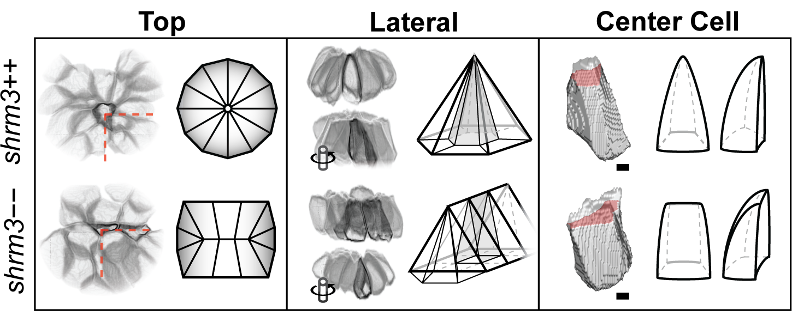
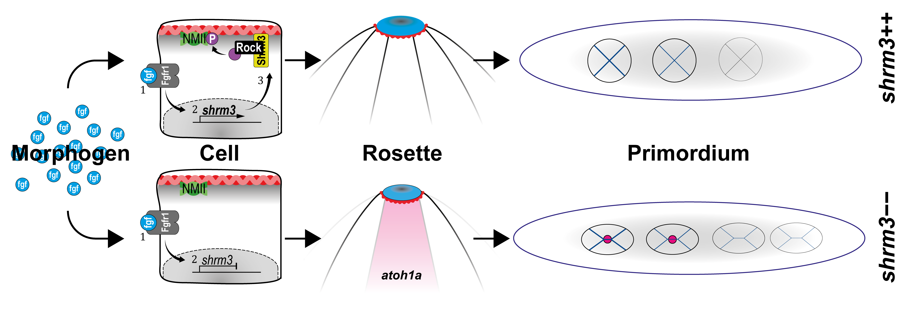
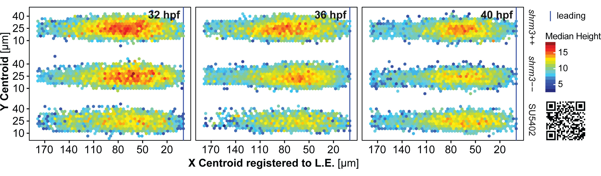
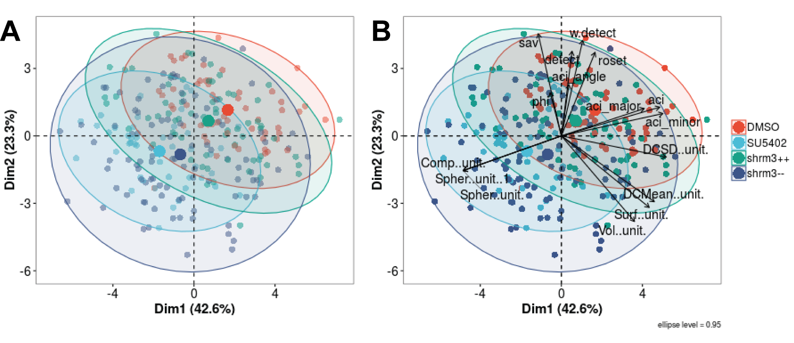

# Summary & Conclusion

<!--If we don't want Conclusion to have a chapter number next to it, we can add the `{-}` attribute.

**More info**

And here's some other random info: the first paragraph after a chapter title or section head _shouldn't be_ indented, because indents are to tell the reader that you're starting a new paragraph. Since that's obvious after a chapter or section title, proper typesetting doesn't add an indent there.
-->

## Adult Phenotype

_Shroom3_ heterozygous zebrafish show no phenotypic abnormality. When incrossed, genotyping of two to five days post fertilization (dpf) embryos results in a Mendelian distribution. However, for stock-fish that are regenerated and genotyped by finclip at about 3 months of age show only a rate of 5-10$\%$ of _shroom3_$--$. After another 3 – 6 months those would usually decease too. Therefore, defect Shroom3 in _D.rerio_ leads to increased mortality.

## Lateral Line

Two additional CCs are deposited in shroom3$--$ embryos (section \@ref(res-ccounts)) leading to a net increase in cell count of ~9$\%$ (31 cells) (section \@ref(res-llmorph)). However, proliferation is not increased in the pLLP (section \@ref(res-prolpllp)) but in CCs once they are deposited (section \@ref(res-prolpllp)). Therefore, the increase in CC count is unrelated to the amount of proliferation in the pLLP. The cell count and area per CC show an average reduction of 6$\%$ respectively and no difference for the density (section \@ref(res-llmorph)).
The shroom3$--$ LL phenotype can be mimicked by inhibition of Rock but not rescued by induction of Rock (section \@ref(res-rockresc)), leading to the conclusion that Rock is necessary for proper rosette assembly and CC deposition, but not sufficient. CC count can also be rescued by ectopic expression of a Shroom3-RFP fusion protein (section \@ref(res-shrmresc)), leading to the conclusion that Shroom3 has a spatiotemporal function necessary and sufficient for proper LL development.
The reduction is supported scanning electron microscopy (SEM) pictures of 3 dpf (supplement, \@ref(fig:suppsem)) NMs, which indicate a disruption bundled kinocilia. However, as hair cells do still develop (supplement, \@ref(fig:suppllhc)), there is no reason to presume that shroom3$--$ NMs suffered from a loss of function. End of migration analysis also shows that the average length of the LL does not differ, suggesting that speed is not affected. This is confirmed by time-lapse analysis, which neither shows a difference in speed of migration, nor in acceleration (results, \@ref(fig:rdtreg)).

## Rosettes

Rosette analysis showed that the median count of rosettes is hardly (2 rosettes in _shroom3_$--$ as compared to 3 in _shroom3_++ embryos) and mostly affected within the first 6-8 hours of migration ((\@ref(fig:rdtdet))B and B’). Also, variance is much more affected, such that the error bars extend those of _shroom3_++ in both maximum and minimum. Rosettiness however, the normalized rosette weight, is much more drastically affected ((\@ref(fig:rdtdet))C and C’). While the median rosettiness of _shroom3_++ is at a constant level of about 0.9, _shroom3_$--$ rosettiness starts out at about 0.5 but then linearly grows until it also reaches levels of about 0.9 at 16-20 hours of migration. As for rosette detection, variance is much higher.

Rosettiness is strongly correlated to the final number of CCs deposited (\@ref(fig:rdtcorr)B) which is also evidenced by rescue of correlation between rosettiness at the beginning of migration and CC count at the end of migration (\@ref(fig:rescshrm)C), concluding that rosettiness is the key parameter for the future outcome of CC pattern. Still, the question is what determines rosette weight. Although speed and rosettiness are correlated only weakly, they are significantly stronger correlated in _shroom3_$--$ than they are in _shroom3_++ embryos throughout time (\@ref(fig:rdtcorr)A). This finding is also confirmed by an experiment where the CC count of _shroom3_$--$ can be rescued when incubated at lower temperature (section \@ref(res-tempresc)). In conclusion these results lead to the conclusion that _shroom3_$--$ rosettes are destabilized with increasing thermodynamics. 

## Hair Cells

Deposition of the first CC is more independent of Shroom3 (\@ref(fig:llpos)) than the remaining CCs and the mean positions indicate that deposition does not happen more randomly, but at a higher frequency. Interestingly during the first four hours, when the first CC is deposited, analysis of hair-cell specification shows that not only the promotor for _atoh1a_ is more active (results, figure 5.2 A and B) in _shroom3_$--$ embryos, but also that more cells are differentiating to become hair-cells (\@ref(fig:hctl)C and C’). This leads to the conclusion that the morphological changes introduced by the _shroom3_ mutation lead to a pre-mature activation of the _shroom3_ promotor, subsequently leading to deposition of the CC the hair-cell is associated with. 
In the pLLP, Notch signaling is important for selection and specification of hair-cells (\@ref(intro-notch)). Interestingly, these findings are supported by another study where they have shown that upon over-activated Notch signaling, CC deposition happened independent of Shroom3 [@Kozlovskaja-Gumbriene2017]. For our observation this could mean that (1) either expression of _atoh1a_ is up-regulated due to a compensation mechanism to ensure CC deposition or (2) that the cellular rearrangements lead to biased Notch signaling. A phenomenon that in fact has been well studied [@Shaya2017a]. For the latter, the proposed model would be that in each micro-rosette the hair-cell is in contact with less cells, but the amount of Notch ligand stays the same. Therefore, lateral inhibition and feedback is stronger, leading to an increase in expression of _atoh1a_ and ultimately to earlier CC deposition. 

## Apical Constriction

The method developed to quantify AC allows measurement along two orthogonal axes, the major (the longer axis) and a minor (the shorter axis), of an ellipse fitted to a cellular cross-section at a distinct distance from the apical site. In addition, the cells orientation in degrees from the horizontal midline is obtained (\@ref(fig:acaci)A-A’).

In summary, AC is significantly reduced in _shroom3_$--$ embryos for the severe phenotype. In more detail the results show an increased axial an-isotropy, meaning that AC is more reduced along the major than along the minor axis. In conclusion this means that AC and probably tension is more relaxed along the anterior-posterior axis. In terms of cell shape this means that rosette cells go from a pyramidal geometry, more to a prism geometry (\@ref(fig:sumcells)). This is also confirmed by angular measurement which show that for 0-15$^\circ$ more _shroom3_$--$ pLLPs cells are aggregated while at 30-45$^\circ$, more _shroom3_++ cells are aggregated.

(ref:sumcells) Rosette and Cell Shape Model

```{r sumcells, out.width = "0.95\\textwidth", fig.cap="(ref:sumcells)", fig.scap="Rosette and Cell Shape Model"}

```

Zona occludens-1 (ZO-1) is a peripheral membrane, tight-junction associated protein. Within the apical region of pLLP rosettes Fgf filled luminal structures are developing that that are hubs for locally confined morphogen signaling. All cells of a rosette make up and are connected to a single lumen. When visualizing the lumen via an antibody for ZO-1, the lumen appears like a buckyball where each side is the connection to a single cell [@Durdu2014a]. While in _shroom3_++ rosettes those structures appear circular in the trailing rosette, in _shroom3_$--$ rosettes they appear more oval (supplement, (\@ref(fig:suppzo1)), which supports the theory of an-isotropy. Furthermore, in more leading regions the signal is more fragmented, which supports the theory of micro-rosette structures.

## Model

Based on these results - In contrast to the current model - the _shroom3_$--$ phenotype is not defined by an absence of rosettes but by a greater than or equal to amount that are smaller and have less weight. Those ‘micro-rosettes’ will eventually be deposited, leading to somewhat smaller CCs, which is also supported by analysis of emerging hair cells in the pLLP. The results are summarized and graphically modeled in figure 2.

(ref:summodel) Shroom3 dependent rosette formation

```{r summodel, out.width = "0.95\\textwidth", fig.cap="(ref:summodel)", fig.scap="Shroom3 dependent rosette formation"}

```

# Discussion

Due to the pLLP’s relative simplicity (~100 cells) and excellent accessibility for advanced light-microscopes (~1 cell layer beneath the skin), it promises an in toto understanding and complete model of factors influencing its development. 
To create a robust model, it is necessary to have robust methods that allow to generate large datasets of precise and meaningful measurements. The tools and methods developed for this work have proven very useful in pinning down of essential developmental aspects and answering important biological questions with quantitative certainty. Still, due to the complexity of biological systems some points remain open for discussion.

## Proliferation

For proliferation no difference in the mitotic rate could be detected in the pLLP which lead to the conclusion that additional CC deposition was independent. However, previous reports have shown a bias in location and direction of mitoses in the pLLP [@Laguerre2009a; @Laguerre2005a]. Since our model supposed that rosette cells are more oriented along the horizontal midline this could mean that even though there are not more mitoses overall, the mitotic axis is also directed more along A-P. This in turn would result in more cells along this direction, potentially decreasing tension, leading to pre-mature deposition.

## Rosette Detection

Deep learning methods are currently, driven by the hype of artificial intelligence, extremely _en vogue_. While their use is not always justified, especially for biomedial image analysis they have proven extremely powerful [@Ching2018; @Falk2019; @Webb2018]. 

With the used fluorescent membrane label epithelial rosettes are relatively simple to detect, even with traditional image processing techniques. The arguably biggest point for criticism is that one usually does not know the features the network has learned to detect. An important metric, besides the plain detection, is the softmax-score^[Also: "detection score", the final result of all weights of the NN]. It is a metric that tells about the security of the network how safe it is in its prediction. We interpreted this score in a way that lower prediction scores are representative for ‘weaker’ rosettes.

## Hair Cell specification

Even though the dataset for hair-cell specification provided a lot of datapoints for statistical testing, the difference for cell counts show only a relatively low significance. This could be attributed to the large variance in measurements. On the other side, not only is there a significant increase in cell count in _shroom3_$--$ pLLPs but also a higher activity of the _atoh1a_ promotor. 

When controlling these results by trying to rescue the _shroom3_$--$ with a _atoh1a_ knockdown, neither in _shroom3_$--$ nor in _shroom3_++ embryos the first NM is deposited anymore. Both of these results would in theory argue for an Atoh1a dependent mechanism of CC deposition, however this result has not been reported before and would need further validation. Furthermore, even though an MO for p53 was co-injected, MO injection has been shown to potentially have many more unspecific effects due to the high concentrations usually injected [@Schulte-Merker2014c]. For this reason double mutants ( _shroom3_$--$; _atoh1a_$--$) were generated - which at this timepoints however are not analyzed yet.

## Single cell reconstruction and AC measurement

Earlier attempts for indexing AC include measuring the ‘apical index’ (A.I.) of bottle cells during _X.laevis_ gastrulation [@Lee2007a] or the ACI for cells of the pLLP [@Harding2012]. For both, the metric describes the ratio of lateral height over apical width which, depending on the situation, is a very coarse and inaccurate description. In the pLLP cells of different forms, volumes and heights can be found. When measuring apical width at a fix distance from the apical site cells with different height but otherwise equal degree of AC turn out to have a very different ACI (\@ref(fig:ACICells)A and A’). If however apical width is measured at a distance relative to the cells height, cells turn out to have the same ACI (\@ref(fig:ACICells)A and A’’). In addition, it remains questionable exactly how to define _apical width_ in a two-dimensional cellular cross-section. By introducing apical width measurement along both, the major and the minor axis (section \@ref(ACI-pol)), the improved model for AC and method for automated and unbiased cellular segmentation therefore represents a major advancement.

AC is also correlated with cell height. To get a more detailed impression about how variables are distributed within the cells of the pLLP, single cell measurements of pLLPs that are normalized in orientation can be superimposed in a two-dimensional map of organ length and width. Next, cell coordinates in this map can be grouped into bins of hexagons and the summary statistic represented as color on a continuous scale (\@ref(fig:dismap)). Doing so reveals that for stages 32 and 36 hpf, height in _shroom3_$--$ cells is not as strongly reduced as in SU5402 treated ones and that cells in the central region of the pLLP are higher than in the leading, trailing and lateral regions. In this specific case this may not lead to new insights, but it improves the visual perception and therefore may assist more concise questioning and reasoning.

(ref:dismap) pLLP Maps

```{r dismap, out.width = "0.95\\textwidth", fig.cap="(ref:dismap)", fig.scap="pLLP Maps"}

```

In addition to visualization, large multidimensional datasets offer the possibility for advanced computational methods such as Machine- and Deep learning. For example, one could use clustering methods such as Principal Component Analysis to find out which dimensions contribute the most to separate a number of clusters from each other (\@ref(fig:dispca)). Another scenario would be to manually label cells of a dataset as either leading, trailing, rosette, lateral, ... etc. to train an Machine learning model on. The model could then be used on unlabeled data to assign the previous learned labels to cells that fit the right parameters.

(ref:dispca) Principal Component Analysis (A) (B)

```{r dispca, out.width = "0.85\\textwidth", fig.cap="(ref:dispca)", fig.scap="Principal Component Analysis"}

```

Yet another application example would be to use the ground truth image data generated for my studies to train a CNN that potentially would be more robust to data of different quality / resolution and easier to use as it wouldn’t require as much pre-processing.

## Future perspectives