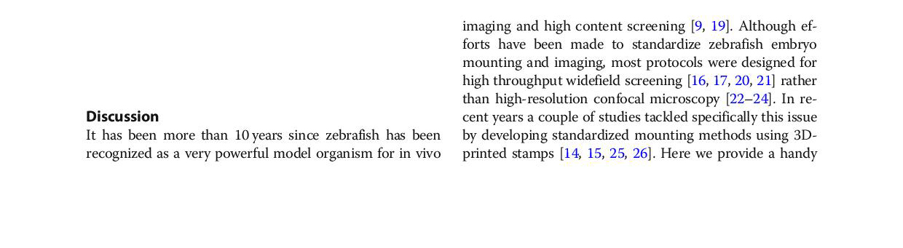
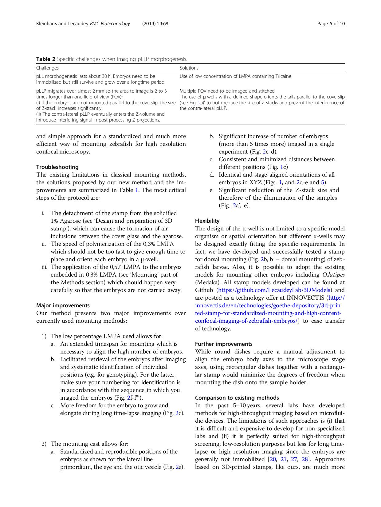
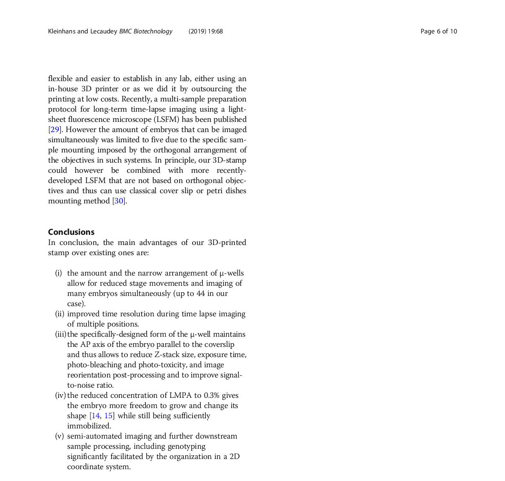

# Discussion

Due to the pLLP’s relative simplicity (~100 cells) and excellent accessibility for advanced light-microscopes (~1 cell layer beneath the skin), it promises an _in toto_ understanding and complete model of factors influencing its development.
To create a robust model, it is necessary to have robust methods that allow to generate large datasets of precise and meaningful measurements. The tools and methods developed for this work have proven very useful in pinning down of essential developmental aspects and answering important biological questions with quantitative certainty. Still, due to the complexity of biological systems some points remain open for discussion.

## Methods

### Mounting

```{r klein_2019_disc_1, out.width = '95%'}

```

```{r klein_2019_disc_2, out.width = '95%'}

```

```{r klein_2019_disc_3, out.width = '95%'}

```

## Shroom3

### Lateral Line

Two additional CCs are deposited in _shroom3_-\- embryos. Proliferation is not increased in the pLLP but in CCs once they are deposited (section \@ref(res-prolpllp)), therefore the increase in CC count is unrelated to the amount of proliferation in the pLLP. The cell count and area per CC show an average reduction of 6$\%$ respectively and no difference in density (section \@ref(res-llmorph)).

The shroom3-\- LL phenotype can be mimicked by inhibition of Rock but not rescued by activation of NMII (section \@ref(res-rockresc)), leading to the conclusion that Rock is necessary for proper rosette assembly and CC deposition. CC count can also be rescued by ectopic expression of a Shroom3-RFP fusion protein (section \@ref(res-shrmresc)), leading to the conclusion that Shroom3 has a function necessary and sufficient for proper LL development.

End of migration analysis also shows that the average length of the LL does not differ, suggesting that speed is not affected. This is confirmed by time-lapse analysis, which neither shows a difference in speed of migration, nor in acceleration (results, \@ref(fig:rdtreg)).

### Proliferation

Due to their high regenerative ability, zebrafish are a popular model in regenerative research [@Chitnis2012a; @Mokalled2016; @Harding2014a]. It is well known that zebrafish NMs have a rather high regenerative capacity [@Cruz2015; @Pinto-Teixeira2015; @Wada2013]. 

While I did not quantify the size of CCs directly after deposition, it seems likely that the observation of an increase in proliferation after CCs are deposited is due to a compensatory effect.

### Rosette Detection

With the used fluorescent membrane label epithelial rosettes are relatively simple to detect, even with traditional image processing techniques. The arguably biggest point for criticism is that one usually does not know the features the network has learned to detect. For this issue however there are solutions by now [@Zeiler2013].

An important metric in object detection is the _softmax_-score (also "detection score", the final result of all weights of the NN). It is a metric that tells about the security of the network how safe it is in its prediction. We interpreted this score in a way that lower prediction scores are representative for ‘weaker’ rosettes. However a linear relationship is, due to the activation function, not necessarily given.

### Hair Cell specification

In the pLLP, Notch signaling is important for selection and specification of hair-cells (section \@ref(intro-notch)). Interestingly, our findings are supported by another study where it was shown that upon over-activated Notch signaling, CC deposition happened independent of Shroom3 [@Kozlovskaja-Gumbriene2017]. For our observation this could mean that **1** either expression of _atoh1a_ is up-regulated due to a compensation mechanism to ensure CC deposition or **2** that the cellular rearrangements lead to biased Notch signaling. A phenomenon that in fact has been reported [@Shaya2017a]. For the latter, the proposed model would be that in each micro-rosette the HC is in contact with less cells, but the amount of Notch ligand stays the same. Therefore, lateral inhibition and feedback is stronger, leading to an increase in expression of _atoh1a_ and ultimately to premature CC deposition.

Even though the dataset for hair-cell specification provided a lot of datapoints for statistical testing, the difference for cell counts show only a relatively low significance. This could be attributed to the large variance in measurements. On the other side, not only is there a significant increase in cell count in _shroom3_-\- pLLPs but also an earlier activity of the _atoh1a_ promotor. 

When controlling these results by trying to rescue the _shroom3_-\- with a _atoh1a_ knockdown, neither in _shroom3_-\- nor in _shroom3_++ embryos the first NM is deposited anymore. Both of these results would in theory argue for an Atoh1a dependent mechanism of CC deposition, however this result has not been reported before and would need further validation. Furthermore, even though an MO for p53 was co-injected, MO injection has been shown to potentially have many more unspecific effects due to the high concentrations usually injected [@Schulte-Merker2014c]. For this reason double mutants ( _shroom3_-\-; _atoh1a_-\-) were generated - which at this timepoints however are not analyzed yet.

### Apical Constriction

In addition to visualization, large multidimensional datasets offer the possibility for advanced computational methods such as Machine- and Deep learning. For example one could label cells of a dataset as either leading, trailing, rosette, lateral, ... etc. to train an Machine learning model on. The model could then be used on unlabeled data to assign the previous learned labels to cells that fit the right parameters [@Hartmann2020]. Yet another application example would be to use the Ground Truth image data generated for my studies to train a CNN that potentially would be more robust to data of different quality / resolution and easier to use as it wouldn’t require as much pre-processing.

### Model

Based on these results phenotype is defined by a greater than or equal to amount of rosettes that are smaller and have less weight. Those ‘micro-rosettes’ will eventually be deposited, leading to somewhat smaller CCs, which is also supported by analysis of emerging hair cells in the pLLP. The results are summarized and graphically modeled in figure \@ref(fig:summodel).

(ref:summodel) Shroom3 dependent rosette formation. First morphogen FGF binds to FGFR1, usually leading to expression of _shroom3_, interaction with Rock and actin network contraction through phosphorylated NMII. Without Shroom3 there's only a partial contraction of the action network which leads to smaller and more rosettes. Altered cellular morphology then leads to a premature expression of _atoh1a_ and hair-cell specification.

```{r summodel, out.width = '95%', fig.cap = "(ref:summodel)", fig.scap = "Shroom3 dependent rosette formation"}
knitr::include_graphics("figures/summary/CurrentModel_new-01.png")
```