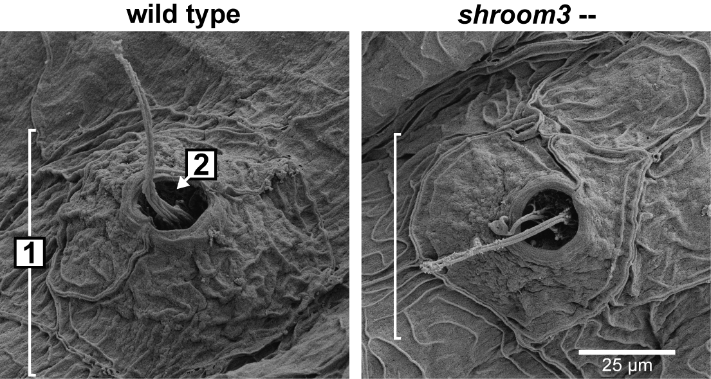
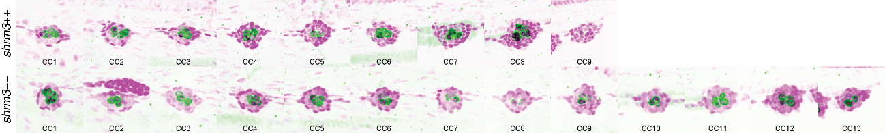
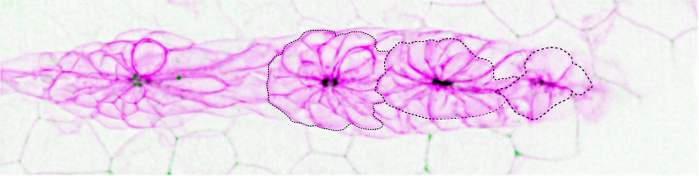
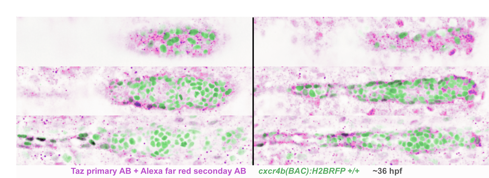
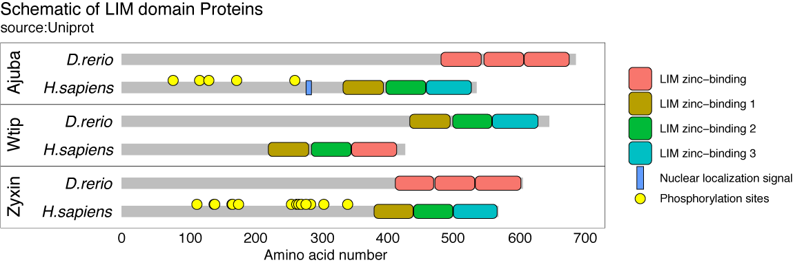
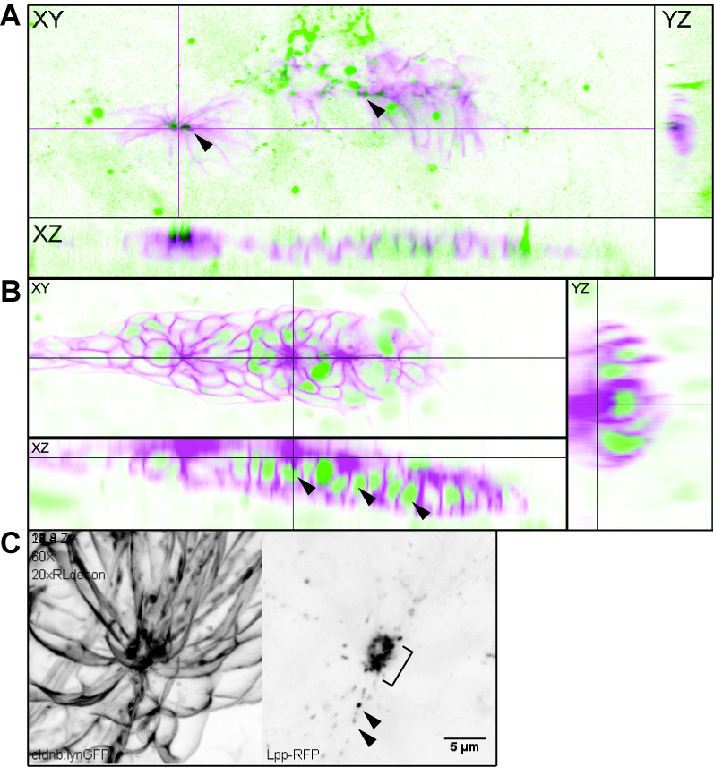
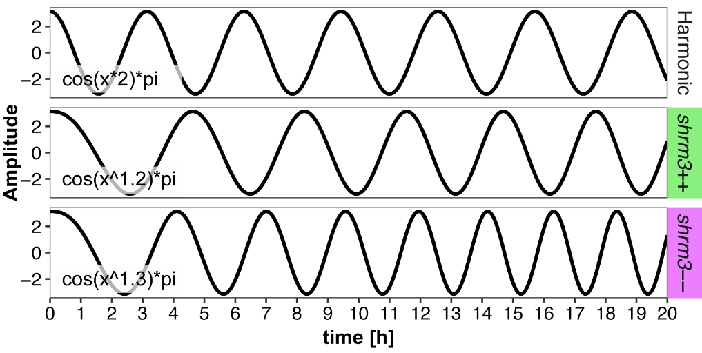
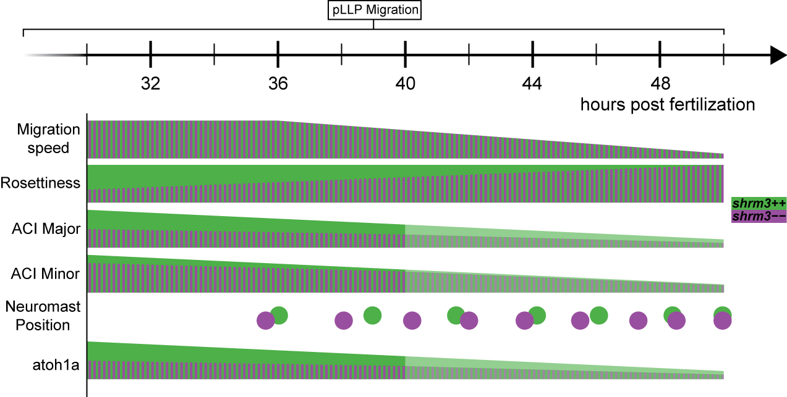

`r if(knitr:::is_latex_output()) '\\appendix'`

`r if(!knitr:::is_latex_output()) '# (APPENDIX) Appendix {-}'` 

# Supplement

To check whether the reduction in size and cell count of NMs in shroom3$--$ embryos had an effect on their morphology too, scanning electron microscopy (SEM) samples for each group were imaged.

(ref:suppsem) CC Kinocilia

```{r suppsem, out.width='50%', fig.cap="(ref:suppsem)", fig.scap="CC Kinocilia"}

```

To check whether the reduction in size and cell count of NMs in shroom3$--$ embryos had an effect on hair cell development, immunostainings on 4 dpf embryos with a hair cell specific marker were performed.

(ref:suppllhc) Lateral Line Haircells

```{r suppllhc, fig.cap="(ref:suppllhc)", fig.scap="Lateral Line Haircells"}

```

(ref:supploc) Shroom3 localization

```{r supploc, out.width='75%', fig.cap="(ref:supploc)", fig.scap="Shroom3 localization"}

```

(ref:suppzo1) Luminal signaling

```{r suppzo1, out.width='85%', fig.cap="(ref:suppzo1)", fig.scap="Luminal signaling"}
knitr::include_graphics("figures/supp/zo1.png")
```

An important regulator for proliferation and organ size is the mechanosensitive hippo signaling pathway where the transcription factors Yap and Taz are the most downstream targets. When dephosphorylated, Yap and Taz translocate from the cytoplasm to the nucleus to induce target gene expression. 
To check for differences in hippo signaling, immunostainings for Taz were performed. On average the immunostainings suggest that Taz localization is more concentrated in the leading region and in the nuclei of peripherical PLLp cells.

(ref:suppyap) Hippo Signaling in the pLLP. PLLps with nuclei labeled in magenta and Taz in green. Vertical sections show a more basal, a medial and a more apical Z section.

```{r suppyap, out.width='85%', fig.cap="(ref:suppyap)", fig.scap="Hippo Signaling in the pLLP"}

```

(ref:suppshrmort) Shroom Ortho- and Paralogs

```{r suppshrmort, out.width='85%', fig.cap = "(ref:suppshrmort)", fig.scap = "Shroom Ortho- and Paralogs"}
knitr::include_graphics("figures/supp/Shroom3_orthology-01.png")
```

(ref:supplim) LIM domain proteins

```{r supplim, out.width='85%', fig.cap="(ref:supplim)", fig.scap="LIM domain proteins"}

```

(ref:supplpp) Interaction partners fusion proteins **A** _tagRFP-trip6_ **B** _tagRFP-limD1_ **C** _lpp-RFP_

```{r supplpp, out.width='85%', fig.cap="(ref:supplpp)", fig.scap="Interaction partners fusion proteins"}

```

(ref:supppos) CC positions **A** Calyculin **B** Rockout **C** Heatshock **D** SU5402 **E** Temperature

```{r supppos, out.width='85%', fig.cap="(ref:supppos)", fig.scap="Heatshock CC positions"}
knitr::include_graphics("figures/supp/cc_positions.png")
```

The CC pattern for both _shrm3_++ and _shroom3_$--$ can be modeled by a phase modulated cosine (figure 1), where the power to x represents the phase and is increased by only 0.1 in _shroom3_$--$ to go from a CC count of 5 to 7 over a span of 20 hours.

(ref:supccpmodel) CC pattern model

```{r supccpmodel, out.width='85%', fig.cap="(ref:supccpmodel)", fig.scap="CC pattern model"}

```

(ref:supgrad) Morphogenic gradients

```{r supgrad, out.width='85%', fig.cap="(ref:supgrad)", fig.scap="Morphogenic gradients"}

```