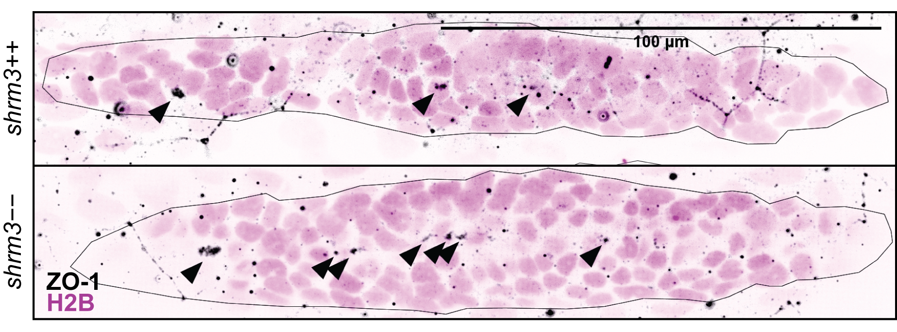
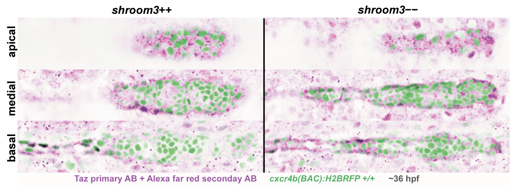
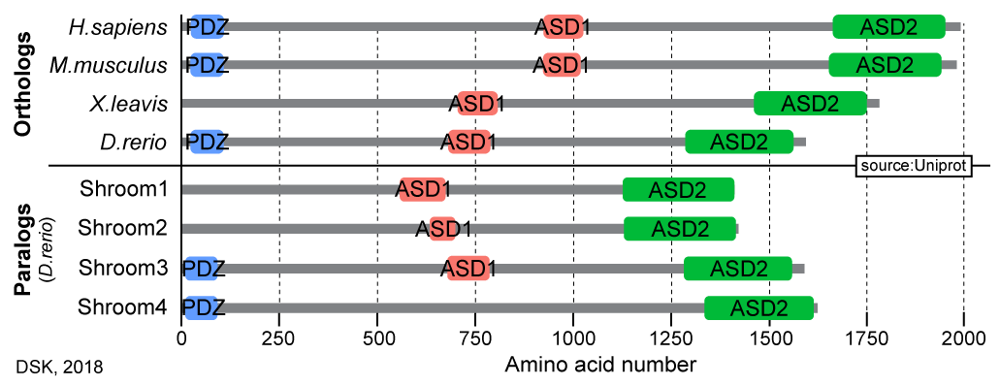
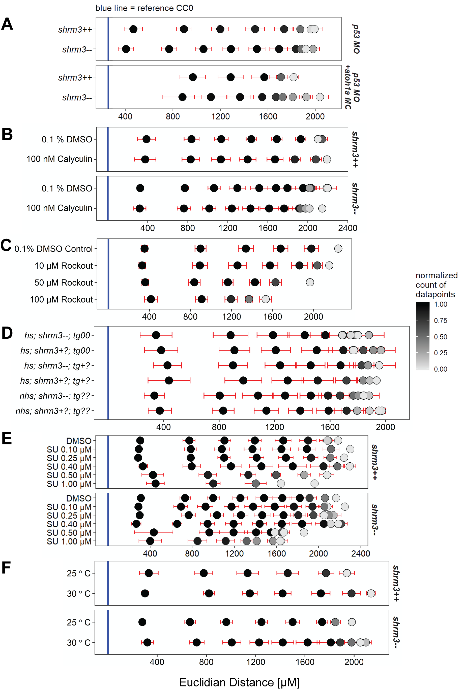

`r if(knitr:::is_latex_output()) '\\appendix'`

`r if(!knitr:::is_latex_output()) '# (Appendix) Appendix {-}'` 

# Supplement {-}

(ref:suppzo1) Luminal signaling. The pLLP is indicated by a dark line. Arrows indicate tight-junctions and possibly luminal structures on the apical side. Nuclei are visualized _via_ a _TgBAC(cxcr4b:H2B-RFP)_ transgenic line (section \@ref(mat-lines). ZO-1 is made visible _via_ Immunostaining (section \@ref(mat-anitb). Scalebar = 100 $\mu$m

```{r suppzo1, out.extra = '', fig.pos = "h", out.width = '70%', fig.cap = "(ref:suppzo1)", fig.scap = "Luminal signaling"}

```

An important regulator for proliferation and organ size is the mechanosensitive hippo signaling pathway where the transcription factors Yap and Taz are the most downstream targets. When dephosphorylated, Yap and Taz translocate from the cytoplasm to the nucleus to induce target gene expression. 
To check for differences in hippo signaling, immunostainings for Taz were performed. On average the immunostainings suggest that Taz localization is more concentrated in the leading region and in the nuclei of peripherical pLLP cells.

(ref:suppyap) Hippo Signaling in the pLLP. PLLps with nuclei labeled in magenta and Taz in green. Vertical sections show a more basal, a medial and a more apical Z section.

```{r suppyap, fig.pos = "H", out.width = '90%', fig.cap = "(ref:suppyap)", fig.scap = "Hippo Signaling in the pLLP"}

```

(ref:suppshrmort) Shroom Ortho- and Paralogs

```{r suppshrmort, out.extra = '', fig.pos = "h", out.width = '85%', fig.cap = "(ref:suppshrmort)", fig.scap = "Shroom Ortho- and Paralogs"}

```


(ref:supppos) CC positions **A** Calyculin **B** Rockout **C** Heatshock **D** SU5402 **E** Temperature

```{r supppos, out.width='85%', fig.cap="(ref:supppos)", fig.scap="Heatshock CC positions"}

```

